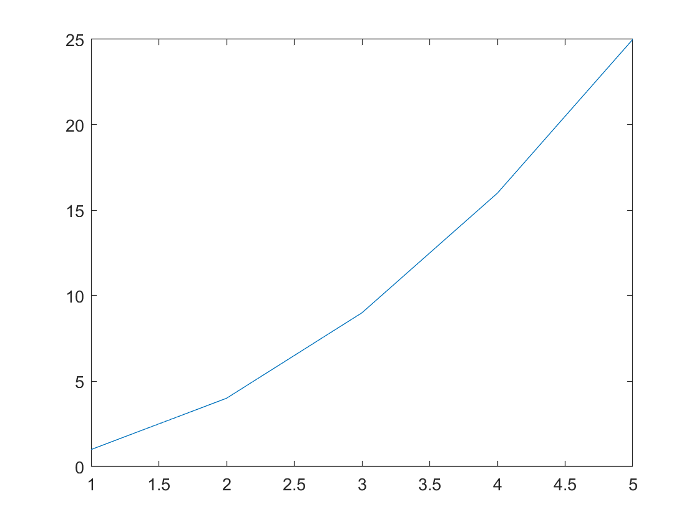

# Refresher and Functions
**IMPORTANT** Some of these functions require the [Symbolic Math Toolbox](https://uk.mathworks.com/products/symbolic.html) to work. Make sure it is installed before trying to use them.
## Refresher
- **partfrac(expr,var)** expresses **expr** as partial fractions, relative to a variable **var**. [Full documentation](https://uk.mathworks.com/help/symbolic/partfrac.html)
    ```matlab:Code
    syms x;
    partfrac(x^2/(x^3-3*x+2),x)
    ```
- **diff(f(x),x,n)** computes the nth derivative of f(x) which is a **symbolic expression** with respect to x. If n is omitted it will be the first order derivative. [Full documentation](https://uk.mathworks.com/help/symbolic/diff.html)

    ```matlab:Code
    syms x;
    f = x^3-4*x;
    diff(f,x,2)
    ```
- **int(expr,var,a,b)** computes the **definite** integral of symbolic expr with respect to var from a to b. If a and b are omitted then it will return a symbolic expression of the **indefinite** integral. [Full documentation](https://uk.mathworks.com/help/symbolic/sym.int.html)

    ```matlab:Code
    syms x;
    expr = sin(x) - x^4;
    int(expr,x)
    ```

- **integral(f(x),a,b)** can only compute numerical integrations of **functions**, unlike int() which uses symbolic expressions. It computes the definite integral from a to b of function f(x). [Full documentation](https://uk.mathworks.com/help/matlab/ref/integral.html)

    ```matlab:Code
    f = @(x) x.^3 -6;
    integral(f,-5,2)
    ```

## Functions

### Functions Operations
- **limit(f(x), x, value)** computes the limit of a function when the variable x of a **symbolic function** (which is different from the normal functions) tends to the **value**. [Full Documentation](https://uk.mathworks.com/help/symbolic/limits.html) 
    ```matlab:Code
    syms x;
    f = 3*x^-2 + 5;
    limit(f,x,Inf)
    ```
- **solve(eqn1,eqn2,var1,var2)** solves a or a system of **symbolic equations**. The equations can be inputed in a matrix or separetly and so can the variables that you desire to solve for. [Full Documentation](https://uk.mathworks.com/help/symbolic/solve.html)

    ```matlab:Code
    syms x
    eq1 = 4*x^2 + 8 == -4;
    solve(eq1,x)
    ```

    ```matlab:Code
    syms x y;
    eq1 = x + y - 5 == 0;
    eq2 = x^2 - y == 3;
    [xsol ysol] = solve(eq1,eq2,x,y)  
    ```

### Plotting
- **plot(X, Y)** generates a 2D plot of X values against Y values. X and Y have to be equal-sized Row/Column matrices. [Full Documentation](https://uk.mathworks.com/help/matlab/ref/plot.html)
    ```matlab:Code
    X = [1, 2, 3, 4, 5];
    Y = [1, 4, 9, 16, 25];
    plot(X,Y)
    ```

- **fplot(f(x),Range)** similar to plot() but instead it takes a symbolic function and a range as [xmin xmax] to plot the function through. If the Range argument is omited the range is [-5 to 5]. [Full Documentation](https://uk.mathworks.com/help/matlab/ref/fplot.html) 
    ```matlab:Code
    f = @(x) sin(x)^-3;
    fplot(f)
    ```

- **fsurf(f(x,y),xyinterval)** generates a 3D plot of a symbolic function of 2 variables, the second argument is a matrix that contains the following values [xmin xmax ymin ymax]. By default it's interval is [-5 to 5] for both x and y. [Full Documentation](https://uk.mathworks.com/help/matlab/ref/fsurf.html)
    ```matlab:Code
    f = @(x,y) cos(x)*y^3;
    fsurf(f)
    ```


###### Dyson School of Design Engineering 2021 - Ivan Revenga Riesco
