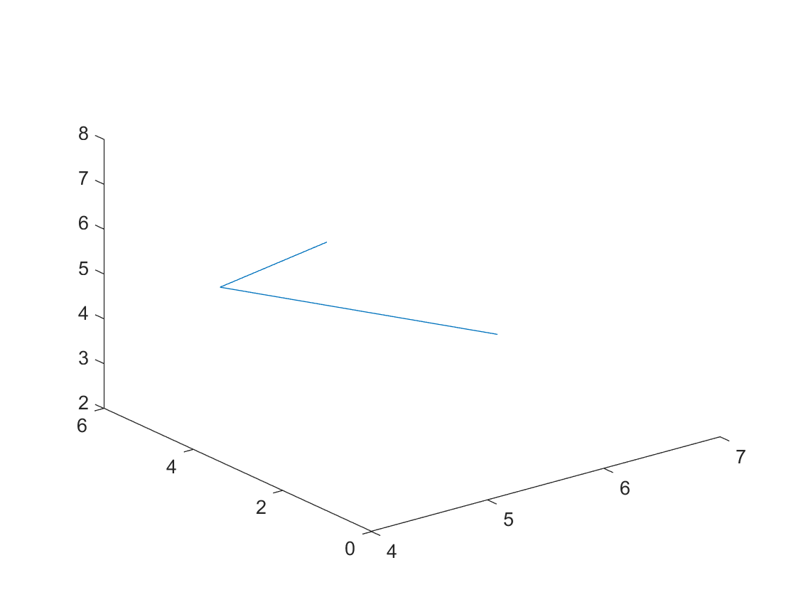
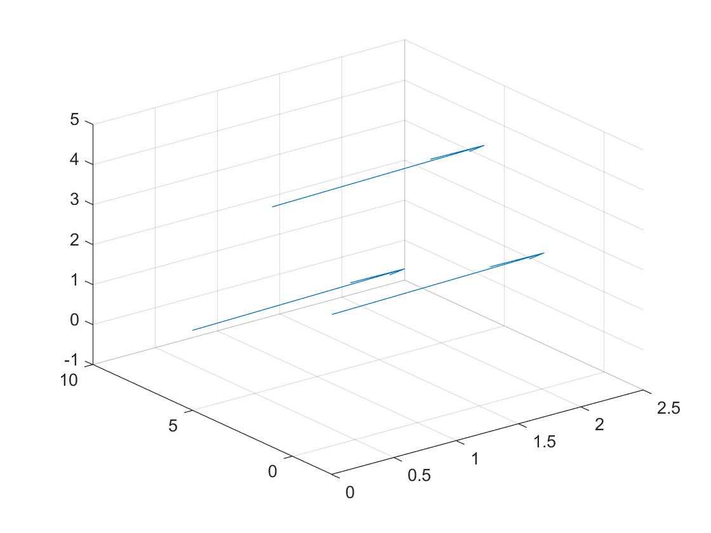

# Vectors

## Vector operations
- **dot(v1,v2)** performs the dot product of two vectors, they both should have the same size. [Full Documentation](https://uk.mathworks.com/help/matlab/ref/dot.html)
    ```matlab:Code
    v1 = [1 2 5];
    v2 = [2 5 2];
    dot(v1,v2)
    ```

- **cross(v1,v2)** performs the cross product of two vectors, the vectors should be of length 3. [Full Documentation](https://uk.mathworks.com/help/matlab/ref/cross.html)
    ```matlab:Code
    cross(v1,v2)
    ```

- **norm(v1)** calculates the magnitude of an array or vector. [Full Documentation](https://uk.mathworks.com/help/matlab/ref/norm.html)
    ```matlab:Code
    norm(v1)
    ```
To calculate the unit vector of a vector then simply:
    ```matlab:Code
    unitv1 = v1/norm(v1)
    ```
## Plotting
**IMPORTANT** plotv requires the [Deep learning toolbox](https://uk.mathworks.com/products/deep-learning.html) to work. Make sure it is installed before trying to use it.
- **plotv(M)** generates 2 Dimensional plot of vectors from the origin, the input argument M is a matrix that contains the x components of the vectors in the first row and the second row contains the y components of the vectors: M = [x1 x2; y1 y2]. [Full Documentation](https://uk.mathworks.com/help/deeplearning/ref/plotv.html)

    ```matlab:Code
    M = [2 3 5; 1 2 3];
    plotv(M)
    ``` 


- **plot3(X,Y,Z)** can be used to plot points on 3D space, X Y Z have to be arrays of equal size. The points are connected with a line [Full Documentation](https://uk.mathworks.com/help/matlab/ref/plot3.html)
    ```matlab:Code
    X = [4 5 7];
    Y = [1 6 5];
    Z = [8 4 2];
    plot3(X,Y,Z)
    ```


- **quiver3(X,Y,Z,U,V,W)** plots 3D arrows starting from the coordinates X Y Z with directional vector components of U V W. [Full Documentation](https://uk.mathworks.com/help/matlab/ref/quiver3.html)

    ```matlab:Code
    X = [0 0 0];
    Y = [5 -2 1];
    Z = [1 3 5];
    U = [2 2 2];
    V = [3 3 3];
    W = [-1 -1 -1];
    quiver3(X,Y,Z,U,V,W)
    ```

###### Dyson School of Design Engineering 2021 - Ivan Revenga Riesco
