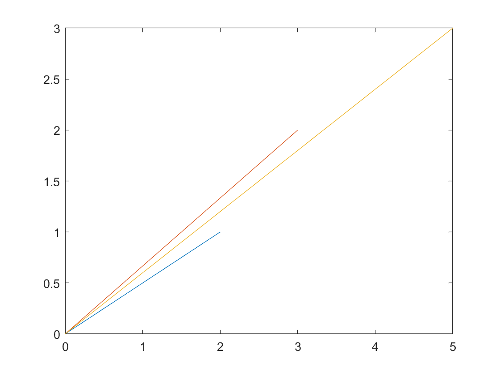

# Linear Transformations
## Linear Transform Operations
- **inv(A)** computes the inverse of a square matrix, unless it is a singular matrix of course. This function is prone to the same error as the det() function, make sure to always check and understand your answer! [Full Documentation](https://uk.mathworks.com/help/matlab/ref/inv.html)
    ```matlab:Code
    inv(A)
    ```

- **null(A,"r")** computes the null space of a matrix A, the second argument "r" returns the null space on a rational basis. [Full Documentation](https://uk.mathworks.com/help/matlab/ref/null.html)
    ```matlab:Code
    A = magic(4);
    null(A,"r")
    ```
## Plotting
**IMPORTANT** plotv requires the [Deep learning toolbox](https://uk.mathworks.com/products/deep-learning.html) to work. Make sure it is installed before trying to use it.
- **plotv(M)** generates 2 Dimensional plot of vectors from the origin, the input argument M is a matrix that contains the x components of the vectors in the first row and the second row contains the y components of the vectors: M = [x1 x2; y1 y2]. [Full Documentation](https://uk.mathworks.com/help/deeplearning/ref/plotv.html)
    ```matlab:Code
    M = [2 3 5; 1 2 3];
    plotv(M)
    ``` 
<p align="center">

</p>

###### Dyson School of Design Engineering 2021 - Ivan Revenga Riesco