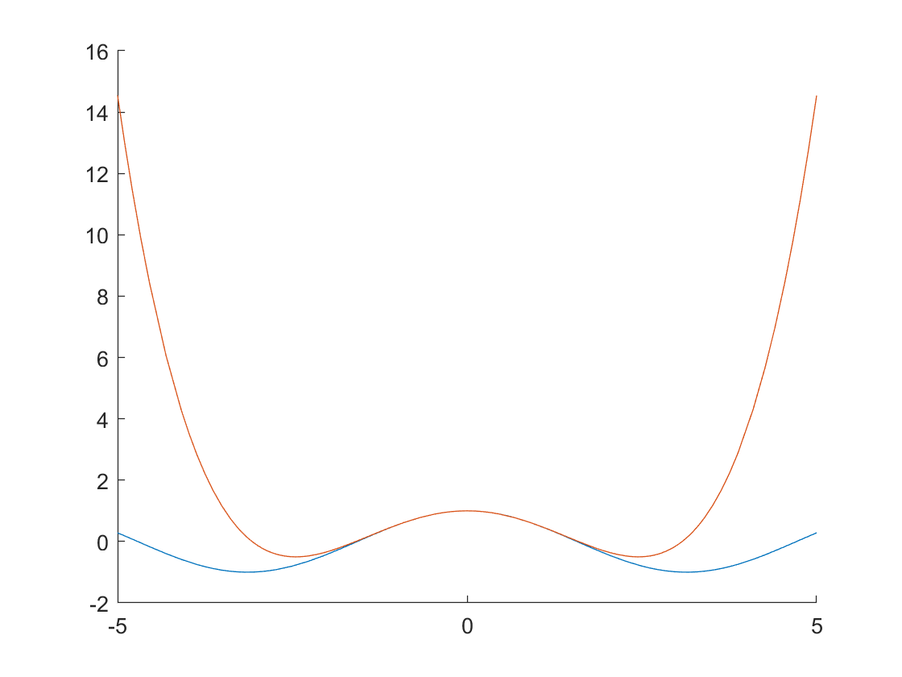

# Power series

**IMPORTANT** Some of these functions require the [Symbolic Math Toolbox](https://uk.mathworks.com/products/symbolic.html) to work. Make sure it is installed before trying to use them.
## Power series operations
- **taylor(f,var,a,"Order",n)** computes the Taylor expansion series of a symbolic expression f with respect to a variable var, around the point a up to the nth order. To do **Maclaurin** set a to 0. [Full documentation](https://uk.mathworks.com/help/symbolic/sym.taylor.html)
    ```matlab:Code
    syms x;
    f = cos(x);
    taylor(f,x,0,"Order",5)
    ```


## Plotting
- **fplot(f(x),Range)** similar to plot() but instead it takes a symbolic function and a range as [xmin xmax] to plot the function through. If the Range argument is omited the range is [-5 to 5]. [Full Documentation](https://uk.mathworks.com/help/matlab/ref/fplot.html) 
    ```matlab:Code
    fplot(f)
    hold on
    fplot(taylor(f,x,0,"Order",5))
    ```

<p align="center">

</p>


###### Dyson School of Design Engineering 2021 - Ivan Revenga Riesco