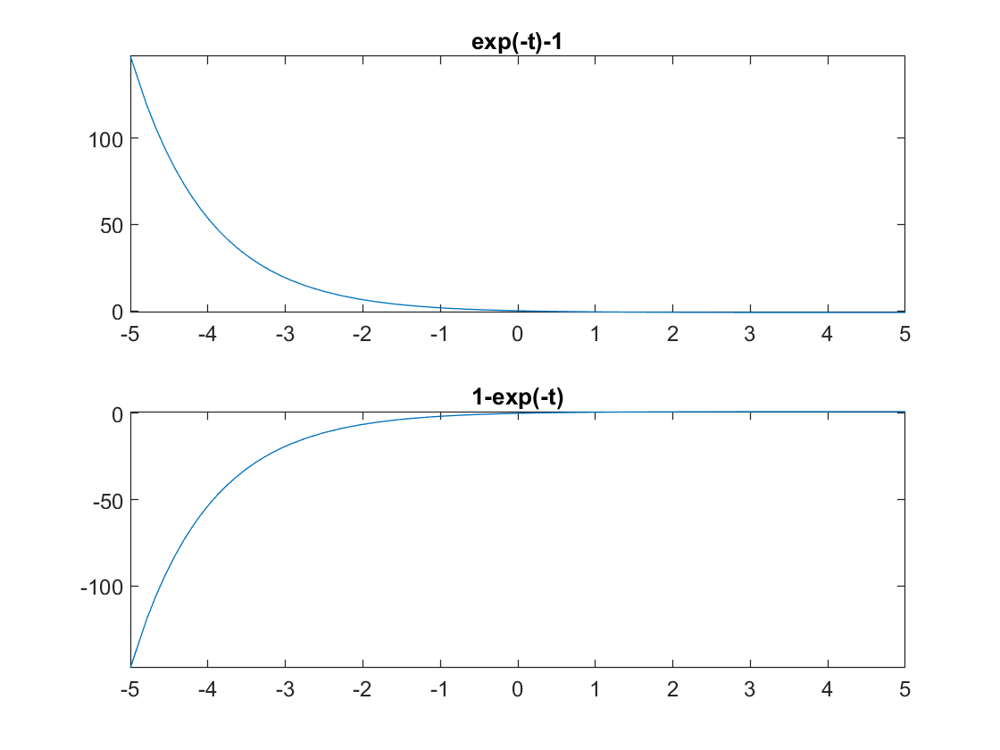
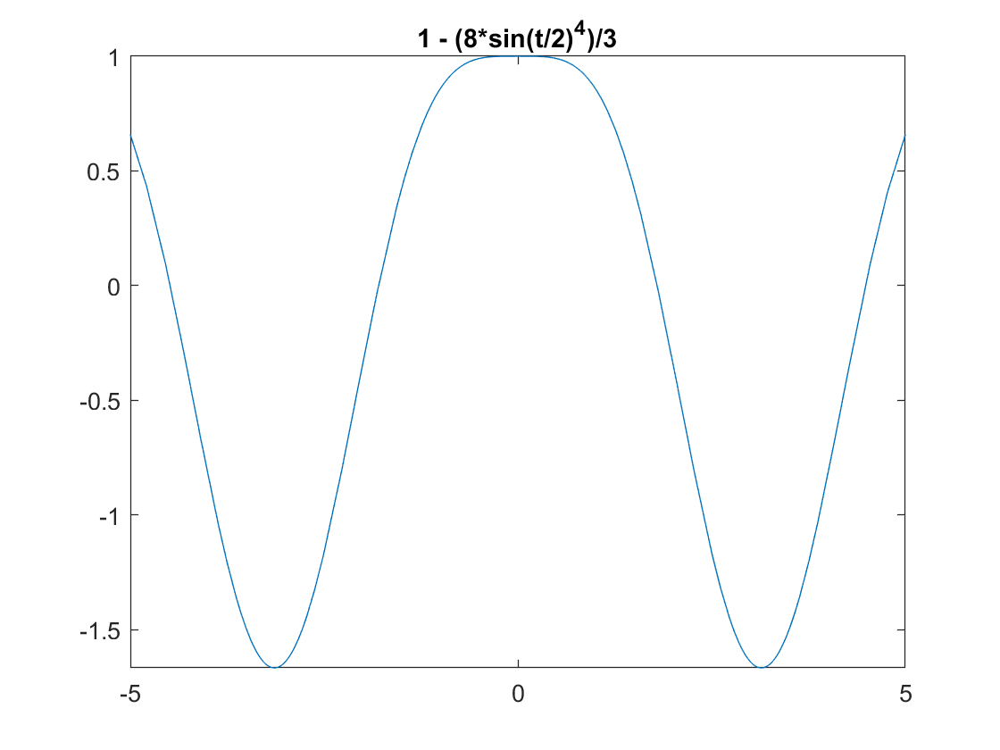

# ODEs

**Requires [Symbolic Math Toolbox](https://uk.mathworks.com/products/symbolic.html)**

**Important** Solving ODEs in Matlab is a vast and complex area of work and sometimes some ODEs won't get solved analytically and will have to be solved numerically. If you are interested on how to do so please have a look a the [Numerically solve ordinary differential equations](https://uk.mathworks.com/learn/tutorials/solving-ordinary-differential-equations-with-matlab.html) course. The following examples will look at how to solve relatively simple ODEs analytically.

### Solving the following nonlinear first order differential equation :

$$(\frac{dy}{ {dt}} + y)^2 = 1$$

with an initial condition

$$ y(0) = 0 $$

1. First declare the function y(t) as a symbolic entity

    ```matlab:Code
    syms y(t)
    ```
1. Define your ODE
    ```matlab:Code
    ode = (diff(y,t) + y)^2 == 1
    ```
1. Define your condition
    ```matlab:Code
    cond = y(0) == 0
   ```
1. Compute solution using ODE and condition
    ```matlab:Code
    ySol(t) = dsolve(ode,cond)
    ```
Which results on two solutions
$$ y(t) = e^{-t} - 1$$

$$ y(t) = 1 - e^{-t}$$



### Solving second order ODEs with initial conditions:

$$\frac{d^2y}{dt^2} = cos(2t)- y$$

with initial conditions

$$ y(0) = 1$$
$$ y'(0) = 0$$

Follows the same pattern as the other one but defining one more condition.
```matlab:Code
syms y(t)
Dy = diff(y,t)
ode = diff(y,t,2) == cos(2*t) - y
cond1 = y(0) == 1
cond2 = Dy(0) == 0
ySol(t) = dsolve(ode,[cond1 cond2])
```



[Find more about solving ODEs analytically](https://uk.mathworks.com/help/symbolic/solve-a-single-differential-equation.html)


###### Dyson School of Design Engineering 2021 - Ivan Revenga Riesco