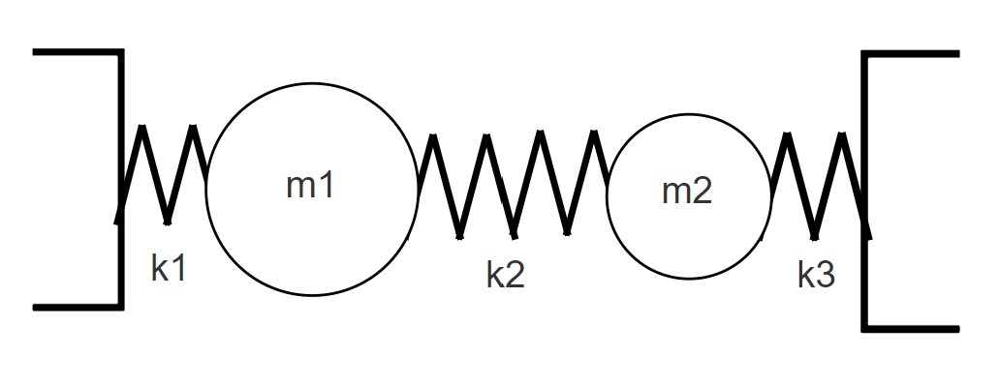

# CHOs

**IMPORTANT** Some of these functions require the [Symbolic Math Toolbox](https://uk.mathworks.com/products/symbolic.html) to work. Make sure it is installed before trying to use them.

The following example will show how to solve a CHO problem alongside matlab. This is complex and requires a good understanding of the physical system.



$$ k = k_1 = \frac{1}{2}k_2 = \frac{1}{3}k_3$$
$$ m = m_1 = \frac{1}{3}m_2$$

Taking the right as the positive direction we can determine the equations of motion for these two masses.

$$m_1\ddot{x_1} = k_2(x_2 - x_1) - x_1k_1$$
$$m_2\ddot{x_2} = k_2(x_1 - x_2) - x_2k_3$$

Divide by the masses and then construct a matrix:

$$ \begin{bmatrix}
\ddot{x_1}  \\
\ddot{x_2}
\end{bmatrix} =
\begin{bmatrix}
\frac{-(k_2 + k_1)}{m_1} & \frac{k_2}{m_1} \\
\frac{k_2}{m_2} & \frac{-(k_2+k_3)}{m_2} 
\end{bmatrix}
\begin{bmatrix}
x_1 \\
x_2
\end{bmatrix}$$

We can define all these elements as **symbolic variables** in matlab and find it's eigenvalues.

```matlab:Code
syms k m
k1 = k
k2 = 2*k
k3 = 3*k
m1 = 3*m
m2 = m
A = [-(k2 + k1)/(m1), k2/m1 ; k2/m2, -(k2 + k3)/(m2)]
[v ,d] = eig(A)
```

The eigenvalues result to be :

$$ \lambda_1 = \frac{k(4\sqrt{3} - 9)}{3m}$$
$$ \lambda_2 = -\frac{k(4\sqrt{3} + 9)}{3m}$$

And their natural frequencies are given by:

$$ \lambda_1 = -\omega_1^2$$
$$ \lambda_2 = -\omega_2^2$$

Therefore:

$$\omega_1 = \sqrt{-\frac{k(4\sqrt{3} - 9)}{3m}}$$
$$\omega_2 = \sqrt{\frac{k(4\sqrt{3} + 9)}{3m}}$$


And their respective eigenvectors tell us how they move

$$v_1 = (2.155,1) (in phase)$$
$$v_2 = (-0.155, 1) (antiphase)$$


###### Dyson School of Design Engineering 2021 - Ivan Revenga Riesco


