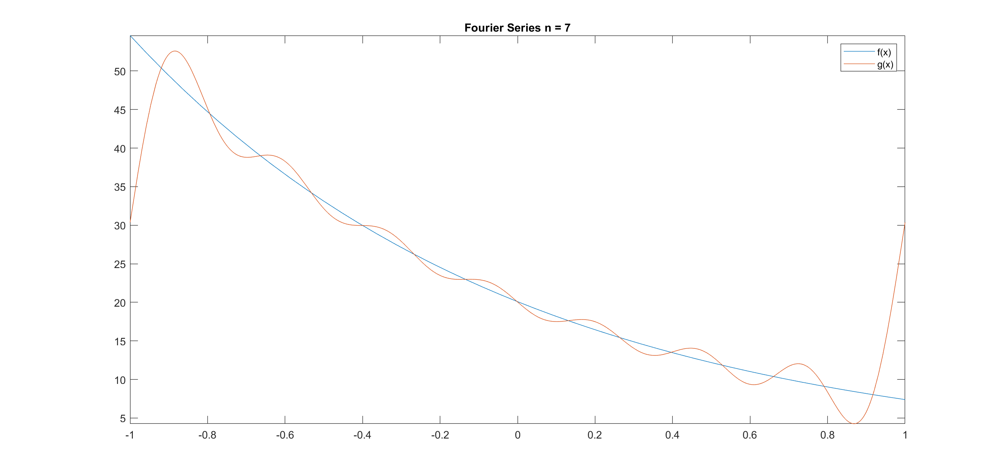

# Fourier series

**IMPORTANT** Some of these functions require the [Symbolic Math Toolbox](https://uk.mathworks.com/products/symbolic.html) to work. Make sure it is installed before trying to use them.

The following example will show how to solve a fourier series question using Matlab

Compute the Fourier Series of the following function in the range **[-1 1]**.

$$ f(x) = e^{-x + 3}$$

For a Fourier Series:
$$ a_0 = \frac{1}{L} \int_{-L}^{L} f(x) dx$$
$$ a_n = \frac{1}{L} \int_{-L}^{L} f(x)\cos(\frac{n\pi x}{L})dx$$
$$ b_n = \frac{1}{L} \int_{-L}^{L} f(x)\sin(\frac{n\pi x}{L})dx$$

$$g(x) = \frac{a_0}{2} + \sum_{n=1}^{\infty} a_n \cos(\frac{n\pi x}{L}) + \sum_{n=1}^{\infty} b_n \sin(\frac{n\pi x}{L})$$


1. First we need to declare our symbolic variables, the function we want to analyse and within what range.
    ```matlab:Code
    syms n x
    f = exp(-x+3);
    range = [-1 1];
    nmax = 7;
    ```
2. Then we declare a0 in terms of f and the range, the symbolic integration is done using the **int()** function.
    ```matlab:Code
    a0 = 1/range(1,2)*int(f,range);
    ```
3. _an_ and _bn_ are special because they have to be declared as functions of n not just symbolic expressions. This is because later on the summation step we need to be able to input different values of n to the _an_ and _bn_ expressions.
    ```matlab:Code
    an = @(n) 1/range(1,2)*int(f*cos(pi*n*x/range(1,2)),range);
    bn = @(n) 1/range(1,2)*int(f*sin(pi*n*x/range(1,2)),range);
    ```
4. Finally we declared g and construct the summation statements using the **symsum()** function.
    ```matlab:Code
    g = a0/2 + symsum(an(n)*cos(n*pi*x/range(1,2)),n,1,nmax) + symsum(bn(n)*sin(pi*n*x/range(1,2)),n,1,nmax)
    ```
The summation on the example goes from n = 1 to n = 7. Plotting it it would look like:

<p align="center">

</p>


###### Dyson School of Design Engineering 2021 - Ivan Revenga Riesco