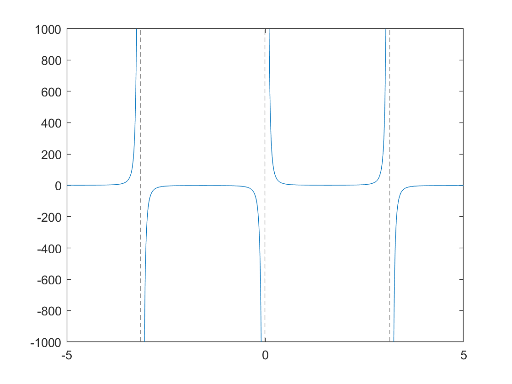
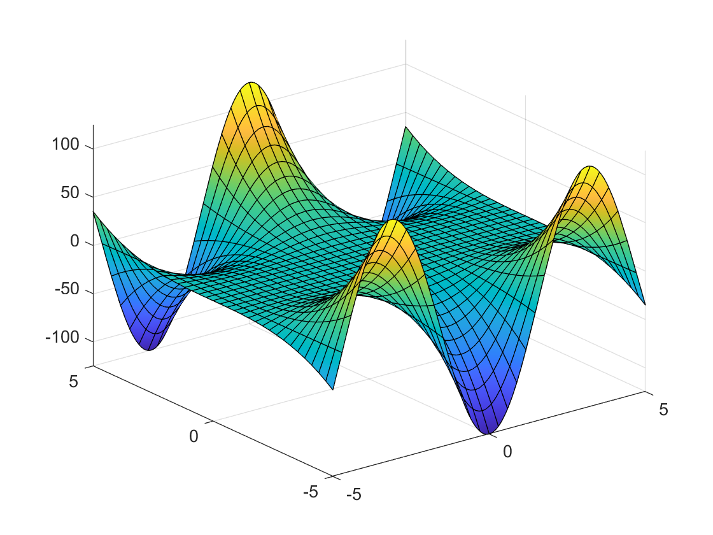

# PDEs

**IMPORTANT** Some of these functions require the [Symbolic Math Toolbox](https://uk.mathworks.com/products/symbolic.html) to work. Make sure it is installed before trying to use them.

## PDE operations
- **diff(f(x),x,n)** computes the nth derivative of f(x) which is a **symbolic expression** with respect to x. If n is omitted it will be the first order derivative. [Full documentation](https://uk.mathworks.com/help/symbolic/diff.html)

    ```matlab:Code
    syms x y z;
    f = x^3-4*x - y*z;
    diff(f,y,1)
    ```
- **int(expr,var,a,b)** computes the **definite** integral of symbolic expr with respect to var from a to b. If a and b are omitted then it will return a symbolic expression of the **indefinite** integral. [Full documentation](https://uk.mathworks.com/help/symbolic/sym.int.html)

    ```matlab:Code
    syms x;
    expr = sin(x) - x^4;
    int(expr,x)
    ```
## Plotting

- **fplot(f(x),Range)** similar to plot() but instead it takes a symbolic function and a range as [xmin xmax] to plot the function through. If the Range argument is omitted the range is [-5 to 5]. [Full Documentation](https://uk.mathworks.com/help/matlab/ref/fplot.html) 
    ```matlab:Code
    f = @(x) sin(x)^-3;
    fplot(f)
    ```
<p align="center">

</p>


- **fsurf(f(x,y),xyinterval)** generates a 3D plot of a symbolic function of 2 variables, the second argument is a matrix that contains the following values [xmin xmax ymin ymax]. By default it's interval is [-5 to 5] for both x and y. [Full Documentation](https://uk.mathworks.com/help/matlab/ref/fsurf.html)
    ```matlab:Code
    f = @(x,y) cos(x)*y^3;
    fsurf(f)
    ```
<p align="center">

</p>


###### Dyson School of Design Engineering 2021 - Ivan Revenga Riesco