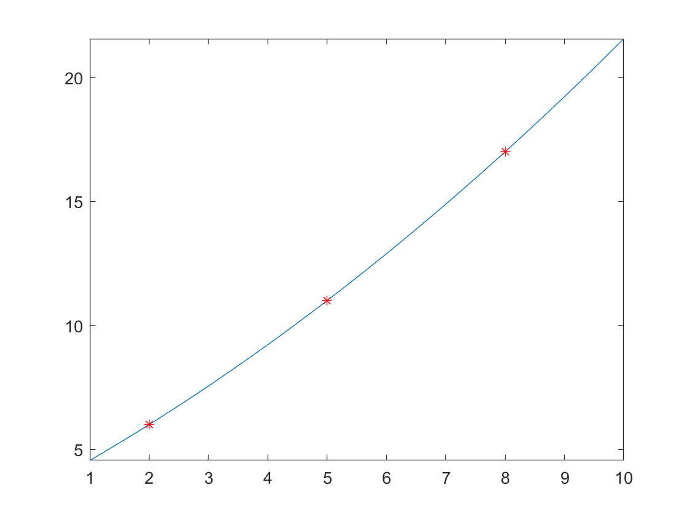

# Optimisation

**IMPORTANT** Some of these functions require the [Symbolic Math Toolbox](https://uk.mathworks.com/products/symbolic.html) to work. Make sure it is installed before trying to use them.

## Optimisation Operations
- **diff(f(x),x,n)** computes the nth derivative of f(x) which is a **symbolic expression** with respect to x. If n is omitted it will be the first order derivative. [Full documentation](https://uk.mathworks.com/help/symbolic/diff.html)

    ```matlab:Code
    syms x;
    f = x^3-4*x;
    diff(f,x,2)
    ```
- **solve(eqn1,eqn2,var1,var2)** solves a or a system of **symbolic equations**. The equations can be inputted in a matrix or separately and so can the variables that you desire to solve for. [Full Documentation](https://uk.mathworks.com/help/symbolic/solve.html)

    ```matlab:Code
    syms x
    eq1 = 4*x^2 + 8 == -4;
    solve(eq1,x)
    ```

    ```matlab:Code
    syms x y;
    eq1 = x + y - 5 == 0;
    eq2 = x^2 - y == 3;
    [xsol ysol] = solve(eq1,eq2,x,y)  
    ```
## Fitting model in data.
In order to fit a set of data in a specific model.
1. First define the model you want to fit the data into.
Let's say I want to fit my data in:
**Important to use ' instead of " with fittype** 
    $$ y = ax^2 + bx + c$$
    ```matlab:Code
    model = fittype({'x^2','x','1'});
    ```
2. Then use the **fit(xdata,ydata,model)** function with the data and it will return the coefficients for a b and c that better suit your data.
    ```matlab:Code
    fit([2 5 8],[6 11 17],model)
    ```
This is how it look relative to the data:




###### Dyson School of Design Engineering 2021 - Ivan Revenga Riesco