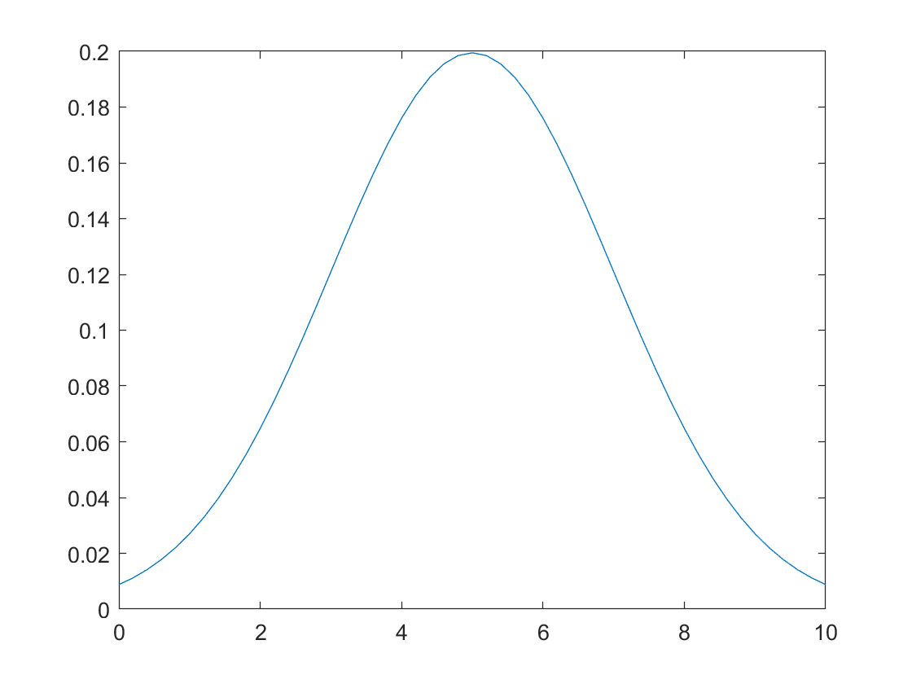

# Normal Distribution

**IMPORTANT** Some of these functions require the [Statistics and Machine Learning](https://uk.mathworks.com/products/statistics.html) to work. Make sure it is installed before trying to use them.

## Normal Distribution Operations
- **solve(eqn1,eqn2,var1,var2)** solves a or a system of **symbolic equations**. The equations can be inputted in a matrix or separately and so can the variables that you desire to solve for. [Full Documentation](https://uk.mathworks.com/help/symbolic/solve.html)

    ```matlab:Code
    syms x
    eq1 = 4*x^2 + 8 == -4;
    solve(eq1,x)
    ```

    ```matlab:Code
    syms x y;
    eq1 = x + y - 5 == 0;
    eq2 = x^2 - y == 3;
    [xsol ysol] = solve(eq1,eq2,x,y)  
    ```
- **normpdf(x,mu,sigma)** calculates the y values over a range of **x** values with a normal distribution model of mean **mu** and standard deviation **sigma**.[Full Documentation](https://uk.mathworks.com/help/stats/normpdf.html)

    ```matlab:Code
    x = [0:0.2:10];
    y = normpdf(x,5,2);
    plot(x,y)
    ```




###### Dyson School of Design Engineering 2021 - Ivan Revenga Riesco