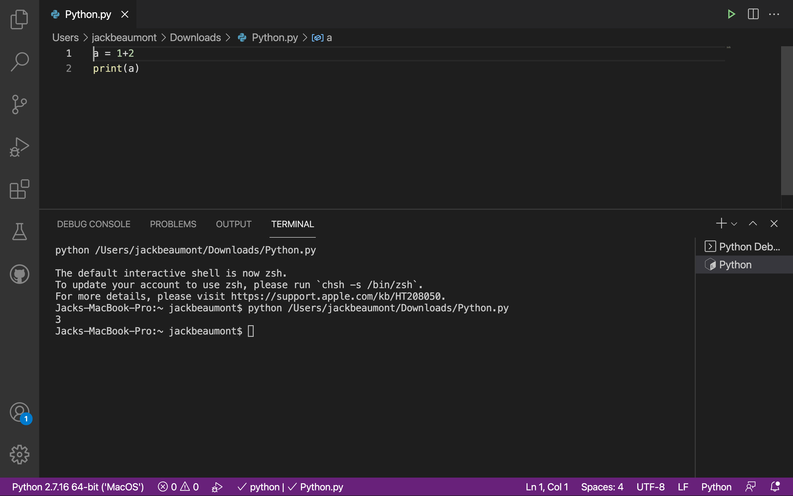

# Interacting with Python

Depending on the type and complexity of the exercise, you could either directly use the Python interpreter or run a file of code.

## Python interpreter

When solving simple problems such as finding the result of a cross product of two vectors, the easiest way to do this is in the Python Interpreter as the result of every line is automatically printed.

You can enter the Interpreter by opening a Terminal window and typing either `python` or `python3` in the prompt.

## VSCode

Alternatively, for more complex problems where you want to have a better view on the code, using an IDE might be more appropriate.

We recommend using VSCode which you should have already installed in Computing 1.

