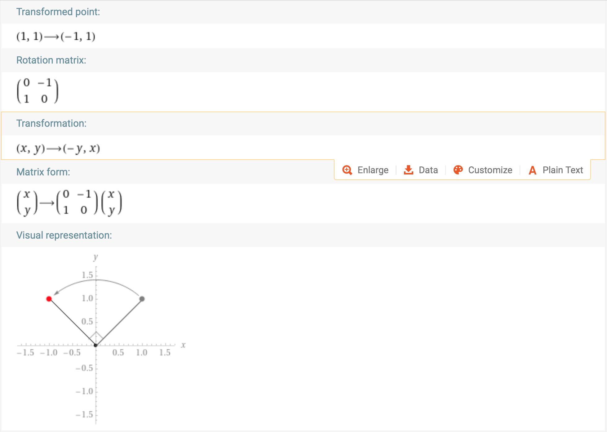
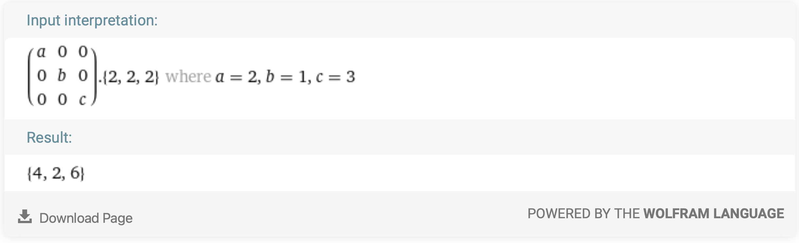

# Linear Transformations

[<= Back to the Cheatsheet](../WolframCheatsheet.md)

**IMPORTANT** You will need to have a [WolframAlpha Pro account](https://www.imperial.ac.uk/admin-services/ict/self-service/computers-printing/devices-and-software/get-software/get-software-for-students/wolfram-alpha-pro/) to use Wolfram effectively.

Linear transformations rely very heavily on [matrices](./matrices.md). For example, calculating the change in size due to a transformation using the determinant, and obtaining the transformation required to undo initial transformation by means of the inverse. You can use a matrix-vector multiplication to obtain the resulting vector after applying a linear transformation. 

### Rotation
You can [ask Wolfram](https://www.wolframalpha.com/input/?i=%7B1%2C+1%7D+rotate+90+degree) to rotate shapes and points for you. 

### Shears
In order to get Wolfram to perform shears, you do need to give it the shear matrix, defining your shear factor `a` to adjust the size of the shear, [like this](https://www.wolframalpha.com/input/?i=%7B%7B1%2C+a%7D%2C+%7B0%2C+1%7D%7D+.+%7B1%2C+1%7D+where+a%3D2).

### Scaling
[Scaling](https://www.wolframalpha.com/input/?i=%7B%7Ba%2C+0%2C+0%7D%2C+%7B0%2C+b%2C+0%7D%2C%7B0%2C+0%2C+c%7D%7D+.+%7B2%2C+2%2C+2%7D+where+a%3D2%2C+b%3D1%2C+c%3D3) works in a similar way, where you need to specify your scale factors.

### Solution of a homogeneous linear system
Here is an example of the [null space (kernel)](https://www.wolframalpha.com/input/?i=null+space+%7B%7B2%2C+6%7D%2C%7B1%2C+2%7D%7D), and a [non-homogeneous system](https://www.wolframalpha.com/input/?i=null+space+%7B%7B2%2C+6%7D%2C%7B1%2C+2%7D%7D). You can visualize the solution on [cartesian axes](https://www.wolframalpha.com/input/?i=2x+%2B+6y%3D7+and+1x+%2B+2y+%3D5).

