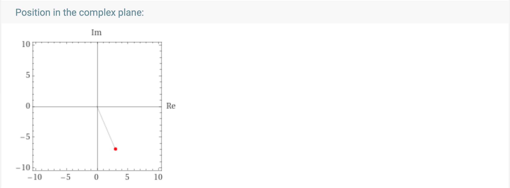
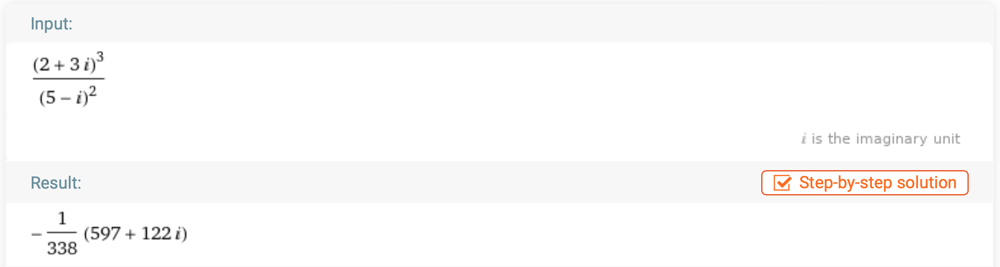
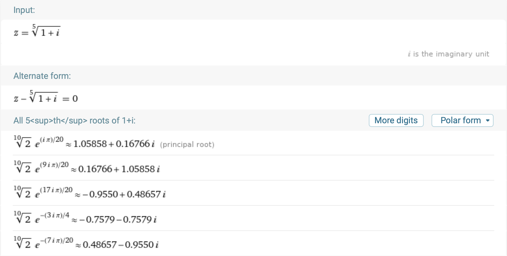

# Complex Numbers

 [<= Back to the Cheatsheet](../WolframCheatsheet.md)

 **IMPORTANT** You will need to have a [WolframAlpha Pro account](https://www.imperial.ac.uk/admin-services/ict/self-service/computers-printing/devices-and-software/get-software/get-software-for-students/wolfram-alpha-pro/) to use Wolfram effectively.

 Wolfram has it's [own documentation](https://www.wolframalpha.com/examples/mathematics/complex-analysis/).

 ### Displaying
 Simply [typing](https://www.wolframalpha.com/input/?i=3-7i) your complex number into Wolfram will give you all kinds of useful information about it, including displaying it on an Argand diagram and polar representation.

 

 ### Calculations
 Doing complex number calculations really is as simple as [typing them in](https://www.wolframalpha.com/input/?i=%282%2B3i%29%5E3%2F%285-i%29%5E2). Wolfram will try to give you as much information as possible - including the answer both as cartesian and polar coordinates.

 

 ### Complex Roots
 Wolfram will apply De Moivre's theorem to find complex roots. All you have to do is [type the equation in](https://www.wolframalpha.com/input/?i=z%3D%281%2Bi%29%5E%281%2F5%29). The solution is visualized in the complex plane.

 