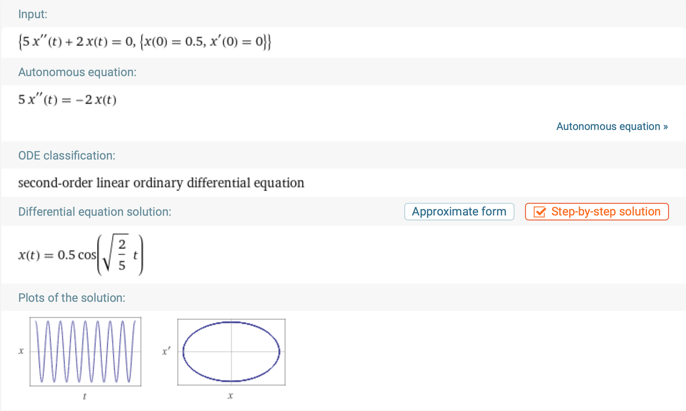
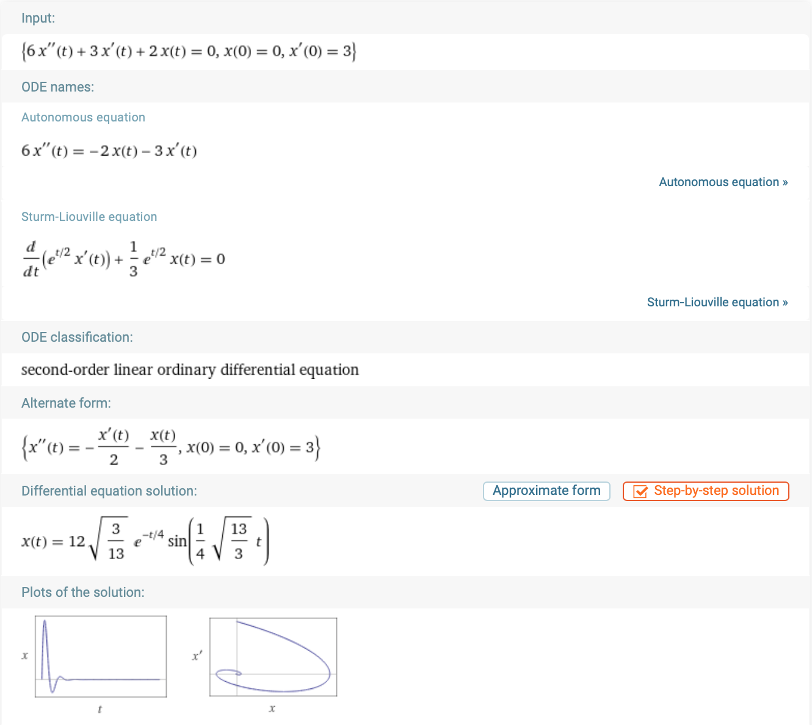

# Ordinary Differential Equations - ODEs

 [<= Back to the Cheatsheet](../WolframCheatsheet.md)

 **IMPORTANT** You will need to have a [WolframAlpha Pro account](https://www.imperial.ac.uk/admin-services/ict/self-service/computers-printing/devices-and-software/get-software/get-software-for-students/wolfram-alpha-pro/) to use Wolfram effectively.

 Wolfram has it's [own documentation](https://www.wolframalpha.com/examples/mathematics/differential-equations/).

 ### Solving a System
 [Solving](https://www.wolframalpha.com/input/?i=6x%27%27+%2B+2x%3D0%2C++x%280%29%3D0%2C+x%27%280%29%3D3) ODEs with initial conditions is trivial. You can type ```/your equation/, /initial condidion 1/, /initial condition 2/``` and Wolfram will give you a general solution.

 

 ### Damping
 You can use exactly the same method as above to solve damped systems. Instead of a simple equation, `6x'' + 2x = 0`, add a damping goefficient: `6x'' + 3x'+ 2x = 0`, [like this](https://www.wolframalpha.com/input/?i=6x%27%27+%2B+3x%27%2B+2x%3D0%2C++x%280%29%3D0%2C+x%27%280%29%3D3).

 