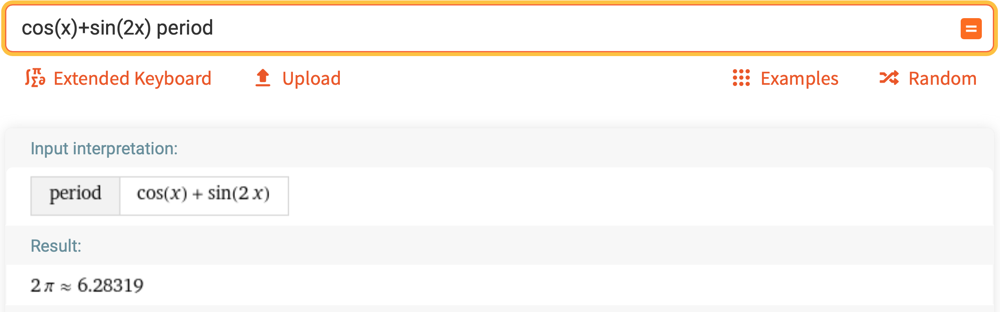
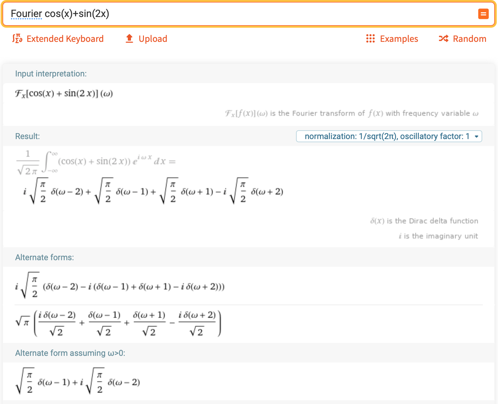

# Fourier Series

 [<= Back to the Cheatsheet](../WolframCheatsheet.md)

 **IMPORTANT** You will need to have a [WolframAlpha Pro account](https://www.imperial.ac.uk/admin-services/ict/self-service/computers-printing/devices-and-software/get-software/get-software-for-students/wolfram-alpha-pro/) to use Wolfram effectively.

 Wolfram has a built-in [Fourier expander widget](https://www.wolframalpha.com/input/?i=fourier+series).

 ### Period of a Function
 You can [ask Wolfram](https://www.wolframalpha.com/input/?i=cos%28x%29%2Bsin%282x%29+period) to find the period of any function, simply by typing the function and the word `period`. This period will usually give the interval 2*L.

 

 ### Fourier Expansion of a Function
 Finding the Fourier expansion of a function is usually as simple as typing `Fourier` before the function, like [here](https://www.wolframalpha.com/input/?i=Fourier+cos%28x%29%2Bsin%282x%29). You can then copy the output in Wolfram form and plot it.

 

 Often, the form of these expasions willl not be particularly useful - and questions may ask for specific components of the expansion. For this reason, it is worth understanding the manual methods behind the Fourier series as well.