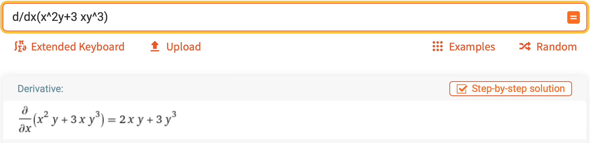
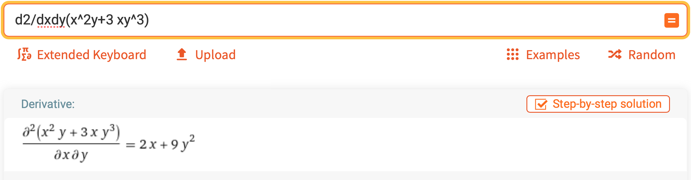
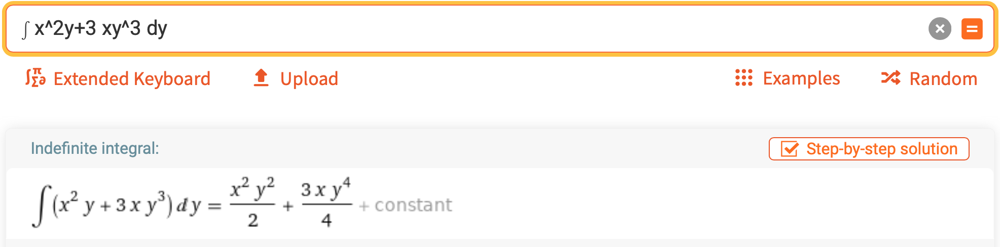

# Multivariate Calculus

[<= Back to the Cheatsheet](../WolframCheatsheet.md)

**IMPORTANT** You will need to have a [WolframAlpha Pro account](https://www.imperial.ac.uk/admin-services/ict/self-service/computers-printing/devices-and-software/get-software/get-software-for-students/wolfram-alpha-pro/) to use Wolfram effectively.

### Partial Derivatives
You can find partial derivatives in eaxctly the same way as you would use Wolfram for full derivatves: [type](https://www.wolframalpha.com/input/?i=d%2Fdx%28x%5E2y%2B3xy%5E3%29) `d/dx` or `d/dy` in front of your function:

### Second-Order Partial Derivatives
2nd order partial derivatives can be done in [much the same](https://www.wolframalpha.com/input/?i=d2%2Fdxdy%28x%5E2y%2B3+xy%5E3%29) way. You can type `d2/dxdy` or `d2/dx2` in front of your equation:

### Integration
Integration with Wolfram works similarly to differentiation. Type `∫` from the Wolfram extended keyboard in front of your function, and `dy`, `dx` etc after it, like [this](https://www.wolframalpha.com/input/?i=∫+x%5E2y%2B3+xy%5E3+dy).

