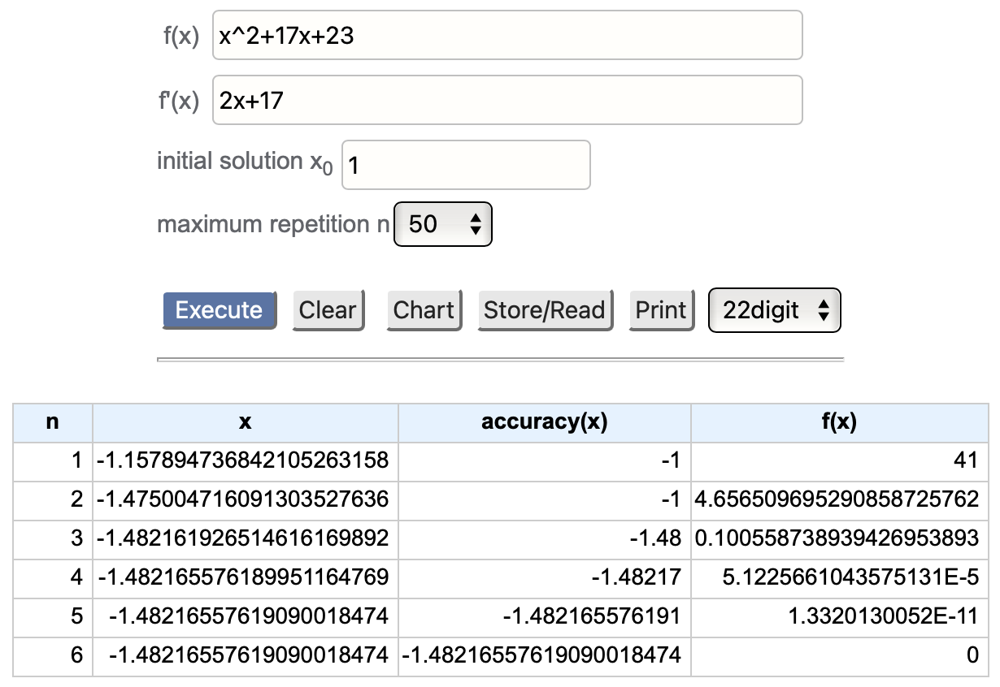

# Root Finding

 [<= Back to the Cheatsheet](../WolframCheatsheet.md)

 **IMPORTANT** You will need to have a [WolframAlpha Pro account](https://www.imperial.ac.uk/admin-services/ict/self-service/computers-printing/devices-and-software/get-software/get-software-for-students/wolfram-alpha-pro/) to use Wolfram effectively.

 ### Bisection Method
 WolframAlpha [can](https://www.wolframalpha.com/input/?i=bisection+method+x*sin%28x%29+at+a%3D1+and+b%3D4+with+10+digits+precision) _do_ the bisection method (just ask it `bisection method x*sin(x) from 1 to 4`) - however, it only gives you the final answer to the specified precision. There are several online calculators, including [this one](https://keisan.casio.com/exec/system/1222999061), which can be much more useful by giving intermediate steps.

 Using either of these tools for the bisection method has its problems, though - you might not spot a discontinuity, for example, if you just type the equation in. Plottting the graph first (on Wolfram, Desmos, Matlab...) might help.

 ### Newton-Raphson Method
 Very similarly to the bisection method, Wolfram [will do](https://www.wolframalpha.com/input/?i=solve+x%5E3-17x+using+newton+method+with+x0%3D2+to+50+digits) the Newton-Raphson method. But again, there are calculators (like [this](https://keisan.casio.com/exec/system/1244946907)) that are more helpful: they also give each of the intermediate solutions before the final answer.

 The disadvantage of the calculators over Wolfram is that many calculators require the function **and** its derivative to be inputted.

 