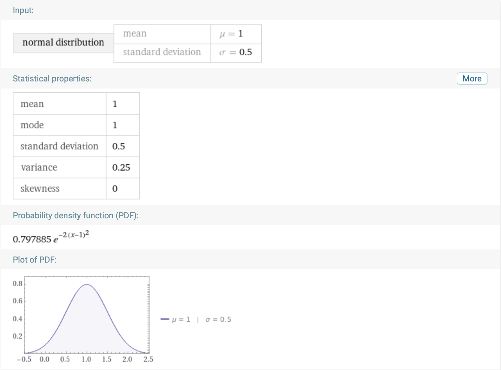

# Optimisation

 [<= Back to the Cheatsheet](../WolframCheatsheet.md)

 **IMPORTANT** You will need to have a [WolframAlpha Pro account](https://www.imperial.ac.uk/admin-services/ict/self-service/computers-printing/devices-and-software/get-software/get-software-for-students/wolfram-alpha-pro/) to use Wolfram effectively.

 ### Visualisation
 Wolfram can help to [visualise](https://www.wolframalpha.com/input/?i=normal+distribution%2C+mu%3D1%2C+sigma%3D0.5) ND bell curves, and will also give numerous other of the curve's parameters.

 

 ### Probability Calculation
 You can get Wolfram to calculate the probability of an event [between two values](https://www.wolframalpha.com/input/?i=normal+distribution%2C+mean%3D100%2C+sd%3D50%2C+120%3Cx%3C140) or, with a composite method, [outside a range](https://www.wolframalpha.com/input/?i=%5Bnormal+distribution%2C+mean%3D100%2C+sd%3D50%2C+120%3Ex+%5D%2B%5Bnormal+distribution%2C+mean%3D100%2C+sd%3D50%2C+x%3E140%5D).

 

 ### The Error Function
 Of course, you can also use Wolfram to [evaluate](https://www.wolframalpha.com/input/?i=1%2F2*%281%2Berf%28+%2860-50%29+%2F+%28sqrt%282%29*10%29+%29%29) the error function without having to use approximations such as `erf(x) = tanh(1.2x)`