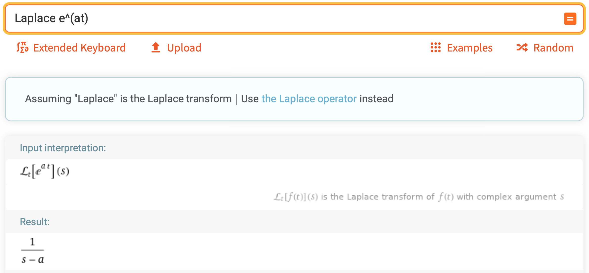
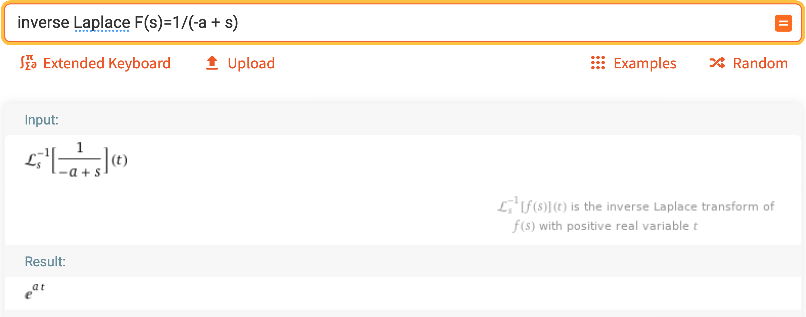

# Laplace Transforms

 [<= Back to the Cheatsheet](../WolframCheatsheet.md)

 **IMPORTANT** You will need to have a [WolframAlpha Pro account](https://www.imperial.ac.uk/admin-services/ict/self-service/computers-printing/devices-and-software/get-software/get-software-for-students/wolfram-alpha-pro/) to use Wolfram effectively.

 ### Laplace
 In order to compute the Laplace transform of a function, simply type `Laplace /function/`, like [this](https://www.wolframalpha.com/input/?i=Laplace+e%5E%28at%29).

 

 ### Inverse Laplace
 The inverse Laplace transform is just as simple: [use](https://www.wolframalpha.com/input/?i=inverse+Laplace+F%28s%29%3D1%2F%28-a+%2B+s%29) `inverse Laplace` followed by your function. As you can see below, this returns the original equation from above.

 