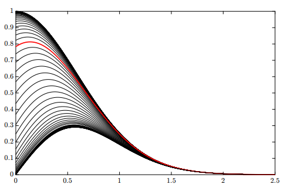

# How to make/edit tutorial sheets
This document should give a semi-brief (hopefully) intro to how to start creating and editing the tutorial sheets as well as other math documents in this repository. Assumes minimal knowledge of markdown, LaTeX, GitHub etc.

## Quick edits
GitHub supports on-site editing of all text files. However, the preview will not render any maths or other embeds so it is only useful for quick edits. With any markdown file opened, click the pencil on the top right.


# Setting up the full "dev environment"
If you already have VS Code (or a text editor of your choice that can preview markdown) and GitHub setup, you can skip pretty much all of this except: "Getting the VS Code preview to display math and other embeds".

## Recommended software: VS Code and GitHub Desktop
[Visual Studio Code](https://code.visualstudio.com/) is a wonderful free code editor that supports markdown previews (and does a lot more).

[GitHub desktop](https://desktop.github.com/) is a great way to interface with GitHub if you don't want to mess around with the command line (only really useful if you are a mega nerd, or mess something up very badly).

## (GitHub setup) Clone the repository
From the [GitHub repository site](https://github.com/DE1-Engineering-Mathematics/module-resources), click the _"open with github desktop"_ option on green code/clone button and follow the resulting prompts.


### Never work out of the master branch!!
For a verity of good reasons, a great Git/GitHub rule is to never work out of your master branch (the main one in our case being: all edits to the master branch get published directly to the GitHub pages website). It's good practice to switch to a specific branch or create a new one after cloning. Use the `tutorial-sheets` branch if you do not want to make a new branch for your edits.

_TODO: Write tutorial for forking/pull requests_


### Other resources
[GitHub Guides: Hello world](https://guides.github.com/activities/hello-world/)

[GitHub Guides: GitHub flow](https://guides.github.com/introduction/flow/)

## (VS Code setup) Setting up the markdown preview
### Spell check and GitHub markdown plugins
Two very useful plugins are
* [Code Spell Checker](https://marketplace.visualstudio.com/items?itemName=streetsidesoftware.code-spell-checker) - pretty self explanatory, we are engineers not english majors after all :)
* [Markdown Preview Github Styling](https://marketplace.visualstudio.com/items?itemName=bierner.markdown-preview-github-styles) - adds GitHub's markdown styling to the preview

### Getting the VS code preview to display math and other embeds
By default, the VS Code will not render math/other embedded content. This is because they require external sources to be loaded and by default VS Code doesn't allow this for safety reasons. We can turn off the security settings that disable this, and as long as you don't open any malicious markdown content there is no need for concern.


#### Step 1, change preview security settings (top right)


#### Step 2, disable preview security


___Warning: Now that we have disabled preview security, make sure you trust all the markdown files you open, as well as their content's sources.___
_(aka: don't forget you left this setting off and then go preview up some random file off the internet)_

<br><br>

-----------------------------------------------------------------------------
<br><br>


# Basic markdown and LaTeX
Now that you have access to edit and preview the documents, the next thing is to understand what's in them and how they are laid out.

## Quick intro to markdown
The tutorial sheets (and other documents, such as this one) are written as markdown documents. Markdown is essentially a highly optimized way of writing html that contains all the basic formatting options necessary to write static pages. Any `.md` will be rendered on GitHub as markdown.

### Basic markdown syntax
The basic bits of markdown syntax that are useful to know are:

```markdown
# Headings
## Smaller headings
### Even smaller... and so on

[this is a link!](https://imperial.ac.uk/)


* this is the first item in a list
* this is the second item in the list

-------------------------------------------
^ This is a horizontal separator (anything after 3 dashes works)

<br>
^ This is a line break
```

For a full intro, check out [GitHub's guide on how to write markdown](https://guides.github.com/features/mastering-markdown/)

## Quick intro to LaTeX
[LaTeX](https://www.latex-project.org/) is a typesetting language that is specificity designed for scientific and technical documents. It has wonderful math typesetting features that are used in the tutorial sheets to generate pretty looking formulas etc.

### Basic LaTeX syntax
In our pages, any text that is surrounded by $ $ will be rendered using LaTeX (specifically the [MathJax](https://www.mathjax.org/) library). The important bits of LaTeX syntax to know are:

```markdown
$ x^2 $ - Exponents (superscripts)
$ x_1 $ - Subscripts
$ \frac{x}{y} $ - Fractions
$ \Rightarrow $ - Looks like: =>
$ \text{text} $ - Renders anything inside the {} as text, not math
$ \int_{a}^b $ - Integral notation (replace with \sum for sum notation)
$ \quad $ - 4 spaces (used frequently in the original tutorial sheet notation)
$ \space $ - Yep, literally a space (also can use "\ ")
$ \boxed{\text{a thing}}$ - puts a box around whatever is inside (used for answers)
```
### LaTeX resources

* https://arachnoid.com/latex/ - Simple online latex editor (has some example formulae)
* https://detexify.kirelabs.org/classify  - Useful webapp that shows you the closest LaTeX symbol to what you drew.
* https://mathpix.com/ - Detexify on steroids, a snipping tool/camera phone app that lets you extract LaTeX formulae from images. (Free limit: 100 snips a month)

## LaTeX Troubleshooting
Here is a list of things to look out for that might catch you out first time around.
One of the main reasons for some of these issues is the compiling of githib pages is a two step process.
Github will render Markdown into HTML in the first pass on their servers.
Then after that the MathJax engine will process maths content in the browser once the page is loaded.
This means, that any GitHub Markdown feature will take priority.

### Display equations centred in blocks
Make sure to leave a clear line between your block mode maths and other text
otherwise it may not render on its own line and centred.
```markdown
Let's assume our trial solution is,

$$
u(x, y, t) = X(x)Y(y)T(t)
$$

Then inputting into the 2D diffusion equation, we get,
```

### Equations over multiple source code lines.
For readability in source code, I break my equations into multiple lines.
E.g.
```markdown
$$
\frac{\partial^2 f(x, t)}{\partial t^2} =
- 2 g \frac{\partial f(x, t)}{\partial t}
+ c^2 \frac{\partial^2 f(x, t)}{\partial x^2}
$$
```
However, the `+` and `-` characters at the start of a line are interpreted
as the start of a bullet list, and break the math-mode block before it renders
in MathJax.
The workaround is to wrap leading plus/minus signs in braces `{}`.
```markdown
$$
\frac{\partial^2 f(x, t)}{\partial t^2} =
{-} 2 g \frac{\partial f(x, t)}{\partial t}
{+} c^2 \frac{\partial^2 f(x, t)}{\partial x^2}
$$
```

### Multi-line equations and aligned equations
If you use MathJax v3 to render maths (Which is faster than v2),
using the `\\` command to add new lines doesn't work unless you
wrap the TeX in an environment that supports it, e.g. `align*`,
which also aligns equations to a chosen symbol using `&`.
```markdown
$$\begin{align*}
T''(t) &= -\gamma T(t) \\
X''(x) &= -k_x^2 X(x)
\end{align*}$$
```

### Prime symbols
GitHub docs uses smart quotes, which means it converts the `'` quote symbol
*inteligently* into either `‘` or `’` which can trip up MathJax,
particularly for double prime quantities like `X''(x) = -k^2 X(x)`.

You can instead use the `\prime` symbol as a superscript,
e.g. `X^{\prime\prime}(x) = -k^2 X(x)`
Or even better define a macro (version dependent), to be able to use,
`X^\pp(x) = -k^2 X(x)`

<br><br>

-----------------------------------------------------------------------------
<br><br>


# Tutorial sheet layout
## The "Preamble"
([a stolen latex term](https://latex.wikia.org/wiki/LaTeX_preamble)) At the top of each tutorial sheet, there is a section of required imports, which setup MathJax, our custom script (for answer show/hide etc) and a css style sheet.

Check the template sheet _insert link_ to copy and paste the current version.


## Intro / Resources
After the require imports, tutorial sheets have an opening section with: Learning targets, Reading, Lectures and Additional resources. These are meant to help guide a student through the week's content and serve as a place to store review resources as well.

## Questions
The next/main/currently final section in each tutorial sheet are the problems. Each question has parts with corresponding answers and is categorized into question types. 

__Question types__ are titled with a level 2 heading (`##` in markdown), there are generaly three sections:
* Essential Questions
* Exam Style Questions
* Challenging Questions

__Questions__ are titled with a level 3 heading (`###`) and each __part__ is manually lettered such as: (a).

__Answers__ are contained within a html div with the class "answer" (`<div class = "answer"></div>`), this allows for dynamic collapse/expand.

Here is an example problem from the functions tutorial sheet:

```markdown
### Problem 1.
Separate the following using the method of partial fractions.

(a) $f(x) = x^3 e^{2x}$
<div class = "answer">$\Rightarrow{}$ Using product rule $\Rightarrow{} \frac{d}{dx}(uv) = v\frac{du}{dx} + u\frac{dv}{dx}\\ \Rightarrow{} u = x^3,\quad v=\exp{(2x)}$
$\Rightarrow{} \frac{du}{dx} = 3x^2$
$\Rightarrow{}$ using chain rule $\frac{d}{dx}v(g(x)) = \frac{dv}{dg}\frac{dg}{dx}$ to solve $\frac{dv}{dx}$ with $g(x) = 2x$
$\Rightarrow{} \frac{dv}{dx} = 2\exp{(2x)}$
$\Rightarrow{} \frac{df(x)}{dx} = 3x^2\exp{(2x)} + 2x^3\exp{(2x)}$
$\Rightarrow{} \boxed{\frac{df(x)}{dx} = x^2\exp{(2x)}(3 + 2x)}$
</div>
```

This will render like this when the answer is toggled:


The final answer to a question should have `\boxed{}` to help point it out to the reader.


-----------------------------------------------------------------------------


## Copying tutorial sheets from overleaf
The previous tutorial sheets have some LaTeX document specific formatting that is useful to understand:

* `\section{}` denotes a new problem
* `\Qpart` denotes a new problem part
* `\begin{comment} \end{comment}` is used to hide the answer (replace with the answer div)
* `\ans{}` was the previous way of collecting final answers in problems (replace with boxed)

### Plots
MathJax does not support LaTeX plots, but since we are working on the internet, there are better options! [Desmos](https://www.desmos.com/) is one of the easiest candidates to make embeddable, interactive plots. To generate a Desmos embed, enter the graph/extra features into Desmos and click the share button. 


