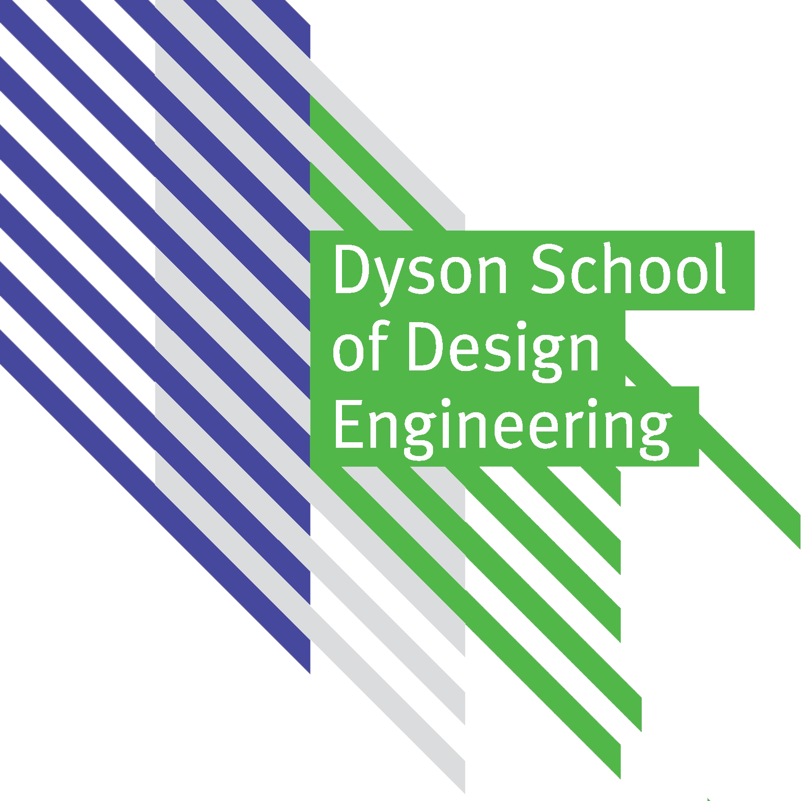

# Engineering Mathematics Module Resources
 

<!-- ## [Module Notes Here](https://imperiallondon.sharepoint.com/sites/msteams_1d9188/Shared%20Documents/Forms/AllItems.aspx?csf=1&amp%3Bweb=1&amp%3Be=l38bKk&cid=84927633%2D346a%2D4659%2D9301%2Dbf11dddda4ea&FolderCTID=0x012000CE08C59F1772E543B28B5F41B1E5B30E&id=%2Fsites%2Fmsteams%5F1d9188%2FShared%20Documents%2FGeneral%2FDE1%2DMaths%5Fnotes%2Epdf&parent=%2Fsites%2Fmsteams%5F1d9188%2FShared%20Documents%2FGeneral)   -->

<!-- ## [GitHub Module Notes](module-resources\media\DE1-Maths_notes.pdf) -->

<!-- Depends on whether the notes are updated or not -->
## [External Link Notes](https://de1-engineering-mathematics.github.io/module-resources/media/DE1-Maths_notes.pdf)

## Tutorial sheets:
### Term 1
* __[1 - Refresher and Functions](tutorial_sheets\01-refresher-and-functions)__
* __[2 - Vectors](tutorial_sheets\02-vectors)__
* __[3 - Matrices](tutorial_sheets\03-matrices)__
* __[4a - Linear Transforms](tutorial_sheets\04A-linear-transforms)__
* __[4b - Eigenproblems ](tutorial_sheets\04B-eigenproblems)__
* __[5a - Power Series](tutorial_sheets\05A-power-series)__
* __[5b - Sequences](tutorial_sheets\05b-sequence)__
* __[6 - Complex Numbers](tutorial_sheets\06-complex-numbers)__
* __[7 - ODEs](tutorial_sheets\07-ode)__
* __[8 - Coupled Harmonic Oscillators](tutorial_sheets\08-cho)__

### Term 2
* __[9 - Laplace Transforms](tutorial_sheets\09-laplace-transforms)__
* __[10 - Fourier Series](tutorial_sheets\10-fourier-series)__
* __[11 - Multi-variate Calculus](tutorial_sheets\11-multivariate-calculus)__
* __[12 - Partial Differential Equations](tutorial_sheets\12-PDE)__
* __[13 - Finite Methods](tutorial_sheets\13-finite-methods)__
* __[14 - Root Finding](tutorial_sheets\14-root-finding)__
* __[15 - Optimisation](tutorial_sheets\15-optimisation)__
* __[16 - Normal Distribution](tutorial_sheets\16-normal-distribution)__

 
-----------------------------------------------------------------------

## Find an error, think of an improvement?
__[How to report an error.](how-to-github-issue)__

__[How these sheets are made.](how-to)__

 

## Acknowledgements
### Module leaders
* __Sam Cooper__
* __Freddie Page__

### Original tutorial sheet authors
* 

### 2020 Maths Student Shapers
* Emilio Severi - 2018
* Megan Hale - 2018
* Sene Kutluay - 2019
* Tristan Uvovo - 2019
* Thomas Godden - 2019

### Students who have found errors in the sheets
* Ivan Revenga Riesco - 2020
* Andrea Contri - 2020
* Shirley Zhao - 2020
* Mingzhe Hu - 2020
* Sarthak Das - 2020
* Amy Walter - 2020
* Mier Harris - 2020
* Ragavi Thavayoganathan - 2020
* Saian Patel - 2020
* Zhao Qi So - 2020
* Arturo Cano Amoros - 2020
* Michela Puglia - 2020
* Ciara Bates - 2020
* Michela Puglia - 2020
* Mathy Tharany - 2020
* Emmeline Bolton - 2020
* Omar Ben-Gacem - 2020
* Amelia Bryant - 2020
* Kiran Scott de Martinville - 2020
