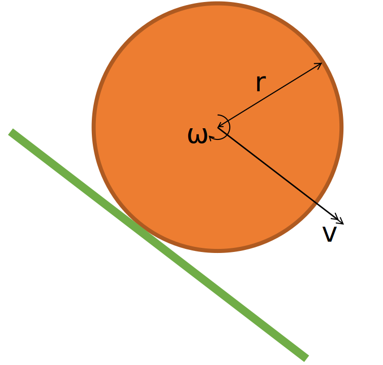
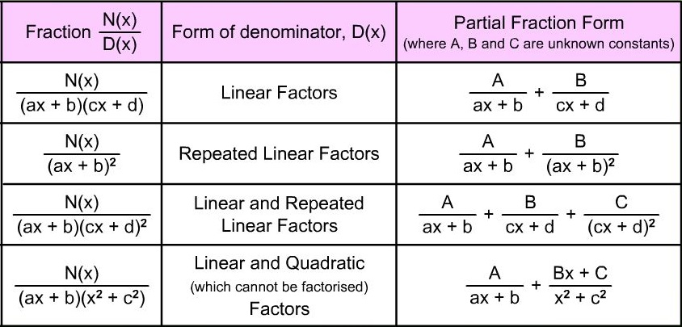
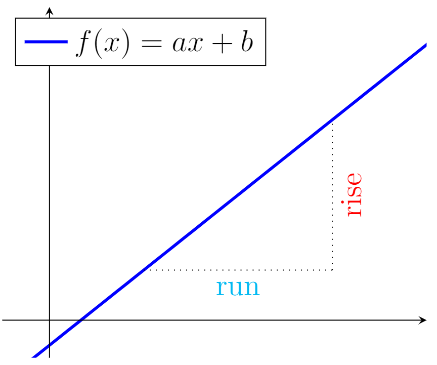
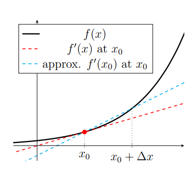
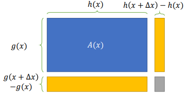
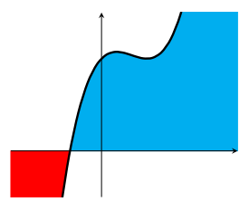

<link rel="stylesheet" type="text/css" media="all" href="styles.css">

## [Return to Contents](notes-contents)

# Chapter 0 - Refresher
This chapter is meant to serve as a high-speed reminder of a few concepts from high school
which you will need to progress with this course. Some of you may have forgotten (or even
never known) some of this material; however, if you let anyone from the teaching team know
this, then I’m sure we can get you up to speed in no time! :-)  

## 0.1 Algebra
 

You will all be familiar with the core idea of algebra, which is that you can represent numbers and concepts (like functions) with symbols. This is very powerful as it allows you to move away from discussing specific cases and instead describe generalised ideas. For example, if I say that the speed of a cylinder rolling down a hill is $v$, its rotational speed is $\omega$, and its radius is $r$; then by considering a bit of geometry, I can write down the relation $v=\omega r$ and this will be true for many different combinations of these three parameters. Fun fact: the word ''algebra'' comes from the Arabic ''al-jabr'' which means ''the reunion of broken parts''; bonus fact, the word ''algorithm'' comes from the name of a specific 8$^{th}$ century Persian mathematician called  Al-Khwarizi.
  
Algebra is at the heart of much of what we do in mathematics and I'm sure you will have done plenty of it at high school. However, for this course I am much more interested in you developing strong mathematical intuition than being masters of grinding through long algebra problems.  
  
To a great extent, computers have taken over most of the mathematical tasks that engineers were once expected to do; however, you still need to know the key ideas in order to take advantage of the computer's power (and to know what to do when the computer gets stuck). You'll also need to know how to manipulate algebraic expressions, using tools such as Partial Fractions (see table), algebraic long division or simultaneous equations.
  

## 0.2 Calculus
We will be using calculus in almost every topic in this module, so it seems sensible for us to start with a quick refresher. However, I won't be expecting you to remember lots of tricky substitutions and identities because, since the advent of the internet, these have turned out to not be very useful things to know. Instead, what we'll be focusing on is the core understanding behind each topic, which will hopefully give you mathematical confidence, without being too dull.
  

If you are given the graph of a linear function (ie $f(x)=ax+b$ in the adjacent figure), you can calculate the slope by simply drawing a right-angle triangle and then calculating the ratio of the vertical to the horizontal lines (ie rise over run or ''RoR''). You can perform this operation anywhere along the line because this function has a constant gradient, but what do we do if our function's gradient is variable?
  
For the general function $f(x)$, the ''gradient'' at a point is the slope of the curve at that point. In the figure below, we're looking for the gradient of the black line at point $x_0$ (the red point). To apply the RoR approach again, we must pick another point further along the $x$-axis, which we will call $(x_0+\Delta x)$. However, as you can see from the figure, the line passing through these two points is not a great approximation to the slope at $x_0$.
  

What I hope you can also appreciate is that as our two points move closer together (\ie as $\Delta x$ gets smaller), then this approximation will improve. We can formalise and extend this rational to write the following expression, which says that 'in the limit' as $\Delta x$ 'goes to zero' (\ie becomes _infinitesimally_ small), then our approximation will become exact. So our gradient becomes (three different derivative notations styles also shown):  

$\frac{\textrm{d}(f(x))}{\textrm{d}x} \equiv \frac{\textrm{d}}{\textrm{d}x}f(x)\equiv f'(x)=\lim_{\Delta x \to 0}\left(\frac{f(x+\Delta x)-f(x)}{\Delta x}\right)$

 
This is still just the same old RoR concept, but taken to an extreme limit. You may not have encountered the 'lim' notation before, but what it's asking you to do is find the value of the expression as $\Delta x$ goes to 0, but not actually at 0 as this would break our fraction (ie you can't divide by zero) - we'll cover this concept in more detail in a later chapter. 

## 0.3 Using Calculus
Although you will probably have lots of derivatives memorised by now, it's important to remember that you are just using shortcuts to evaluate the 'lim(RoR)' equation above.
  
For example, if $g(x)=3x^2-5$, then we can simply substitute this into the expression above and rearrange to find the derivative. Make sure you are comfortable working through the following example:

$$\begin{aligned}
g'(x)
&=\lim_{\Delta x \to 0}\left(\frac{(3(x+\Delta x)^2-5)-(3x^2-5)}{\Delta x}\right)\\
&=\lim_{\Delta x \to 0}\left(\frac{(3x^2+6x\Delta x +3\Delta x^2-5)-(3x^2-5)}{\Delta x}\right)\\
&=\lim_{\Delta x \to 0}\left(\frac{6x\Delta x +3\Delta x^2}{\Delta x}\right)=\lim_{\Delta x \to 0}\left(6x+3\Delta x\right) \quad = \quad 6x\\
\end{aligned}$$

You can see that once you've work through the algebra, it's that final step where the magic of the ``lim'' happens. We have $6x+3\Delta x$, but as $\Delta x$ becomes very small we can just ignore it.

Now that we've understood the core concept, we can start to build a list of time saving rules so that we don't have to use 'lim(RoR)' equation each time. As we've already seen in our first example, polynomials can be dealt with using two rules. The **Power Rule** tells us that differentiation of a simple power can be efficiently calculated by multiplying the original power to the front and then reducing the power by 1 (ie $f(x)=ax^b \Rightarrow f'(x)=abx^{b-1}$). Also in the above example is the **Sum Rule**, which says that the derivative of the sums is the sum of the derivatives (ie $f(x)=g(x)+h(x) \Rightarrow f'(x)=g'(x)+h'(x)$).

The **Product Rule**, which tells us how to differentiate the product of two functions, so if $f(x)=g(x)h(x)$,

$ \quad \frac{\textrm{d}(f(x))}{\textrm{d}x}\equiv f'(x)=g'(x)h(x)+g(x)h'(x)$   

Perhaps the simplest way to think about the product rule is to consider $g(x)$ and $h(x)$ to be the length of two sides of a rectangle of area $A(x)$. This means that to differentiate w.r.t. $x$ (NB `w.r.t.' is short for 'with respect to') is simply to ask how does $A(x)$ change with $x$. We can imagine that for a certain function, increasing $x$ by some small $\Delta x$ will increase $A(x)$ by the amount shown in the two yellow and one grey boxes in the adjacent figure. If you now write down an expression for this increase in area, divide it by $\Delta x$ and once again take the limit, you'll recover the expression above. When you try this, you'll notice that the area of the grey box ends up being ignored.
  

The **Chain Rule** is slightly harder to visualise, but a similar logic can be applied. Consider a function of a function $g(h(x))$. We can differentiate this thing by using the following expression.  

$f(x)=g(h(x))\quad\Rightarrow\quad
	f'(x)=\frac{\textrm{d}}{\textrm{d}x}g(h(x)) = g'(h(x))\ h'(x)\equiv \frac{\textrm{d}g}{\textrm{d}h}\times\frac{\textrm{d}h}{\textrm{d}x}=\frac{\textrm{d}g(h(x))}{\textrm{d}x}$

 
For example, if $f(x)=g(h(x))$, where $g(x)=2x^2+3$ and $h(x)=5x^3-1$. As $g'(x)=4x$ and $h'(x)=15x^2$, therefore, $f'(x)=g'(h(x))\ h'(x)=4(5x^3-1)\times 15x^2=300x^5-60x^2$. In this simple example, you could equally have found this result by simply multiplying out $g(h(x))$ and taking the derivative of the resulting expression.

### 0.3.1 Integration

Integration is just the inverse operation to differentiation, but can also be thought of as finding the area between a function and the axis (NB. If a function is negative, this area counts as negative, for example, the integral of the sine function between 0 and $\pi$ is 1, but between 0 and $2\pi$ it's gone down to 0 again).
  

The **Power Rule** for integration tells us that the integral of a simple power can be efficiently calculated by increasing the power by 1 and then dividing the coefficient by this new power (ie $f(x)=ax^b \Rightarrow \int f(x)\textrm{d}{x}=\frac{a}{b+1}x^{b+1}+c$). This is clearly the inverse operation to the differential power rule, with the only key difference being the appearance of a new term $c$. This term is simply a constant and you can see that if you had started by differentiating a function which contained a constant and then integrated again, you wouldn't know what this constant was (eg $f(x)=3x^2+3 \Rightarrow f'(x)=6x \Rightarrow \int 6x\textrm{d}x=3x^2+c$).
  

For the **Sum Rule**, the same rules apply as for differentiation, whereby the integral of the sums is the sum of the integrals (ie $f(x)=g(x)+h(x) \Rightarrow \int f(x) \textrm{d}{x}=\int g(x)\textrm{d}{x}+ \int h(x)\textrm{d}{x}$).

The key time saving rule that you should be aware of for integration is called **Integration by Parts** or sometimes just **Parts** for short. One way to think about this process is as a rearrangement of the product rule for differentiation. So, for the function $f(x)=g(x)h(x)$:  

$\frac{f(x)}{\textrm{d}x}=\frac{g(x)}{\textrm{d}x}h(x)+\frac{h(x)}{\textrm{d}x}g(x)\quad\Rightarrow{\text{integrate \& rearrange}}\quad
\int \left(g(x)\frac{h(x)}{\textrm{d}x}\right)\textrm{d}x=f(x)-\int \left(h(x)\frac{g(x)}{\textrm{d}x}\right)\textrm{d}x$

  
To make this easier to remember, it can be shortened to $\int g \text{d}h=gh-\int h\text{d}g$. Make sure you understand why this is and how to use it, as we'll be using it a lot in the chapter on Fourier series. 

In general, integration is tough (tougher than differentiation) and often doesn't give you nice solution in terms of elementary functions. 

## 0.4 Powers, logs & bases
In the simple case where an exponent, $n$, is a positive integer, it specifies the number of times a variable, $b$, is multiplied by itself.
 

$\begin{aligned}
a 
&= b^n \\
&= \underbrace{b\times ...\times b}_{n\text{ times}}
\end{aligned}$

However, as you will have seen, this definition can be expanded to allow for any exponent (or 'power') positive or negative, real or complex. The following equations show several representations of the same number, achieved through manipulating and interpreting its exponent. Make sure you understand how to convert between each of these forms.

$7^{-\frac{2}{3}}=
7^{-\frac{1}{3}}\times7^{-\frac{1}{3}}=
\frac{7^{\frac{1}{3}}}{7}=
\frac{7^{-\frac{1}{3}}}{7^{\frac{1}{3}}}=
\frac{1}{7^{\frac{2}{3}}}=
\frac{1}{\sqrt[3]{\left(7^{2}\right)}}=
\left(\frac{1}{\sqrt[3]{7}}\right)^2$

A logarithm (or 'log') is the inverse operation to exponentiation, where $b$ is now referred to as the *base* of the logarithm.

$\quad log_b(a) = n \quad\quad (\text{Log to the base }b\text{ of a equals }n)$

When dealing with addition or multiplication, we have a clear picture in our mind of what an equation is asking us to do, but people tend to be less clear with logs, which is perhaps because they cannot turn the mathematical statements into sentences.  

$$\begin{aligned}
&x=2+10 \newline 
&\text{'What is two add ten?'}
\newline \newline
&x=2\times 10 \newline 
&\text{'What is two lots of ten?'}
\newline \newline
&x=10^{2} \newline 
&\text{'What is ten times itself?'}
\newline \newline
&x=\log_{10}(100) \newline
&\text{'What power of ten makes one hundred?'}
\end{aligned}$$

 
It can also be useful to refer to an 'easy to recall' example, such as $\boldsymbol{\log_{10}(100)=2}$, to help you remember how to convert between logarithms and exponents. 
  
N.B. You will often see the expression '$\ln(x)$', which is simply the logarithm with the Euler's number, $e=2.718...$ as its base: $\ln(x)=\log_{e}(x)$. This is commonly referred to as the 'natural logarithm'. We'll be meeting $e$ again later in the course. 
  
We now need to learn how to manipulate logs:
  

**Rule** - Addition

$\quad\quad\log_b(x)+\log_b(y)=\log_b(xy)$

**Example** - We now know that $\boldsymbol{\log_{10}(100)=2}$, so clearly $\log_{10}(100)+\log_{10}(100)=2+2=4$, but using the addition rule this also implies that $\log_{10}(100\times 100)=\log_{10}(10000)=4$, which makes sense, as $10^4=10000$.  

**Rule** - Subtraction

$\quad\quad\log_b(x)-\log_b(y)=\log_b\left(\frac{x}{y}\right)$

**Example** - We can see that $\log_{2}(32)-\log_{2}(4)=\log_{2}(2^5)-\log_{2}(2^2)=5-2=3$, but we could have also arrived at this result by using the subtraction rule, as $\log_{2}(32)-\log_{2}(4)=\log_{2}(32/4)=\log_{2}(8)=\log_{2}(2^3)=3$. You should also notice here that the subtraction rule is just a logical extension of the addition rule and follows from our discussion of powers at the beginning of this chapter.  

**Rule** - Powers

$\quad\quad\log_b(x^p)=p\log_b(x)$

**Example** - If you are given the expression $-0.2\log_{2}(243)$ you can convert this to an alternative form where the coefficient is within the log function as follow: $\log_{2}(243^{-0.2})=\log_{2}(243^{-\frac{1}{5}})=\log_{2}(\frac{1}{\sqrt[5]{243}})=\log_{2}(\frac{1}{3})$  

### 0.4.1 Change of base
We can re-express $\log_{b}(x)$ in terms or an arbitrary base $c$ using the following formula. 

$$\log_b(x) = \left(\frac{1}{\log_c(b)}\right)\log_c(x)$$
 

**Example** - $\log_8(64)$ can be express in base 2 as  $\left(\frac{1}{\log_2(8)}\right)\log_2(64)$

This can be useful for expressing all the terms in an equation in the same base, which makes manipulation easier. Using the power rule from the previous section, we can also clearly re-express this in the following manner.  

$\quad\begin{aligned}
\log_b(x) 
&= \log_c\left(x^{1/\log_c(b)}\right)\\
&= \log_c\left(\sqrt[\log_c(b)]{x}\right)
\end{aligned}$

 

**Example** - $\log_9(x)$ can be express in base 3 as  $\log_3(x)/\log_3(9)= \log_3(x)/2=\log_3(\sqrt{x})$ 
  

## 0.5 Engineers love
### 0.5.1 Unit comparisons and dimensional analyses

Rather than looking at equations as just a collection of abstract numbers and symbols, engineers are usually attributing some physical meaning to them. This means that each *may* have units. Furthermore, each term may be higher dimensional than a simple scalar (e.g. 7) and could be a vector (e.g. [3, 2, 4] or matrix, [1, 2; 5, 3], etc. ).
  
Crucially, only quantities with the same units and dimensions may be added (+), subtracted (-) or compared ($=, <, >$). This is very useful as it allows us to quickly assess whether a problem has been correctly stated and frequently to spot ways to simplify an expression. Also, it means you have less to remember as you can always check the units to see if, for example, your fraction is the right way up.
  
Think of the following equation of motion, where $s$ is distance, $u$ is speed and $t$ is time. 

$$s=ut+0.5at^2 \quad\quad \textrm{units}\rightarrow \quad\quad [\textrm{m}]=[\frac{\textrm{m}}{\textrm{s}}][\textrm{s}]+[??][\textrm{s}^2]]$$

Just by simple comparison of the units, you can tell that the $a$ term must have units of $\left[\frac{\textrm{m}}{\textrm{s}^2}\right]$ and therefore be an acceleration term. 
  

### 0.5.2 Order of magnitude approximations

Another crucial engineering skill is 'order of magnitude analysis', which is essentially a method for simplifying equations by ignoring certain terms. 
  
Consider the expression $y=\frac{x+1}{x^2}$. If you were told to evaluate this expression only for values of $x>>1$ (i.e. $x$ \textit{much} larger than 1), it would be reasonable to forget about the 1 and say $y\approx1/x$. This kind of approximation is typically what we might call a 'back of the envelope' calculation. 
  
In complicated equations, such as the [Navier Stokes equations ](https://en.wikipedia.org/wiki/Navier-Stokes_equations) which describe viscous fluid flow, often the first step in their analysis is to work through each of the terms and determine which are small enough to be ignored - this is just the kind of thing engineers love and you'll be doing plenty of it on this degree!
  
We also have some special notation to characterise the ``order of magnitude'', $\mathcal{O}(x)$, which we'll be putting in to use in the chapter on power series approximations.
  

### 0.5.3 Curve Sketching

Although the whole next chapter is about curve sketch (as it's such an important topic), you should all have covered various simple transforms that enable you to shift and stretch a curve on the plane.
  
Study the adjacent figure and make sure you can see how the constant $a$ (assuming $a>0$) transforms the original black curve to the four new curves shown.
    

## Conclusion
If anything we covered in this chapter was new to you (or old... but still mysterious), then please let someone from the teaching team know and we will do our best to get you up to speed. Alternatively, if you are feeling confident enough to have a look online, then there as so many wonderful resources available to help you - Khan Academy is an excellent place to start with high school topics like these.

