

<link rel="stylesheet" type="text/css" media="all" href="styles.css">

## [Return to Contents](notes-contents)

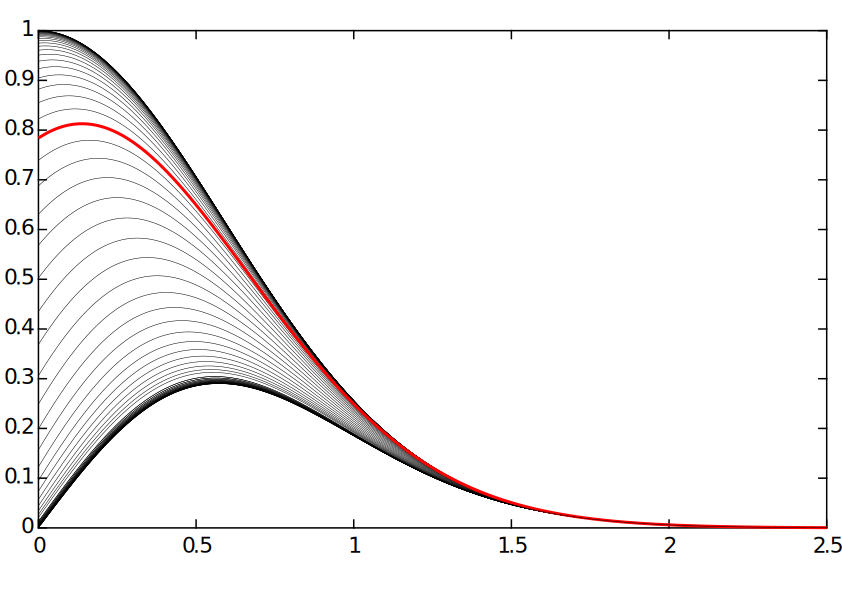

# Chapter 1 - Functions

In many ways this is the most important chapter of the course - if you are able to sketch and manipulate functions with confidence, then all the other methods we will discuss will be much simpler. Ultimately, sketches in general are just diagrams designed to convey some specific bits of information whilst not worrying too much about others - function sketching is no different.

## 1.1 Curve Sketching

When sketching a curve, there are several key features which need to be considered.

1. General Shape
2. Intercepts ($x=0$ and $y=0$)
3. Asymptotes
4. Stationary Points ($\frac{\textrm{d}{y}}{\textrm{d}{x}}=0$)
5. Inflection Points ($\frac{\textrm{d}{^2y}}{\textrm{d}{x^2}}=0$)
6. Domain and Range
  

### 1.1.1 General Shape
It is very useful, before you start calculating any of the specific features, to have a picture in your mind of roughly how the curve should look. The following four plots are to help you remember some common functions that you should be familiar with. Put your finger over the colour indicators in the legend and make sure you can pair up the curves with the functions. Apologies for how busy each figure is, but this is the best way to see the patterns!
  
The effect of varying the index of variable:
 
  
  
Natural functions, illustrating that inverse functions can be constructed with simple reflections across the line $y=x$:
 
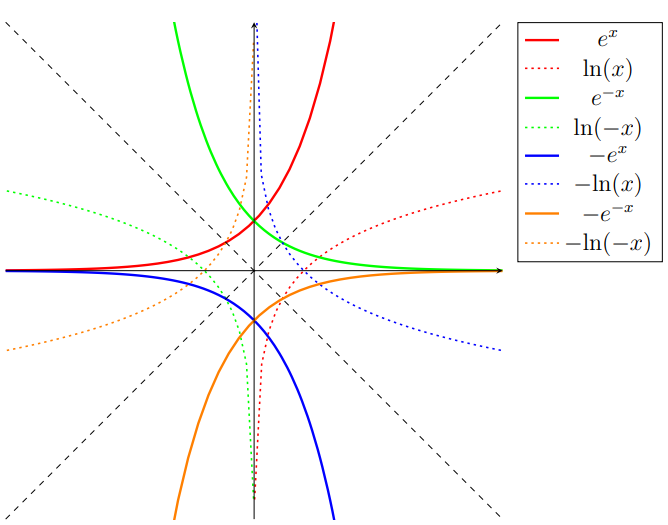  
  
Trigonometric functions
 
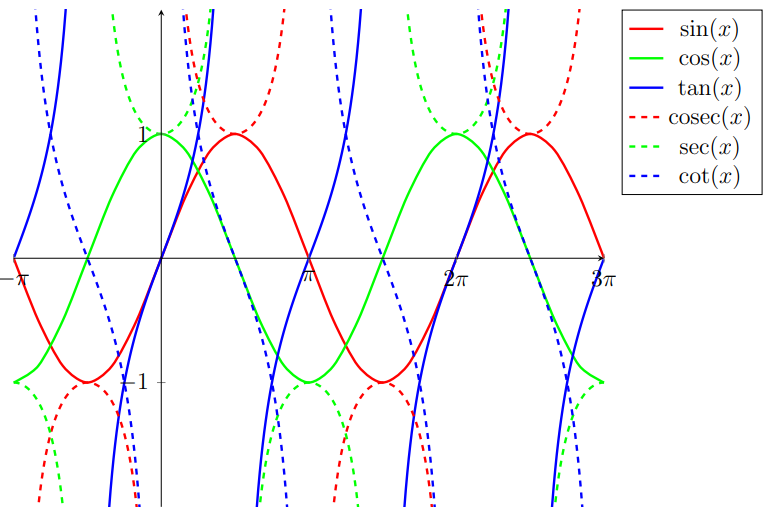  
  
Hyperbolic Functions
 
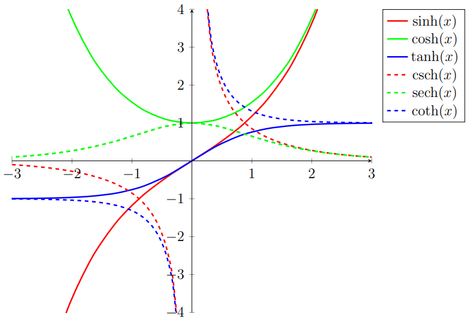   

### 1.1.2 Intercepts
Once the general shape has been established, it is then often useful to be able to label certain points of interest. If you are given an *explicit* equation ($i.e.$ in the form $y=f(x)$), then a trivial point to find is the intercept of the vertical axis. This is evaluated by setting the independent variable to zero.
  
**Example** - For the curve $y=3x^3-47x+9$, the $y$-intercept occurs at $y=3(0)^3-47(0)+9=9$
  
The points at which the curve crosses the $x$-axis are called *roots*. For some simple equations, they can be found by inspection.
  
**Example** - The root of the curve $y=\frac{x-1}{x^2}$, can be found by considering when the function would equal zero. This will occur only when the numerator of the fraction is also zero; therefore, we need only solve $x-1=0$, giving us $x=1$.
  
For some other functions, we must first rearrange the equation to a form that yields the roots. 
  
**Example** - The roots of the curve $y=x^2+4x-21$, can be found by first factorizing the equation to the form $y=(x-3)(x+7)$. In order to solve this equation at $y=0$, we must find the two values of $x$ that cause each of the bracketed terms to be zero. Therefore, the roots occur at $x=3$ and $x=-7$. 
  
Furthermore, the roots of all equations of the form $y=ax^2+bx+c$ can be found using the familiar 'quadratic formula'.  

$$x=\frac{-b\pm\sqrt{b^2-4ac}}{2a}$$

However, there remain many equations which cannot be tackled with any of the above methods. Consider, for example, the function $y=x^{3/2}-x+7$. To find the roots in this case we are forced to employ *numerical methods*, which are discussed in a later chapter.  

### 1.1.3 Asymptotes
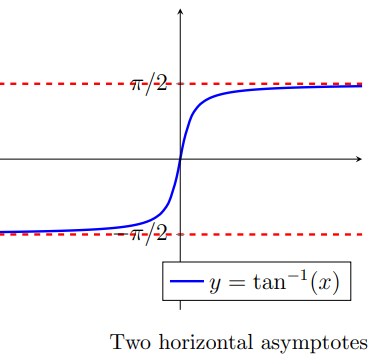
An asymptote is a straight line that is continually approached by a given curve, but does not meet it at any finite distance. Asymptotes can be vertical, horizontal or oblique (slanted), as illustrated in the following figure. 
  
If a function can be expressed as a fraction, then a vertical asymptote will occur when the denominator equals zero. Also, if the degree of the numerator is one higher than the denominator, it may also have a slant asymptote.
  

**Example** - For the equation $y=\frac{-3x^2+2}{x-1}$, there is an easy to spot vertical asymptote when the denominator of the fraction equals zero (ie at $x=1$).
  

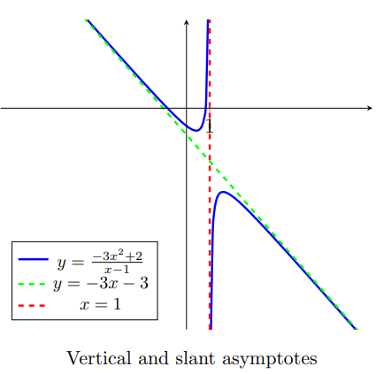
However, notice that the degree of the numerator is higher than that of the denominator, which means there may also be a slant asymptote. The next step is to perform algebraic long division, which tells us to expect an asymptote on the line $y=-3x-3$. Now that we have our slant asymptotes, we should think about whether our function will be above or below this line. Perhaps the simplest way of doing this is just to sample the pair of points either side of $x=1$ and see if they are positive or negative.
<!--Missing LaTex for long division -->
  

### 1.1.4 Stationary Points
Stationary points are where the gradient of a curve is zero. They can be found by differentiating the function and finding the values of $x$ where the differential is zero.
  
**Example** - Differentiating the function $y=x^3+x^2-8x-7$, gives the expression $\frac{dy}{dx}=3x^2+2x-8=(3x-4)(x+2)$. Stationary points occur at $(3x-4)=0$ and $(x+2)=0$, yielding $x=4/3$ and $x=-2$.
  
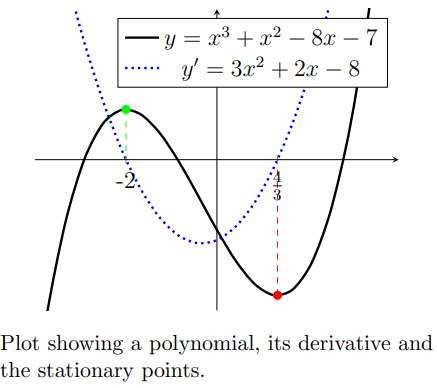
If the gradient of the function changes sign at the stationary point, then it is called a 'turning point'. It is also possible to determine whether a turning point is a local maximum or minimum by differentiating a second time and evaluating the second differentials at each turning point. If the second differential is positive, then the point is a minimum and *vice versa*.
  
**Example** - Differentiating the function $y=x^3+x^2-8x-7$ twice yields $\frac{d^2y}{dx^2}=6x+2$. Taking the stationary points from the previous example, we find that evaluating the second derivative at the stationary point $x=4/3$ gives $6(4/3)+2=10$, so it is a local minimum, and similarly at the stationary point $x=-2$ gives $6(-2)+2=-10$ so it is a local maximum.
  
If the gradient of the function does not change sign at the stationary point, then it is called a point of 'horizontal inflection'. Inflection points are discussed in the next section, but to visualise a curve with a stationary point that is not a turning point, think of the function $y=x^3$.
  
Finally, if you'd like to evaluate the $y$-coordinates of stationary points, simply substitute their $x$-coordinate back into the original equation (this might sound obvious, but people do forget!).
  

### 1.1.5 Inflection Points
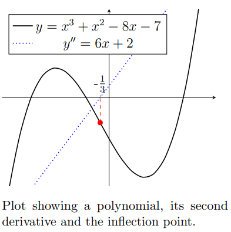
An inflection point is a point on a curve at which the sign of the curvature (ie the concavity) changes. Inflection points may be stationary points (eg the function $y=x^3$), but do not have to be and they are not local maxima or local minima. They can be located by finding where the second derivative of a function equals zero.
  

**Example** - Differentiating the function $y=x^3+x^2-8x-7$ twice yields $\frac{d^2y}{dx^2}=6x+2$. Setting this to zero, we find that $6x+2=0$, which gives $x=-1/3$.
  

### 1.1.6 Domain and Range
The *domain* is the set of all $x$ coordinates that have a corresponding $y$ coordinate.
  
The *range* is the set of all $y$ coordinates that have a corresponding $x$ coordinate.
  
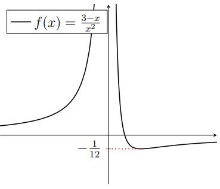
They can be expressed using set notation, where square brackets '[ ]' signify that the point is included and round brackets '( )' signify that it is excluded. By convention, infinities are consider to be excluded. If our domain has multiple regions, separated by discontinuities, then we can express this concept using the union symbol '$\cup$'.
  
**Example** - For the function $y=\frac{3-x}{x^2}$, as shown in the figure, there is an asymptote at $x=0$ and the global minimum (ie the lowest point) occurs at the coordinate ($6,-\frac{1}{12}$). We can therefore express the domain as $(-\infty,0)\cup(0,\infty)$ and the range as $[\frac{-1}{12},\infty)$  
  

### 1.1.7 Log Axes
One application of logs that you will encounter frequently as an engineer is plotting graphs where one ('log-linear') or both ('log-log') of the axes use a log scale. For example, a log-linear plot might be required when the independent variable causes the dependant variable to range over multiple scales; whereas, the log-log plot can be used to extract 'power law' relationships (such as growth). The following figures plot the same three functions in each of the three graphs.  

  
The left figure shows the functions on linear axes with which you are familiar. The middle figure, plotted with a semi-log (base 10) y-axis, makes the first two functions into straight lines. Finally, in figure on the right, by plotting the log of the functions in the appropriate base (in this case base $e$), allows the coefficient of the power to be directly measured from the graph as the gradient for the first two functions, but not for the last.
  

#### Log-log axes
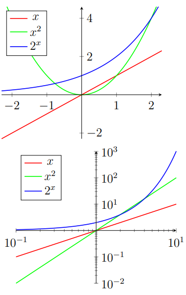
In the case of log-log axis, perhaps the easiest way to see whether a function will be a straight line is to take the log of both sides of your expression and then make the following substitution.  

$$X=\log(x)\qquad\&\qquad Y=\log(y)$$
  
And then check if this substituted function is itself linear. For example, considering the function $y=7x^2$ and then taking logs (any base is fine) of both sides, we get $\log(y)=\log(7x^2)=\log(7)+\log(x^2)=\log(7)+2\log(x)$. Now, making the above substitution, we get $Y=\log(7)+2X$. Remembering that $\log(7)$ is just a number, we see that our new expression matches the form $y=mx+c$ and so must be a straight line on a log-log scale.
    

## 1.2 Problem Solving
We have just seen how to produce sketches of functions using their key features. However, in an open-book exam it is far too easy to be given a function and asked to sketch it because various graphing tools can do this for you. Instead, it is a greater test of your skills to have a curve-sketching question in reverse; that is, "Here is a sketch, can you find the function?". In this type of question, online tools will only get you so far and you will need to rely on your understanding of the features of graphs! In most cases you will be given a framework equation such as $f(x)= ax\cos(b\pi x)+c$ and you will need to find the values of the constants by referring to a sketch.
  

### 1.2.1 Walkthrough
Suppose we are told that the sketch below has the equation $f(x)=a+cos(b\pi x)e^{\frac{x}{c}}$ and we need to find the values of $a$, $b$ and $c$, given that they are all integers..
  
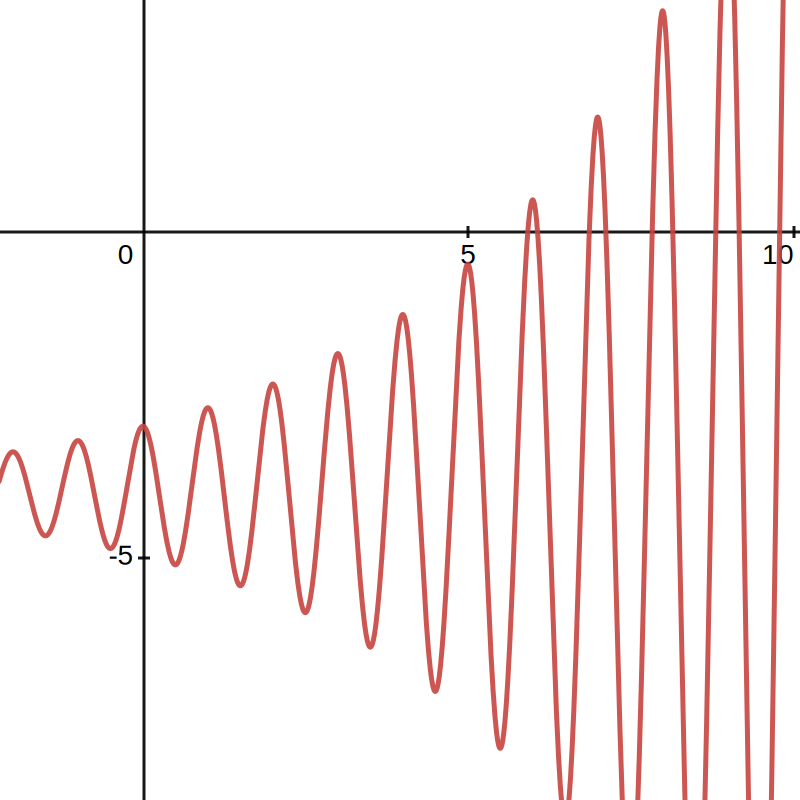

The first (and easiest) step is to work with the vertical intercept. From the sketch we can see that the curve crosses the $y$-axis at $y=-3$. We can substitute $x=0$ into our framework equation: 
$$f(0)=a+cos(0)e^{0}=a+1$$  We know that $f(0)=-3$, therefore: $$a+1=-3 \Rightarrow \boxed{a=-4}$$
Next we will work with the horizontal intercepts. We can substitute $y=0$ into our framework equation:
$$0=a+\cos(b\pi x)e^{\frac{x}{c}}\Rightarrow 4=\cos(b\pi x)e^{\frac{x}{c}}\text{ (as } a=-4\text{)}$$
This equation is not particularly useful yet, however it may become more useful once we find another constant.
  

Following this, we need to make an executive decision to avoid working with turning points. This is because there are far too many of them at unhelpful locations for them to be of use. Instead we can examine the periodicity of the curve.
  

The $b\pi$ term governs the frequency of the curve and we can see that the curve has an oscillation period of $1$. Using the relationship between time period, $T$ and frequency, $f$, ($f=\frac{1}{T}$), we can find the value of $b$.
$$b\pi=\frac{2\pi}{1}\Rightarrow \boxed{b=2}$$

Now all we need to find is the constant $c$. We can use the equation we found from the horizontal intercepts:
$$4=cos(2\pi x)e^{\frac{x}{c}}$$
To find $c$ we need to choose one of the many horizontal intercepts. The trick here is to choose a value of $x$ that simplifies our equation. We are choosing $x\approx6$ because when we substitute this into our equation, the $\cos(2\pi x)$ term simplifies to $1$. The same outcome is achieved by using an of the other intercepts. This allows us to easier isolate $c$.
$$4=\cos(12\pi)e^{\frac{6}{c}}$$
$$4=e^{\frac{6}{c}} \text{ (as }\cos(12\pi)=1\text{)}$$
The integer solution to this equation will give us the value of $c$.
$$\ln{4}=\frac{6}{c}\Rightarrow c=\frac{6}{\ln4}=4.32808...\Rightarrow\boxed{c=4}$$
This means that the equation of the curve in the sketch is $f(x)=-4+cos(2\pi x)e^{\frac{x}{4}}$.
