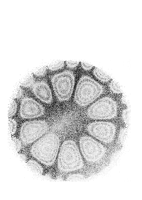
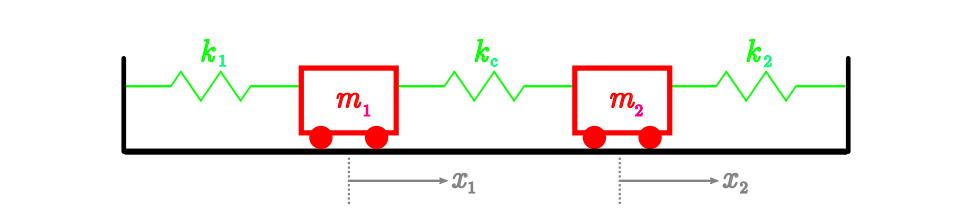
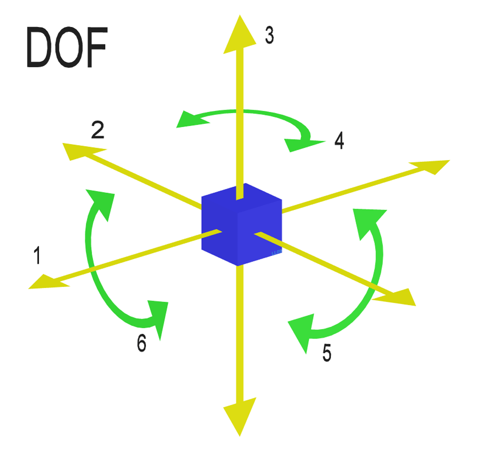
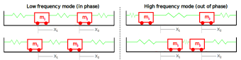
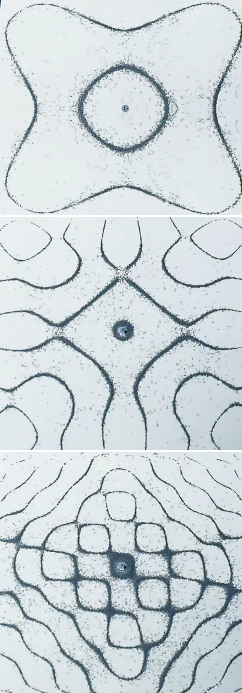

<link rel="stylesheet" type="text/css" media="all" href="styles.css">

## [Return to Contents](notes-contents)

# Chapter 10 - Coupled Oscillators

This chapter will bring together  many of the topics we've covered so far in the course: graph sketching, vectors, matrices, eigenanalysis, complex numbers and ODEs... you're going to love it. Furthermore, it will allow you to start developing insight into how maths can help us model more complex physical systems, with many components coupled (\ie linked) together.  

Take the spring-mass system from the previous chapter (forget the damper for now) and then connect this mass, via another spring, to a second mass, which is itself connected to a wall by a third spring (see figure below).  

  
We can use a similar analysis approach to that laid out in the previous chapter, where we related forces to accelerations, but we will have to consider each of the two masses separately.  

As such, we will be considering a separate position variable for each mass, both of which are defined as pointing in the same direction and equal to zero when the system is in static equilibrium (ie when $x$ and all its derivative equal zero). For the following analysis, let's also assume that all three spring are neither extended or compressed when the system is in static equilibrium.  

## 10.1 Sum of forces
So, for the left hand mass, $m_1$, we must consider the effect of both the left hand spring, $k_1$, and the central connecting spring, $k_{\textrm{c}}$. If we move $m_1$ to the right (ie a position $x_1>0$), then spring $k_1$ will act to pull it back towards $x_1=0$, just as in the previous chapter. But what about spring $k_{\textrm{c}}$?   

Well, whether spring $k_{\textrm{c}}$ is stretched or compressed depends not just on the position of $m_1$, but also on the position of $m_2$. More specifically the extension of spring $k_{\textrm{c}}$, depends on the relative location of $m_1$ to $m_2$, which we can write as $(x_1-x_2)$, \ie if $(x_1-x_2)>0$, then spring $k_{\textrm{c}}$ must be compressed, which act to push $m_1$ in the negative $x_1$ direction. Summing the forces acting on $m_1$ resulting from springs $k_1$ and $k_{\textrm{c}}$, we can say  

$$\Sigma F_{m_1}=-k_1x_1-k_{\textrm{c}}(x_1-x_2)=m_1\ddot{x}_1$$

  
Applying the same logic to the second mass, clearly as it moves in the positive $x_2$ direction, this will compress spring $k_2$, acting to push it back towards $x_2=0$. Similarly, the action of spring $k_{\textrm{c}}$ will depend on the relative location of the two masses, leading to the equation  

$$\Sigma F_{m_2}=-k_2x_2-k_{\textrm{c}}(x_2-x_1)=m_2\ddot{x}_2$$

  
We can take these two equations and write them as a pair of second order differential equations, factorised for the $x$ terms rather than the $k$ terms.   

$$\begin{align}
	m_1\ddot{x}_1+(k_1+k_{\textrm{c}})x_1-k_{\textrm{c}}x_2=&0\\
	m_2\ddot{x}_2+(k_2+k_{\textrm{c}})x_2-k_{\textrm{c}}x_1=&0 
\end{align}$$

  
However, based on our work in the previous chapter it's still not clear how to 'solve' this system, where, presumably a solution will take the form of a pair of equations, giving the explicit location of $m_1$ and $m_2$ (\ie $x_1$ and $x_2$) as a function of time, $t$.   

## 10.2 Natural frequencies and Eigenmodes

 

We saw in the ODEs chapter that spring-mass systems have a 'natural frequency' at which the system will oscillate if 'perturbed' (ie, set in motion). This concept extends to systems of coupled masses, but instead of having a single natural frequency, they have one natural frequency per 'degree of freedom' (DoF). The number of DoF of a system is the number of variables required to fully describe its independent displacement/rotation. The adjacent diagram shows the six DoF of a body in 3D space, 3 translational and 3 rotational. So, for our two masses moving in a one dimensional model, we have two degrees of freedom only, described by $x_1$ and $x_2$.   

Let's imagine a scenario where the two masses are vibrating at the same frequency, $\omega$. This will of course have been the result of a certain set of initial conditions, but we're not interested in these for now.  

If the masses are oscillating at the same frequency, then their general solutions can be described with the following pair of equations (which we can then differentiate twice to describe their acceleration, as below).  

$$\begin{align}
	x_1(t)=&A_1\sin(\omega t)+B_1\cos(\omega t)
	\\
	x_2(t)=&A_2\sin(\omega t)+B_2\cos(\omega t)
\end{align}$$

  
Where the amplitudes, $A$ and $B$, are constants. If we differentiate these two functions with respect to $t$, we find the acceleration function, which is simply the negative of the position functions, multiplied by $\omega^2$.   

$$\begin{align}
	\ddot{x}_1(t)=&-\omega^2A_1\sin(\omega t)-\omega^2B_1\cos(\omega t)=-\omega^2x_1(t)
	\\
	\ddot{x}_2(t)=&-\omega^2A_2\sin(\omega t)-\omega^2B_2\cos(\omega t)=-\omega^2x_2(t)
\end{align}$$

  
With this in mind, we can go back to the pair of second order differentiation equations that we initially constructed to describe our system and then re-arrange them leaving only the acceleration terms on the right hand side.  

$$\begin{align}
	-\frac{(k_1+k_{\textrm{c}})}{m_1}x_1+\frac{k_{\textrm{c}}}{m_1}x_2=&\ddot{x}_1\\
	\frac{k_{\textrm{c}}}{m_2}x_1-\frac{(k_2+k_{\textrm{c}})}{m_2}x_2=&\ddot{x}_2
\end{align}$$

  
Next, we re-express these equations using matrix notation  

$$\begin{bmatrix}
\frac{-(k_1+k_{\textrm{c}})}{m_1} & \frac{k_{\textrm{c}}}{m_1}\\
\frac{k_{\textrm{c}}}{m_2} & \frac{-(k_2+k_{\textrm{c}})}{m_2}
\end{bmatrix}
\begin{bmatrix}
x_1\\x_2
\end{bmatrix}
=
\begin{bmatrix}
\ddot{x}_1\\\ddot{x}_2
\end{bmatrix}$$

  
Pulling in the $\ddot{x}=-\omega^2x$ result that we found above by investigating the trial general solutions, we can now say   

$$\begin{bmatrix}
\frac{-(k_1+k_{\textrm{c}})}{m_1} & \frac{k_{\textrm{c}}}{m_1}\\
\frac{k_{\textrm{c}}}{m_2} & \frac{-(k_2+k_{\textrm{c}})}{m_2}
\end{bmatrix}
\begin{bmatrix}
x_1\\x_2
\end{bmatrix}
=
-\omega^2
\begin{bmatrix}
x_1\\x_2
\end{bmatrix}$$

  
which should, I hope, remind you of something... what do we call a vector which, when a matrix is applied to it, yields the same result as multiplying by a scalar? An eigenvector of course!  

Thinking back to earlier in the course, we can say that to find an eigenvector, we start from the general expression $Ax=\lambda x$ and rearrange to $(A-\lambda I)x=0$, which has solutions at $\textrm{det}(A-\lambda I)=0$. In this case, we've given $\lambda$ the meaning ``$-\omega^2$''. So, we need to find  

$$\textrm{det}\begin{bmatrix}
\frac{-(k_1+k_{\textrm{c}})}{m_1}-\lambda & \frac{k_{\textrm{c}}}{m_1}\\
\frac{k_{\textrm{c}}}{m_2} & \frac{-(k_2+k_{\textrm{c}})}{m_2}-\lambda
\end{bmatrix}
=0$$

  
At this point, we could work through and find the general algebraic solution for the eigenvalues (\ie values of ``$-\omega^2$'') and their corresponding eigenvectors, but the algebra is both messy and unhelpful in terms of intuition building for what the results would mean. So, instead let's put some numbers in using an example...  

## 10.3 Example system
A pair of masses, $m_1$ and $m_2$, are coupled to each other via a spring, $k_{\textrm{c}}$, and to rigid walls either side of them by two further springs, $k_1$ and $k_2$. The positions of the two masses are defined by the variables $x_1$ and $x_2$, which are both at zero when the system is at rest and at equilibrium (the same as the first figure in this chapter).   

Considering that $m_2=3m_1=3\text{ kg}$ and $k_{\textrm{c}}=2k_1=3k_2=6\text{ N/m}$, we can now write down the two governing equations  

$$\begin{align}
	m_1\ddot{x}_1+(k_1+k_{\textrm{c}})x_1-k_{\textrm{c}}x_2=&0\qquad\xRightarrow{\text{sub in values}}\qquad \ddot{x}_1+9x_1-6x_2=0
	\\
	m_2\ddot{x}_2+(k_2+k_{\textrm{c}})x_2-k_{\textrm{c}}x_1=&0\qquad\xRightarrow{\text{sub in values}}\qquad  3\ddot{x}_2+8x_2-6x_1=0
\end{align}$$

  
and, skipping through the various rearrangements, the matrix for finding eigenvalues becomes  

$$\textrm{det}\begin{bmatrix}
\frac{-(k_1+k_{\textrm{c}})}{m_1}-\lambda & \frac{k_{\textrm{c}}}{m_1}\\
\frac{k_{\textrm{c}}}{m_2} & \frac{-(k_2+k_{\textrm{c}})}{m_2}-\lambda
\end{bmatrix}
=0
\qquad\Rightarrow{\text{sub in values}}\qquad
\textrm{det}\begin{bmatrix}
-9-\lambda & 6\\
2 & \frac{-8}{3}-\lambda
\end{bmatrix}
=0$$

  
This returns the two eigenvalues $\lambda_1=-10.53...$ and $\lambda_2=-1.14...$, which we can interpret as our two natural frequencies $\omega_1=\sqrt{-\lambda_1}=3.24 \text{s}^{-1}$ and 
$\omega_2=\sqrt{-\lambda_2}=1.07\text{s}^{-1}$ (ignoring the negative frequencies resulting from the square roots).  

Now that we've got our eigenvalues (telling us our natural frequencies), what can we learn from their corresponding eigenvectors?  

Following our standard eigenvector finding method, when we substitute in the first eigenvalue, we get  

$$\begin{bmatrix}
-9--10.53 & 6\\
2 & \frac{-8}{3}--10.53
\end{bmatrix}
\begin{bmatrix}
x_1\\x_2
\end{bmatrix}
=
\begin{bmatrix}
1.53 & 6\\
2 & 7.86
\end{bmatrix}
\begin{bmatrix}
x_1\\x_2
\end{bmatrix}
=0$$

  
which gives the eigenvector $\textbf{x}_1=\begin{bmatrix}-3.93\\1\end{bmatrix}$. Similarly, for the second eigenvalue, we get the eigenvector $\textbf{x}_2=\begin{bmatrix}0.76\\1\end{bmatrix}$, but what do this vectors mean?  

Delightfully, it tells us amplitudes of oscillation of the two masses at that frequency! So, at $\omega=3.24 \text{s}^{-1}$,  the first mass will not only be moving more than the second mass, but also in the opposite direction (ie 180$^\circ$ out of phase); and then at $\omega=1.07$ s$^{-1}$, the first mass will have a smaller amplitude than the second, but this time they will be moving in the same direction (ie in phase with each other).  

The figure below illustrates the mode shapes at these two characteristic frequencies, showing to snapshots at the point of maximum displacement of each mass.  

  

## 10.4 Generalising
Even for this two mass system, working through the algebra can be quite arduous, but at least it represents something physical, so you should get some clues if you go too wrong (no complex eigenvalues for simple linear systems, for example!). What about systems with more degrees of freedom?   

Well, I hope you'd agree that following through the ``sum of forces'' to the matrix representation wouldn't be too much harder for a 3 mass system, just more messing around with algebra. You'd end up with $(3\times3)$ matrix describing the system, which would have 3 real eigenvalues and three eigenvectors. What's more, the same pattern would emerge: at low frequencies, all the masses would be in phase and moving together and then as you go to higher frequency they would increasingly vibrate alternately in opposite directions. So, at the highest natural frequency of a multi-mass system, each mass would be moving in the opposite direction to its neighbours.   

## 10.5 Mind blown

 

Let's round off this chapter and this term by blowing your minds... 
  
In your mind's eye, zoom in to the atoms of a metal bar or plate. You can think of each nucleus as a little mass, connected to it's neighbours be electromagnetic forces, which you can think of as little springs...
  
This means that when you inject some energy in to the system (hit it), it should have some preferred frequencies at which it will vibrate, as well as ``modes shapes'' corresponding to each of those frequencies. These modes shapes are complicated patterns and depend on the exact size and shape of the object, what it's made of and how it's being held. They are also quite beautiful!
    