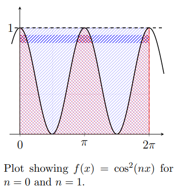
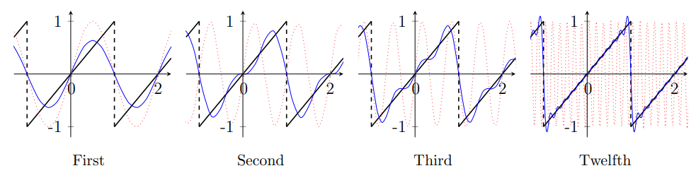
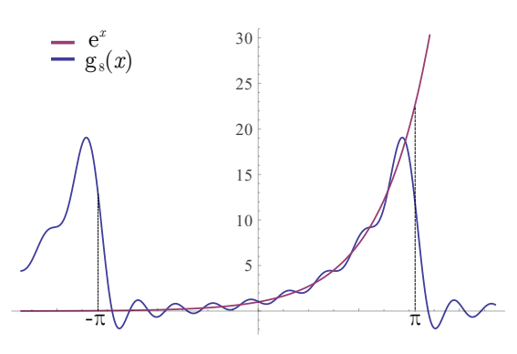
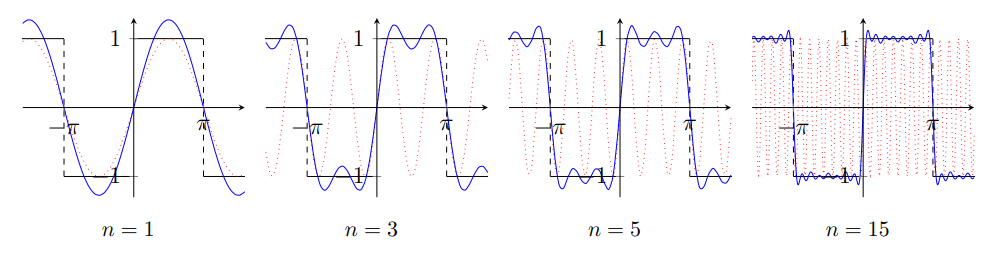
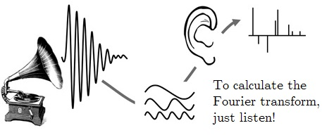

<link rel="stylesheet" type="text/css" media="all" href="styles.css">

## [Return to Contents](notes-contents)

# Chapter 12 - Fourier Series
Fourier series is a way of representing any function in terms of other functions, with some similarities to Taylor series, but also some key differences. Fourier uses a series of 'harmonic' functions (ie sine and cosine) as its basis and, like the Taylor series, the accuracy of the representation typically depends on the number of terms used. In the Taylor series, each term requires the calculation of a new coefficient in front of a higher power of $x$ (i.e. $f(x)=a_0+a_1x+a_2x^2+a_3x^3+a_4x^4...$), whereas for the Fourier series, each term requires the calculation of new coefficients in front of higher frequency harmonics (i.e. $f(x)=a_0+a_1\cos(x)+b_1\sin(x)+a_2\cos(2x)+b_2\sin(2x)+a_3\cos(3x)+b_3\sin(3x)+...$).   

In Taylor series, a point of interest, $c$, is chosen, around which the series is expanded and adding more terms allows the approximation to be useful increasingly far from $c$. With the Fourier series, an interval of interest, $[x_0-L, x_0+L]$ is selected and unlike the Taylor series, each additional term makes this approximation a little better (on average) everywhere in the interval simultaneously. Regions outside of the interval are totally ignored by this method, so unless the function is itself periodic (also with period $2L$), the approximation will not converge to it outside of this interval.   

There are many alternative ways to express the Fourier series, but the one we will be using on this course is perhaps the most common due to its simplicity of interpretation.   

$$g(x)=\frac{a_0}{2}+\sum_{n=1}^{\infty}a_n\cos(\frac{n\pi x}{L})+\sum_{n=1}^{\infty}b_n\sin(\frac{n\pi x}{L})$$

  
where,   

$$\begin{align}
	a_0&=\frac{1}{L} \int_{-L}^{L}f(x)\textrm{d}x\\
	a_n&=\frac{1}{L} \int_{-L}^{L}f(x)\cos\left(\frac{n\pi x}{L}\right)\textrm{d}x\\
	b_n&=\frac{1}{L} \int_{-L}^{L}f(x)\sin\left(\frac{n\pi x}{L}\right)\textrm{d}x\\
\end{align}$$

  
where $f(x)$ is the function you are trying to model in the interval $-L$ to $L$. If $f(x)$ is a periodic and 'integrable' (\ie 'can be integrated') function, with a period of $2L$, then the Fourier series can be used to perfectly recreate it. In some cases it is more convenient to perform the integrals from $0$ to $2L$ (rather than from $-L$ to $L$), which is an equally acceptable definition.   

Although these equations might look a little intimidating, its essentially just a set of instructions for calculating the coefficients $a_n$ and $b_n$ that go before each of the harmonic terms and it's up to you to decided how many terms you need, which will depend on the problem you are solving.   

 

Two questions might immediately spring to mind: Firstly, why is there an $a_0$, but not a $b_0$? And secondly, why is $a_0$ divided by 2? To answer the first question, simply set $n=0$ in the equation for $b_n$ above. Since $\sin(0)=0$, so $b_0$ will always equal zero for any value of $f(x)$ (therefore calculating it would be pointless). The answer to the second question is a little bit more involved, but starts by picturing the function $f(x)=\cos^2(nx)$ (black line in the adjacent figure). Notice that for $n=1$, the red shaded area under the  curve (ie the integral) is exactly half the blue area between 0 and 1 in the vertical axis. Furthermore *any* integer value of $n$ will have an integral of $\pi$ in this range *except* $n=0$, which has an integral of $2\pi$ (see the area under the dashed line in the figure). Hence, we need to renormalise the $a_n$ term to make it resemble the rest of the series. A simpler way to think of the first term is that it's just the mean of the function in the interval...   

## 12.1 Periodic functions
Periodic functions are composed of an infinite sequence of identical repeat units, examples include the harmonic functions (ie sine, cosine and tangent) and various discontinuous functions such as the 'saw-tooth' and 'square wave' functions. The Fourier series is well suited to approximating periodic functions, even if they contain discontinuities.   

 

  
The four graphs above show the odd 'saw-tooth' function (black), as well as the first, second, third and twelfth order Fourier approximations (blue). Also shown (red dots) are the profiles of the highest frequency sine waves used in each case. Notice how, unlike the Taylor series, the Fourier approximations improve the function (on average) at all points simultaneously. Also notice the high frequency wiggles close to the discontinuity, which are referred to as *Gibbs ringing*.   

 
The figure on the right shows the Fourier expansion (up to the $8^{th}$ order) of the function $f(x)=e^x$ in the interval $-\pi$ to $\pi$. 
Clearly, $f(x)=e^x$ is not a periodic function, so although the approximation appears to be reasonable in the interval considered, it is totally useless outside of this domain. However, as use of the domain [$-\pi,\pi$] was arbitrary, what's to stop us from making this interval much larger? As we shall see later on in this chapter, we can even investigate the case where the interval [$-\infty, \infty$] is used, which yields a very powerful result!
  

## 12.2 Complex exponential representation
Previously in the course we saw that the trigonometric functions could be
written as complex exponentials and vice versa, i.e.,   

$$e^{i x} = \cos(x) + i \sin(x)$$

  

$$\Rightarrow \qquad \cos(x) = \frac{e^{i x} + e^{-i x}}{2} \qquad\qquad\&\qquad\qquad \sin(x) = \frac{e^{i x} - e^{-i x}}{2 i}$$

  
Using these we can reformulate the Fourier Series in terms of complex
exponentials, rather than sines and cosines.
This simplifies the representation to,  

$$\begin{equation}
g(x) = \sum_{n=-\infty}^\infty C_n \exp \left(\frac{i n \pi x}{L} \right)
\;,
\end{equation}$$

  
with,  

$$\begin{equation}
C_n = \frac{1}{2L} \int^L_{-L} f(x) \exp \left(-\frac{i n \pi x}{L} \right)
\,\mathrm{d}x
\;.
\end{equation}$$

  
Note here, that this is a sum over both positive and negative values of $n$,
and that the *zeroth* term is included in the sum, rather than being
separate in the cosine case.
The complex exponential case is completely equivalent to the sine and cosine
representation; A truncated Fourier series with exponential terms from $-N$ to
$N$ will give exactly the same function as sine and cosine terms from $n=0$ to
$N$.
The sinusoidal and complex exponential coefficients are related as,   

$$\begin{align}
a_n = C_n + C_{-n} \qquad\qquad \& \qquad\qquad %a_n = \frac{A_n + A_{-n}}{2} \qquad\qquad \& \qquad\qquad
b_n = i(C_n - C_{-n}) %b_n = \frac{-A_n + A_{-n}}{2 i}
\;.
\end{align}$$

  
This description has the advantage of being simpler, there is only one type of
term and the coefficients all have the same form, at the price of introducing
complex numbers to describe an entirely real function
(For real functions, the coefficients are constrained such that
$C_{-n} = C_n^*$).

  

### Example - Square wave

We will now walk through the full calculations for the example of a square wave, as shown in the adjacent figure. The function has a period of $2\pi$ and is discontinuous and odd.   

$$f(x)= 
\begin{cases}
-1,& x< 0\\
1, & x\geq 0
\end{cases}
, \quad -\pi<x\leq\pi$$

  
Firstly, as we have noticed that $f(x)$ is an *odd* function, we can be sure that all the $a_n$ terms are zero (including $a_0$). Also, as the period is $2\pi$, we can replace $L$ in our standard equation with $\pi$. This means that our Fourier series will be of the form  

$$\begin{equation}
g(x)=\sum_{n=1}^{\infty}b_n\sin(nx) ,\quad \mathrm{where}\quad b_n=\frac{1}{\pi} \int_{-\pi}^{\pi}f(x)\sin(nx)dx
\end{equation}$$

  
To evaluate $b_n$ at each value of $n$, we must consider the two regions ([$-\pi$,0] and [0,$\pi$]) of this discontinuous function separately. To do this, we simply integrate first from $-\pi$ to 0 where $f(x)=-1$ and from 0 to $+\pi$ where $f(x)=+1$; our constant is the sum of these two integrals.   

$$\begin{align}
  b_1&=\frac{1}{\pi} \int_{-\pi}^{\pi}f(x)\sin(x)dx\\
  &=\frac{1}{\pi} \left(\int_{-\pi}^{0}(-1)\sin(x)dx+\int_{0}^{\pi}(1)\sin(x)dx\right)\\
  &=\frac{1}{\pi} \left(\left[\cos(x)\right]_{-\pi}^{0}+\left[-\cos(x)\right]_{0}^{\pi}\right)\\
  &=\frac{1}{\pi}\left(2+2\right)=\frac{4}{\pi}
\end{align}$$

  

$$\begin{align}
	b_2&=\frac{1}{\pi} \int_{-\pi}^{\pi}f(x)\sin(2x)dx\\
	&=\frac{1}{\pi} \left(\int_{-\pi}^{0}(-1)\sin(2x)dx+\int_{0}^{\pi}(1)\sin(2x)dx\right)\\
	&=\frac{1}{\pi} \left(\left[\frac{1}{2}\cos(2x)\right]_{-\pi}^{0}+\left[-\frac{1}{2}\cos(2x)\right]_{0}^{\pi}\right)\\
	&=\frac{1}{\pi}\left(0+0\right)=0
\end{align}$$

As is often the case with Fourier series, we can now save ourselves a lot of work by looking for patterns in the behaviour of the coefficients. From studying the calculation for $b_2$, it should be clear that for *any* even value of $n$, the result will always be zero. Similarly, for odd values of $n$, the calculation for $b_1$ shows us that the only difference between each term will be a factor of $\frac{1}{n}$.
We can now write down our Fourier series approximation for this function and plot the effect of truncation. Blue is the approximation and red is the highest frequency included.  

$$\begin{equation}
	g(x)=\frac{4}{\pi}\left[\sin(x)+\frac{1}{3}\sin(3x)+\frac{1}{5}\sin(5x)+...\right]=\frac{4}{\pi}\sum_{n=1, 3, 5,...}^{\infty}\frac{1}{n}\sin(nx)
\end{equation}$$

 

  

## 12.3 Fourier transform

Although we won't be studying the transform in much detail, take some time to look back at the graph of the function $f(x)=e^x$ and its Fourier series approximation. Although it seems clear that this approach has some limitations for non-periodic functions, consider what happens when we imagine the period to be infinite? This means that the problem we have with the 'fake' periodic discontinuities should disappear, which is exactly what the Fourier *transform* allows us to do. This means that if we take a signal in the time domain, $f(t)$, we should now be able to write a new expression for this in the *frequency domain*, $\hat{f}(\omega)$.   

The integral below does just that, where the sine and cosine functions that we used in the series expansion have been replaced with a complex exponential (NB $(e^{iz})^n=\cos(nz)+i\sin(nz)$). Furthermore,  if we have started with frequency data, there is also an inverse Fourier transform for recovering the time signal. The figure above shows a function and its transpose together.   

$$\begin{equation}
	\hat{f}(\omega)=\int_{-\infty}^{\infty}f(t)e^{-2\pi it\omega}dt
\end{equation}$$

  

$$\begin{equation}
	f(t)=\int_{-\infty}^{\infty}\hat{f}(\omega)e^{2\pi it\omega}dw
\end{equation}$$

  
The relationship between time and frequency is not the only useful pairing and the same concept relates position and momentum. Fourier transforms are also very useful in calculus, where a differentiation in the time domain can be as simple as a multiplication in frequency space.   

## 12.4 Mind blown

Pretty much everything about Joseph Fourier's (1768-1830) work is mind blowing. Fourier analysis is at the heart of so much of modern technology, from the compression of images (this is how a $\texttt{jpeg}$ file is so small, but also why sharp edges get blurred) to the transmission of sound messages by your phone. What is perhaps even more astonishing, although it shouldn't be surprising, is that nature also makes use of this concept.   

Inside your ear, there is a tube full of tiny hairs and when a sound wave enters your ear, it causes some of these hairs to resonate. Low frequencies stimulate the soft region near the entrance, whereas high frequency activate the narrow end of the tube. Real sounds are rarely perfect sine waves, but rather a superposition of many waves all with different phases and frequencies. If your brain simply used a pressure sensor to measure incoming sound, it would need to perform some very complicated numerical analysis in order to reconstruct the incoming waves. Instead, most of this work is done by the mechanical Fourier transform performed by the hairs, which simply tell the brain which frequencies are incoming and how loud they are.
    