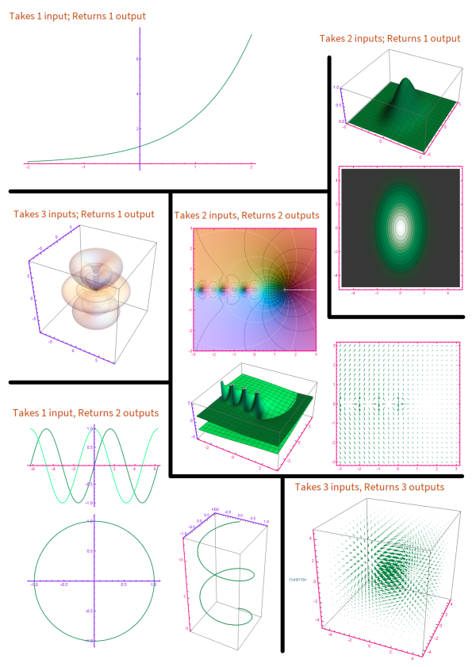
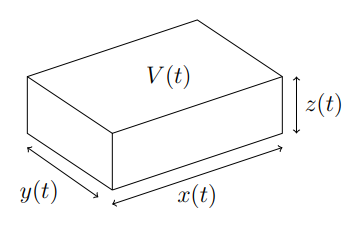
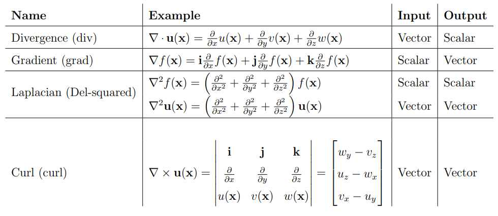
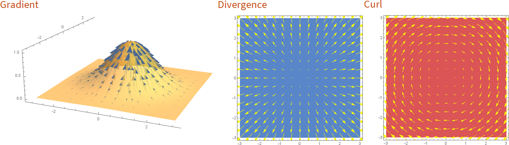

<link rel="stylesheet" type="text/css" media="all" href="styles.css">

## [Return to Contents](notes-contents)

# Chapter 13 - Multivariate Calculus

## 13.1 Functions of multiple variables
So far we have been dealing with functions that take a number, e.g. $x$, as
input and return a number, $f(x)$, as output.
We can upgrade to functions of multiple variables, or *multivariate
functions*. i.e.,   

$$\begin{equation}
f(x, y) = 4x\sin(y) + 5 e^{\frac{y}{x}}
\;.
\end{equation}$$

  
This function takes two inputs, $x$ and $y$ and returns a single number
$f(x,y)$ as the result.
In principle, our multivariate functions could also return a vector.
We will cover this later in the chapter, but for now we'll concentrate on the
case where a function takes multiple inputs and returns one output as there's
lots to say about this case before vectorising everything!  

The first thing to consider is how to actually visualise these functions.
2D functions aren't generally a problem since the 2-input and 1-output adds upto
a 3D space that we can visualise.
The common representations include surface plots, contour plots, and density
plots.  

An example of some of these is included on the next page - here input
dimensions are drawn in pink, and output dimensions in purple.  

For higher dimensions, we'll have to rely on the intuition built up in the 2D
case, as we'll no longer be able to plot the function in its entirety.  

 

  

## 13.2 Partial derivatives
Now we have multivariate functions, can we do calculus with them?
The answer is of-course YES! but we'll need to upgrade our machinery.   

For a function $f(x,y,z)$, we can now differentiate with respect to either $x$,
$y$, or $z$.
We'll define the *partial derivative* as differentiating with respect to
one variable, *whilst keeping the others constant*.
e.g.,  

$$\begin{equation}
\left(\frac{\partial f}{\partial x}\right)_{yz}
\;,
\end{equation}$$

  

means taking the derivative of $f(x,y)$ with respect to $x$ whilst holding $y$
and $z$ constant.
Notice the curly-d, $\partial$, this is pronounced *'partial'*.
Sometimes the little subscript indicating which variable is being held constant
is omitted when it's otherwise clear what's going on.  

There are other notations you might see in the wild,  

$$\begin{equation}
\left(\frac{\partial f(x,y)}{\partial x}\right)_{yz} = \frac{\partial
f}{\partial x} = \partial_x f = f_x
\;,
\end{equation}$$

  

Let's see a couple of examples; consider,  

$$\begin{equation}
f(x, y) = 3x^2y + 2y + xy^2
\;,
\end{equation}$$

  
differentiating with respect to $x$, whilst treating $y$ as if it was
just a constant, gives,  

$$\begin{align}
\left(\frac{\partial f}{\partial x}\right)_{y} &= 6xy + 0 + y^2 \\
&= 6xy + y^2
\;.
\end{align}$$

  
We can do the same differentiating with respect to $y$,  

$$\begin{equation}
\left(\frac{\partial f}{\partial y}\right)_{x} = 3x^2 +2 +2xy
\;.
\end{equation}$$

  
Let's go again with a more complicated example,  

$$\begin{align}
f(x, y) &= 4x\sin(y) + 5 e^{\frac{y}{x}}
\\
\frac{\partial f}{\partial x} & =
  4 \sin(y) - \frac{5 y}{x^2} e^{\frac{y}{x}} 
\\
\frac{\partial f}{\partial y} & =
  4x\cos(y) + \frac{5}{x} e^{\frac{y}{x}}
\;.
\end{align}$$

  
Make sure you see how these results are obtained by holding one variable
constant.
(It may help you to replace the constant variable with another letter, like $a$,
to give the impression that these really are just constants.)  

This gives us all we need to upgrade most of our 4
differentiation rules.  

**Sum rule:** 
  

$$\begin{equation}
\frac{\partial}{\partial x} \left[ f(x, y) + g(x, y) \right] = 
\frac{\partial f}{\partial x} + \frac{\partial g}{\partial x}
\end{equation}$$

  

**Power rule:**
  

$$\begin{equation}
\frac{\partial}{\partial x} \left[x^n f(y)\right] = 
n x^{n-1} f(y)
\end{equation}$$

  

**Product rule:**
  

$$\begin{equation}
\frac{\partial}{\partial x} \left[ f(x, y) \, g(x, y) \right] = 
\frac{\partial f(x,y)}{\partial x}\,g(x,y) + f(x,y)\,\frac{\partial
g(x,y)}{\partial x}
\end{equation}$$

  

**Chain rule (part 1):**
  

$$\begin{equation}
\frac{\partial}{\partial x} f(g(x, y)) =
\frac{\mathrm{d}f}{\mathrm{d}g}\frac{\partial g}{\partial x}
\end{equation}$$

  
Notice here that $f$ is a function of one variable, when we differentiate it we
use ordinary upright ds, as $\frac{\mathrm{d}f}{\mathrm{d}g}$ is just the
derivative of $f$ with respect to its single argument.  

We'll have to wait until later in the chapter to see what happens if $f$ was
also a function of multiple variables.  

### 13.2.1 Higher order derivatives
We can differentiate more than once to give us higher order derivatives.
There are now more options as to how to do this.
e.g. for,   

$$\begin{align}
f(x, y) &= 2 y e^{3x} - x^3 y^2 + y^5
\\
\frac{\partial f}{\partial x} &= 6 y e^{3x} - 3x^2 y^2
\\
\frac{\partial^2 f}{\partial x^2} &= 18 y e^{3x} - 6x y^2
\;.
\end{align}$$

  
So far so good, but we could have decided to differentiate with respect to $y$
after the first $x$ derivative to form a mixed derivative,  

$$\begin{equation}
\frac{\partial}{\partial y}\frac{\partial f}{\partial x} = \frac{\partial^2
f}{\partial y \partial x} = 6 e^{3x} - 6x^2 y
\end{equation}$$

  
Let's start by differentiating with respect to $y$,  

$$\begin{align}
f(x, y) &= 2 y e^{3x} - x^3 y^2 + y^5
\\
\frac{\partial f}{\partial y} &= 2 e^{3x} - 2 x^3 y + 5y^4
\\
\frac{\partial^2 f}{\partial y^2} &= - 2 x^3 + 20y^3
\\
\frac{\partial^2 f}{\partial x \partial y} &= 6 e^{3x} - 6 x^2 y
\;.
\end{align}$$

  
Note how $\frac{\partial^2 f}{\partial x \partial y} = \frac{\partial^2
f}{\partial y \partial x}$

  
In general it doesn't matter the order your differentiate by.  

## 13.3 Stationary points
Let's look into stationary points (turning points) for multivariate functions.
Here for a turning point, all partial derivatives need to be zero.
i.e. $f_x = 0$ and $f_y = 0$.
Consider the function,   

$$\begin{equation}
f(x, y) = x^2 + xy + y^2 -5 x -y + 7
\;,
\end{equation}$$

  
the derivatives are,  

$$\begin{align}
f_x &= 2x + y -5 \\
f_y &= x + 2y -1
\;,
\end{align}$$

  
Setting these equal to zero, we have a pair of simultaneous equations that have
the solution, $x = 3, y=-1$.
This indicates that there's a stationary point at $(3,-1)$, but what is it's
character? a maximum, minumum, or something else?
We'll cover later in the module how you can tell, it will involve the second
derivative (and the cross terms, $f_{xy}$)
In addition to maxima, minima, and inflection points, there is another point of
interest that appears in multi-dimensional systems, a saddle point, which is a
special kind of inflection point.
This is where a stationary point appears like a maximum from one direction and
a minimum from another.   

 

  

## 13.4 Total differentials and derivatives
We have so far looked at the derivatives along $x$ and $y$, but we may want to
take the derivative along other directions, or a curved path within the $x,y$
space; for this we can use the total derivative.
Let's consider the change in the function, $f(x, y)$ as we take a small step
away, i.e.,   

$$\begin{equation}
\Delta f = f(x + \Delta x, y + \Delta y) - f(x, y)
\end{equation}$$

  
Then let's do a bit of mathematical trickery, including adding zero and
multiplying by one.  

$$\begin{align}
\Delta f &= f(x + \Delta x, y + \Delta y)
\underbrace{-f(x, y + \Delta y) + f(x, y + \Delta y)}_{=0}
- f(x, y)
\\
\Delta f &=
\frac{f(x + \Delta x, y + \Delta y) -f(x, y + \Delta y)}{\Delta x} \Delta x +
\frac{f(x, y + \Delta y) - f(x, y)}{\Delta y} \Delta y
\end{align}$$

  
In the limits as we take $\Delta x$ and $\Delta y$ to infinitesimals we can see
the rise over run definition of the partial derivatives.
So we get the following expression for the total derivative,  

$$\begin{equation}
\mathrm{d}f =
  \left(\frac{\partial f}{\partial x}\right)_{y} \mathrm{d}x
+ \left(\frac{\partial f}{\partial y}\right)_{x} \mathrm{d}y
\end{equation}$$

  
(or in more than two dimensions, this generalises as you'd expect)  

$$\begin{equation}
\mathrm{d}f =
  \left(\frac{\partial f}{\partial x}\right)_{yz\ldots} \!\!\!\!\!\! \mathrm{d}x
+ \left(\frac{\partial f}{\partial y}\right)_{xz\ldots} \!\!\!\!\!\! \mathrm{d}y
+ \left(\frac{\partial f}{\partial z}\right)_{xy\ldots} \!\!\!\!\!\! \mathrm{d}z
+ \ldots
\end{equation}$$

  
Let's take an example to illustrate how the a total differential can be used.   

**Example:** `A box has sides $x,y,z$ changing in length over time $t$.
Find the rate of change in volume.'   

 

The volume is $V(x,y,z) = xyz$. And $x,y$ and $z$ are all changing functions of
time $t$:   

$$x = x(t) \quad y = y(t) \quad z = z(t)$$

  
Let's set up the total differential for this problem,  

$$\begin{equation}
\mathrm{d}V =
  \left(\frac{\partial V}{\partial x}\right)_{yz} \!\!\! \mathrm{d}x
+ \left(\frac{\partial V}{\partial y}\right)_{xz} \!\!\! \mathrm{d}y
+ \left(\frac{\partial V}{\partial z}\right)_{xy} \!\!\! \mathrm{d}z
\end{equation}$$

  
In this example, if we calculate the partial derivatives,
$\frac{\partial V}{\partial x} = yz$,
$\frac{\partial V}{\partial y} = xz$, and
$\frac{\partial V}{\partial z} = xy$.

  
The derivatives $\textrm{d}x/\textrm{d}t$, $\textrm{d}y/\textrm{d}t$ and $\textrm{d}z/\textrm{d}t$ are either
given as functions of $t$ or simply as values (eg '$x$ is decreasing at 0.2
metres per second' means $\textrm{d}x/\textrm{d}t = -0.2$ if SI units were assumed.)  

In general, given a function $f(x,y,z \dots)$, where the variables $x,y,z,\dots$
are each functions of another variable $t$, then the **total derivative**
is given by:  

$$\frac{\textrm{d}f}{\textrm{d}t} = f_{x}\frac{\textrm{d}x}{\textrm{d}t} +
f_{y}\frac{\textrm{d}y}{\textrm{d}t} + f_{z}\frac{\textrm{d}z}{\textrm{d}t} + \dots$$

  
In some cases, you might have a function of some variables which are related to
each other through a single underlying variable, *as well as* the
underlying variable itself.  

  

**Example:** Consider the function $f(x,y,z,t)$ then the total derivative
with respect to $t$ can be expressed as:  

$$\frac{\textrm{d}f}{\textrm{d}t} = \frac{\partial f}{\partial t}\frac{\textrm{d}t}{\textrm{d}t} +
\frac{\partial f}{\partial x}\frac{\textrm{d}x}{\textrm{d}t} + \frac{\partial
f}{\partial y}\frac{\textrm{d}y}{\textrm{d}t} + \frac{\partial f}{\partial
z}\frac{\textrm{d}z}{\textrm{d}t}$$

  
If the velocity field is defined as $u = \textrm{d}x/\textrm{d}t$, $v = \textrm{d}y/\textrm{d}t$ and
$w = \textrm{d}z/\textrm{d}t$ then:  

$$\frac{\textrm{d}f}{\textrm{d}t} = \frac{\partial f}{\partial t} + u\frac{\partial
f}{\partial x} + v\frac{\partial f}{\partial y} + w\frac{\partial
f}{\partial z}$$

  
which is sometimes also referred to as the 'material derivative' and written
$\frac{\text{D}f}{\text{D}t}$.  

### 13.4.1 Chain rule
With the total differential, we can complete our upgrade to the chain rule.
i.e. what happens when we have, $f$ a function of $u$ and $v$, which are each
functions of both $x$ and $y$,   

$$\begin{equation}
\frac{\partial}{\partial y} f(u(x, y), v(x, y))
\;.
\end{equation}$$

  
We can solve this by writing the total derivative,  

$$\begin{equation}
\mathrm{d}f =
  \left(\frac{\partial f}{\partial u}\right)_v \mathrm{d}u
+ \left(\frac{\partial f}{\partial v}\right)_u \mathrm{d}v
\;,
\end{equation}$$

  
from which we can derive,  

$$\begin{equation}
\left(\frac{\partial f}{\partial y}\right)_x
= \left(\frac{\partial f}{\partial u}\right)_v
  \left(\frac{\partial u}{\partial y}\right)_x
+ \left(\frac{\partial f}{\partial v}\right)_u
  \left(\frac{\partial v}{\partial y}\right)_x
\;,
\end{equation}$$

  
which is the fully upgraded chain rule.  

Let's test this with an example, let
$f(u, v) = \sqrt{u^2 - v^2}$, 
$u(x, y) = y / x$,
$v(x, y) = x + y$,
Then,  

$$\begin{align}
\left(\frac{\partial f}{\partial u}\right)_v &=
  \frac{u}{\sqrt{u^2-v^2}}
\\
\left(\frac{\partial f}{\partial v}\right)_u &=
  \frac{-v}{\sqrt{u^2-v^2}}
\\
\left(\frac{\partial u}{\partial y}\right)_x &=
  \frac{1}{x}
\\
\left(\frac{\partial v}{\partial y}\right)_x &=
  1
\;.
\end{align}$$

  
Putting these together,  

$$\begin{equation}
\left(\frac{\partial f}{\partial y}\right)_x
= \frac{u}{\sqrt{u^2-v^2}}
  \frac{1}{x}
+ \frac{-v}{\sqrt{u^2-v^2}} (\times 1)
\;,
\end{equation}$$

  
and replacing $u$ and $v$, and rearranging,  

$$\begin{equation}
\left(\frac{\partial f}{\partial y}\right)_x
= \frac{y/x^2 - x - y}{\sqrt{(y/x)^2-(x+y)^2}}
\;,
\end{equation}$$

  
Let's see if we can get the same answer by direct substitution.  

$$\begin{align}
f(u(x, y), v(x, y)) &=
  \sqrt{(y/x)^2 - (x+y)^2}
\\
\frac{\partial f}{\partial y} &=
  \frac{1}{2}\frac{1}{\sqrt{(y/x)^2 - (x+y)^2}}
\cdot \left( \frac{2y}{x^2} - 2(x+y) \right)
\\
&= \frac{y/x^2 - x - y}{\sqrt{(y/x)^2-(x+y)^2}}
\;.
\end{align}$$

  
As we would hope, this comes out the same as previously.
Often in particularly complicated examples, the full chain rule can save time
and effort.  

## 13.5 Vector calculus
### 13.5.1 Vector functions
It can be of benefit to vectorise our functions, i.e.   

$$\begin{equation}
f(x, y, z) \rightarrow f(\mathbf{x})
\end{equation}$$

  
This is especially the case if you have varibles that naturally bundle together,
like physical spatial dimensions, or if you have a large number of variables to
keep track of, i.e. in data science.  

In addition to functions that take a vector as input, there are functions that
return a vector as output, and functions that do both.  

Functions that take values at every point in space sometimes get called fields,
i.e. the temperature at any point, $T(\mathbf{x})$, in a room is a scalar field,
and the velocity of the airflow at any point in a room,
$\mathbf{v}(\mathbf{x})$, is a vector field.  

differentiating a vector function with respect to a scalar is easy, it
differentiates component wise, i.e.,  

$$\begin{equation}
\frac{\mathrm{d}}{\mathrm{d}t}\mathbf{F}(t) = 
  \frac{\mathrm{d}F_x(t)}{\mathrm{d}t} \mathbf{i}
+ \frac{\mathrm{d}F_y(t)}{\mathrm{d}t} \mathbf{j}
+ \frac{\mathrm{d}F_z(t)}{\mathrm{d}t} \mathbf{k}
\;.
\end{equation}$$

  
Identities like the chain rule, work as you might expect,  

$$\begin{align}
\frac{\mathrm{d}}{\mathrm{d}t} \left(a(t)\mathbf{b}(t)\right) =
  \frac{\mathrm{d}a(t)}{\mathrm{d}t} \mathbf{b}(t)
+ a(t) \frac{\mathrm{d} \mathbf{b}(t)}{\mathrm{d}t}
\\
\frac{\mathrm{d}}{\mathrm{d}t} \left(\mathbf{a}(t) \cdot \mathbf{b}(t)\right) =
  \frac{\mathrm{d}\mathbf{a}(t)}{\mathrm{d}t} \cdot \mathbf{b}(t)
+ \mathbf{a}(t) \cdot \frac{\mathrm{d} \mathbf{b}(t)}{\mathrm{d}t}
\\
\frac{\mathrm{d}}{\mathrm{d}t} \left(\mathbf{a}(t) \times \mathbf{b}(t)\right) =
  \frac{\mathrm{d}\mathbf{a}(t)}{\mathrm{d}t} \times \mathbf{b}(t)
+ \mathbf{a}(t) \times \frac{\mathrm{d} \mathbf{b}(t)}{\mathrm{d}t}
\;.
\end{align}$$

  

### 13.5.2 The del operator
When the argument is a vector, we can introduce the vector differential operator
$\nabla$, pronounced \emph{del} (the symbol itself is called
\emph{nabla}.
The operator can also be written as
$\frac{\partial}{\partial \mathbf{x}}$),
which behaves like a vector with the components,   

$$\begin{equation}
\nabla = 
  \mathbf{i} \frac{\partial}{\partial x}
+ \mathbf{j} \frac{\partial}{\partial y}
+ \mathbf{k} \frac{\partial}{\partial z}
+ \ldots
\;,
\end{equation}$$

  
there are a number of useful ways to apply this, depending what kind of quantity
we have.  

where we have coordinate vector
$\mathbf{x} = (x, y, z)^\mathrm{T}$,
$f(\mathbf{x})$ is a scalar field,
and $\mathbf{u}(\mathbf{x}) =
(u(\mathbf{x}), v(\mathbf{x}), w(\mathbf{x}))^\mathrm{T}$ is a vector field.
(Don't forget the $A^\mathrm{T}$ notation allows us to write a column vector as
a transposed row vector, to save space!)
The properties translate as you'd expect in dimensions
other than 3d (except curl which doesn't exist apart from in 3d!).
The rules as to what is a valid input or output, are the same as
for the scalar, dot, and cross product, so no extra learning of cases required.   

<!-- Table not rendering directly from latex-->
 
The divergence measures if in a vector field, the vectors nearby a point
flow inwards or outwards towards the point.   

The gradient measures for a scalar field, which direction is the steepest i.e.
which direction changes the value of the function quickest, and by how much.  

The Laplacian, as you will see, it comes up a lot in partial differential
equations.
It can be applied to scalars or vectors ($\nabla^2$ is a scalar operator).  

The curl will measure by how much a small object placed in a vector field would  
rotate if pushed by those vectors.

There are plenty of vector calculus identities that exist, that we won't go
into detail here. There's a comprehensive list on Wikipedia: Vector calculus
identities, should you need to look them up.  

*a) Gradient of a scalar field.
b) Vector field with a constant divergence.
c) Vector field with a constant curl.*

  

#### Examples
Find the **divergence** of the vector function,
$\begin{bmatrix}
x y z \newline
3 y^2 x \newline
x^2 + y^2
\end{bmatrix}$

  

Let's start by writing out the div operator in full,  

$$\begin{align}
\nabla \cdot \begin{bmatrix}
x y z \\
3 y^2 x \\
x^2 + y^2
\end{bmatrix}
&=
\begin{bmatrix}
\frac{\partial}{\partial x} \\
\frac{\partial}{\partial y} \\
\frac{\partial}{\partial z} \\
\end{bmatrix} \cdot
\begin{bmatrix}
x y z \\
3 y^2 x \\
x^2 + y^2
\end{bmatrix}
\\
&= \frac{\partial}{\partial x}(x y z)
+ \frac{\partial}{\partial y}(3 y^2 x)
+ \frac{\partial}{\partial z}(x^2 + y^2)
\\
&= (y z) + (6 y x) + (0)
\\
&= y(z + 6x)
\;
\end{align}$$

  

Calculate the **gradient** of $x y -z^2$.   

$$\begin{align}
\nabla (x y - z^2)
&= \begin{bmatrix}
\frac{\partial f}{\partial x} \\
\frac{\partial f}{\partial y} \\
\frac{\partial f}{\partial z}
\end{bmatrix} (x y - z^2)
\\
&= \begin{bmatrix}
y \\
x \\
-2z
\end{bmatrix}
\end{align}$$

  

Calculate the **Laplacian** of $\sin(x y)$.   

$$\begin{align}
\nabla^2 \sin(x y)
&= \left(\frac{\partial^2}{\partial x^2}
+ \frac{\partial^2}{\partial y^2}\right) \sin(x y)
\\
&= -y^2 \sin(x y) - x^2 \sin(x y)
\end{align}$$

  

Calculate the **Curl** of $y \mathbf{i} - x \mathbf{j} $.   

$$\begin{align}
\nabla \times \begin{bmatrix}
y \\ -x \\ 0
\end{bmatrix}
&=
\begin{vmatrix}
  \mathbf{i} & \mathbf{j} & \mathbf{k} \\
  \frac{\partial}{\partial x} &
  \frac{\partial}{\partial y} &
  \frac{\partial}{\partial z} \\
  y & -x & 0
\end{vmatrix}
\\
&=
\begin{bmatrix}
0 \\ 0 \\ -1 -1
\end{bmatrix}
=
\begin{bmatrix}
0 \\ 0 \\ -2
\end{bmatrix}
\end{align}$$

  

### 13.5.3 Gradient revisited
Previously we saw the gradient operator and how it takes a scalar field and
returns a vector field.   

$$\begin{equation}
\nabla f = \begin{bmatrix}
\frac{\partial f}{\partial x} \\
\frac{\partial f}{\partial y} \\
\frac{\partial f}{\partial z}
\end{bmatrix}
\end{equation}$$

  
We can generalise this to apply to vectors too.
Since the gradient takes a scalar and *upgrades* it to a vector,
taking the gradient of a vector field should upgrade it to a matrix,   

$$\begin{equation}
\nabla \begin{bmatrix}
u \\
v \\
w
\end{bmatrix} = 
\begin{bmatrix}
  \frac{\partial u}{\partial x} &
  \frac{\partial u}{\partial y} &
  \frac{\partial u}{\partial z} \\
  \frac{\partial v}{\partial x} &
  \frac{\partial v}{\partial y} &
  \frac{\partial v}{\partial z} \\
  \frac{\partial w}{\partial x} &
  \frac{\partial w}{\partial y} &
  \frac{\partial w}{\partial z} \\ 
\end{bmatrix}
\end{equation}$$

  
This pattern will continue giving larger objects each time.
They become harder to write down because we run out of space, but the general
form of scalar, vector, matrix is called a tensor (these are the same tensors
that *flow* in the famous machine learning library TensorFlow).  

Applying the gradient once (to a scalar or a vector field etc.) has a special
name, the \emph{Jacobian}. $\mathbf{J} = \nabla f$.
For a scalar function, this returns a vector - what if we apply it again?
It should return a matrix, and it does!  

$$\begin{equation}
\mathbf{H} = 
\nabla (\nabla f) = 
\begin{bmatrix}
  \frac{\partial^2 f}{\partial x^2} &
  \frac{\partial^2 f}{\partial x \partial y} &
  \frac{\partial^2 f}{\partial x \partial z} \\
  \frac{\partial^2 f}{\partial y \partial x} &
  \frac{\partial^2 f}{\partial y^2} &
  \frac{\partial^2 f}{\partial y \partial z} \\
  \frac{\partial^2 f}{\partial z \partial x} &
  \frac{\partial^2 f}{\partial z \partial y} &
  \frac{\partial^2 f}{\partial z^2} \\ 
\end{bmatrix}
\end{equation}$$

  
This one has the special name, the \emph{Hessian}, do note that
$\nabla (\nabla f) \neq \nabla^2 f $, as one is a matrix and the other a scalar,
although the trace of the Hessian does equal the Laplacian!
$\mathrm{Tr} (\nabla (\nabla f)) = \nabla^2 f $.  

We'll revisit the Hessian and Jacobian when we look at optimisation later in the
module.  

Do note that computers are quite good at doing linear algebra (this is
actually the primary feature of programs like matlab and numpy in python).
What is important is that you get a feel for how the tools work so that you can
interpret the meaning of results.

    