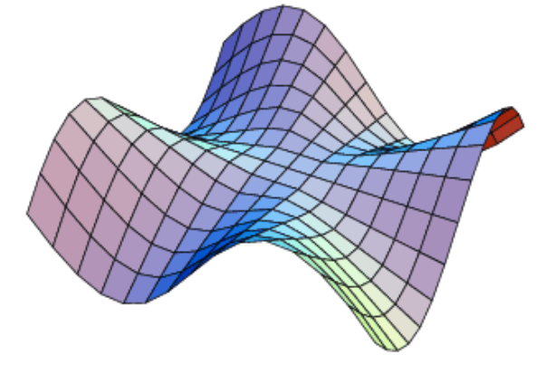

<link rel="stylesheet" type="text/css" media="all" href="styles.css">

## [Return to Contents](notes-contents)

# Chapter 14 - Partial Differential Equations
## Recap
In a previous chapter, we looked at
[ODEs – Ordinary Differential Equations](9-ODE).
Here we had a quantity of interest, a model for how the system evolves in time,
and a set of initial conditions.
One of the examples that we considered was the trolley on a spring.
Here the quantity of interest was the position of the trolley
at any moment in time $x(t)$,
the model for how it evolves was an ODE like
$\ddot{x}(t) = -\frac{k}{m} x(t)$,
and the initial conditions were $x(0)$ and $\dot{x}(0)$,
the position and velocity of the trolley at $t=0$, when we start the clock.

Solving the ODE meant finding an $x(t)$ that satisfied the ODE
in the general case (of any initial conditions), i.e.
$x(t) = A \cos(\omega t) + B \sin(\omega t)$
with
$\omega = \sqrt{\frac{k}{m}}$;
then matching this general solution to the particular initial conditions we
were given. i.e.
$x(t) = x(0) \cos(\omega t) + \frac{\dot{x}(0)}{\omega}\sin{\omega t}$.

Next, we considered
[Coupled Oscillators](10-coupled-oscillators),
where the game was the same but we had multiple discrete quantities of interest,
and again a model for how the system evolves and set of initial conditions.
E.g. for a set of trolleys connected to each other with springs.

In this setup we upgraded some of our quantities to vectors and matrices, e.g.
$x(t) \rightarrow \mathbf{x}(t)$,
and our ODE became,
$$
\ddot{\mathbf{x}}(t) =
  \begin{bmatrix}
    -\frac{k_1 + j}{m_1} & \frac{j}{m_1} \\
    \frac{j}{m_2} & -\frac{k_2 + j}{m_2}
  \end{bmatrix}
\mathbf{x}
$$
We solved this system by finding the *normal modes* that oscillate
in harmonic motion at a single frequency,
and added the combination of all solutions together for the
genaral solution, before matching to initial conditions.

### Upgrading to PDEs
**Partial Differential Equations**, PDEs, are the next step in this progression
where we go from modelling the time evolution of single quantity,
to a discrete set of quantities, to a continuous set of values – e.g.
the displacement of every point on a guitar string when it is struck,
the temperature at every point in a room when a heat source is nearby,
the stresses on the body of an aircraft during operation.

Solving PDEs allows us to calculate how our systems evolve in time,
but also can give us insight into how to optimise them e.g.
for their response efficiency, or to detect failure modes.

PDEs find applications in many fields of Engineering, and are studied in their
own right as a topic in Appled Mathematics.
In this module we will introduce the topic and give a first set of tools for
approaching them.

We'll be relying heavily on the intuition you have built up for ODEs,
so make sure you are refreshed and comfortable with that topic.

## Introducing PDEs
Returning to our analogy of ODEs and Coupled Oscillators,
Our quantity of interest is usually the value of a quantity
both at some moment in time and now also at some point in space.
i.e. a multivariate function of space and time – $f(\mathbf{x}, t)$.

The model for our system, how our quantity of interest evolves in time,
is no longer an *Ordinary* Differential Equation,
but a *Partial* Differential Equation,
i.e. a differential equation that contains
[partial derivatives](13-multivariate-calculus).

Some physically motivated PDEs that we'll look at in more detail are the
diffusion equation:
$$
\frac{\partial f(x, t)}{\partial t} =
\alpha \frac{\partial^2 f(x, t)}{\partial x^2}
$$
and the wave equation:
$$
\frac{\partial^2 f(x, t)}{\partial t^2} =
c^2 \frac{\partial^2 f(x, t)}{\partial x^2}
$$
Notice that in each we have deriviatives in both space and time of our quantity
of interest, $f(x, t)$,
as well as some constants of the system, $\alpha$ and $c$.

A small slight-of-hand to be aware of here is,
previously our quantity of interest was labeled $x$, and we solved for $x(t)$.
In this case, our quantity of interest is $f$
and now $x$ is one of our independent variables along with $t$,
and we solve for $f(x, t)$.
In different applications, we may use different symbols for our dependent and
independent quantities, so it's always worth noting which variables play what
role.

The initial conditions of the system also upgrade,
instead of a single value when $t=0$,
we now typically specify an entire function, $f(x, 0)$ –
i.e. what the system looks like at a snapshot in time.

Solving partial differential equations amounts to asking the question:

*"If I have a system who's behaviour is governed by a particular PDE,*
*and the system starts with a known initial state:*
*What is the state of the system at future times?"*

## 1D Wave Equation Example
In general, PDEs are difficult to solve, we're going to focus primarily on
two special cases that have special relevance in engineering
and are tractable to solve.
Though the tools we develop here will allow you to analyse
wider class of problems.

*The wave equation* is a class of PDEs that model vibration and wave phenomena.
This can be applied to multiple physical systems from
mechanical vibrations in solid bodies,
sound waves in accoustic systems,
and electromagnetic waves – i.e. light.

We saw a wave equation earlier in this chapter that looked like this,
$$
\frac{\partial^2 f(x, t)}{\partial t^2} =
c^2 \frac{\partial^2 f(x, t)}{\partial x^2}
$$
Let's see what we can do with an equation like this.

One question we may wish to answer when we have a PDE is,
*"Does a particular function that I have solve this PDE?"*.
If we have a candidate function $f(x, t) = \operatorname{sech}(x - a t)$,
where $a$ is a constant term,
let's determine if this solves the PDE
(we can discuss how we would get such a function later)

First thing to do is to calculate the derivatives of $f(x, t)$
that appear in the PDE.
In this case, the second derivatives in space and time.
(This can be done by hand, but
[Wolfram Alpha](https://www.wolframalpha.com/input/?i=D[Sech[x-a+t]%2C+{x,2}])
is pretty good for this too.)
$$
\frac{\partial f(x, t)}{\partial x} =
    -\tanh(x - a t)\operatorname{sech}(x - a t) \\
\frac{\partial^2 f(x, t)}{\partial x^2} =
    \operatorname{sech}(x - a t) - 2\operatorname{sech}^3(x - a t) \\
\frac{\partial f(x, t)}{\partial t} =
    a \tanh(x - a t)\operatorname{sech}(x - a t) \\
\frac{\partial^2 f(x, t)}{\partial t^2} =
    a^2 \operatorname{sech}(x - a t) - 2 a^2 \operatorname{sech}^3(x - a t)
$$
Then if we insert these derivatives into the PDE,
we can cancel things down a lot,
$$
a^2 \operatorname{sech}(x - a t) - 2 a^2 \operatorname{sech}^3(x - a t) =
c^2 \left(\operatorname{sech}(x - a t) - 2\operatorname{sech}^3(x - a t)\right)
$$
which reduces to,
$$
a^2 = c^2
$$
This says we have a condition on
$f(x, t) = \operatorname{sech}(x - a t)$ being a solution.
It *is* a solution, if and only if $a^2 = c^2$, i.e., $a = \pm c$.
Physically, this tells us the speed of the function,
that the $\operatorname{sech}$ envelope travels at speed $c$,
which was one of the constants of the PDE.
<iframe
  src="https://www.desmos.com/calculator/jk0daqq6df"
  width="800"
  height="600"
  style="border: 1px solid #ccc"
  frameborder=0
></iframe>

Here then we have two solutions to the wave equation,
$f(x, t) = \operatorname{sech}(x - c t)$ and
$f(x, t) = \operatorname{sech}(x + a t)$.
The wave equation is a *linear* differential equation,
which means we can combine any two solutions to form a third new solution –
recall how this was the case with ODEs as well.
So a more general solution to the PDE is,
$$
f(x, t) = A\operatorname{sech}(x - c t) + B\operatorname{sech}(x + c t)
$$
This is good, and we've made progress,
however we're not yet confident we've found *all* solutions –
what if our function doesn't look like $\operatorname{sech}$?
The following functions also solve the wave equation,
$$
f(x, t) = e^{-(x - c t)^2 / w^2} \\
f(x, t) = \frac{1}{w^2 + x^2 + 2 x c t + c^2 t^2}
$$
where $w$ is a free parameter that controls the width.
Try yourself by inserting these into the differential equation.

Since these solve the PDE with any value of parameter, $w$,
then any sum of solutions is also a solution, e.g.,
$$
f(x, t) = \sum_w A_w e^{-(x - c t)^2 / w^2} +
B_w \frac{1}{w^2 + x^2 + 2 x c t + c^2 t^2}
$$
for a set of $w$ values.

But again here, the solutions were given to us to begin with.
It would be good to have a more systematised way to approach the PDEs.

(It turns out with the  1D wave equation that any function,
$f(x, t) = f_+(x - c t) + f_-(x + c t)$,
is a solution, for arbitrary $f_+(x)$ and $f_-(x)$.
This is a special case though, we need something that will work in general.)

## Separation of variables
Let's trial another solution to the wave equation,
$$
f(x, t) = \cos k x \cos \omega t
$$
Here the parameter $k$ is called the *wavevector* and it determines the
wavelength of the cosine, $l = 2\pi / k$;
the parameter $\omega$ is the angular frequency (or informally just frequency)
and determines the time period, $\tau = 2\pi / \omega$.
If we insert this into the wave equation, we get the result,
$$
\frac{\partial^2 }{\partial t^2} \cos k x \cos \omega t =
c^2 \frac{\partial^2}{\partial x^2} \cos k x \cos \omega t
\\
-\omega^2 \cos k x \cos \omega t =
- c^2 k^2 \cos k x \cos \omega t
$$
And therefore,
$$
\omega^2 = c^2 k^2
$$
This resulting equation is called the *dispersion relation*,
which sets the relationship between the frequency and the wavevector that is
the condition for $f(x, t)$ to be a solution to the wave equation.
It says that a sinusoidal wave with a specific wavelength has a fixed period
that is related to it.

Let's look into our solution and see if
there are any general lessons we can learn.
Our trial solution, $f(x, t) = \cos k x \cos \omega t$,
had relatively simple derivatives.
Part of the reason for this is the part of the expression that varies
in $x$, i.e. $\cos k x$, and the part that varies in $t$, i.e. $\cos \omega t$,
are multiplied together, rather than mixed in a more intricate manner.

### Procedure

This is a key insight, we can look for solutions where the variables,
$x$ and $t$, are separated in multiplied terms.
This technique is called *Separation of Variables*
Let's imagine we have a solution to the wave equation, $f(x)$,
which is the product of a part that only varies in $x$, let's call that part
$X(x)$, and a part that only varies in $t$, lets call that $T(t)$,
then we express our solution as $f(x) = X(x)T(t)$.

What happens if we plug this into the wave equation.
$$
\frac{\partial^2 f(x, t)}{\partial t^2} =
c^2 \frac{\partial^2 f(x, t)}{\partial x^2}
\\
\frac{\partial^2}{\partial t^2} X(x)T(t) =
c^2 \frac{\partial^2}{\partial x^2} X(x)T(t)
$$
Now the partial derivatives only *see* their respective terms, i.e.,
$$
X(x) \left(\frac{\partial^2}{\partial t^2} T(t)\right) =
c^2 \left(\frac{\partial^2}{\partial x^2} X(x) \right)T(t)
$$
which we can shorthand to,
$$
X(x)T''(t) = c^2 X''(x)T(t)
$$
If we indulge a final step in mathematical manipulation,
we can divide both sides by $X(x)T(t)$,
$$
\frac{X(x)T''(t)}{X(x)T(t)} = c^2 \frac{X''(x)T(t)}{X(x)T(t)}
$$
which if we cancel terms returns,
$$
\frac{T''(t)}{T(t)} = c^2 \frac{X''(x)}{X(x)}
$$
Let's look at what we have, one of our terms,
$T''(t) / T(t)$,
is only dependant on $t$.
The other term, $X''(x) / X(x)$, is only dependant on $x$.
The big step conceptually from here is to recognise that since the $t$ term
must be equal to a set of other terms that don't involve $t$,
the $t$ term itself must be independant of $t$, i.e. is a constant:
$$
\frac{T''(t)}{T(t)} = a \,,
$$
where $a$ is a constant. And this can be re-arranged into,
$$
T''(t) = a T(t)
$$
i.e. a linear ODE.

The same is true of the $x$ term, and we can get,
$$
X''(x) = b X(x)
$$
where $b$ is also a constant, with the relationship $a = c^2 b$ linking the two.

Let's pause and reflect here, because what we have done is to convert a PDE,
which in principle is difficult to solve,
$$
\frac{\partial^2 f(x, t)}{\partial t^2} =
c^2 \frac{\partial^2 f(x, t)}{\partial x^2}
$$
into two ODEs, a relationship between the constants,
and a relationship between the solutions.
$$
T''(t) = a T(t) \\
X''(x) = b X(x) \\
a = c^2 b \\
f(x) = X(x)T(t)
$$
From here we can tackle the ODEs using the tools developed in
a [previous chapter](9-ODE).

Let's do just that.
Our ODEs here in $x$ and $t$ take the same form,
lets look at the $x$ one.
$$
X''(x) = b X(x)
$$
Reading the ODE, it is asking, what function,
when differentiated twice, returns itself times a constant?
Exponential functions fit the bill here,
and so do sines and cosines if $b$ is negative.
We're free to choose, let's look at sines and cosines as we saw them before.
Let's use the trial function,
$$
X(x) = \sin k x
$$
If we insert it into the ODE, we get,
$$
-k^2 \sin k x = b \sin k x
$$
or
$$
-k^2 = b
$$
i.e.¸
$$
X(x) = \sin \left(\sqrt{-b} x \right)
$$
The same is true of $X(x) = \cos \left(\sqrt{-b} x \right)$.
So we can write a combined solution,
$$
X(x) = A \sin \left(\sqrt{-b} x \right) + B \cos \left(\sqrt{-b} x \right)
$$
We could do the same with $t$ for,
$$
T(t) = C \sin \left(\sqrt{a} t \right) + D \cos\left(\sqrt{a} t \right)
$$
Giving a combined solution that is the product of the separated 
solutions:
$$
f(x, t) =
\left[A \sin \left(\sqrt{-b} x \right) + B\cos \left(\sqrt{-b} x \right)\right]
\left[C \sin \left(\sqrt{-a} t \right) + D\cos \left(\sqrt{-a} t \right)\right]
$$
Which you can check solves the full PDE.

### Better constants
The square roots aren't very nice here,
but since $a$ and $b$ are arbitrary constants (positive, negative, complex),
we can replace them with more meaningful symbols,
we used $k^2 = -b$ earlier as the coefficient of $x$,
if we replace all instances of $b$ with $-k^2$,
and similarly $a$ with $-\omega^2$,
We get as our solution,
$$
f(x, t) =
\left[A \sin \left(k x \right) + B\cos \left(k x \right)\right]
\left[C \sin \left(\omega t \right) + D\cos \left(\omega t \right)\right]
$$
Or if we use the dispersion relation, we get:
$$
f(x, t) =
\left[A \sin \left(k x \right) + B\cos \left(k x \right)\right]
\left[C \sin \left(k c t \right) + D\cos \left(k c t \right)\right]
$$
which means our for shorter wavelengths we have a higher frequency.

<iframe src="https://www.desmos.com/calculator/1bwugzm94f"
  width="800"
  height="600"
  style="border: 1px solid #ccc"
  frameborder=0
></iframe>

More crucially, if we replace our ODEs with,
$$
T''(t) = -\omega^2 T(t) \\
X''(x) = -k^2 X(x) \\
\omega^2 = c^2 k^2 \\
f(x) = X(x)T(t)
$$
which, if we had anticipated the result,
we could have called our arbitrary complex constants
$-k^2$ and $-\omega^2$ this way from the start.
Here $k$ and $\omega$ are the wavevector and (angular) frequency
that we met earlier.

Note how we have freedom to choose the names of our
arbitrary constants.
If we had set $T''(t) = \gamma^2 T(t)$ and $X''(x) = \kappa^2 X(x)$
show that this would return exponentially growing and decaying
solutions.
How would this affect the dispersion relation?

Let's pause again and reflect.
We've managed to derive the sinusoidal solution that we guessed
earlier, but this time from first principles.

What was our process?
* **Assume a solution that is seperable, e.g., $f(x, t) = X(x)T(t)$.**
* **Plug this into our PDE, and let the derivatives work on like terms.**
* **Divide the whole thing by $X(x)T(t)$ and collect like terms.**
* **Set these terms to be constant, to define ODEs and a dispersion relation.**
* **Solve the ODEs and combine the solutions together.**

We'll see in the next section this working on a different set of PDEs.

## Diffusion Equation
*The diffusion equation* is for diffusion processes,
i.e. how a concentration of a substance spreads out through a medium.
This could be how Lithium ions in an energy fuel cell diffuse through a
porous medium.
It is also the equation that governs temperature,
and how heat is transfered
through solids.
For this reason, the diffusion equation is also called the
*Heat Equation*.

The 1D diffusion has the form,
$$
\frac{\partial u}{\partial t} = \alpha \frac{\partial^2 u}{\partial x^2}
$$
Where $u$ is our diffusing quantity here, and $\alpha$ is the diffusivity,
i.e. a measure of how quickly the substance diffuses.

If we try to interpret the PDE, it's saying the concentration of a substance
will change over time in proportion to the local curvature (2nd derivative).
Or if there's more concentration on average adjacent to a point,
then over time the concentration will flow to average out and come to
equilibrium.

Here is a plot of *a* solution to the diffusion equation,
to give you a feel for the dynamics.

<iframe src="https://www.desmos.com/calculator/decmboyi1l"
  width="800"
  height="600"
  style="border: 1px solid #ccc"
  frameborder=0
></iframe>

Let's use Separation of Variables to solve the diffusion equation.
* **Assume a solution that is seperable.**
$$u(x, t) = X(x)T(t)$$

* **Plug this into our PDE, and let the derivatives work on like terms.**
$$
\frac{\partial}{\partial t} X(x)T(t) =
\alpha \frac{\partial^2}{\partial x^2} X(x)T(t) \\
X(x)T'(t) = \alpha X''(x)T(t)
$$

* **Divide the whole thing by $X(x)T(t)$ and collect like terms.**
$$
\frac{X(x)T'(t)}{X(x)T(t)} = \alpha \frac{X''(x)T(t)}{X(x)T(t)} \\
\frac{T'(t)}{T(t)} = \alpha \frac{X''(x)}{X(x)}
$$

* **Set these terms to be constant, to define ODEs and a dispersion relation.**
\
For $x$, we've seen this before and can set $X''(x) / X(x) = -k^2$,
choosing $-k^2$ to be our constant, which will imply sinusoidal solutions. 
This returns the ODE $X''(x) = -k^2 X(x)$. \
For $t$, let's use $T'(t) / T(t) = -\gamma$,
the minus sign isn't strictly needed,
but we'll see turns out to be the best choice.
The second ODE is therefore, $T'(t) = -\gamma T(t)$
and the dispersion relation is $\gamma = \alpha k^2$.
(then if $k$ is real then $\gamma$ is positive).

* **Solve the ODEs and combine the solutions together.** \
The $X(x)$ part has the solutions we saw before, \
$X(x) = A \sin \left(k x \right) + B\cos \left(k x \right)$ \
The $T(t)$ part is a first order ODE, so only has one solution, \
$T(t) = e^{-\gamma t}$ \
giving a full solution,
$$
U(x, t) = A \sin \left(k x \right) e^{-\gamma t} +
  B\cos \left(k x \right) e^{-\gamma t}
$$
When we insert the dispersion relation, we get,
$$
U(x, t) = A \sin \left(k x \right) e^{-\alpha k^2 t} +
  B\cos \left(k x \right) e^{-\alpha k^2 t}
$$
Which should match to our intuition, the sinusoids that have the
shortest periods decay away the quickest.

<iframe src="https://www.desmos.com/calculator/ltmmgukeo6"
  width="800"
  height="600"
  style="border: 1px solid #ccc"
  frameborder=0
></iframe>

## Further Examples
We've so far looked at the 1D Undamped Wave Equation and
1D Diffusion Equation.
It's worth briefly looking into some extentions of these cases to
see how the Separation of Variables methods generalises.

Let's go to higher dimensions first,
often PDEs generalise by replacing their spatial
$\frac{\partial^2}{\partial x^2}$ term with the *Laplacian*,
$\nabla^2$.
The 2D Diffusion equation for example looks like,
$$
\frac{\partial u(x, y, t)}{\partial t} = \alpha \nabla^2 u(x, y, t)
$$
We solve this in a very similar to the 1D case.
Let's assume our trial solution is,
$$
u(x, y, t) = X(x)Y(y)T(t)
$$
Then inputting into the 2D diffusion equation, we get,
$$
\frac{T''(t)}{T(t)} =
\alpha \frac{X''(x)}{X(x)} +
\alpha \frac{Y''(y)}{Y(y)}
$$
Each of the separated terms gets its own constant and ODE,
and we get a dispersion relation linking them,
$$
T''(t) = -\gamma T(t) \\
X''(x) = -k_x^2 X(x) \\
Y''(y) = -k_y^2 Y(y) \\
\gamma = \alpha \left( k_x^2 + k_y^2 \right)
$$
The ODEs can be solved and combined here as before.

Things to note are, we have two degrees of freedom in $k_x$ and $k_y$
which in turn determine the value of $\gamma$.

Another equation we can look at is the damped wave equation,
here in 1D.
This one is the wave equation we've seen already but
with a damping term that seeks to extinguish vibrations over time.
$$
\frac{\partial^2 f(x, t)}{\partial t^2} =
{-} g \frac{\partial f(x, t)}{\partial t}
{+} c^2 \frac{\partial^2 f(x, t)}{\partial x^2}
$$
Where here $g$ is a newly introduced damping constant,
that is the coefficient for a first derivative in $t$.
We approach this as usual, i.e. $f(x, t) = X(x)T(t)$,
and get,
$$
\frac{T''(t)}{T(t)} = -g \frac{T'(t)}{T(t)} + c^2 \frac{X''(x)}{X(x)}
$$
Now before we start assigning constants,
we need to group together like terms.
Our assumption previously was that our $t$ block is equal to things
that don't depend on $t$, this is only true if both $t$ terms
are grouped together. i.e.,
$$
\frac{T''(t) + g T'(t)}{T(t)} = c^2 \frac{X''(x)}{X(x)}
$$
Allowing us to write,
$$
T''(t) + g T'(t) = -\omega^2 T(t) \\
X''(x) = -k^2 X(x)
$$
Here, we still have $\omega^2 = c^2 k^2$,
the $g$ term is wrapped up in the $T(t)$ ODE.
This ODE is solved as you have already seen [previously](9-ODE).

## Initial Conditions
So far we have found general solutions to PDEs,
either by having a test solution and checking any constraints on it,
or by using separation of variables to generate new solutions.
In either case we were able to generate new solutions as a linear combination
of other solutions.

What we would really like to be able to say is,
“If our systems starts in this initial condition,
how does it evolve into future times”.
I.e. if our concentration starts over here, what does it do next?

Previously with ODEs, our initial condition was a set of values at $t=0$,
i.e. the position, $x(t=0)$, and sometimes the velocity, $x'(t=0)$.
For a second order ODE we needed two values, and for a first order one value,
etc.
For PDEs, our initial conditions are usually specified as the value of the
function for every point in space at a single time, e.g. $f(x, y, t=0)$.
If we can match our initial conditions to a solution when $t=0$ then we can
know how the system will behave at future times.

For example, let's consider the 1D diffusion equation,
We saw above that it has solutions,
$$
U(x, t) = A \sin \left(k x \right) e^{-\alpha k^2 t} +
  B\cos \left(k x \right) e^{-\alpha k^2 t}
$$
Let's assume here that we have a value for our diffusivity,
$\alpha = 1 \, \mathrm{m}^2 / \mathrm{s}$
If we are told that at $t=0$, concentration of our substance is
distributed as,
$$
U_0(x) = 10\,\mathrm{g}/\mathrm{m}\;
\cos \left(\frac{2 \pi}{0.5 \mathrm{m}} x \right)
$$
Then, we can pattern match our full solution to this,
i.e. at $t=0$ our full solution is,
$$
U(x, t=0) = A \sin \left(k x \right) +
  B\cos \left(k x \right)
$$
Pattern matching, we can determine for $U(x, t=0) = U_0(x)$,
that $A = 0$, $B = 10\,\mathrm{g}/\mathrm{m}$,
and $k=2 \pi / 0.5 \, \mathrm{m}^{-1}$.
From here, we can insert the free parameters that we have now determined
into the full solution, giving,
$$
U(x, t) = 10\,\mathrm{g}/\mathrm{m}
\cos \left(\frac{2 \pi}{0.5 \mathrm{m}} x \right)
\exp\left({-\frac{(2 \pi)^2}{0.25} \mathrm{s}^{-1} t}\right)
$$
or
$$
U(x, t) = 10\,\mathrm{g}/\mathrm{m} \;
\cos \left(12.6 \, \mathrm{m}^{-1} \; x \right)
\exp\left({- 128 \, \mathrm{s}^{-1} \; t}\right)
$$
Which tells us what our system looks like at all times.

In general, things are a little more complicated than this.
The wave equation, for example, is second order in time.
This means we need to specify not just initial values, but also inital time derivatives too.
E.g., We can look at the 1D wave equation, that has solution,
$$
f(x, t) =
\left[A \sin \left(k x \right) + B\cos \left(k x \right)\right]
\left[C \sin \left(k c t \right) + D\cos \left(k c t \right)\right]
$$
We might be told, at $t=0$ the value of the function is zero everywhere,
$f_0(x) = 0$,
but the time derivative has value $f^{(t)}_0(x) = 0.4 \sin 3 x$.

Here we need match our solution and its time derivative to our
intial conditions at $t=0$.
i.e.
$$
\frac{\partial f}{\partial t}(x, t) =
\left[A \sin \left(k x \right) + B\cos \left(k x \right)\right]
\left[C k c \cos \left(k c t \right) - D k c\sin \left(k c t \right)\right]
$$
So at $t=0$,
$$
f(x, 0) =
\left[A \sin \left(k x \right) + B\cos \left(k x \right)\right] D
\\
\frac{\partial f}{\partial t}(x, 0) =
\left[A \sin \left(k x \right) + B\cos \left(k x \right)\right] C k c
$$
If we patern match, $f(x, 0) = 0$, we get $D=0$,
then matching $\frac{\partial f}{\partial t}(x, 0) = f^{(t)}_0(x)$,
we can determine $B = 0$, $k=3$, $A C = 0.4 / (k c) = 0.133 / c$.
This gives full solution,
$$
f(x, t) =
0.133 \sin \left(3 x \right)\sin \left(3 c t \right)
$$

Sometimes, the function we are matching to may not look exactly like our
solution,
e.g. for the diffusion equation, we may have an initial condition of,
$$
u_0(x) = 4 \cos (2 x) + 7 \cos (3 x)
$$
Here we can pattern match each part of the sum separately,
e.g. if our initial condition was,
$$
u_0(x) = 4 \cos (2 x)
$$
then our full solution would be,
$$
u(x, t) = 4 \cos (2 x) e^{-4 \alpha t}
$$
and equivalently, for an initial condition,
$$
u_0(x) = 7 \cos (3 x)
$$
Our full solution is,
$$
u(x, t) = 7 \cos (3 x) e^{-9 \alpha t}
$$
Since linearity applies, we can add these solutions together.
I.e.,
$$
u(x, t) = 4 \cos (2 x) e^{-4 \alpha t} + 7 \cos (3 x) e^{-9 \alpha t}
$$
Which we can double check does indeed equal
$4 \cos (2 x) + 7 \cos (3 x)$
when $t = 0$.

This is important to reflect on,
sometimes we need to patern match to a sum of solutions to the equation.
In the cases we've seen the spatial wavevector, $k$, is a free parameter.
It can take any value (in general it can even be complex).
So we're free to add *any* form of this solution with a specific $k$ together
to form a particular solution, as we saw in the previous example with
$k = 2$ and $k = 3$.

We can write this more explicitly as follows,
For the diffusion equation, we had solution,
$$
U(x, t) = A \sin \left(k x \right) e^{-\alpha k^2 t} +
  B\cos \left(k x \right) e^{-\alpha k^2 t}
$$
Now, since $k$ is arbitrary, we can sum over different values of $k$.
Each of these will have a different $A$ and $B$ coefficient,
so we can label these with a subscript.
$$
U(x, t) = \sum_k A_k \sin \left(k x \right) e^{-\alpha k^2 t} +
  B_k \cos \left(k x \right) e^{-\alpha k^2 t}
$$
This might look familiar from
[Fourier Series](12-fourier-series),
and indeed in general,
if you can match a function's Fourier coefficients
to the PDE solution at $t=0$, then this will tell you the
evolution of that function under the PDE at future times.

## Boundary Conditions
So far, we have been looking at solutions to the our PDEs that fill all space.
I.e. there has been no constraint on what $x$ values are allowed.
For example, if we have a wave on a guitar string,
the string has a length and our solution is only valid on the string.

Let's say our guitar string has a length $L$, and waves on it are defined on
$x \in [0, L]$.
We can specify a boundary condition, which is how the system behaves
on a boundary, e.g. at $x = 0$ and $x = L$ here.
One such condition could be that the string is fixed in place at the boundary,
i.e. $f(x=0, t) = 0$ and $f(x=L, t) = 0$, at all times.

Let's incorporate these into the wave equation solution,
$$
f(x, t) = \sum_k
\left[A_k \sin \left(k x \right) + B_k\cos \left(k x \right)\right]
\left[C_k \sin \left(k c t \right) + D_k\cos \left(k c t \right)\right]
$$
First, let's set $x = 0$,
$$
f(0, t) =
B_k \left[C_k \sin \left(k c t \right) + D_k \cos \left(k c t \right)\right] = 0
$$
This implies that $B_k = 0$ for the function to be zero at all times.
Next, let's set $x = L$, here we get,
$$
f(L, t) = \sum_k
A_k \sin \left(k L \right)
\left[C_k \sin \left(k c t \right) + D_k\cos \left(k c t \right)\right] = 0
$$
At this stage, we can't set this to equal zero by setting any coefficients,
(Setting $A_k = 0$ would mean the function is zero everywhere at all times)
If the $\sin \left(k L \right)$ term was zero though, then the whole expression
would be.
What is the condition for a sine function to be zero though?
If its argument is an integer multiple of $pi$, this would do it.
I.e. if we set, $k L = n \pi$, with $n \in \mathbb{Z}$.
This gives a condition on $k$, i.e. that $k = n \pi / L$.
So instead of $k$ being *any* complex number, by imposing these boundary
conditions, we've said that $k$ can *only* be discrete real values.
I.e. our general solution after applying the boundary conditions becomes,
$$
f(x, t) = \sum_{n=0}^{\infty}
A_k \sin \left(\frac{n \pi x}{L} \right)
\left[
  C_k \sin \left(\frac{n \pi c t}{L} \right) +
  D_k\cos \left(\frac{n \pi c t}{L} \right)
\right]
$$
We can actually tidy this up further, by redefining our coefficients,
$$
f(x, t) = \sum_{n=0}^{\infty}
\sin \left(\frac{n \pi x}{L} \right)
\left[
  a_n \sin \left(\frac{n \pi c t}{L} \right) +
  b_n\cos \left(\frac{n \pi c t}{L} \right)
\right]
$$
Let's review what we've just done.
We've restricted our spatial range from an infinite range to a finite section,
and this has had the result of quantising the allowed wavevectors of modes
in the system.
You'll also notice that the frequency has been quantised too now, even
though we've not restricted anything in time.
This is because our dispersion relation holds, $\omega^2 = c^2 k^2$,
hence $\omega = n \pi c / L$.

This is interesting in itself, becaues we can ask what the lowest frequency
of the system is.
We can get this by setting $n = 1$ (If we set $n=0$ we get zero everywhere).
Here we get the smallest frequency, or fundamental frequency, of the system
is $\omega_1 = \pi c / L$. and all other frequencies are, in this case,
integer multiples – or overtones – of the fundamental frequency,
$\omega_n = n \omega_1$.
This is what makes musical instruments sound the way they do.
The geometry of the instument constrains the smallest frequency it can produce
to its lowest note, the note is then supplemented by overtones which give
each instrument its own sound.

In principle, we can also set boundary conditons where the derivative
of the field is zero at the boundary.
Let's have a look at this one,
Formally $f^{(x)}(x=0, t) = 0$ and $f^{(x)}(x=L, t) = 0$.
Using the general solution again,
$$
f(x, t) = \sum_k
\left[A_k \sin \left(k x \right) + B_k\cos \left(k x \right)\right]
\left[C_k \sin \left(k c t \right) + D_k\cos \left(k c t \right)\right]
$$
The spatial derivative of this is,
$$
f^{(x)}(x, t) = \sum_k
\left[A_k k \cos \left(k x \right) - B_k k \sin \left(k x \right)\right]
\left[C_k \sin \left(k c t \right) + D_k\cos \left(k c t \right)\right]
$$
now, let's set $x=0$,
$$
f^{(x)}(0, t) = \sum_k
\left[A_k k\right]
\left[C_k \sin \left(k c t \right) + D_k\cos \left(k c t \right)\right]
$$
Which implies $A_k = 0$.
Then substituting this, and setting $x = L$,
$$
f^{(x)}(L, t) = \sum_k
- B_k k \sin \left(k L \right)
\left[C_k \sin \left(k c t \right) + D_k\cos \left(k c t \right)\right]
$$
Which again implies $k = \pi n / L$.
So,
$$
f(x, t) = \sum_n
\cos \left(\frac{\pi n}{L} x \right)
\left[
  a_n \sin \left(\frac{\pi n c t}{L} \right) +
  b_n \cos \left(\frac{\pi n c t}{L} \right)
\right]
$$

Setting the derivative of the field usually implies a fixed in-flow or 
out-flow at the boundary.
In general, boundary conditions might be a mixed set, a fixed value at one boundary, and a fixed derivative at the other.
The conditions we've seen so far have all been set to zero,
in principle they can also be set to finite values.
In this case, you would still calculate the boundary condition solutions
for a zeroed boundary condition, then add a static solution
(that doesn't vary in time) which sets the boundary values to the specified
amount.

In higher dimensions, we don't just restrict our region to a 1D line,
E.g. in 2D if we restrict our domain to a rectangular region,
boundary conditions can be specified on each edge.
In this case, they are functions along the edge rather than
two endpoints of the line.
This can quickly get complicated, depending on the shapes of our regions
and boundaries.

## Outlook
In this chapter we have introduced Partial Differential Equations.
What it means to have a solution, how to manipulate them,
and a general purpose technique in separation of variables to approach them.
We have constrained our general solutions with boundary conditions,
and matched our solutions to set initial conditions to find the specific
time evolution of a known starting state.

PDEs is a much bigger topic than what we have discussed here,
with active research ongoing at present.
E.g. Stochastic PDEs introduce random pertubations and can be used to study
financial markets.
It's worth discussing some of the low-hanging fruits of what we have
left out of this discussion, but that you may encounter in
Engineering problems.

We didn't look at any driving terms.
We saw how a field might evolve under a PDE, but we never added energy
to the system or considered the frequency response to a periodic excitation.

The PDEs we saw were homogeneous, this means the parameters,
like the wave speed, $c$, and diffusivity, $\alpha$ were constant
at all points in space and at all times.
A lot of interesting phenomena occurs at the interface between
regions of different properties.

We only ever considered one field at a time,
Some systems have vector fields, e.g. electromagnetism,
where there is an electric and magnetic field, which depend on each other
and are each vectors not scalars.
Or a multi-phase diffusion where there is more than one diffusing quantity.

A lot of systems are non-linear.
In these, we cannot use superposition of solutions to produce valid new
solutions.
The maths gets harder, but the behaviours that can be found
get more interesting.
E.g. Chaotic dynamics can be found only in non-linear systems.

This isn't our final word on PDEs however,
We can get a handle on some of the above by using computational methods
and we'll introduce this in the Finite Methods chapter.
