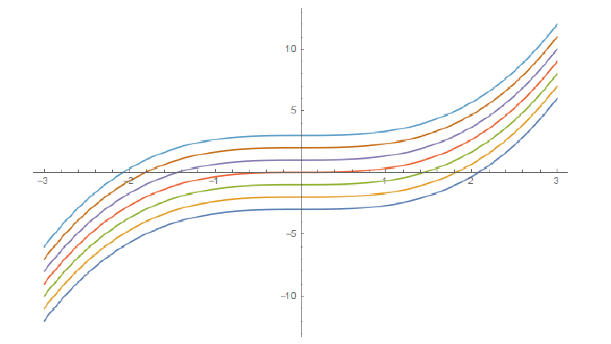
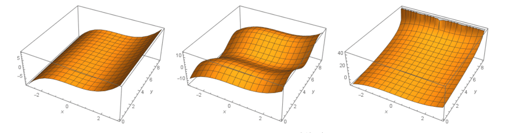
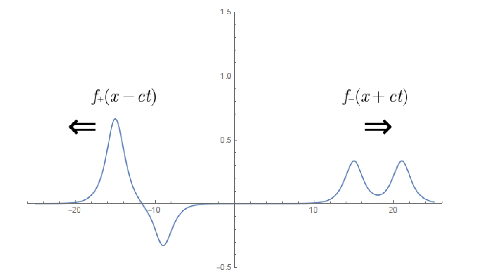
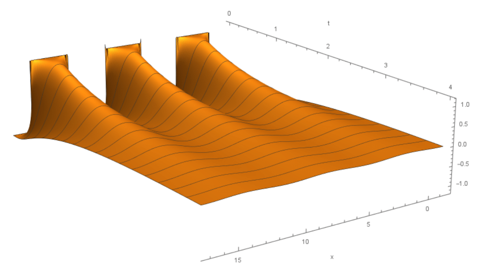
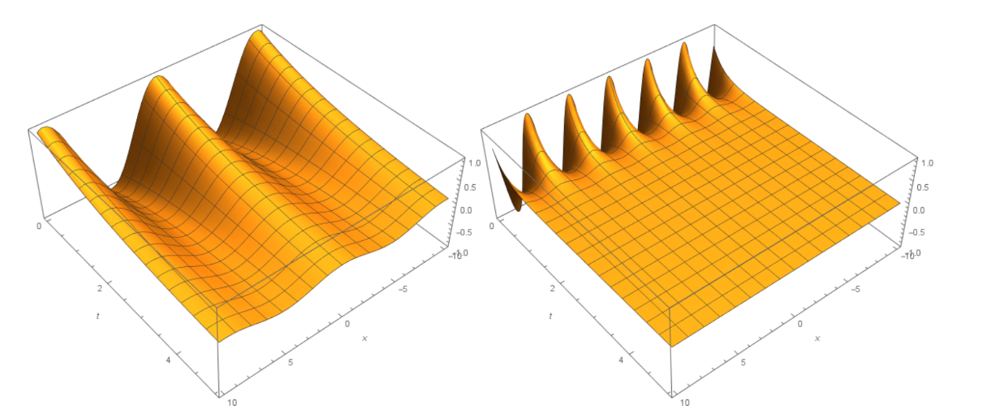
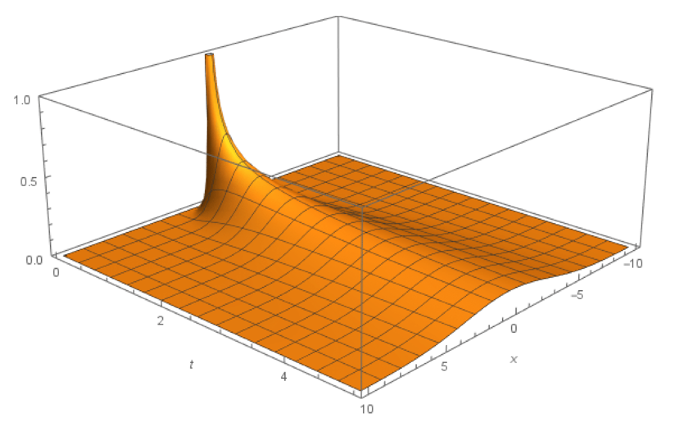

<link rel="stylesheet" type="text/css" media="all" href="styles.css">

## [Return to Contents](notes-contents)

# Chapter 14 - Partial Differential Equations

##  14.1 Recap
 
As you will remember, an ordinary differential equation (ODE) is an equation with at least one ordinary derivative. The definition for partial differential equations is as expected, an equation with at least one partial derivative. Let's recap ODEs, and see what insights we can gain as we upgrade to PDEs. Take the following ODE,

$$ \frac{f(x)}{x} = x^2 \;, $$

We can find a *solution* to this equation, which is to say a function of $x$ that satisfies the ODE. i.e.,

$$ f(x) = \frac{1}{3} x^3 + c \;. $$

This simple expression represents a family of solutions to the above equation, parametrised by the constant $c$ at the end. If we were given further information, we could find the particular solution. Say we know the value of the function at $x=0$, we could replace $c$ with a specific value,

$$ f(x) = \frac{1}{3} x^3 + f(0) \;. $$

So far so good, what if we had the very similar PDE,

$$ \frac{\partial f(x,y)}{\partial x} = x^2 \;, $$

Not a lot has changed, so the solution should look very much like the ODE case,

$$ f(x,y) = \frac{1}{3} x^3 + c(y) \;.$$

The only difference is in the *`constant'* term; the only requirement is that is constant when varying $x$, that's to say nothing of varying $y$. In fact this term is upgraded to a *function* of $y$. This subtle change has implications for how we specify a particular solution. Previously we could lock down our solution by specifying information at specific points on the function, e.g. at $x=0$, now we have to specify the function for all values of $y$.   

 

***Fig 14.1*** *Solutions to the ODE $ \frac{f(x)}{x} = x^2 \;, $*   

 

***Fig 14.2*** *Solutions to the PDE $ \frac{\partial f(x,y)}{\partial x} = x^2 \;, $*   

**Example:** Find $c(y)$ for the particular solution of the above PDE where $f(x, y)$ takes the values $f(y) = e^y$ when $x = 0$.

$$\begin{align*}
f(x,y) &= \frac{1}{3} x^3 + c(y)
\\
f(y) = f(0,y) &= \frac{1}{3} 0^3 + c(y)
\\
c(y) &= e^y
\\
\Rightarrow f(x,y) &= \frac{1}{3} x^3 + e^y
\end{align*}$$

**Example:** Find $c(y)$ for the particular solution of the above PDE where $f(x, y)$ takes the values $f(y) = 2 \sin(\pi y)$ along the curve $x = \sqrt{y}$.

This example is more difficult, it illustrates how we can specify boundary conditions over a curve in $x, y$ space, rather than a specific straight line.

$$\begin{align*}
f(x,y) &= \frac{1}{3} x^3 + c(y)
\\
f(y) = f(\sqrt{y},y) &= \frac{1}{3} (y^{1/2})^3 + c(y)
\\
2 \sin(\pi y) &= \frac{1}{3} (y^{1/2})^3 + c(y)
\\
c(y) &= 2 \sin(\pi y) - \frac{1}{3} y^{3/2}
\\
\Rightarrow f(x,y) &= \frac{1}{3} x^3 + 2 \sin(\pi y) - \frac{1}{3} y^{3/2}
\end{align*}$$

  
 

***Fig 14.3*** *Particular solution to the PDE $\frac{\partial f(x,y)}{\partial x} = x^2$ with $f(x,y) = 2 \sin(\pi y)$ along $x = \sqrt{y}$*   

These examples have set the scope for more complicated partial differential equations. Our PDEs are equations in more than one dimension, whose general solutions are functions of multiple variables, and the particular solution to these is specified by a information given at curves within the space.

##  14.2 PDE Strategies

Often for engineering purposes, the goal isn't to find a new solution to a differential equation, but to manipulate known solutions to the situation at hand. The PDE we saw last time was simplistic, it almost looked like the simplest ODE. This was to get a feel for what kind of objects we're looking at. Now let's consider a more realistic PDE, one that has derivatives in more than
one variable, i.e. the wave equation,   

$$\frac{\partial^{2} f(x,t)}{\partial t^{2}} = c^2 \frac{\partial^{2} f(x,t)}{\partial x^{2}} \;.$$

  
In principle we don't know how to solve this yet. An effective technique can be to use a trial solution, and test whether it does indeed solve the equation, perhaps generating a further condition on when it is valid. Perhaps frustratingly, there's not often a good way of selecting trial solutions other than already knowing that they are likely to work. I might call this, in jest, the Wolfram Alpha approach.  

For the wave equation, let's test the hypothesis that solutions take the form,  

$$ f(x, t) = f(x \mp c t),$$

  
which represents wavepackets with a shape $f(x)$ that moves to the right ($-$ sign), or to the left ($+$ sign), with a speed $c$. To do this, we must find the partial derivatives of the test solution and see if they match the PDE,  

$$\begin{align*}
\frac{\partial f(x\mp c t)}{\partial t} &= \mp c f'(x \mp c t)
\\
\frac{\partial^{2}f(x\mp c t)}{\partial^{2} t} &= c^2 f''(x \mp c t)
\\
\frac{\partial f(x\mp c t)}{\partial x} &= f'(x \mp c t)
\\
\frac{\partial^{2} f(x\mp c t)}{\partial^{2} x} &= f''(x \mp c t)
\end{align*}$$

  
Therefore, inserting these into the PDE,  

$$ c^2 f''(x \mp c t) = c^2 f''(x \mp c t)\;$$

  
which as the LHS and RHS are equal, is always true.  

Since the wave equation is a *linear* PDE, then any sum of solutions is also a solution. Therefore, the general solution to the wave equation is,  

$$ f(x, t) = f_+(x - c t) + f_-(x + c t) \;.$$

  
For a particular solution, it is not enough just to know the value of the function at a boundary, i.e. at $t=0$, since we would have one equation and two unknowns,  

$$ f(x, 0) = f_+(x) + f_-(x), $$

  
If we had a second piece of information, such as the value of the function at another time, or the time derivative, then we could solve for $f_+$ and $f_-$. e.g.,  

$$\begin{equation*}
\left.\frac{\partial f(x, t)}{\partial t}\right|_{t=0} = -c f'_+(x) + c f'_-(x)
,
\end{equation*}$$

  
Therefore, since,  

$$\begin{equation*}
\frac{\partial f(x, 0)}{\partial x} = f'_+(x) + f'_-(x)
\end{equation*}$$

  
then,  

$$\begin{align*}
f'_+(x) =
  \frac{1}{2}\frac{\partial f(x, 0)}{\partial x}
  - \frac{1}{2c}\left.\frac{\partial f(x, t)}{\partial t}\right|_{t=0}
\\
f'_-(x) =
  \frac{1}{2}\frac{\partial f(x, 0)}{\partial x}
  + \frac{1}{2c}\left.\frac{\partial f(x, t)}{\partial t}\right|_{t=0}
\;,
\end{align*}$$

  
Then $f_\mp$ can be found by integrating these.

  
 

***Fig 14.4*** *Left and right traveling wave solutions to the wave equation.*   

### 14.2.1 Separation of Variables

The previous example relied on us knowing something specific about the wave equation. We won't always have this knowledge, so let's explore a more general technique called \emph{separation of variables}. This technique assumes that we can write a solution that is the product of functions of one variable. i.e.,  

$$ f(x, t) = X(x)T(t) \;.$$ 

  
Here you will note that $X(x)$ is only a function of $x$ and $T(t)$ is only a function of $t$. If we plug this into the wave equation, we get,  

$$ X(x) T''(t) = c^2 X''(x) T(t) \;. $$

  
Now, dividing through by $X(x)T(t)$, will give us,  

$$\frac{T''(t)}{T(t)} = c^2 \frac{X''(x)}{X(x)} \;. $$

  
Here we see that the LHS is only a function of $t$ and the RHS is only a function of $x$. This implies that each must be constant, since it can't be a function of $x$, the LHS doesn't depend on $x$, nor can it be a function of $t$ since the RHS
doesn't depend on $t$. This allows us to split the equation out into two ODEs,  

$$\begin{align*}
\frac{T''(t)}{T(t)} &= c^2 \frac{X''(x)}{X(x)} = -\omega^2
\\
T''(t) &= -\omega^2 T(t)
\\
X''(x) &= -\frac{\omega^2}{c^2} X(x)
\;,
\end{align*}$$

  
where $-\omega^2$ has been introduced here as the constant term. (I've chosen this form specifically because I know what comes next,
but there's nothing stopping me saying the constant was just $A$ for example). We are able to solve these ODEs, they give sinusoidal solutions,  

$$\begin{align*}
T(t) &= A_+ e^{i \omega t} + A_- e^{-i \omega t}
\\
X(x) &= B_+ e^{i \omega x / c} + B_- e^{-i \omega x / c}
\end{align*}$$

  
These are then combined into one equation (with some rearranging),  

$$\begin{align*}
f(x, t)
= C_+(\omega) e^{i \frac{\omega}{c}(x - c t)}
+ C_-(\omega) e^{i \frac{\omega}{c}(x + c t)}
\;.
\end{align*}$$

  
You'll notice how the $x \mp c t$ behaviour gets recovered here. The constants have been given an explicit $\omega$ dependency, this is to
indicate that the general solution is a sum over all possible values for $\omega$ (which is any real number),  

$$\begin{align*}
f(x, t)
= \int_{-\infty}^\infty \mathrm{d}\omega\;
  C_+(\omega) e^{i \frac{\omega}{c}(x - c t)}
+ C_-(\omega) e^{i \frac{\omega}{c}(x + c t)}
\;.
\end{align*}$$

  
Dealing with expressions like this is the subject of *Fourier analysis*.  

### 14.2.2 Example - Application to PDEs

You may wonder why we spend lots of time on the separation of variables technique in PDEs. The answer is, often (i.e. for the wave equation, Laplace' equation and diffusion equation) we separate out ODEs that permit sinusoidal solutions. These sinusoids can be combined into a Fourier series in one of the variables, which then can tell us how the function behaves in the other variables.   

E.g. for the diffusion equation, $\frac{\partial f}{\partial t} - \alpha \frac{\partial^{2} f}{\partial x^{2}} = 0$, we get ODEs,  

$$\begin{align*}
X''(x) &= -k^2 X(x) 
\\
T'(t) &= -\gamma T(t) 
\\
\text{with } \gamma &= \alpha k^2
\;,
\end{align*}$$

  
with solutions,  

$$\begin{equation*}
f(x, t) = a e^{-\alpha k^2 t} \cos(k x) + b e^{-\alpha k^2 t} \sin(k x)	\;.
\end{equation*}$$

  
Remember, that this is true for any arbitrary $k$. We could set $k = \frac{n \pi}{L}$, i.e.,
$$\begin{equation*}
f(x, t)
= a e^{-\frac{\alpha n^2 \pi^2}{L^2}t} \cos(\frac{n \pi x}{L})
+ b e^{-\frac{\alpha n^2 \pi^2}{L^2}t} \sin(\frac{n \pi x}{L})\;.
\end{equation*}$$

  
Remember that sum of solutions to a linear PDE or ODE is also a solution, so,  

$$ \begin{equation*}
g(x, t) = \frac{a_0}{2} +
\sum_{n=1}^\infty\left(
a_n e^{-\frac{\alpha n^2 \pi^2}{L^2}t}
\cos(\frac{n \pi x}{L})
+ b_n e^{-\frac{\alpha n^2 \pi^2}{L^2}t}
\sin(\frac{n \pi x}{L})\right) \;,
\end{equation*}$$

  
is a solution too.  

Now, here's where it gets interesting. If we set $t=0$, then this expression turns into the Fourier series.  

$$\begin{equation*}
g(x, 0) = \frac{a_0}{2} +
\sum_{n=1}^\infty \left(
a_n \cos(\frac{n \pi x}{L}) + b_n \sin(\frac{n \pi x}{L})\right) \;,
\end{equation*}$$

  
So, if we work out the Fourier coefficients $a_n$, $b_n$ for an initial condition, $f(x,t=0)$, then we can know how that function evolves in time. By grouping together the fourier coefficients at the exponential, we can get
time-varying coefficients,  

$$\begin{align*}
a_n(t) = a_n e^{-\frac{\alpha n^2 \pi^2}{L^2}t} 
\\
b_n(t) = b_n e^{-\frac{\alpha n^2 \pi^2}{L^2}t}
\end{align*}$$

  
which allow us to reconstruct a new Fourier series at any moment in time, just by knowing the $t=0$ state.  

Let's apply this to the previous square wave solution,  

$$\begin{equation*}
g(x, 0)
= \frac{4}{\pi} \sum_{n=1, 3, 5,...}^{\infty} \frac{1}{n}\sin(nx)
\end{equation*}$$

  
therefore, by pattern matching to the general separable solution,  

$$\begin{equation*}
g(x, t)
= \frac{4}{\pi} \sum_{n=1, 3, 5,...}^{\infty}
\frac{1}{n}\sin(nx)
e^{-\alpha n^2 t}
\end{equation*}$$

  
is the full particular solution, that solves the diffusion equation. It looks like this:  

  
 

***Fig 14.5*** *A square wave evolving in time under the diffusion equation, calculated using Fourier series.*   

**Diffusion equation**
Let's apply our technique to another useful PDE, the diffusion equation,   

$$\begin{equation*}
\frac{\partial f(x,t)}{\partial t} = \alpha \frac{\partial^{2} f(x,t)}{\partial x^{2}}
\;.
\end{equation*}$$

   
This equation models how a localised concentration of a quantity spreads out, or diffuses, over time. The constant $\alpha$ is the diffusivity, which measures how readily a concentration diffuses away. A mental image of this could be how a blob of honey might spread out if you dropped it on a table (assuming no surface tension). The expression is found in an engineering context to model how concentrations of ions, or gasses pass from an area of high concentration to an area of low concentration, or indeed how heat is conducted in a solid object (the diffusion equation also gets called the heat equation).   

Let's attempt to gain insights about the diffusion equation by applying separation of variables. Again, let $f(x, t) = X(x) T(t)$, then,    

$$\begin{align*}
\frac{\partial f(x,t)}{\partial t} = \alpha \frac{\partial^{2} f(x,t)}{\partial x^{2}}
\end{align*}$$
$$\begin{align*}
X(x)T'(t) &= \alpha X''(x)T(t)
\\
\frac{T'(t)}{T(t)} &= \alpha \frac{X''(x)}{X(x)} = -\gamma
\;.
\end{align*}$$

  
Giving us two ODEs, with solutions,   

$$\begin{align*}
T'(t) &= -\gamma T(t)
\\
X''(x) &= -\frac{\gamma}{\alpha} X(x)
\\
T(t) &= A e^{-\gamma t}
\\
X(x)
&= B \sin\left( \sqrt{\frac{\gamma}{\alpha}} x \right)
+ C \cos\left( \sqrt{\frac{\gamma}{\alpha}} x \right)
\\
\Rightarrow f(x, t) &=
B' \sin\left( \sqrt{\frac{\gamma}{\alpha}} x \right) e^{-\gamma t}
+ C' \cos\left( \sqrt{\frac{\gamma}{\alpha}} x \right) e^{-\gamma t}
\end{align*}$$

  
What we see here is that fine features that vary spatially over short distances tend to die out quite quickly - they have a large $\gamma$ parameter in the $\sin$ and $\cos$, but equally that large parameter is in the $e^{-\gamma t}$, which means this feature decays fast. Conversely, coarse features that vary over longer distances tend to remain for longer.  

  
 

***Fig 14.6*** *Sinusoidal solutions to the diffusion equation.*   

### 14.2.3 Fundamental solution

Let's look at the diffusion equation from a different angle, to see if we can gain any more insight. If we assume a concentration as having a Gaussian profile at an initial time,   

$$\begin{equation*}
f(x,0) = \exp\left(-\frac{x^2}{2 \sigma^2}\right)
\;,
\end{equation*}$$

  
where here $\sigma$ is the standard deviation (or characteristic width) of the concentration, it would be reasonable to assume the width gets bigger over time. We could guess that the profile stays Gaussian over time too - this is a hypothesis, we'll need to confirm that it is indeed true.   

First we need a general piece of information from the diffusion equation,
namely, does the area of the concentration curve remain constant for all times?
To answer this, we can integrate the diffusion equation itself,   

$$\begin{align*}
\int_{-\infty}^{\infty} \mathrm{d}x\; \frac{\partial f(x,t)}{\partial t}
= \int_{-\infty}^{\infty} \mathrm{d}x\; \alpha \frac{\partial^{2}f(x,t)}{\partial x^{2}}
\end{align*}$$ 

  
On the left hand side, we can reverse the order of differentiation and
integration, and on the right, we can directly integrate,  

$$ \begin{align*}
\frac{\partial}{\partial t} \int_{-\infty}^{\infty} \mathrm{d}x\; f(x,t)
= \alpha \left.\frac{\partial f(x,t)}{\partial x}\right|_{x\rightarrow \infty}
- \alpha \left.\frac{\partial f(x,t)}{\partial x}\right|_{x\rightarrow -\infty}
\;,
\end{align*}$$ 

  
if we assume the concentration goes to zero sufficiently fast towards infinity,
then the derivatives towards infinity will also go to zero, giving,  

$$\begin{align*}
\frac{\partial}{\partial t} \int_{-\infty}^{\infty} \mathrm{d}x\; f(x,t) = 0
\;.
\end{align*}$$

  
This confirms that the area underneath the concentration curve does indeed remain constant over time. This area would represent things like the total number of particles (molecules, ions, etc.); this remaining constant seems reasonable.   

With this in mind, let's rewrite our Gaussian to have a constant unit area,   

$$\begin{equation*}
f(x,0) = \frac{1}{\sigma\sqrt{2\pi}}\exp\left(-\frac{x^2}{2 \sigma^2}\right) \;.
\end{equation*}$$ 

  
 

***Fig 14.7*** *Gaussian solutions to the diffusion equation.*   

Let's follow our hypothesis that the width changes as a function of time - although as an unknown function for now,  

$$\begin{equation*}
f(x,t) = \frac{1}{\sigma(t)\sqrt{2\pi}}\exp\left(-\frac{x^2}{2
\sigma(t)^2}\right) \;.
\end{equation*}$$

  
We'll need to plug this into the PDE, so let's first calculate the relevant partial derivatives:
$$\begin{align*}
\frac{\partial f(x,t)}{\partial t} &=
\frac{1}{\sqrt{2\pi}}\left[
-\frac{1}{\sigma(t)^2} + \frac{x^2}{\sigma(t)^4}
\right]\sigma'(t)\exp\left(-\frac{x^2}{2
\sigma(t)^2}\right)
\\
\frac{\partial f(x,t)}{\partial x} &=
\frac{1}{\sqrt{2\pi}}\left[
-\frac{x}{\sigma(t)^3}
\right]\exp\left(-\frac{x^2}{2
\sigma(t)^2}\right)
\\
\frac{\partial^{2} f(x,t)}{\partial x^{2}} &=
\frac{1}{\sqrt{2\pi}}\left[
-\frac{1}{\sigma(t)^3}
+\frac{x^2}{\sigma(t)^5}
\right]\exp\left(-\frac{x^2}{2
\sigma(t)^2}\right)
\,
\end{align*}$$

  
Inserting into the PDE,  

$$\begin{align*}
\frac{1}{\sqrt{2\pi}}\left[
-\frac{1}{\sigma(t)^2} + \frac{x^2}{\sigma(t)^4}
\right]\sigma'(t)\exp\left(-\frac{x^2}{2
\sigma(t)^2}\right)
&=
\alpha
\frac{1}{\sqrt{2\pi}}\left[
-\frac{1}{\sigma(t)^3}
+\frac{x^2}{\sigma(t)^5}
\right]\exp\left(-\frac{x^2}{2
\sigma(t)^2}\right)
\\
\Rightarrow \sigma'(t) &= \frac{\alpha}{\sigma(t)}
\end{align*}$$

  
Now, this is a non-linear ODE, but it can be solved fairly easily.  

$$\begin{align*}
\frac{\mathrm{d}\sigma(t)}{\mathrm{d} t} \sigma(t) &= \alpha
\\
\int \mathrm{d}{\sigma(t)}\; \sigma(t) &= \int \mathrm{d}t \; \alpha
\\
\frac{\sigma(t)^2}{2} &= \alpha t + c
\\
\sigma(t) &= \sqrt{2 \alpha t + 2c}
\,
\end{align*} $$

  
or by fixing the constant term,  

$$\begin{align*}
\sigma(t) = \sqrt{\sigma(0)^2 + 2 \alpha t}
\end{align*}$$ 

  
Let's pause and have a look at what we've just uncovered. Our guess that the concentration shape would remain Gaussian as it diffuses was
correct, and the condition for this to be true, is the function form of $\sigma(t)$ just derived. Our derived solution is therefore   

$$\begin{equation*}
f(x,t) = \frac{1}{\sqrt{2\pi}\sqrt{\sigma(0)^2 + 2 \alpha t}}
\exp\left(-\frac{x^2}{2
{\sigma(0)^2 + 4 \alpha t}}\right) \;.
\end{equation*}$$

  
The width of the concentration expands proportionally to the square root of the diffusivity times time, i.e. relatively slowly, and slowing as it widens out. Note that this expression gives imaginary widths for times $t < -\sigma(0)/(2\alpha)$, which is nonsense. Therefore, this solution has a bounded domain, where it only predicts behaviour in the range $t \in \left(-\frac{\sigma(0)}{2\alpha}, \infty\right)$. In the limit as the width goes to zero, we have a solution with finite area (i.e. particle number) yet localised exactly to a single location at a single instant in time, and spreads out from there.   

$$\begin{equation*}
f(x,t) = \frac{1}{\sqrt{4\pi \alpha t}}
\exp\left(-\frac{x^2}{
{4 \alpha t}}\right) \;.
\end{equation*}$$ 

  
This form is of particular use to construct the time-evolution of an arbitrary starting concentration, earning it the rather grandiose name of the fundamental solution.   

In this chapter we have looked at partial differential equations, seeing how they generalise from ODEs and that they need to be specified over curves rather than single points for a particular solution. We've explored some ways of finding solutions to PDEs, either by constructing them out of known pieces, or techniques to reduce the PDEs to a set of related ODEs. What we've not covered is non-linear PDEs (a whole course on it's own) or inhomogeneous PDEs, where there is a driving term for our waves, or heat/particle sources and sinks in our diffusion equation. Often these PDEs can be solved to required precision numerically, and we'll explore this later in the module. Quite often, we have equations that are in more spatial dimensions, and where the parameters (like wave speed and diffusivity) are able to change as a function of space. In these cases, stitching together solutions from simpler cases, or numerically solving are often the only way of tackling, but the intuition build here should give you insight when faced with that task.

    

