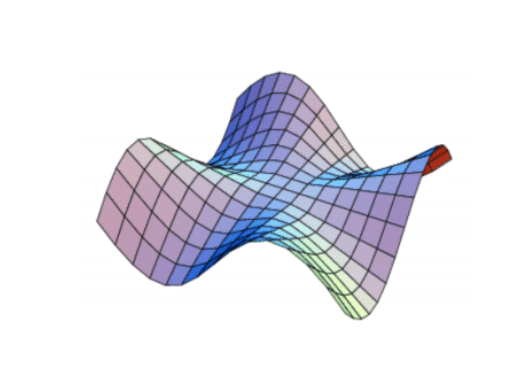
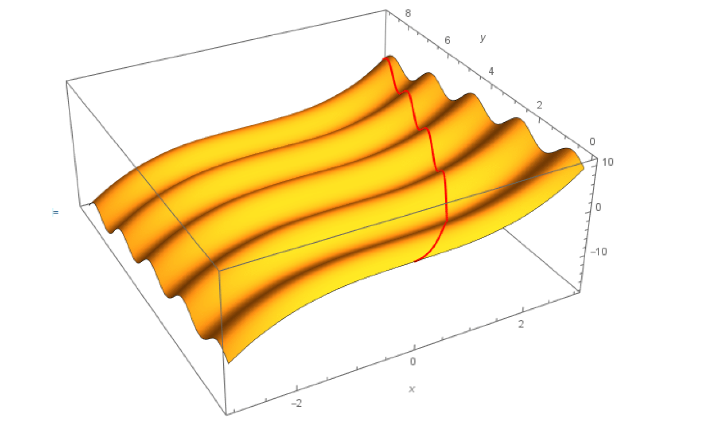

<link rel="stylesheet" type="text/css" media="all" href="styles.css">

## [Return to Contents](notes-contents)

# Chapter 15 - Finite Differences

##  15.1 Introduction
 

  
 

***Fig 14.3*** *Particular solution to the PDE $\frac{\partial f(x,y)}{\partial x} = x^2$ with $f(x,y) = 2 \sin(\pi y)$ along $x = \sqrt{y}$*   
