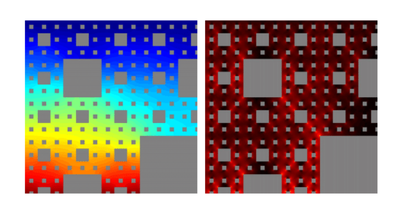
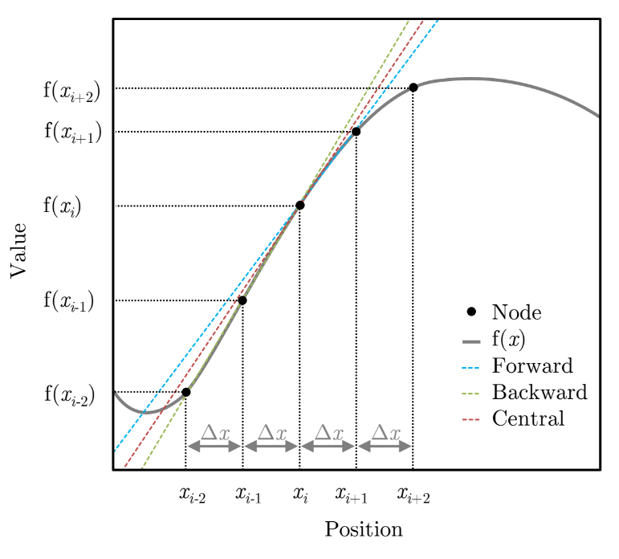
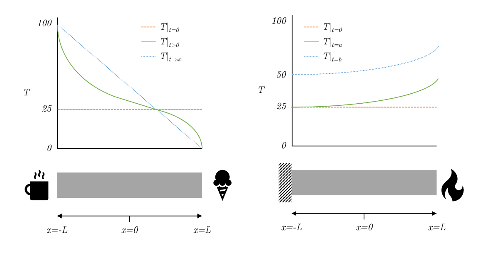
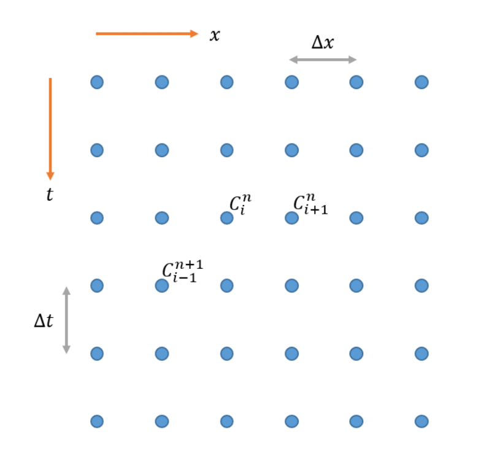
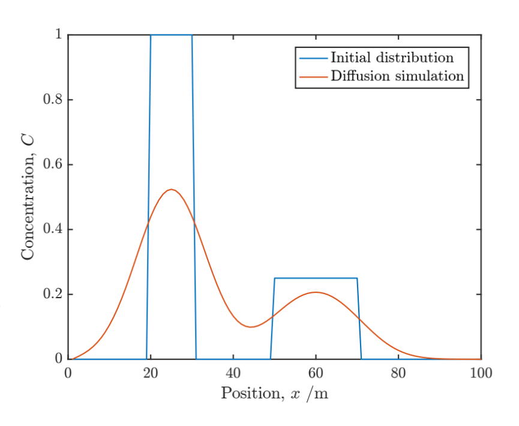
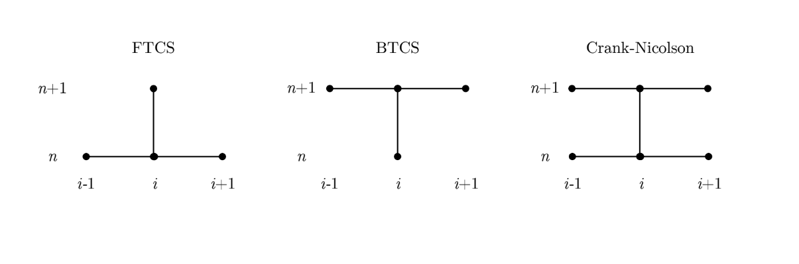

<script type="text/x-mathjax-config">
  MathJax.Hub.Config({
    tex2jax: {
      inlineMath: [ ['$','$'], ["\\(","\\)"] ],
      processEscapes: true
    }
  });
</script>

<script type="text/javascript" async
  src="https://cdnjs.cloudflare.com/ajax/libs/mathjax/2.7.5/MathJax.js?config=TeX-MML-AM_CHTML">
</script>
<script type="text/javascript" src="tutorialSheetScripts.js"> </script>
<link rel="stylesheet" type="text/css" media="all" href="styles.css">

## [Return to Contents](notes-contents)



# Chapter 15 - Finite Differences

## <a id="intro"></a> 15.1 Introduction
<br>

You will have seen that in some simple scenarios it is possible to find analytical solutions to differential equations; however, even very minor increases in complexity usually make this approach impractical, if not impossible! <br><br>

Finite difference methods are a numerical approach to solving differential equations by approximating derivatives with "difference quotients". First, the simulation domain (typically time and/or space) is discretised (chopped up into chunks), where the properties of the system are stored at discrete nodes. Then a Taylor series expansion is used to describe the relation of each node to the others in the system. This method is exclusively used with the help of computers, as it involves many simple steps being repeated zillions of times. However, if the equation for every node really did include all the others in the system, this would be too much even for computers, so a truncated series is used, which typically only involves each node's nearest neighbours.<br><br>

### 15.1.1 Taylor Series Again

As we learnt previously, the Taylor series assumes complete knowledge of a function at a single point (the value and all its derivatives) and uses this information to recreate the whole function with a power series. For all smooth, continuous functions, there will exist an exact polynomial description if the series is expanded to enough terms. In some cases, such as trigonometric functions, infinitely many terms are required. If we assume that we know every thing about the function $f(x)$ at the point $c$, then we can approximate $f(x)$ at any other point by using:<br><br>

$$\begin{align*}
f(x)=f(c)+f'(c)(x-c)+\frac{f''(c)}{2!}(x-c)^2+\frac{f^{(3)}(c)}{3!}(x-c)^3+...+\frac{f^{(n)}(c)}{n!}(x-c)^n 
\end{align*}$$

<br><br>
Next, we make the substitution $x=c+\Delta x$ (we use the notation $\Delta x$ to imply a very small, but non-zero step size. The motivation for this will become clear after the next step...) <br><br>

$$\begin{align*}
f(c+\Delta x)=f(c)+f'(c)(\Delta x)+\frac{f''(c)}{2!}(\Delta x)^2+\frac{f^{(3)}(c)}{3!}(\Delta x)^3+...+\frac{f^{(n)}(c)}{n!}(\Delta x)^n 
\end{align*}$$

<br><br>
our expression now says that if we know everything about $f(x)$ at point $c$, we can also find $f(x)$ at some point $\Delta x$ away from $c$.<br><br>

Many mathematical descriptions of physical phenomena, such as diffusion, involve the relation of differentials. The expression in the previous equation can be rearranged to make the first differential the subject, as shown in eq.15.1 (be sure to have a go at this rearrangement yourself!).<br><br>

$$\begin{equation*}
	f'(c) = \frac{f(c+\Delta x) - f(c)}{\Delta x}-\left[\frac{\Delta x}{2}f''(c) + \frac{\Delta x^2}{6}f'''(c) + \frac{\Delta x^3}{24}f^{(4)}(c) + ... \right]
	\quad\quad (15.1)
\end{equation*}$$

<br><br>
So we now have an equation for the first derivative at position $c$ in terms of the values of the function at $f(c)$ and $f(c+\Delta x)$, as well as a bunch of more complicated derivative terms (which have been put into square brackets...). What we can now say is that *if* $\Delta x$ is very small, then all the terms inside the big square brackets must  be *really small* compared to the first terms.<br><br>

In fact, we will intentionally leave out the square bracket terms and use only the first part of the expression to form our approximation. We can now say that by truncating the Taylor series expansion before the second derivative term, we will expect to get an error on the order of $\Delta x$, which is fine if $\Delta x$ is small enough! We often write this error as $e=\mathcal{O}(\Delta x)$, where the symbol $\mathcal{O}$ means "on the order of". So the approximation of the function $f(x)$ at point $c$ becomes<br><br>

$$\begin{equation*}
f'(c) \approx \frac{f(c+\Delta x) - f(c)}{\Delta x}
\quad\quad (15.2)
\end{equation*}$$

<br><br>
This formulation is referred to as the *Forward Euler* approach and was first described in 1768 (way before computers!) by Leonhard Euler. If you think back to your study of linear functions for graph plotting, the equation above looks suspiciously like "gradient=rise/run", which I hope does not surprise you too much! In fact, this *linearisation* is exactly what a first order finite differencing scheme does (i.e. it takes any function and describes it as loads of tiny line segments - the smaller these lines are, the better the approximation will be!).<br><br>

 The *Backward Euler* can be similarly constructed by stepping $\Delta x$ away from $c$ in the negative direction (eq.15.3) and has the same magnitude of error.<br><br>

$$\begin{equation*}
	f'(c) = \frac{f(c) - f(c-\Delta x)}{\Delta x}+\left[\frac{\Delta x}{2}f''(c) - \frac{\Delta x^2}{6}f'''(c) + \frac{\Delta x^3}{24}f^{(4)}(c) - ... \right]
	\quad\quad (15.3)
\end{equation*}$$

<br><br>
An improved approximation can be found by taking the average of the *Forward Euler* and *Backward Euler*. Equation 15.4 shows the resulting expression, referred to as the *central difference*, which now has an improved $\mathcal{O}(\Delta x^2)$ truncation error.<br><br>

$$\begin{equation}
	f'(c) = \frac{f(c+\Delta x) - f(c-\Delta x)}{2\Delta x} - \left[\frac{\Delta x^2}{6}f'''(c) + \frac{\Delta x^4}{120}f^{(5)}(c) + ... \right]
	\quad\quad (15.4)
\end{equation}$$

<br><br>


These three methods are shown graphically in the adjacent plot, where the difference between the outputs has been highlighted by extending their tangent approximations for the point $x_i$. <br><br>

Similarly, we can also construct an approximation for the second derivative by taking the difference between the *Forward Euler* and *Backward Euler*. This should also not come as a surprise when we consider that the second derivative is just the gradient of the gradient!<br><br>

As with the central difference, this approximation to the second derivative also has an $\mathcal{O}(\Delta x^2)$ truncation error.<br><br>

$$\begin{equation}
f''(c) = \frac{f(c+\Delta x) - 2f(c) + f(c-\Delta x)}{\Delta x^2} - \left(\frac{\Delta x^2}{12}f^{(4)}(c) + ... \right) 
\quad\quad (15.5)
\end{equation}$$

<br><br> 

## <a id="app"></a> 15.2 Application Example - Numerical Diffusion
<br>

Now that we have suitable approximations to the first and second derivatives of a function, we can use them to approximate the solution to a useful equation. Diffusive processes are very common in engineering and, in 1 dimension, are described by the equation <br><br>

$$\begin{equation*}
	\frac{\partial C(t,x)}{\partial t}=D\frac{\partial^2 C(t,x)}{\partial x^2}
\end{equation*}$$

<br><br>
where $C$ represents the concentration of a diffusion species, $t$ is time, $x$ is distance and $D$ is some kind of diffusivity coefficient (i.e. how easy is it for this thing to move around). The $\partial$ symbol is used to signify that a partial derivative is being evaluated as $C$ is a function of both $t$ and $x$. Firstly, using the forward difference approximation in eq.15.1, we can approximate the time derivative to be<br><br>

$$\begin{equation*}
	\frac{\partial C(t,x)}{\partial t}\approx \frac{C(t+\Delta t,x) - C(t,x)}{\Delta t}
\end{equation*}$$

<br><br>
Then, using the second derivative approximation in eq.15.5 we can approximate the second spatial derivative<br><br>

$$\begin{equation*}
	\frac{\partial^2 C(t,x)}{\partial x^2}\approx  \frac{C(t,x+\Delta x) - 2C(t,x) + C(t,x-\Delta x)}{\Delta x^2}
\end{equation*}$$

<br><br>
Substituting these two approximations back into the diffusion equation, we get<br><br>

$$\begin{equation*}
	\frac{C(t+\Delta t,x) - C(t,x)}{\Delta t}\approx D\frac{C(t,x+\Delta x) - 2C(t,x) + C(t,x-\Delta x)}{\Delta x^2}
\end{equation*}$$

<br><br>
Looking at the expression above, we can assume that we know all the values of $C$ at time $t$ (i.e. now) and are therefore using this expression iteratively to work out the values at time $t+\Delta t$ (i.e. the next point in the future). Therefore, we can rearrange the equation above to make our unknown the subject<br><br>

$$\begin{equation*}
	C(t+\Delta t,x)\approx D\frac{\Delta t}{\Delta x^2}\left[C(t,x+\Delta x) - 2C(t,x) + C(t,x-\Delta x)\right]+ C(t,x)
\end{equation*}$$

<br><br>
Finally, to make this more convenient for a computer to calculate many times, we will first make the substitution $\sigma=D\frac{\Delta t}{\Delta x^2}$ and then expand the brackets such that each value of $C$ is only called once.<br><br>

$$\begin{equation*}
	C(t+\Delta t,x)\approx \sigma C(t,x+\Delta x) + \sigma C(t,x-\Delta x) +(1-2\sigma) C(t,x)
\end{equation*}$$

<br><br>
We now have an expression ready to be input into a simulation which models time dependant diffusion. This approach is referred to as a *Forward-Time Central-Space* (FTCS) model because of how the approximations were derived. There are many subtle tweaks that we can implement in order to speed up or improve the accuracy of this simulation, but many real world codes today would simply use the expression we've found above. Interestingly, the FTSC method becomes susceptible to instability and oscillation if $\sigma>0.5$, so we must be careful to avoid this. Detailed explanation of why this is is beyond the scope of this course, but use the MatLab code shared below to see for yourself!<br><br>

## <a id="systems"></a> 15.3 Systems of equations and conditions
<br>

To describe a system that we wish to simulate, it's not enough just to give the governing equation (e.g. the diffusion equation of the wave equation). In addition, you will need to know things about what happens at the edges of the system (e.g. is there an insulator blocking heat transfer or maybe a blow torch adding more heat!), as well as the state of the system at some point in time (usually the initial condition). It is often convenient to write all of this information in a little cluster using the following format which we call a system of equations. A solution is something that satisfies all of these equations at the same time. <br><br>

$$\begin{equation}
\begin{cases}
\partial_t T = \alpha\partial_{xx}T  &\text{on}\, (0,\infty)\times [-L,L],\\
T|_{t=0}=25 &\forall x,\\
T|_{x=-L}=100 \qquad\  &\forall t>0,\\
T|_{x=L}=0 \qquad\  &\forall t>0.
\end{cases}
\end{equation}$$

<br><br> 
The system above describes a one dimensional heat diffusion problem, with initial and boundary conditions. The first line is called the governing equation, which in this case is diffusion equation applied to the temperature, $T$. 

The parameter $\alpha$ is just a coefficient mediating the process, which in this case can be interpreted as the thermal diffusivity. The text to the right of this equation tells us where/when this equation applies, which in this case is all time from now, $0<t\textrm{<}\infty$, and a region of space $2L$ wide, $-L\leq x\leq L$ (notice I've used the same rule for bracket selection as described in Chapter 1). <br><br>

The second line of the equation contains two new symbols: a vertical line symbol "$|$" which can be read as *such that*, or just *at*; and an upside-down capital A symbol "$\forall$" which should be read as *for all*. So the line reads "The temperature at time equals zero is equal to 25 for all $x$", i.e. initially the temperature is 25 everywhere.<br><br>

Following the same logic, the third line reads "The temperature at position $x=-L$ is equal to 100 for all time greater than zero" i.e. the temperature on the left hand side of the system equals 100 from now on. Similarly the final line of the system says, "The temperature at position $x=L$ is equal to zero for all time greater than zero" i.e. the temperature on the right hand side of the system equals 0 from now on. So, although the system is initially room temperature everywhere, as soon as the clock begins, the temperatures at the two edges snap to new values, as if one end is touching boiling water and the other end is touching an ice cube. <br><br>



<br><br>
This scenario is represented in the figure above, which shows what the distribution of temperature is initially, some time later, and eventually converging to a steady state scenario with a constant temperature gradient across the sample from hot to cold. Fixing the value of a system at any particular location is called a Dirichlet boundary condition; however, we could equally well fix the gradient instead (called a Neumann boundary condition), as in the following example system. <br><br>

$$\begin{equation}
\begin{cases}
\partial_t T = \alpha\partial_{xx}T  &\text{on}\, (0,\infty)\times [-L,L],\\
T|_{t=0}=25 &\forall x,\\
\partial_x T|_{x=L}=0 \qquad\  &\forall t>0,\\
\partial_x T|_{x=-L}=10 \qquad\  &\forall t>0.
\end{cases}
\end{equation}$$

<br><br>
This time the left hand side of the system has a fixed gradient of zero (which we can think of as an insulating barrier, letting no heat in or out) and the right hand side has a constant gradient of 10 degrees per meter (we can think of this as a controlled heat source, like a laser). 

<br>

The figure shows the distribution of temperature initially, at time $t=a$ which is when $T|_{x=-L}$ first increases about 25 degrees, and at time $t=b$ which is when $T|_{x=-L}=50$.

<br>

Notice that the gradient of the temperature at $x=-L$ and $x=L$ are the same at $t=b$ as they are at $t=a$. These gradients are defined in the system of equations. Since this system is gaining heat at one end and not losing any heat at the other, it will just keep getting hotter and hotter, although the shape of the temperature profile will stay the same for $t\geq a$. <br><br>

## <a id="notation"></a> 15.4 Notation
<br>

The functional notation used above can be a bit of a hassle to write, as you probably noticed in the above. In some cases it can be convenient to instead use subscripts and superscripts to communicate the value of $t$ and $x$, either in the continuous form, or using indexes to refer to locations in the discrete form. <br><br>

$$\textrm{Continuous form:}\quad C(t+\Delta t, x+\Delta x) \equiv C^{t+\Delta t}_{x+\Delta x} \qquad\qquad\textrm{Discrete form:}\quad C({n+1}, {i+1}) \equiv C^{n+1}_{i+1}$$

<br><br>

<br><br>

## <a id="code"></a> 15.5 Code


```matlab:Code
%% Begin Function
% 1 Dimensional diffusion
D=1; % Define D [m^2/s]
delta_t=0.1; % Define the time step [s]
delta_x=1; % Define the spatial step [m]
sigma=D*delta_t/delta_x^2 %Calculate sigma
steps_t=300; % Define number of time steps
steps_x=100; % Define number of spatial nodes
C=zeros(steps_t,steps_x); % Define concentration matrix

% Initalise concentration at t=0
C(1,20:30)=1;
C(1,50:70)=0.25;

for t=1:steps_t-1 % Iterate through time steps
	% Use finite difference to calcuate concentration at next time step
	% Assume spatial end values are always zero
	C(t+1,2:end-1)=sigma*C(t,1:end-2)+sigma*C(t,3:end)+(1-2*sigma)*C(t,2:end-1);
	% Plot results 
	plot(1:steps_x,C(1,:),1:steps_x,C(t+1,:));
	drawnow
end
legend('Initial distribution','Diffusion simulation');
xlabel('Position, x /m');
ylabel('Concentration, C');
%% End Function
```
<br><br>



Copy and paste the code above into a Matlab file (save as **Diffusion1D.m**). When you run this script, it should generate a plot after each time step similar to that shown below. When reading it, remember that all the green text after the **%** symbols are called comments and are included just to help you understand the code (i.e. they are totally ignored by the computer). <br><br>

This simulation could equally represent heat transfer, mass transport or even the movement of bacteria. Notice the smoothing effect that diffusion has, turning an initially very sharp distribution in to two overlapping curves similar to Gaussians.<br><br>

You should work through the code to make sure you understand each line and then try modifying it. Perhaps start by changing the initial distribution to something more unusual. Next change the value of the node at $x=0$ to something other than zero  to observe the effect (i.e. **C(:,1)=1;**). What does this do?<br><br>

The spatial nodes at either end of our simulation are currently not being updated as we iterate. This means that their values don't change, meaning that they act like a *sink* and the mass/heat/bacteria will just flow through them as if they were falling off the edge of a table. However, clearly this is only appropriate for a certain set of scenarios. What happens at these boundaries is what we refer to as *boundary conditions*. Our current fixed value boundaries are referred to as *Dirichlet* boundaries, but several other options exist.<br><br>

### 15.5.1 Alternative Approaches

An alternative approach, called *Backward-Time Central-Space* (BTCS), can be derived in the same manner as the FTCS and has the same associated truncation error, but it does not yield an explicit solution. Instead an implicit approach must be used where the values of concentration within each iteration are calculated simultaneously by solving a system of linear equations. This matrix operation typically incurs more computational expense per iteration than FTCS; however, the BTCS approach is unconditionally stable and immune to oscillation for any value of $\sigma$.<br><br>

The figure below illustrates the nodes required (or *stencil*) to update each value of $C$ in an iteration for the FTCS and BTCS methods, as well as a third (particularly awesome) scheme, called Crank Nicolson, which you'll have to google. <br><br>



<br><br><br><br>
