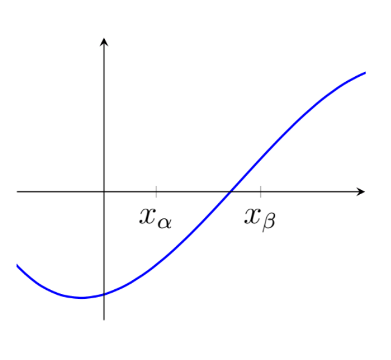
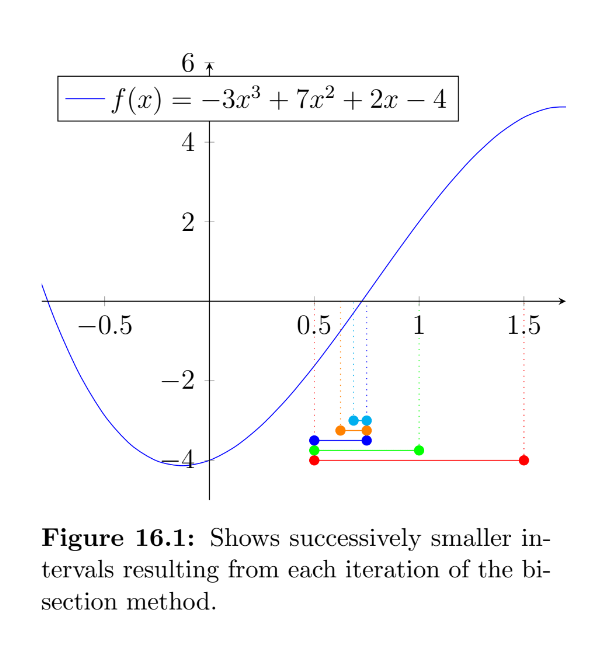
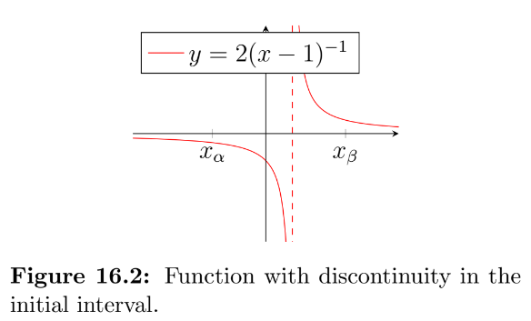
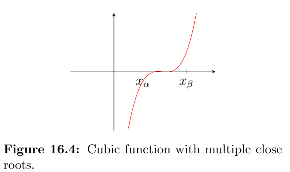
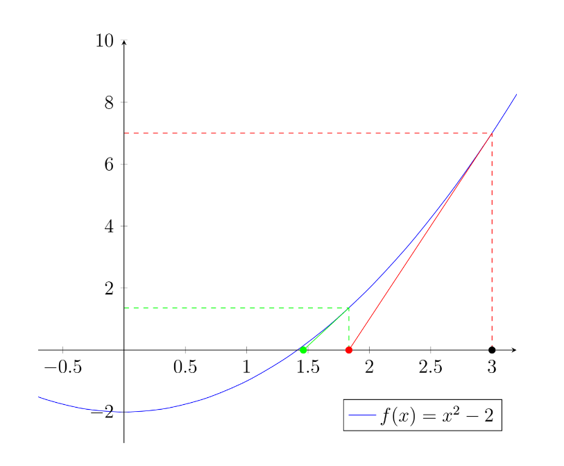
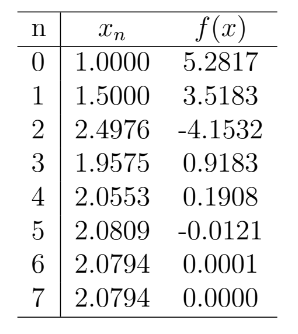
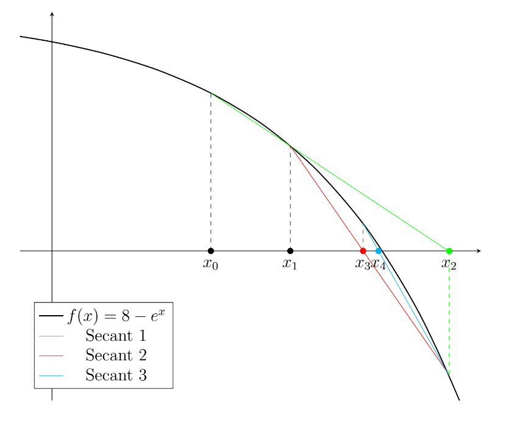

<link rel="stylesheet" type="text/css" media="all" href="styles.css">

## [Return to Contents](notes-contents)

# Chapter 16 - Root Finding
 

As discussed earlier in the course, it is sometimes possible to find the roots of equations simply by factoring them into linear factors or using known analytical solutions (such as the quadratic formula). However, in many cases there is no direct approach to find the roots and a numerical method must be used.   

A variety of methods have been developed over the years, which vary in simplicity and efficiency. This chapter will explore the bisection method and the Newton-Raphson method.     

##  14.1 The Bisection Method

If a function has a single root between the two $x$-coordinates, $x_\alpha$ and $x_\beta$, then $f(x_\alpha)$ and $f(x_\beta)$ should have different signs (i.e. one positive and one negative).   

The bisection method starts with the user specifying an interval (i.e. two $x$-coordinates), which they believe to contain a single root. Next, this interval is bisected (i.e. cut in half) to create two smaller intervals either side of our bisection point, $x_1$. By evaluation $f(x_1)$, we can then determine which of the two new intervals must contain the root (i.e. the one with the sign change).   

If we are lucky with the selection of our initial interval, our bisection point may eventually coincide with the root itself ($f(x_n)=0$), but this will not usually be the case. As such, we must continue to iterate the bisection method until the interval containing the root is acceptably small. This method is summarised as follows:  

1. For iteration $n$, calculate $x_n$, which is the midpoint of the current interval, $x_n =\tfrac{1}{2}\left(x_\alpha + x_\beta\right)$. 
2. Calculate the function value at the midpoint, $f(x_n)$. 
3. If convergence is satisfactory (that is, if the interval $\tfrac{1}{2}\left(x_\alpha - x_\beta\right)$ or the value $f(x_n)$ is sufficiently small), return $x_n$ and stop iterating. 
4. Check the sign of $f(x_n)$ and replace either $x_\alpha$ or $x_\beta$. Go to step 1 if not converged.  

**Example** - The function $f(x)=-3x^3+7x^2+2x-4$ has three distinct roots. We would like to find an approximation to the first positive root using the bisection method. We know that the first root lies between the points $x_\alpha=0.5$ and $x_\beta=1.5$ (this interval  $[x_\alpha,x_\beta]$  is highlighted in fig. 16.1.   

   

The first bisection point occurs at   $x_1=\tfrac{1}{2}\left(x_\alpha + x_\beta\right)=\tfrac{1}{2}\left(0.5 + 1.5\right)=1$.  

$$\begin{align*}
f(x_1)
&=-3x_1 ^3+7x_1 ^2+2x_1-4\\
&=-3(1)^3+7(1)^2+2(1)-4\\
&=2 \quad\mathrm{(positive)}
\end{align*}$$

  
As the function is positive at $x_1$, we can exclude $x_\beta$ and repeat this process in our new interval  $[x_\alpha,\,x_1]$. The second bisection point occurs at $x_2=\tfrac{1}{2}\left(x_\alpha + x_1\right)=\tfrac{1}{2}\left(0.5 + 1\right)=0.75$.  

$$\begin{equation*}
f(x_2)=0.172... \quad\mathrm{(positive)}
\end{equation*}$$ 

  
As the function is positive at $x_2$, we can exclude $x_1$ and repeat this process in our new interval  $[x_\alpha,x_2]$. The third bisection point occurs at $x_3=\tfrac{1}{2}\left(x_\alpha + x_2\right)=\tfrac{1}{2}\left(0.5 + 0.75\right)=0.625$.  

$$\begin{equation*}
f(x_3)=-0.748... \quad\mathrm{(negative)}
\end{equation*}$$

  
As the function is negative at $x_3$, we can exclude $x_\alpha$ and repeat this process in our new interval  $[x_3,x_2]$. The fourth bisection point occurs at $x_4=\tfrac{1}{2}\left(x_2 + x_3\right)=\tfrac{1}{2}\left(0.625 + 0.75\right)=0.6875$.  

$$\begin{equation*}
f(x_4)=-0.291... \quad\mathrm{(negative)}
\end{equation*}$$

  
If we choose to terminate the iterations here, our approximation of $x_4=0.6875$ is still 5\% lower than the correct value (found analytically), but this may be acceptably close for our application. We can also say with confidence that the root must be in our final range of  $[x_4,x_2]$=$[0.6875,0.75]$.   

### 16.1.1 Potential Problems
 

The bisection method is conceptually simple, but is generally considered slow compared to other methods available. It is also very sensitive to the choice of the initial interval.   

There are several cases that you should be aware of as they may cause you difficulty. The first is that if you have evaluated a function at two points and found their sign to be opposite, this does not guarantee that there is a root in this interval. Figure 16.2 shows an interval containing a discontinuity. If the bisection method was pursued it would locate the discontinuity as if it were a root.   

Another case to be aware of is if a function has multiple equal roots (i.e. two roots at the same $x$-coordinate). The function $y=x^2-2x+1$ is shown in fig. 16.3, which can be thought of as having a pair of coincident roots at $x=1$ (factorise the expression if you don't see why!).      

The final case that we will mention here is for functions that have multiple roots packed close together. Figure 16.4 shows the function $f(x)=x(x(16x-160)+529)-578$. If you did not spot that this was a cubic function, you may have presumed by looking at the graph that the interval $[x_\alpha,x_\beta]$ contained only one root. ¯\ \_(ツ)_/¯   

If you proceed with the bisection method from this starting interval, you will still end up finding a root, but you won't know which of the three you've found. It is now possible to find the remaining two roots, but it requires some careful thought. By taking the root you've just found as an approximation for, $x_\gamma$, and investigating the intervals either side of it (i.e. the intervals $[x_\alpha,x_\gamma]$ and $[x_\gamma,x_\beta]$). Be aware that if $x_\gamma$ was either the first or last of the three possible roots, then one of these two new intervals will lead you straight back to $x_\gamma$. Also, if you were lucky and managed to find the first root exactly (i.e. $f(x_\gamma)=0$), then clearly you cannot use this as one of your bounds as it is neither positive or negative, and will therefore have to use $x_\gamma+\delta$ instead, where $\delta$ represents a very small change in $x_\gamma$.   

##  14.2 The Newton-Raphson Method}

The Newton-Raphson (NR) method, sometimes just called Newton's method, named after Isaac Newton and Joseph Raphson, is an iterative method for approximating the roots of real-valued functions.  

Starting from an initial guess for the root, $x_0$, the NR method requires the value of the function at this point, $f(x_0)$, as well as the function's local gradient, $f'(x_0)$. It uses these two pieces of information to construct a tangent line and then gives the $x$-intercept of this line as the next guess (this sounds complicated, but will become much clearer once you've seen a graph!).   

To derive the NR formula, we need to be able to find the equation of a tangent. We know that all straight lines will have an equation of the form $y=mx+c$, where $m$ is the gradient and $c$ is the $y$-intercept. We also know that the gradient to our function at the point $x_0$ is $f'(x_0)$. So by substituting the relevant co-ordinates into our equation we get,  

$$\begin{equation*}
f(x_0)=f'(x_0)x_0+c ,
\end{equation*}$$

 
which can be rearranged to find $c$  

$$\begin{equation*}
c=f(x_0)-f'(x_0)x_0 .
\end{equation*}$$

 
We can now write the following expression for the tangent line at $x_0$  

$$\begin{equation*}
y=f'(x_0)x+f(x_0)-f'(x_0)x_0 ,
\end{equation*}$$

 
Finally, by setting $y=0$ and rearranging to make $x$ the subject, we get  

$$\begin{equation*}
x=x_0-\frac{f(x_0)}{f'(x_0)} ,
\end{equation*}$$

 
Now that we have our explicit equation for the intercept of the tangent line, we can rewrite this in the iterative notation that is the NR method.  

$$\begin{equation*}
x_{n+1}=x_n-\frac{f(x_n)}{f'(x_n)} ,
\end{equation*}$$

 
A common use for the NR method is finding a numerical approximation for the $n^{th}$ root of a number, as shown in the following example.  

### 16.2.1 NR Example

Find an approximation for the square root of 2 by using the NR method to find the root of the equation $f(x)=x^2-2$.  

Differentiating our $f(x)$ shows the gradient function to be $f'(x)=2x$. So we can now state the NR method in terms of our specific problem,  

$$\begin{equation*}
x_{n+1}=x_n-\frac{x_n^2-2}{2x_n}\quad,
\end{equation*}$$

 
which rearranges to,   

$$\begin{equation*}
x_{n+1}=0.5x_n+x_n^{-1}\quad.
% x_{n+1}=\frac{x_n}{2}+\frac{1}{x_n}\quad.
\end{equation*}$$

If we take our starting guess to be $x_0=3$ (we could have made a better guess, but this was useful for illustration!), we can then write the following expression for our first iteration,   

$$\begin{equation*}
x_1=0.5(3)+\frac{1}{3}=\frac{11}{6}=1.8\dot{3}\quad.
\end{equation*}$$

  
This gives us the improved approximation,  $x_1=1.8\dot{3}$ (shown as the red dot on the graph). We can then iterate a second time using our new point,   

$$\begin{equation*}
x_2=0.5\left(\frac{11}{6}\right)+\frac{6}{11}=\frac{193}{132}=1.46\dot{2}\dot{1}\quad,
\end{equation*}$$

  
which gets us to the green point, $x_2=1.46\dot{2}\dot{1}$. A third time,  

$$\begin{equation*}
x_3=0.5\left(\frac{193}{132}\right)+\frac{132}{193}=\frac{72097}{50952}=1.415...\quad,
\end{equation*}$$

  
so even starting from a poor guess and with just three iterations we now have an estimate of the square root of 2 that is correct to within 0.1%.  

However, if we had started from $x_0=-3$ (or any negative number), we would have found the other root ($-\sqrt{2}$) instead.  

Furthermore, if we have chosen our initial guess to be $x_0=0$, the NR method would not have yielded anything (try it!).  

This illustrates that the selection of our initial guess is important. Typically, to find a specific root, we should aim to have no discontinuities or stationary points between the root and our initial guess. As we have just seen, in the case $f(x)=x^2-2$, to find the positive root, our initial guess had to be in the range $ 0<x_0<\infty $. For more complicated functions, selection of the initial guess requires careful consideration. 

  
##  14.1 Secant Method

The final root finding method that we'll be covering in this course is called the "secant method". You may remember form high school geometry that a secant is a line that intersects with a curve in at least two (distinct) places.   

The key advantage of this approach is that although it makes use of gradients like the Newton-Raphson method, it does not require you to actually know the derivative of the function.   

This method is summarised as follows:  

1. Select two starting points, $x_0$ and $x_1$.
2. Use these two points to construct a secant.
3. Take the root of the secant as the next approximation, $x_n$.
4. Stop if $f(x_n)$ is close enough to zero.
5. Return to step 2 using the most recent two points, $x_n$ and $x_{n-1}$.  

As the two starting points have the coordinates $(x_0,f(x_0))$ and $(x_1,f(x_1))$, it's possible to construct a straight line of the form $y=mx+c$ that passes through both points.  

$$ y=\frac{f(x_1)-f(x_0)}{x_1-x_0}x+f(x_0)-x_0\frac{f(x_1)-f(x_0)}{x_1-x_0} $$

  
Then, the root of this line (i.e. where it crosses the horizontal axis) can be found by setting $y=0$ and solving for $x$.  

$$ x=\frac{x_0f(x_1)-x_1f(x_0)}{f(x_1)-f(x_0)}=x_0-f(x_0)\left(\frac{f(x_1)-f(x_0)}{x_1-x_0}\right)^{-1} $$

  
Notice that in the second representation above, the secant method resembles the Newton-Raphson method, except that the gradient term has been replaced by a ``rise over run'' approximation of the gradient using the two points.   

So, in general, for an iteration, was can write  

$$ x_{n+1}=\frac{x_{n-1}f(x_{n})-x_{n}f(x_{n-1})}{f(x_{n})-f(x_{n-1})}=x_n-f(x_n)\left(\frac{f(x_{n-1})-f(x_n)}{x_{n-1}-x_n}\right)^{-1} $$
  

### 16.3.1 Example 

Consider the function $f(x)=8-e^x$, which has one real root.   

Simply by substituting sequential values of $x_n$ into the formula, we can build the following table, which converges to the root $x=2.0794$ after five iterations (i.e. it's the result of inputting the $x_4=2.0553$ and $x_5=2.0809$).  

  
The first three iterations of this process can be seen in the figure below. This example highlights the fact that the solution does not need to be within the domain specified by the first two guess points. However, it's important to also note that the secant method is not guaranteed to converge.   

    

