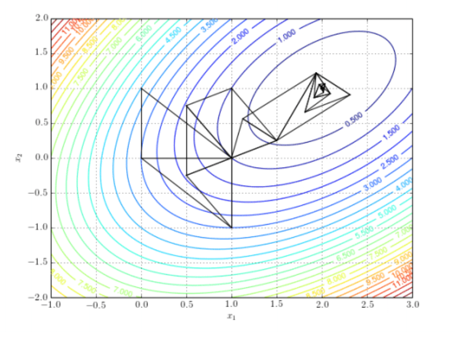
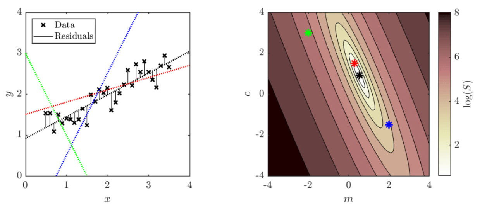
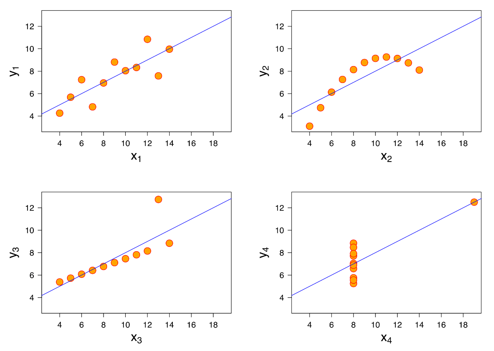
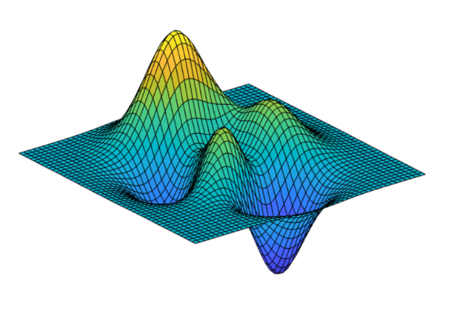

<link rel="stylesheet" type="text/css" media="all" href="styles.css">

## [Return to Contents](notes-contents)

# Chapter 17 - Optimisation

Optimisation is a vast and varied topic within mathematics; it is also at the very core of engineering. Essentially, it can be thought of as the process of improving the performance of a system relative to a defined objective; or, if possible, finding the best performance. 

Examples include:
- Planning the **shortest** path between points on a map.
- Using the **minimum** volume of material when manufacturing a product.
- **Maximising** the amount of energy produced by a wind farm.
- Finding the **best** parameters for recognising a face using a neural network.
- Writing the **ideal** headline to attract clicks on social media.
- Arranging shell companies to pay the **least** amount of tax.
- Choosing the **optimal** photos for success on a dating app.

Although this is a very diverse list of activities, notice the language "shortest", "minimum", "maximising", "best", "ideal", "least", "optimal"... they're all optimisation problems. For each one, the problem could be approached in a range of ways and a good optimisation strategy is one that finds the best results fastest.

The notion of "constraint" is very important in optimisation. Formula One racing is a great example for this as all the cars are trying to be the *fastest*, but they are constrained by rules about the allowable engine size, wheel diameter, spoiler designs etc.

The concept of a "tolerance" is also critical, where although you would like to be at the "optimum", it may be impossible to land exactly on it, so you have to decide what's *good enough* (think back to the root finding chapter).

Of course, you've interacted with simple optimisation for years already. For example, find the minimum of the simple 1D function $f(x)=ax^2+bx+c$. To solve this, you'd just differentiate the function to $f'(x)=2ax+b$ and set it to zero, yielding $x=-b/2a$. However, this was only possible because the function was so simple... 

In many cases, the function will be multidimensional and highly complicated... maybe it's not something you can differentiate... or maybe you've not even got the function at all, but just a fluid flow simulation to design a plane that takes an hour to run each time you change the design... or a lab experiment to find a drug that takes a week to measure a single result... 

Clearly, each of the problems listed above will require a wide variety of tools and new approaches are being developed all the time.    

##  17.1 Linear Regression

The word "linear" in linear regression is often mistakenly thought of as referring to fitting a straight line. In fact, linear regression describes a class of problems that are linear in the *coefficients*. So, the 1 dimension polynomial function   

$$f(x)=a_0+a_1x+a_2x^2+a_3x^3$$

  
would be considered a linear regression problem, because although the function itself is not linear, the coefficients are linear. Similarly, the multidimensional function  

$$g(x,y,z)=a_0x+a_1y+a_2z$$

  
is also amenable to linear regression methods. And finally, the wild function  

$$h(\textbf{x}) = a_0 x_1 x_3^2+a_1\exp(-x_2^2)-a_2\sqrt{x_1}$$

  
is both non-linear and multi-dimension, but it's still linear from the perspective of the coefficients and could therefore still be fit to some data using linear regression.   

Unlike most of your calculus experience so far (where you differentiated functions with respect to their independent variables), for regression you will instead be differentiating with respect to the coefficients.  

### 17.1.1 Fitting a straight line to some data

Let's start with a classic problem: Imagine you've acquired some data and you wish to find the "line of best fit". More formally, we've made $n$ measurements of $y$ (e.g. extension of a spring), at different values of $x$ (e.g. force applied), and we would like to fit a line of the form $y=mx+c$ that minimises the distance between the data points and the line, but like any real data, there is some noise, so the data has some scatter.   

The standard method for doing this is a least squares minimisation method, and it works as follows. We first define the "residual", $r_i$, for each data point $(x_i,y_i)$;  

$$r_i = y_i - (mx_i+c)$$

  
where $r_i$ is the difference between the measured values of $y_i$ and the value of the line at that point, which is just $(mx_i+c)$. However, crucially, we don't care whether the line is above or below the data, but just how far away it is, and a convenient way to "ignore" the sign is just to square this value. Now we simply say that the best value of $m$ and $c$ will be those for which the **sum of the squares** of the residuals are a minimum; so we find   

$$S=\sum_ir_i^2=\sum_i (y_i - mx_i -c)^2 $$

  
Now that we have expressed our problem mathematically, hopefully you can see that we can simply use partial differentiation to find the derivative of $S$ with respect to each of $m$ and $c$, and then set these derivatives to zero to find our minimum. We will then have 2 equations and 2 unknowns...   

$$\begin{align*} 
\frac{\partial S}{\partial m} = -2 {\textstyle{\sum}} x_i(y_i - mx_i -c) =0
\\
\frac{\partial S}{\partial c} = -2 {\textstyle{\sum}} (y_i - mx_i -c) =0 
\end{align*}$$

  
Let's start by finding an expression for $c$. We can rearrange the expression for $\frac{\partial S}{\partial c}$ (think back to our series chapter to understand how) to give   

$$cn+ m{\textstyle{\sum}} x_i= {\textstyle{\sum}} y_i$$

  
and then since the average of all values of $x_i$ is given by $\overline{x} = (\sum x_i) /n$ (and the same holds for $\overline{y}$), we can write  

$$c = \overline{y} - m\overline{x}$$

  
We now need to build an expression for $m$. So, let's start by re-writing the expression for $\frac{\partial S}{\partial m}$ as   
 
$$m{\textstyle{\sum}} x_i^2 + c{\textstyle{\sum}} x_i = {\textstyle{\sum}} x_iy_i$$

  
and then we can substitute the equation we've just derived for $c$ into the equation above, giving  

$$m{\textstyle{\sum}} x_i^2 + (\overline{y}-m\overline{x}){\textstyle{\sum}} x_i = {\textstyle{\sum}} x_iy_i $$

  
Collecting the $m$ terms together and rearranging (remember, $(\sum x_i) /n = \overline{x}$),  
 
$$m ({\textstyle{\sum}} x_i^2 -\overline{x}^2n) = {\textstyle{\sum}}x_iy_i - \overline{x}\, \overline{y} n$$

  
then finally we can write an equation explicit for $m$ and therefore also for $c$   
 
$$\begin{align*} 
m = \frac{\sum x_iy_i -\overline{x}\, \overline{y} n }\sum x_i^2 - \overline{x}^2n}
\end{align*}$$

$$\begin{align*}
\equiv
\frac{\overline{x}\, \overline{y}-\overline{xy}}{\overline{x}^2-\overline{x^2}}
\qquad \Rightarrow \qquad
c=
\overline{y} - \left(\frac{\overline{x}\, \overline{y}-\overline{xy}}{\overline{x}^2-\overline{x^2}}\right)\overline{x}
\end{align*}$$

$$ m = \frac{\textstyle{sum}x_i}{\textstyle{sum}x_i^2}$$

  
And that's that. We now have explicit equations for $m$ and $c$ that allow us to find the line of best fit through an arbitrary dataset. Remember, these equations are really just finding the minima of the two partial derivatives, so this does not necessarily mean that $S$ now equals zero (i.e. the line passes through all the points), but simply that $S$ is the smallest it could be.   

  
Each pair of $m$ and $c$ values corresponds to a value of the sum of squared residuals, $S$. We can plot a 2D map in ($m$, $c$)-space showing how $S$ varies, where each point on this map corresponds to a different straight line on the data graph (matching colours), as illustrated in the figures above.  

The fact that linear regression has an explicit formulation means that it has much more in common with the simple graph sketching activities.   

It's worth highlighting, before we finish this section, that just because you've minimised $S$, this does not mean that you have a "good fit". This is illustrated excellently by the above four plots, known as Anscombe's quartet. Four different data sets are shown which each have the same line of best fit AND the same value of $S$ (and the same mean and standard deviation!).   

##  17.2 Non-linear Regression

A classic example of a non-linear regression problem is fitting a normal distribution curve to some data. Our function is  

$$f(x)=\frac{1}{\sigma\sqrt{2\pi}}e^{-\frac{(x-\mu)^2}{2\sigma^2}}$$

  
where the mean, $\mu$, standard deviation, $\sigma$, are the two parameters that we will be adjusting in order to achieve a good fit.   

So, once again, we will start by writing an expression for the residuals  

$$r_i = y_i - f(x_i) = y_i-\left(\frac{1}{\sigma\sqrt{2\pi}}e^{-\frac{(x_i-\mu)^2}{2\sigma^2}}\right)$$

  
then our summed square error, $S$ becomes  

$$ S=\sum(y_i - f(x_i))^2 = \sum\left(y_i-\left(\frac{1}{\sigma\sqrt{2\pi}}e^{-\frac{(x_i-\mu)^2}{2\sigma^2}}\right)\right)^2 $$

  
and our two monstrous derivatives are therefore  
$$\begin{equation*}
\frac{\partial S}{\partial \mu}=
-\sum\left(\frac{(x_i-\mu)}{\sigma^3}\right)
\left(\sqrt{\frac{2}{\pi}}e^{-\frac{(x_i-\mu)^2}{2\sigma^2}}\right)
\left(y_i-\left(\frac{1}{\sigma\sqrt{2\pi}}e^{-\frac{(x_i-\mu)^2}{2\sigma^2}}\right)\right)=0
\end{equation*}$$

 
$$\begin{equation*}
\frac{\partial S}{\partial \sigma}=
-\sum\left(\frac{(x_i-\mu)^2-\sigma^2}{\sigma^4}\right)
\left(\sqrt{\frac{2}{\pi}}e^{-\frac{(x_i-\mu)^2}{2\sigma^2}}\right)
\left(y_i-\left(\frac{1}{\sigma\sqrt{2\pi}}e^{-\frac{(x_i-\mu)^2}{2\sigma^2}}\right)\right)=0
\end{equation*}$$

  
Hopefully, you've guessed that it will not be possible to rearrange the above two equations and make them explicit for $\mu$ and $\sigma$ (as we did in the linear case). So what do we do?   

Since we're lucky enough to even have our two derivative expressions that we really can evaluate, let's put them to use! Thinking back to our chapter on multivariate calculus, we can combine these two partial derivatives into a Jacobian vector   

$$\text{J}_S=\left[\frac{\partial S}{\partial \mu},\frac{\partial S}{\partial \sigma}\right]$$ 

  
If we pick some arbitrary values of $\mu$ and $\sigma$, we can evaluate the Jacobian vector at this point. We can then think of J$_S$ as a vector in $(\mu,\sigma)$-space pointing in the direction in which $S$ increases the most... So if we'd like to *minimise* $S$ then our next guess for $\mu$ and $\sigma$ should be in the opposite direction i.e. $-\text{J}_S$.   

The left hand figure below shows some data points, as well as four normal distribution curves. The right hand figure shows a contour plot of $S$, parametrised by $\mu$ and $\sigma$, where the four points correspond by colour to the four adjacent curves. In addition, attached to each point is an arrow pointing in the direction $-\text{J}_S$, where the length of the arrow shows the magnitude of the vector.    

  
Essentially, we have just performed the first step of an iterative method: Starting from some arbitrary initial point, evaluate the Jacobian, move in the opposite direction to it to a new point and then evaluate the Jacobian again, and then repeat until some convergence criteria are met. It important to notice that the negative Jacobians shown in the contour plot do not point directly at the minimum (otherwise finding the solution would be easy!), but instead point in the steepest direction "downhill" locally. Also consider that although the black point doesn't appear to have a Jacobian arrow, this is simply because the local value of the partial derivative are tiny as it is close to the minimum.   

The difficulty comes in deciding *how far* to move in each step and when to stop. If you take big steps, you will move quickly down hill, but you might jump over minima and never ``converge'' to an acceptable solution; equally, if you take small steps, the system will converge very slowly as you make so little progress each time and it still might be a local minimum. To work out when to stop, you will need to choose some criteria, for example, picking a threshold value of $S$ or the partial derivatives that you feel is acceptable, and then checking regularly while iterating. Also, picking a good starting point can be very important, as, in the case of the normal distribution.  

Imagine if our initial guess was $\mu=-100$ and $\sigma=0.1$. This would mean that the region overlapping with the data is essentially a flat line at $f(x)\approx 0$, so the local gradients would be small as increasing or decreasing $\mu$ would only result is small changes in $S$. There are essentially two ways of dealing with this: The first is that you have *some* idea what your data's like and pick sensible values (i.e. correct order of magnitude at least!); the second approach is to run the fitting algorithm many times, start from a wide range of initial guesses.   

Finally, it's worth reminding you that although I show you the nice contour plot, to generate this image required me to calculate to value of $S$ at each point. This is simple for "toy" problems like the two we've seen so far, but in general will not be possible for the kinds of optimisation problem engineers are typically faced with. Furthermore, you also might not have nice explicit expressions for the derivative and might therefore choose to use... a finite difference method to approximate them (and sometimes it is necessary to avoid gradients all together)!  

##  17.3 Conclusion

We started this chapter off by saying that optimisation is a big topic, but even just from the two examples above you are already confronted with many of the key challenges. In both cases, I chose fitting functions with just two parameters so that I could show you nice 2D contour plots, but if there were three parameters it would already be difficult to plot and many real problems, for example training a neural networks, might require optimising thousands of parameters! So, once you've built your intuition on simple problems, and learnt strategies to deal with noisy data, local optima or complicated constraints you just have to trust the maths...   

If you'd like to know more about this topic, head to our [Mathematics for Machine Learning](https://www.coursera.org/specializations/mathematics-machine-learning) online specialisation on Coursera, which is free to Imperial students! :))

    

