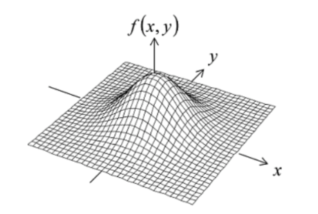
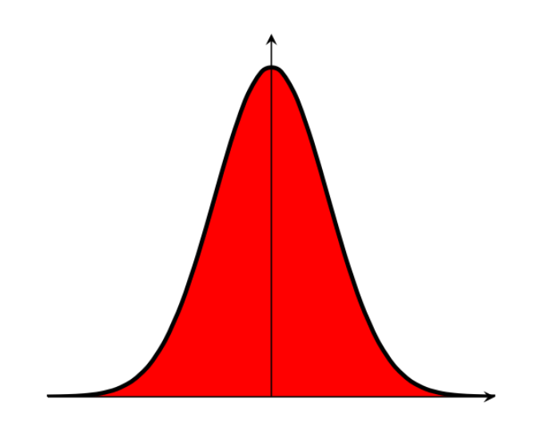
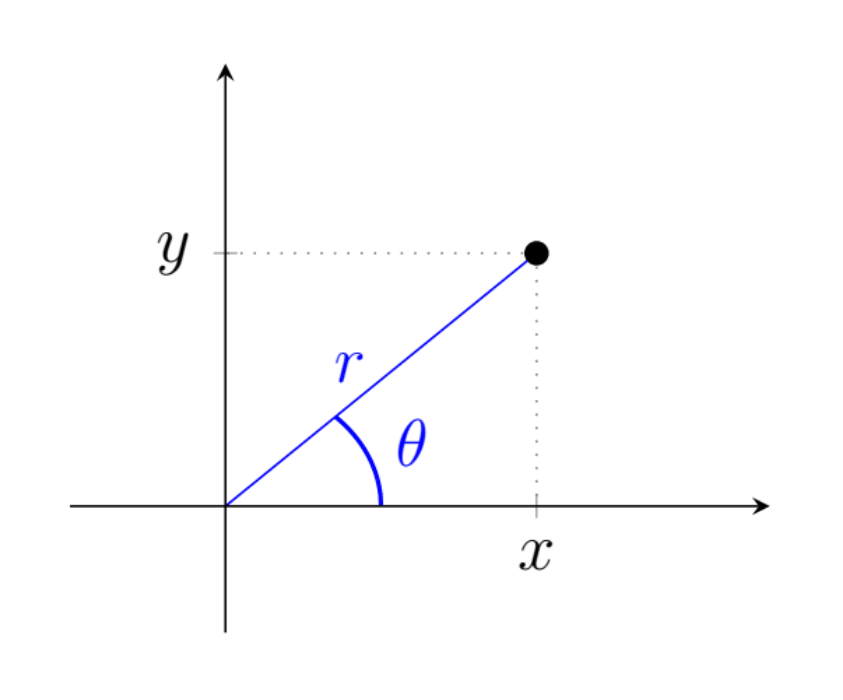
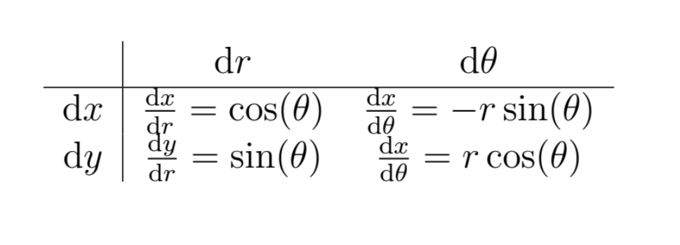
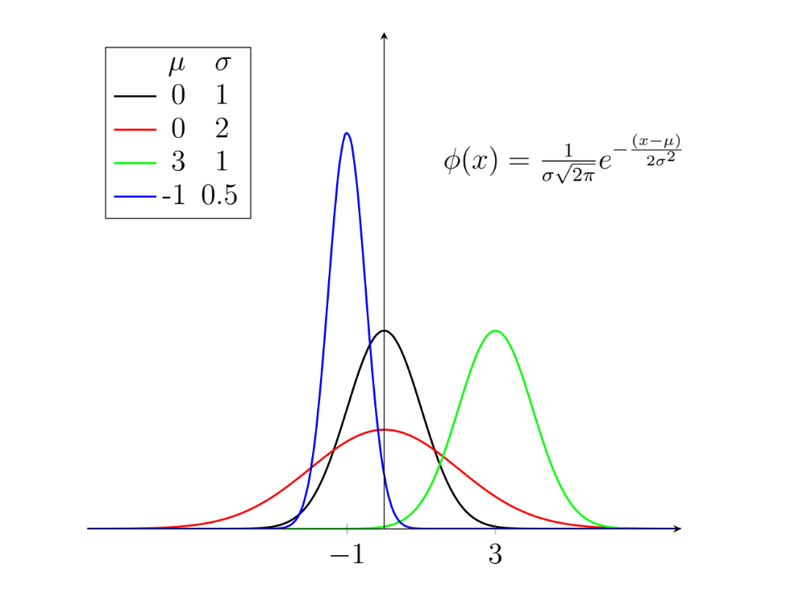
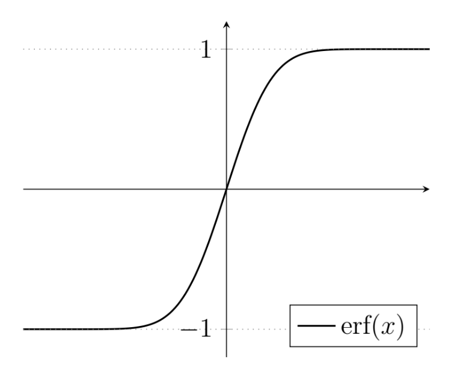
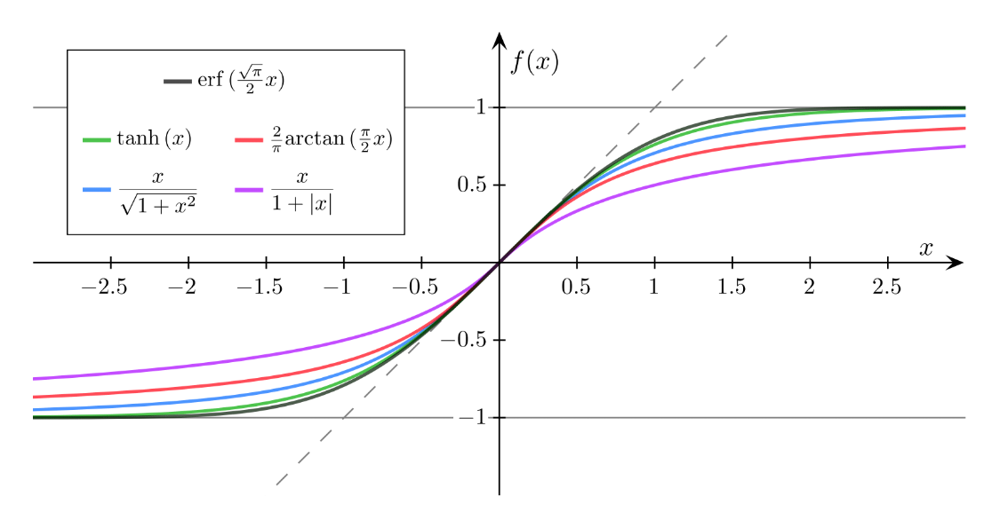
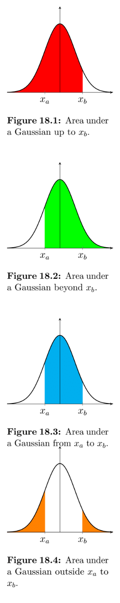
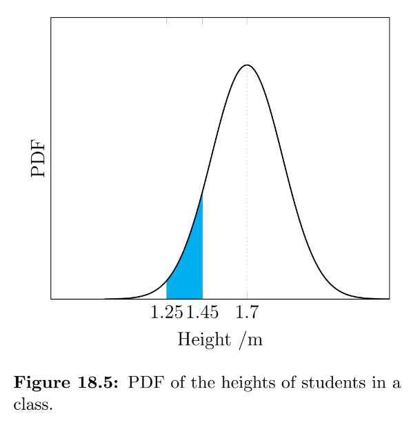

<link rel="stylesheet" type="text/css" media="all" href="styles.css">

## [Return to Contents](notes-contents)

# Chapter 18 - The Normal Distribution

Gaussians, named after the mathematician Carl Friedrich Gauss, are functions based on the form where $e$ is Euler's number and $a$, $b$ and $c$ are arbitrary positive constants. 

$$\begin{equation*}
f(x)=ae^{-b(x-c)^2}\quad, 
\end{equation*}$$

  

These functions have a characteristic ``bell curve'' shape and are asymptotic to the $x$-axis in both directions; however, crucially they also have a finite area. Finding the area under this curve is trick (just try integrating it from $x=-\infty$ to $x=+\infty$ directly if you're curious...), but we can find the answer by making use of a few clever substitutions (tricks!).   

##  18.1 The Gaussian Integral

The following method (which you do not need to memorise, but should just be aware of) uses the following three tricks to find the integral:   

$$\begin{align*}
\textbf{Squared}\qquad\Rightarrow\qquad
\textbf{Polar}\qquad\Rightarrow\qquad
\textbf{Substitution}
\end{align*}$$

  
The meaning of each of the steps will hopefully become clear as we proceed. If you can remember these three words then you should be able to reproduce this derivation (I won't be asking you to) without too much difficulty!  

We wish to find the area, $A$, under the standard Gaussian (i.e. where $a$ and $b$ are 1 and $c$ is 0).   

$$\begin{equation*}
A=\int^\infty_{-\infty}e^{-x^2}\,dx
\end{equation*}$$

  
We can write an identical expression in terms of $y$ that will have exactly the same answer (why is this useful? keep reading to find out!  

$$\begin{equation*}
A=\int^\infty_{-\infty}e^{-y^2}\,dy
\end{equation*}$$

  
By multiplying these two functions together, we can form an expression for the area **squared**, $A^2$. As the two variables, $x$ and $y$, are independent, the order of integration does not matter. Furthermore, we can rearrange the expression into a single exponent as shown.   

$$\begin{align*}
A^2
&=\int^{x=\infty}_{-\infty}\int^{y=\infty}_{-\infty}e^{-y^2}e^{-x^2}\,dy\,dx\\
&=\int^{x=\infty}_{-\infty}\int^{y=\infty}_{-\infty}e^{-(x^2+y^2)}\,dy\,dx
\end{align*}$$

  

  

The variables $x$ and $y$ are usually, as in this case, used to describe a Cartesian coordinate system. The next step is to transform the system from Cartesian into **polar** coordinates, as illustrated in the adjacent figure.  

$$\begin{align*}
x&=r\cos(\theta)\\
y&=r\sin(\theta)
\end{align*}$$

  
To convert between coordinate systems, we calculate the determinant of something called the ``Jacobian'' matrix, which we'll be covering in more detail later in the course. This is because integration in $(x,y)$-space does not map directly on to $(r,\theta)$-space (i.e. d$x$d$y\neq$ d$r$d$\theta$).  

The Jacobian matrix is constructed by finding each of the four possible partial derivative combinations, as in the following table.  

  
Once we have found the determinant of this matrix, we can then complete the conversion of our equation.  

$$\begin{align*}
|J|&=
\begin{vmatrix}
\cos(\theta) & -r\sin(\theta) \\
\sin(\theta) & r\cos(\theta) 
\end{vmatrix}=r\cos^2(\theta)+r\sin^2(\theta)=r(\cos^2(\theta)+\sin^2(\theta))=r
\end{align*}$$

  
Therefore,  

$$\begin{equation*}
\text{d}x\text{d}y=r\,\text{d}r\,\text{d}\theta
\end{equation*}$$

  
We can now transform our equation for $A^2$, which we'll do in three steps. First by using our Jacobian,  

$$\begin{equation*}
A^2=\int^{x=\infty}_{-\infty}\int^{y=\infty}_{-\infty}e^{-(x^2+y^2)}r\,\text{d}r\,\text{d}\theta\quad.
\end{equation*}$$

  
Next we must transform our limits. To do this, think of $x-y$ space as a two dimensional plane. We have been asked to integrate between $-\infty$ and $+\infty$ in both directions, which can be thought of as "the entire plane". To cover the entire plane using polar coordinates, we simply need $r=0$ to $r=+\infty$ and $\theta=0$ to $\theta=2\pi$.  

$$\begin{equation*}
A^2=\int^{r=\infty}_{0}\int^{\theta=2\pi}_{0}e^{-(x^2+y^2)}r\,\text{d}r\,\text{d}\theta
\end{equation*}$$

  
Finally, we also know from Pythagoras that $x^2+y^2=r^2$, which leads to  

$$\begin{equation*}
A^2=\int^{r=\infty}_{0}\int^{\theta=2\pi}_{0}e^{-r^2}r\,\text{d}r\,\text{d}\theta
\end{equation*}$$

  
In this form, we notice that the integrand (i.e. the function to be integrated) does not contain $\theta$, so we can already evaluate the $\theta$ integral, yielding  

$$\begin{equation*}
A^2=2\pi\int^{r=\infty}_{0}e^{-r^2}r\,\text{d}r
\end{equation*}$$

  
The last stage is to make the **substitution** $s=-r^2$, which differentiates to   

$$\begin{equation*}
\text{d}s=-2r\,\text{d}r
\end{equation*}$$

  
Take care to substitute the limits correctly!  

$$\begin{align*}
A^2=-\pi\int^{s=-\infty}_{0}e^{s}\,\text{d}s=-\pi\left[e^{-\infty}-e^0\right]=-\pi\left[0-1\right]=\pi
\end{align*}$$

  
Having completed this integration, we simply take the square root of our answer to find the area, $A$, under our standard Gaussian... easy as $A=\sqrt{\pi}$.  

##  18.2 The Normal Distribution

The Gaussian is also the correct shape for modelling random variables, a reasonable example of which might be the height of students in your class. The curve itself is the probability density function (PDF), so the value of the curve at a point is the *probability density* NOT the probability! It is only by finding the area under the curve between two $x$ values that allows us to calculate a probability. For example, when we ask "how many people are 1.70\,m tall?" we do not mean how many are *exactly* 1.700000...\,m tall, but more likely, how many are between 1.695\,m and 1.705\,m tall.   

We have just found the area under the curve $y=e^{-x^2}$ to be $\sqrt{\pi}$, which roughly equals 1.772, but the total area under any probability curve should be 1. To understand why, consider that finding the total area under a PDF of "student height" is like asking "What is the probability that a random student in your class is *any* height?"... you can be 100\% sure that they they have *a* height, so the area must be 1. In order to modify our function such that its total area is 1, we simply divide by its current area.  

$$\begin{equation}
f(x)=\frac{1}{\sqrt{\pi}}e^{-x^2}
\end{equation}$$

The second modification we are going to make is that we would like both the *standard deviation*, $\sigma$, and therefore also the *variance*, $\sigma^2$, to be equal to 1. The variance of eq.(1), which is a measure of the broadness of the bell curve, is currently equal to 0.5. Although we won't go through the derivation here, this modification simply requires dividing $x^2$ and the function itself both by a factor of $\sqrt{2}$, which gives what is usually referred to as the *standard normal distribution*.  

$$\begin{equation*}
f(x)=\frac{1}{\sqrt{2\pi}}e^{-\frac{x^2}{2}}
\end{equation*}$$

We can then generalise this probability density function to its final form, which is called the *general normal distribution*, $\phi$. This allows us to modify the *mean*, $\mu$, and the standard deviation, whilst ensuring that the the total area underneath is always equal to 1, as illustrated in the figure below.   

$$\begin{equation*}
\phi(x)=\frac{1}{\sigma\sqrt{2\pi}}e^{-\frac{(x-\mu)^2}{2\sigma^2}}
\end{equation*}$$

  
The normal distribution is not "normal" in the sense that it is "usual" or "average", which can lead to to some confusion. One way to keep this in mind is to remember that we have just "normalised" our function by modifying the exponent and dividing it by $\sqrt{2\pi}$ (although this is not the real reason Gauss chose the name).  

  
There any many alternative distributions that we can use to model data, but you will encounter the normal distribution frequently and need to know how to manipulate it.  

Going back to our example of modelling the heights of students in a class, we now would like to be able to use the function to make predictions. Once we've got our "fitted" curve (which we call a "model"), we can use it to evaluate the probability of a randomly selected student being between two heights (e.g. "what is the chance a student is between 1.5m and 1.6m tall?").  

To evaluate this probability, $P$, we need to be able find the area under our function between two $x$ values, $x_a$ and $x_b$.  

$$\begin{equation*}
P(x_a<X<x_b)=\int^{x_b}_{x_a}\frac{1}{\sigma\sqrt{2\pi}}e^{-\frac{(x-\mu)^2}{2\sigma^2}}\,dx
\end{equation*}$$

  
Although we were able to integrate the function between infinite limits, the tricks we used do not work on finite limits (try it!). You may have been taught in school to use something called a "Z-table" which contains many values of this integral so that you can look up the one you need; however, in your careers it is very unlikely that you will use this outdated approach. The next section explains how we can evaluate this integral in a way you can implement in code.  

### 18.2.1 The Error Function 

 

The Gauss error function, written $\text{erf}(x)$, is a special function for evaluating the integrals of Gaussian functions. The function $e^{-x^2}$ is *even* (i.e. symmetrical about the $y$-axis), so the two definitions given below are equivalent, as you could either find the area under the region from $-x$ to $x$ or just find it from 0 to $x$ and double it.   

$$\begin{align*}
\text{erf}(x)
&=\frac{1}{\sqrt{\pi}}\int^{x}_{-x}e^{-t^2}\,\text{d}t
\\
&=\frac{2}{\sqrt{\pi}}\int^{x}_{0}e^{-t^2}\, \text{d}t
\end{align*}$$

  
Also, notice that the variable $t$ is what we call a "dummy" variable, as it does not appear outside the expression and is only there to allow us to manipulate $x$ in a certain way.  

We still do not know how to evaluate $\text{erf}(x)$ directly. In fact, ask yourself this: when you ask you calculator to evaluate $\sin(7)$, how does it actually do this? The reality is, there is no explicit, simple formula to exactly evaluate these functions, so various clever approximations have been developed, using approaches like the Taylor series, which we shall see later in the course. Fortunately for you, most calculators have a $\sin(x)$ evaluation button... unfortunately for you, most calculators do not have an $\text{erf}(x)$ button. For the rest of your career, you'll have access to a computer with the internet that can help you evaluate $\text{erf}$; however, the fact that you will only have a calculator in the exam give us an opportunity to practice another engineering skill: approximations.  

In the following figure you can see a selection of "sigmoid" (i.e. "S" shaped) functions, that resemble the error function, in that they are rotationally symmetrical around the origin and have a range from -1 to 1 (N.B. Sigmoid functions are often used in neural networks as "activation" functions). The hyperbolic tangent function ("$\tanh$") is not only a close approximation, but can also be evaluated on your calculator. We will often use the approximation $\text{erf}(x)\approx\tanh(1.2 x)$.  

  

  

Now that we can evaluate $\text{erf}(x)$ we can use it in the following expression (called a *cumulative distribution function* or CDF) to calculate probabilities from the general normal distribution function. To find the probability being below a certain $x$ value, we use the following expression (illustrated in fig. 18.1).  

$$\begin{equation*}
P(X<x_b)=\frac{1}{2}\left[1+\text{erf}\left(\frac{x_b-\mu}{\sigma\sqrt{2}}\right)\right]
\end{equation*}$$

  

Similarly, to find the probability of something above a certain $x$ value, we can then simply find one minus the CFD up to that point.   

$$\begin{align*}
P(X>x_a)
&=1-P(X<x_a)\\
&=1-\frac{1}{2}\left[1+\text{erf}\left(\frac{x_a-\mu}{\sigma\sqrt{2}}\right)\right]\\
&=\frac{1}{2}\left[1-\text{erf}\left(\frac{x_a-\mu}{\sigma\sqrt{2}}\right)\right]
\end{align*}$$

  
To find the probability of something being between two specified bounds, we can then simply find the difference between two of these CDFs, as shown in fig. 18.3.  

$$\begin{align*}
P(x_a<X<x_b)
&=P(X<x_b)-P(X<x_a)\\
&=\frac{1}{2}\left[\text{erf}\left(\frac{x_b-\mu}{\sigma\sqrt{2}}\right) - \text{erf}\left(\frac{x_a-\mu}{\sigma\sqrt{2}}\right)\right]
\end{align*}$$

  
The last case is when we want to find the probability of being outside a certain range, where we simply evaluate one minus the CDF of the range.  

$$\begin{align*}
P(X<x_a)+P(X>x_b)
&=1-P(x_a<X<x_a)\\
&=1-\frac{1}{2}\left[\text{erf}\left(\frac{x_b-\mu}{\sigma\sqrt{2}}\right) - \text{erf}\left(\frac{x_a-\mu}{\sigma\sqrt{2}}\right)\right]
\end{align*}$$

  
  
  
**Example** - In a class of 100 students, if the average height is 1.70\,m and the standard deviation is 20fcm, how many students would you expect to be between 1.25m and 1.45m tall?   

$$\begin{align*}
P(1.25<X<1.45)
&=P(X<1.45)-P(X<1.25)\\
&=\frac{1}{2}\left[\text{erf}\left(\frac{1.45-1.7}{0.2\sqrt{2}}\right) - \text{erf}\left(\frac{1.25-1.7}{0.2\sqrt{2}}\right)\right]\\
&=\frac{1}{2}\left[(-0.7887...)-(-0.9756...)\right]\\
&=0.093...
\end{align*}$$

  

As the probability of any given student falling within the range is roughly 0.093, we would expect for there to be approximately 9 students between 1.25\,m and 1.45\,m in a class of 100.  

The values of the error function were found using www.wolframalpha.com, which is a free online knowledge engine, although any other platform, such as MATLAB&reg;, would also have a suitable function.

    

