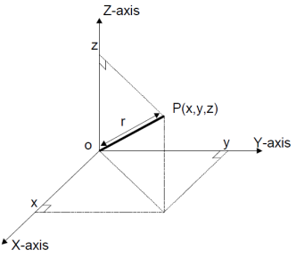
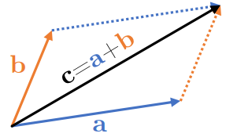
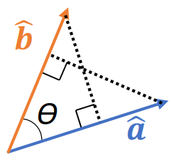
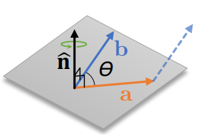
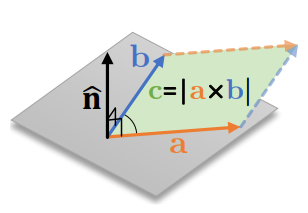

<link rel="stylesheet" type="text/css" media="all" href="styles.css">

## [Return to Contents](notes-contents)

# Chapter 2 - Vectors
When you first start learning maths at school, you immediately encounter 'scalars', which can be formally described as a number with a 'magnitude, but no direction'... or less formally as *just a number*. However, as the formal definition suggests, we have ways of expressing multiple associated concepts in a single object and the most simple of these is the vector. Perhaps the most common example of the difference between a vector and a scalar is that between speed and velocity. If we say that a car is travelling at 20 km h $^{-1}$ , this is a scalar, but if we say it is going 20 km h $^{-1}$ due North West, we have a vector. Vectors can also be thought of as a list, in which the order of the contents matters. 
  
In this section of the course we will introduce some formal mathematical notation and rules for the manipulation (addition, multiplication, *etc.*) of these vector quantities. It is often very useful to represent vectors and their associated processes as lines on a 2D plane, to reinforce the underlying theory with a physical intuition. However, when the problem is in 3 (or more) dimensions, illustrating these concepts can become very difficult and you will have to rely on the rules you learned in 2D. Several different notational styles can be used with vectors, beyond the explicit coordinate representation $(v_1,v_2,v_3)$, such as:
  
$$\begin{align*}
\textrm{Underlined}:&\ \ \underline{v}\quad &
\textrm{Bold lower case}:&\ \ \textbf{v}\quad &
\textrm{Column}:&\ \ \begin{bmatrix}
v_1 \\
v_2 \\
v_3
\end{bmatrix} \quad \\
\textrm{Arrow over points}:&\ \ \overrightarrow{AB} &
\textrm{Vector arrow}:& \ \ \vec{v}\quad &
\textrm{Unit vectors}:&\ \ v_1\hat{i}+v_2\hat{j}+v_3\hat{k}\\
\end{align*}$$

  

## 2.1 Co-ordinate Geometry

The theory of co-ordinate geometry is very closely associated with vectors, so let's start by discussing the adjacent 3D illustration in $x, y, z$-space. Here you can see a vector from the origin to point $P(x,y,z)$. You can calculate the length (or *magnitude*) of the line $\overrightarrow{OP}$ using Pythagoras theorem. 

$$|\overrightarrow{OP}|=r=\sqrt{x^2+y^2+z^2}$$

   
You can also use trigonometry to work out all it associated angles.

$$\begin{align*}
	\angle POx & = \arccos(x/r)\\
	\angle POy & = \arccos(y/r)\\
	\angle POz & = \arccos(z/r)
\end{align*}$$

Importantly, if two vectors have the same length and the same direction, they are identical.

### 2.1.1 Unit Vectors

A vector whose length/magnitude/modulus is 1, (ie $|\underline{v}|=1$) is called a ``unit vector'' and is often written with a little hat, $\hat{v}$.
  
It is sometimes convenient to describe vectors in terms of these unit vectors and corresponding coefficients. The unit vectors oriented along the three orthogonal Cartesian axis are:

$$\begin{align*}
	\hat{i}=(1,0,0)\quad\hat{j}=(0,1,0)\quad\hat{k}=(0,0,1)
\end{align*}$$

You can also find the unit vector of any arbitrary vector by dividing it by its own magnitude (eg $\hat{\textbf{a}}=\frac{\textbf{a}}{|\textbf{a}|}$).
  
This concept makes vector *addition* straightforward, as we simply add each direction separately. For example, if we wanted to find the 'resultant force', $\textbf{c}$, when the two forces $\textbf{a}=3\hat{i}+2\hat{j}-1\hat{k}$ and $\textbf{b}=-1\hat{i}-2\hat{j}+4\hat{k}$ are both applied to the same point, we just add each component to get $\textbf{c}=2\hat{i}+3\hat{k}$.
  
Another classic real world example is to imagine a boat trying to cross a river from West to East. Its motor allows it to travel at a speed of $|\textbf{b}|=4$ms $^{-1}$ *relative to the water* and the river is flowing from North to South at $|\textbf{r}|=3$ms $^{-1}$ *relative to the land* . By first converting these two pieces of information into vectors, we can then add them together and find the velocity of the boat relative to the bank. By taking East to be in the direction of $\hat{i}$ and North to be in the direction of $\hat{j}$, we can rewrite the problem as $\textbf{b}=4\hat{i}$ and $\textbf{r}=-3\hat{j}$. So, the velocity of our boat, *v*,  must be $\textbf{v}=\textbf{b}+\textbf{r}=4\hat{i}-3\hat{j}$, which can also be described as a speed of 5\ m\ s $^{-1}$ at a bearing of 127$^\circ$, relative to the land.
  

### 2.1.2 Basis Vectors
This is a big topic in its own right, but it's worth just mentioning it as a follow on from the previous section. As we saw above, you can think of the vector $(a, b)$ in terms of the scalar $a$ multiplied by the unit vector $\hat{i}$ and the scalar $b$ multiplied by the unit vector $\hat{j}$. What's interesting to consider is that we tend to implicitly assume the use of $\hat{j}$ and $\hat{j}$ as our basis vectors in 2D, but we don't have to. We could, for example, choose the vectors $\vec{v}=\hat{i}+3\hat{j}$ and $\vec{w}=2\hat{i}-\hat{j}$ as our basis and still be able to reach every point on the 2D plane using linear combinations of these two vectors. For example, in our $\vec{v}$, $\vec{w}$ basis, the vector $(3,-1)$ is equivalent to $3\vec{v}-\vec{w}=\hat{i}+10\hat{j}$.
  
However, if we mistakenly choose a pair of basis vectors that were parallel, we would no longer be able to access the whole 2D plane, but just a line instead (no better than just using a single vector). The region accessible by the linear combination of vectors is called the 'span'.  If two vectors are parallel, it means they are pointing in the same direction, but their lengths can be different. This means you can write the expression $\underline{a}=\lambda\underline{b}$ and find a value for lambda. If $\lambda>0$ they are parallel, however if $\lambda<0$, they are 'anti-parallel', which means they are pointing in exactly opposite directions. 

## 2.2 Vector Multiplication
There are three methods of vector multiplication that we will cover in this course, which we will consider by applying them to the vectors $\textbf{a}=(1, 2, 3)$ and $\textbf{b}=(4, 5, 6)$. They are stated concisely below (without engineering context), just to have them all in one place.

  

$\textbf{a}\circ\textbf{b}\quad$ - **Entrywise product** or **Hadamard product** - This is where you multiply each pair of terms in the two vectors to yield a new vector: $\textbf{a}\circ\textbf{b}=(a_1b_1, a_2b_2, a_3b_3)=(4, 10, 18)$ (NB. Can only be performed on vectors of the same size and returns a vector of the same size).

 

$\textbf{a}\bullet\textbf{b}\quad$ - **Dot product** or **Scalar product** or **Inner product** - This is where you first perform the entrywise product and then add all the terms in the resulting vector together: $\textbf{a}\bullet\textbf{b}=a_1b_1+a_2b_2+a_3b_3=4+10+18=32$ (NB. Returns a scalar).

 

$\textbf{a}\times\textbf{b}\quad$ - **Cross product** or **Vector product** - This is where you find the difference of the products of the cross matched terms either side of the current index (explained again below!): $\textbf{a}\times\textbf{b}=(a_2b_3-a_3b_2, a_3b_1-a_1b_3, a_1b_2-a_2b_1)=(12-15, 12-6, 5-8)=(-3, 6, -3)$. (NB. Returns same size vector and only possible with 3D vectors (or 7D, but we won't be using these!)).

 

You can now blindly apply these three definitions without much difficulty, but if we take a closer look at the dot product and cross product, we can start to understand what they mean. 

  

### 2.2.1 Dot Product

The dot product can be thought of as a kind of directional multiplication, where for a pair of vectors, the products of their components in each dimension are found and then added together. Perhaps the most intuitive way to understand the dot product is through the concept of *projection* , where we relate any two vectors by the shadow they cast on each other if a light was shone orthogonally to the vector being shadowed (NB. $\textbf{a} \bullet \textbf{b}= \textbf{b} \bullet \textbf{a}$).

Thinking about this in terms of trigonometry, as each shadow's path is perpendicular to a vector, they must form a right angled triangle.This means we can now write down the standard definition of the dot product in terms of the angle, $\theta$ between the two vectors; however, I think the interpretation of this concept becomes clearer when it is rearranged slightly

$$\begin{align*}
	\textbf{a}\bullet\textbf{b}=|\textbf{a}||\textbf{b}|\cos(\theta) \qquad\qquad\Rightarrow{\text{rearrange}}\qquad\qquad
	\frac{\textbf{a}}{|\textbf{a}|}\bullet\frac{\textbf{b}}{|\textbf{b}|}=\hat{\textbf{a}}\bullet\hat{\textbf{b}}=\cos(\theta)
\end{align*}$$

such that, after cancelling out the magnitude of the two vectors, you are just comparing the two corresponding unit vectors, giving you the angle between them. One of the most useful features of the dot product is as a convenient test for orthogonality (and therefore linear independence), which can simply be represented as when $\theta=90^\circ$. It follows that because $\cos(90)=0$, then $\hat{\textbf{a}}\bullet\hat{\textbf{b}}$ must also equal zero if $\hat{\textbf{a}}$ and $\hat{\textbf{b}}$ are at right angles to each other.
  

### 2.2.2 Cross Product

There are two key applications of the cross product that you are likely to encounter as an engineer. Firstly, as a method for calculating rotational effects (such as moments) and secondly for calculating parallelogram areas. NB, unlike the dot product, the result of a cross product is a vector.

When dealing with moments, imagine a lever, \textbf{a}, connected to the origin, being acted on at its tip by a force vector, **b**. When you look at the diagram, this can seem a bit confusing because both vectors are coming out of the origin, as this is how they will be typically represented; however, the diagram also shows you a dashed line of what this physical interpretation is implying. So, because **a** and **b** are clearly not orthogonal (ie $\theta\neq90^\circ$), only some of the force will be converted into a rotational moment. This moment is represented as a vector normal to the plane described by **a** and **b**, with the direction implying the direction of rotation according to the right hand rule. There are two things to notice here, firstly that the order now matters (ie $\textbf{a}\times\textbf{b}=-\textbf{b}\times\textbf{a}$) and secondly if $\theta=0$, then the cross product is zero, which makes sense as there will be no rotational moment. (NB. $\hat{\textbf{i}}\times\hat{\textbf{j}}=\hat{\textbf{k}}$).
  

For area calculation, you simply imagine a parallelogram contained by two pairs of the two vectors, all connected up! NB, to help visualise, we show the arrows connected as if adding, but they may have different units, so the sum is *meaningless*.

Once again, a more general interpretation of the concept is shown through the same simple rearrangement we used for the dot product. The cross product of two unit vectors gives you a new vector in the direction normal to their plane with a length equal to the sine of their angle.

$$\begin{align*}
\textbf{a}\times\textbf{b}=|\textbf{a}||\textbf{b}|\sin(\theta)\hat{\textbf{n}} \qquad\Rightarrow{\text{rearrange}}\qquad
\frac{\textbf{a}}{|\textbf{a}|}\times\frac{\textbf{b}}{|\textbf{b}|}=\hat{\textbf{a}}\times\hat{\textbf{b}}=\sin(\theta)\hat{\textbf{n}}
\end{align*}$$
  

### 2.2.3 Triple Scalar Product

## 2.3 Vector Equation of a Line
### 2.3.1 Equations of planes

