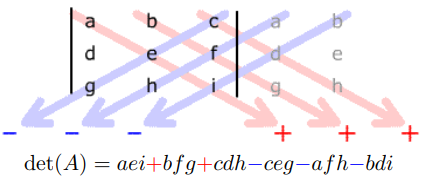

<link rel="stylesheet" type="text/css" media="all" href="styles.css">

## [Return to Contents](notes-contents)

# Chapter 3 - Matrices
### What is a Matrix?

$$\begin{pmatrix}
1 & 3 & 0 \newline
-2 & 8 & 2 \newline
4 & 0 & -1 \newline
\frac{1}{2} & 0 & 117
\end{pmatrix}$$

 

A *matrix* is a rectangular array of *elements*. These elements could be anything, but they are usually numbers when we discuss them as engineers. The core idea of matrices is *ordering*, by which we mean that the *location* of each element in our matrix tells us something about it. Compare a shopping list, which is an unordered vector where the location of each item on it doesn't really matter; to a digital image, which is a matrix of numbers representing colours, where clearly the location matters a lot!

The above matrix is a 4$\times$3 matrix, ie it has four rows and three columns, so 12 elements in total.

We use matrices in mathematics and engineering because often we need to deal with several variables at once - eg coordinate vectors, as we saw in the previous chapter are a type of matrix which only has either a single column or a single row. In the following chapter on 'linear transformations' we'll see a particular interpretation of the structure of a matrix relating to operations that transform vectors, but in this chapter we're simply going to lay out the language and start building up a toolbox. 

It turns out that many operations that are needed to be performed on coordinates of points are **linear operations** and so can be organised in terms of rectangular arrays of numbers (matrices). Then we find that matrices themselves can, under certain conditions, be added, subtracted and multiplied so that there arises a whole new set of algebraic rules for their manipulation
  
In general, a matrix '$\textit{A}$' with dimensions of ($n \times m$) looks like:
  

$$A =
\begin{pmatrix}
	a_{11} & a_{12} & a_{13} & \dots & a_{1,m-1} & a_{1,m} \\
	a_{21} & a_{22} & a_{23} & \dots & a_{2,m-1} & a_{2,m} \\
	a_{31} & a_{32} & a_{33} & \dots & a_{3,m-1} & a_{3,m} \\
	\vdots & \vdots & \vdots & \ddots & \vdots & \vdots \\
	a_{n-1,1} & a_{n-1,2} & a_{n-1,3} & \dots & a_{n-1,m-1} & a_{n-1,m} \\
	a_{n,1} & a_{n,2} & a_{n,3} & \dots & a_{n,m-1} & a_{n,m}
\end{pmatrix}$$

  
It is convention to denote entries within a matrix $a_{ij}$, where $\textit{i}$ denotes the row and $\textit{j}$ denotes the column, also a capital letter is typically used to define the matrix itself.
  
The following sections describe methods for calculating various matrix operations; **however**, since the advent of modern computing, **no one does this by hand any more** ... So you might wonder why we're going over it! The answer is partly so that you know what's going on in the machine and partly to make you appreciate how incredible computing power is!  

## 3.1 Matrix Operations
### 3.1.1 Addition
It is possible to add two matrices together, but *only if they have the same dimensions*. We simply add the corresponding entries to form a new matrix of the same size:  

$$\begin{pmatrix}
	1 & 3 & 0 \\
	-2 & 8 & 2 \\
	4 & 0 & -1 \\
	\frac{1}{2} & 0 & 117
\end{pmatrix}
+
\begin{pmatrix}
	4 & 0 & 1 \\
	0 & -8 & -3 \\
	5 & 1 & -2 \\
	\frac{1}{2} & 1 & -50
\end{pmatrix}
=
\begin{pmatrix}
	5 & 3 & 1 \\
	-2 & 0 & -1 \\
	9 & 1 & -3 \\
	1 & 1 & 67
\end{pmatrix}$$

  
If two matrices do not have the same dimensions they cannot be added, or we say the sum is 'not defined'.  

### 3.1.2 Multiplication or "Rows times cols"
When multiplying matrices, keep the following in mind: if the number of columns of the first matrix equals the number of rows of the second, then you can proceed. The process for multiplying is as follows: to find entry ($n$, $m$) of the resulting matrix, take row $n$ of the first matrix and column $m$ of the second matrix and then find the sum of the product of each pair of entries (\ie the dot product). For example:
  

$$\begin{pmatrix}
	1 & 2 \\
	3 & 4
\end{pmatrix}
\begin{pmatrix}
	5 & 6 & 7 \\
	8 & 9 & 0
\end{pmatrix}
=
\begin{pmatrix}
	(1\times5) + (2\times8) & (1\times6) + (2\times9) & (1\times7) + (2\times0) \\
	(3\times5) + (4\times8) & (3\times6) + (4\times9) & (3\times7) + (4\times0)
\end{pmatrix}$$ 

 

$$=
\begin{pmatrix}
	21 & 24 & 7 \\
	47 & 54 & 21
\end{pmatrix}$$

  
Symbolically, if we have the matrices A and B:
  

$$\begin{equation*}
	A =
	\begin{pmatrix}
	a_{11} & a_{12} & a_{13} & \dots & a_{1,m} \\
	a_{21} & a_{22} & a_{23} & \dots & a_{2,m} \\
	a_{31} & a_{32} & a_{33} & \dots & a_{3,m} \\
	\vdots & \vdots & \vdots & \ddots & \vdots \\
	a_{n-1,1} & a_{n-1,2} & a_{n-1,3} & \dots & a_{n-1,m} \\
	a_{n,1} & a_{n,2} & a_{n,3} & \dots & a_{n,m}
	\end{pmatrix}
	\quad \& \quad
	B =
	\begin{pmatrix}
	b_{1} & b_{2} & b_{3} & \dots & b_{1,q} \\
	b_{21} & b_{22} & b_{23} & \dots & b_{2,q} \\
	b_{31} & b_{32} & b_{33} & \dots & b_{3,q} \\
	\vdots & \vdots & \vdots & \ddots & \vdots \\
	b_{p-1,1} & b_{p-1,2} & b_{p-1,3} & \dots & b_{p-1,q} \\
	b_{p,1} & b_{p,2} & b_{p,3} & \dots & b_{p,q}
	\end{pmatrix}
\end{equation*}$$

  
Then the product $AB$ is given by:
  

$$AB =
\begin{pmatrix}
	\sum_{i=1}^{m}a_{1i}b_{i1} & \sum_{i=1}^{m}a_{1i}b_{i2} & \dots & \sum_{i=1}^{m}a_{1i}b_{iq} \\
	\sum_{i=1}^{m}a_{2i}b_{i1} & \sum_{i=1}^{m}a_{2i}b_{i2} & \dots & \sum_{i=1}^{m}a_{2i}b_{iq} \\
	\vdots & \vdots & \ddots & \vdots \\
	\sum_{i=1}^{m}a_{ni}b_{i1} & \sum_{i=1}^{m}a_{ni}b_{i2} & \dots & \sum_{i=1}^{m}a_{ni}b_{iq}
\end{pmatrix}$$

  
Where $\sum_{i=1}^{m}a_{1i}b_{i1}$ stands for $a_{11}b_{11} + a_{12}b_{21} + a_{13}b_{31} + \dots + a_{1n}b_{n1}$, etc.
Note that we must have $m = p$ such that the number of columns in the first matrix must equal the number of rows in the second; otherwise, we say the product is *undefined*.
  
The quick way to check whether a sequence of operations is allowed for matrices of different sizes is the following. Simply write down their dimensions as ``rows$\times$cols'' and check that, wherever two adjacent matrices are multiplied, the adjacent dimensions are the same. Consider:  

$$A=(2\times\underline{3)(3}\times\underline{5)(5}\times\underline{1)(1}\times7) \qquad \& \qquad B=(2\times\underline{\underline{4)(3}}\times\underline{5)(5}\times\underline{1)(1}\times7)$$

  
The operation for $A$ would work and the dimensions of the resulting matrix are those at the outer most of the operation, \ie $(2\times7)$, whereas the operation for $B$ is undefined.  

### 3.1.3 Scalar Multiplication
Another form of matrix multiplication is called \textit{scalar multiplication}. This involves simply multiplying each entry of the matrix:  

$$3
\begin{pmatrix}
	-1 & 2 & 0 \\
	4 & 1 & -2
\end{pmatrix}
=
\begin{pmatrix}
	-3 & 6 & 0 \\
	12 & 3 & -6
\end{pmatrix}$$

  

## 3.2 Rules of Addition and Multiplication
There are rules which matrix addition and multiplication obeys:  

* Associative Addition $\quad\quad (A+B)+C = A+(B+C)$ 
* Associative Multiplication $\quad\quad (AB)C = A(BC)$ 
* Commutative Addition $\quad\quad A+B=B+A$
* Non-Commutative Multiplication $\quad\quad AB \neq BA$ 
* Distributive $\quad\quad A(B+C)=AB+AC$ 
* Moving Constants $\quad\quad A(\lambda B) = \lambda(AB)$

  

**Example** - Consider the following matrices:  

$$A=
\begin{pmatrix}
	1 & 0 \\
	3 & 2
\end{pmatrix}
, \quad\ B =
\begin{pmatrix}
	-1 & 4 \\
	1 & -2
\end{pmatrix}
, \quad\ C =
\begin{pmatrix}
	2 \\
	3
\end{pmatrix}$$

  

*Non-commutative* behaviour can clearly be shown by comparing AB to BA:  

$$AB =
\begin{pmatrix}
	1 & 0 \\
	3 & 2
\end{pmatrix}
\begin{pmatrix}
	-1 & 4 \\
	1 & -2
\end{pmatrix}
=
\begin{pmatrix}
	(1\times-1) + (0\times1) & (1\times4) + (0\times-2) \\
	(3\times-1) + (2\times1) & (3\times4) + (2\times-2)
\end{pmatrix}
=
\begin{pmatrix}
	-1 & 4 \\
	-1 & 8
\end{pmatrix}$$

  

$$BA =
\begin{pmatrix}
	-1 & 4 \\
	1 & -2
\end{pmatrix}
\begin{pmatrix}
	1 & 0 \\
	3 & 2
\end{pmatrix}
=
\begin{pmatrix}
	(-1\times1) + (4\times3) & (-1\times0) + (0\times-2) \\
	(1\times1) + (-2\times3) & (1\times0) + (-2\times2)
\end{pmatrix}
=
\begin{pmatrix}
	11 & 8 \\
	-5 & -4
\end{pmatrix}$$

  

And *distributive* behaviour (i.e. $A(B+C)=AB=AC$) may be shown with the following:

  

$$\begin{align*}
	AC & =
	\begin{pmatrix}
	1 & 0 \\
	3 & 2
	\end{pmatrix}
	\begin{pmatrix}
	2 \\
	3
	\end{pmatrix}
	=
	\begin{pmatrix}
	2 \\
	12
	\end{pmatrix}\\
	BC & =
	\begin{pmatrix}
	-1 & 4 \\
	1 & -2
	\end{pmatrix}
	\begin{pmatrix}
	2 \\
	3
	\end{pmatrix}
	=
	\begin{pmatrix}
	10 \\
	-4
	\end{pmatrix}\\
	AC+BC & =
	\begin{pmatrix}
	2 \\
	12
	\end{pmatrix}+
	\begin{pmatrix}
	10 \\
	-4
	\end{pmatrix}
	=
	\begin{pmatrix}
	12 \\
	8
	\end{pmatrix}\\
	A+B & =
	\begin{pmatrix}
	1 & 0 \\
	3 & 2
	\end{pmatrix}+
	\begin{pmatrix}
	-1 & 4 \\
	1 & -2
	\end{pmatrix}
	=
	\begin{pmatrix}
	0 & 4 \\
	4 & 0
	\end{pmatrix}\\
	(A+B)C & =
	\begin{pmatrix}
	0 & 4 \\
	4 & 0
	\end{pmatrix}
	\begin{pmatrix}
	2 \\
	3
	\end{pmatrix}
	=
	\begin{pmatrix}
	12 \\
	8
	\end{pmatrix}
\end{align*}$$

  

Noting that $(A+B)C=AC+BC$.
  

## 3.3 Transpose
Another operation on matrices is the \textit{transpose}. This reverses the rows and columns, or equivalently, reflects the matrix along the leading diagonal. The transpose of $A$ is normally written $A^{t}$, thus:  

$$A =
\begin{pmatrix}
	a_{11} & a_{12} & a_{13} & \dots & a_{1,m-1} & a_{1,m} \\
	a_{21} & a_{22} & a_{23} & \dots & a_{2,m-1} & a_{2,m} \\
	a_{31} & a_{32} & a_{33} & \dots & a_{3,m-1} & a_{3,m} \\
	\vdots & \vdots & \vdots & \ddots & \vdots & \vdots \\
	a_{n-1,1} & a_{n-1,2} & a_{n-1,3} & \dots & a_{n-1,m-1} & a_{n-1,m} \\
	a_{n,1} & a_{n,2} & a_{n,3} & \dots & a_{n,m-1} & a_{n,m}
\end{pmatrix}$$
 

$$A^{t} =
\begin{pmatrix}
	a_{11} & a_{21} & a_{31} & \dots & a_{m-1,1} & a_{m,1} \\
	a_{12} & a_{22} & a_{32} & \dots & a_{m-1,2} & a_{m,2} \\
	a_{13} & a_{23} & a_{33} & \dots & a_{m-1,3} & a_{m,3} \\
	\vdots & \vdots & \vdots & \ddots & \vdots & \vdots \\
	a_{1,n-1} & a_{2,n-1} & a_{3,n-1} & \dots & a_{m-1,n-1} & a_{m,n-1} \\
	a_{1,n} & a_{2,n} & a_{3,n} & \dots & a_{m-1,n} & a_{m,n}
\end{pmatrix}$$

  

Note that the transpose of a $(n\times m)$ matrix is a $(m\times n)$ matrix.  

**Example**

 

$$A=
\begin{pmatrix}
	2 & 4 & -1 \\
	0 & 3 & 5
\end{pmatrix}
, \ A^{t}=
\begin{pmatrix}
	2 & 0 \\
	4 & 3 \\
	-1 & 5
\end{pmatrix}$$

  

## 3.4 Square Matrices
### 3.4.1 Identity Matrix
A square matrix is a matrix with the same number of rows as columns, ie $(n \times n)$. There are a number of special square matrices, however, a particularly important one is the 'Identity Matrix'. This matrix fulfils a similar role to the number '1' in calculations such that multiplying a matrix by the identity matrix results in no change to the matrix:  

$$AI_{n\times n}=A \qquad\text{and}\qquad I_{n\times n}A = A$$

  
The identity matrix is a $(n\times n)$ matrix with the number one across the leading diagonal and zeros in every other position:  

$$I_{2\times2}=
\begin{pmatrix}
	1 & 0 \\
	0 & 1
\end{pmatrix}
,\quad I_{3\times3}=
\begin{pmatrix}
	1 & 0 & 0 \\
	0 & 1 & 0 \\
	0 & 0 & 1
\end{pmatrix}
,\quad I_{4\times4}=
\begin{pmatrix}
	1 & 0 & 0 & 0 \\
	0 & 1 & 0 & 0 \\
	0 & 0 & 1 & 0 \\
	0 & 0 & 0 & 1
\end{pmatrix} \quad \text{etc....} $$

  
Whereby the size ($n\times n$) of the identity matrix is generally inherited from the other matrices involved in the operation unless otherwise stated.  

**Example** - Let: 

$$A=
\begin{pmatrix}
	1 & 7 \\
	3 & 2
\end{pmatrix}
, \ I = I_{2\times 2} =
\begin{pmatrix}
	1 & 0 \\
	0 & 1
\end{pmatrix}$$

  

$$AI =
\begin{pmatrix}
	1 & 7 \\
	3 & 2
\end{pmatrix}
\begin{pmatrix}
	1 & 0 \\
	0 & 1
\end{pmatrix}
=
\begin{pmatrix}
	(1\times1) + (7\times0) & (1\times0) + (7\times1) \\
	(3\times1) + (2\times0) & (3\times0) + (2\times1)
\end{pmatrix}
=
\begin{pmatrix}
	1 & 7 \\
	3 & 2
\end{pmatrix}$$

 

$$IA =
\begin{pmatrix}
	1 & 0 \\
	0 & 1
\end{pmatrix}
\begin{pmatrix}
	1 & 7 \\
	3 & 2
\end{pmatrix}
=
\begin{pmatrix}
	(1\times1) + (0\times3) & (1\times7) + (0\times2) \\
	(0\times1) + (1\times3) & (0\times7) + (1\times2)
\end{pmatrix}
=
\begin{pmatrix}
	1 & 7 \\
	3 & 2
\end{pmatrix}$$

  

Showing that matrix A has not been altered.  

### 3.4.2 Determinants
The determinant is a property of a square matrix and is a scalar number defined by the entries within the matrix. It is very useful for calculating 'how much larger' (or smaller) a linear transformation has changed the original value (we'll be talking about this in the next chapter, don't worry for now!). The determinant of a matrix $A$ is denoted as either $\det(A)$ or $|A|$.

#### Calculating the determinant of a (2$\times$2) matrix
Calculating the determinant of a $(2\times 2)$ matrix is a trivial process. For a matrix $A$:  

$$A =
\begin{pmatrix}
	a & b \\
	c & d
\end{pmatrix}$$

  

The determinant is simply the multiplication of $a \times d$ followed by the subtraction of $b \times c$:  

$$\det(A) =|A| = ad-bc$$

  
**Example** - Consider the following:  

$$\det
\begin{pmatrix}
	2 & 3 \\
	1 & 5
\end{pmatrix}
= (2 \times 5) - (3 \times 1) = 7$$

  

$$\det
\begin{pmatrix}
	-1 & 2 \\
	3 & -6
\end{pmatrix}
= (-1 \times -6) - (2 \times 3) = 0$$

  

#### Minors and Cofactors
Before calculating the determinant of larger matrices the concept of *minors* and *cofactors* must be introduced.  

**Minors** - Let $A$ be a $(n \times n)$-matrix:  

$$A =
\begin{pmatrix}
	a_{11} & a_{12} & a_{13} & \dots & a_{1,n-1} & a_{1,n} \\
	a_{21} & a_{22} & a_{23} & \dots & a_{2,n-1} & a_{2,n} \\
	a_{31} & a_{32} & a_{33} & \dots & a_{3,n-1} & a_{3,n} \\
	\vdots & \vdots & \vdots & \ddots & \vdots & \vdots \\
	a_{n-1,1} & a_{n-1,2} & a_{n-1,3} & \dots & a_{n-1,n-1} & a_{n-1,n} \\
	a_{n,1} & a_{n,2} & a_{n,3} & \dots & a_{n,n-1} & a_{n,n}
\end{pmatrix}$$

  
Then, the minor $m_{ij}$, for each $i$ and $j$ is the determinant of the $(n-1 \times n-1)$-matrix obtained by deleting the $i^{th}$ row and the $j^{th}$ column. If you are left with a $(2\times 2)$-matrix the determinant is then taken. For example, in this notation:  

$$m_{11} =
\begin{pmatrix}
	a_{22} & a_{23} & \dots & a_{2,m-1} & a_{2,m} \\
	a_{32} & a_{33} & \dots & a_{3,m-1} & a_{3,m} \\
	\vdots & \vdots & \ddots & \vdots & \vdots \\
	a_{n-1,2} & a_{n-1,3} & \dots & a_{n-1,m-1} & a_{n-1,m} \\
	a_{n,2} & a_{n,3} & \dots & a_{n,m-1} & a_{n,m}
\end{pmatrix}$$

 

$$m_{21} =
\begin{pmatrix}
	a_{12} & a_{13} & \dots & a_{1,m-1} & a_{1,m} \\
	a_{32} & a_{33} & \dots & a_{3,m-1} & a_{3,m} \\
	\vdots & \vdots & \ddots & \vdots & \vdots \\
	a_{n-1,2} & a_{n-1,3} & \dots & a_{n-1,m-1} & a_{n-1,m} \\
	a_{n,2} & a_{n,3} & \dots & a_{n,m-1} & a_{n,m}
\end{pmatrix}$$

  

**Example** - The minors of the matrix $A$:  

$$A =
\begin{pmatrix*}
	2 & 1 & -1 \\
	0 & 4 & 3 \\
	-5 & 0 & -2
\end{pmatrix*}$$
  

$$\begin{align*}
	m_{11} &=
	\begin{vmatrix*}
		4 & 3 \\
		0 & -2
	\end{vmatrix*}
	= -8
	&
	m_{12} &=
	\begin{vmatrix*}
		0 & 3 \\
		-5 & -2
	\end{vmatrix*}
	= 15
	&
	m_{13} &=
	\begin{vmatrix*}
		0 & 4\phantom{-} \\
		-5 & 0\phantom{-}
	\end{vmatrix*}
	= 20 \\
	m_{21} &=
	\begin{vmatrix*}
		1 & -1 \\
		0 & -2
	\end{vmatrix*}
	= -2
	&
	m_{22} &=
	\begin{vmatrix*}
		2 & -1 \\
		-5 & -2
	\end{vmatrix*}
	= -9
	&
	m_{23} &=
	\begin{vmatrix*}
		2 & 1\phantom{-} \\
		-5 & 0\phantom{-}
	\end{vmatrix*}
	= 5 \\
	m_{31} &=
	\begin{vmatrix*}
		1 & -1 \\
		4 & 3
	\end{vmatrix*}
	= 7
	&
	m_{32} &=
	\begin{vmatrix*}
		\phantom{-}2 & -1 \\
		\phantom{-}0 & 3
	\end{vmatrix*}
	= 6
	&
	m_{33} &=
	\begin{vmatrix*}
		\phantom{-}2 & 1\phantom{-} \\
		\phantom{-}0 & 4\phantom{-}
	\end{vmatrix*}
	= 8
\end{align*}$$

  

#### Cofactors
The numbers called 'cofactors' are almost the same as minors, except some have a minus sign in accordance with the following pattern:  

$$\begin{pmatrix*}
	+ & - & + & - & \dots \\
	- & + & - & + & \dots \\
	+ & - & + & - & \dots \\
	- & + & - & + & \dots \\
	\vdots & \vdots & \vdots & \vdots & \ddots
\end{pmatrix*}$$

  
The best way to remember this is as an 'alternating' pattern of positive and negative signs. Combining the minors from the previous example with this grid we get the cofactors:  

$$\begin{align*}
c_{11} &= m_{11} = -8 & c_{12} &= -m_{12} = -15 & c_{13} &= m_{13} = 20 \\
c_{21} &= -m_{21} = 2 & c_{22} &= m_{22} = -9 & c_{23} &= -m_{23} = -5 \\
c_{31} &= m_{31} = 7 & c_{32} &= -m_{32} = -6 & c_{33} &= m_{33} = 8
\end{align*}$$

  

#### Calculating the determinant of a (3$\times$3) matrix
In order to calculate the determinant of a $(3\times 3)$-matrix, choose \textit{any} row or column. Then, multiply each entry by its corresponding cofactor, and add the three products. This gives the determinant.  

**Example** - to show that *any* row or column may be used take matrix $A$:  

$$A =
\begin{pmatrix*}
	2 & 1 & -1 \\
	0 & 4 & 3 \\
	-5 & 0 & -2
\end{pmatrix*}$$

  

Using the top row: 

$$\begin{align*}
	a_{11}=&2 \quad
	m_{11}=
	\begin{pmatrix*}
		2 & 1 & -1 \\
		0 & 4 & 3 \\
		-5 & 0 & -2
	\end{pmatrix*}
	\quad\therefore\quad
	c_{11}=
	\begin{pmatrix*}
		2 & -1 & -1 \\
		0 & 4 & -3 \\
		-5 & 0 & -2
	\end{pmatrix*}\\
	a_{11}c_{11} =& 2
		\begin{vmatrix*}
			4 & -3 \\
			0 & -2
		\end{vmatrix*}
	= (2\times-8) =-16
\end{align*}$$

  

$$\begin{align*}
	a_{12}=&1 \quad
	m_{12}=
	\begin{pmatrix*}
		2 & 1 & -1 \\
		0 & 4 & 3 \\
		-5 & 0 & -2
	\end{pmatrix*}
	\quad\therefore\quad
	c_{12}=
	\begin{pmatrix*}
		2 & -1 & -1 \\
		0 & 4 & -3 \\
		-5 & 0 & -2
	\end{pmatrix*}\\
	a_{12}c_{12} =& 1
		\begin{vmatrix*}
			0 & -3 \\
			-5 & -2
		\end{vmatrix*}
	= (1\times-15) =-15
\end{align*}$$

  

$$\begin{align*}
	a_{13}=&-1 \quad
	m_{13}=
	\begin{pmatrix*}
		2 & 1 & -1 \\
		0 & 4 & 3 \\
		-5 & 0 & -2
	\end{pmatrix*}
	\quad\therefore\quad
	c_{13}=
	\begin{pmatrix*}
		2 & -1 & -1 \\
		0 & 4 & -3 \\
		-5 & 0 & -2
	\end{pmatrix*}\\
	a_{13}c_{13} =& -1
		\begin{vmatrix*}
			0 & 4 \\
			-5 & 0
		\end{vmatrix*}
	= (-1\times20) =-20
\end{align*}$$

  
Or more succinctly: 

$$\det A = a_{11}c_{11}+a_{12}c_{12}+a_{13}c_{13} = (2\times-8) + (1\times-15) + (-1\times20) = -51$$

Using the second column we can see the outcome is the same: 

$$\det A = a_{12}c_{12}+a_{22}c_{22}+a_{32}c_{32} = (1\times-15) + (4\times-9) + (0\times-6) = -51$$

  
Although it doesn't matter which is chosen, it is common for the top row to be chosen. Note that it is not necessary to work out all the minors (or cofactors), just the three necessary!  

The entire process above is neatly summarised in the adjacent diagram for a $3\times3$ matrix. It's massively faster, so please make sure you understand what it's asking; however, it's still important that you understand the above so that you can tackle larger matrices.
  

**Finding the determinant of an $(n\times n)$ matrix:**
 
The procedure for large matrices is exactly the same as for a $(3\times 3)$ matrix: choose a row or column, multiply the entry by the corresponding cofactor and add them up. But of course each minor is itself the determinant of a $(n-1\times n-1)$-matrix so for example, in a $(4\times 4)$ determinant, it is necessary to do four $(3\times 3)$ determinants - quite a lot of work... but lucky you will never have to do this, thanks to computers!  

## 3.5 Inverses
Let $A$ be an $(n\times n)$-matrix, and let $I$ be the $(n\times n)$ identity matrix. Sometimes, there exists a matrix $A^{-1}$ (called the \textit{inverse} of $A$) with the property:  

$$\begin{align*}
	AA^{-1}=I=A^{-1}A
\end{align*}$$

  

### 3.5.1 Inverse of a (2x2) Matrix
From the above definition, we can simply write down the general case for a $2\times2$ matrix leaving the inverse matrix as four unknowns.  

$$AA^{-1}=I 
\qquad\text{then}\qquad
\begin{pmatrix}
a & b \\
c & d
\end{pmatrix}
\begin{pmatrix}
x_{11} & x_{12} \\
x_{21} & x_{22}
\end{pmatrix}=
\begin{pmatrix}
1 & 0 \\
0 & 1
\end{pmatrix}$$

  
And now we're simply looking to find the 4 values of $x$ in terms of $a, b, c, \&\ d$.
  
First we can write down the four simultaneous equations generated by applying the matrix multiplication.   

$$\begin{align*}
	ax_{11}+bx_{21}=&1\\
	ax_{12}+bx_{22}=&0\\
	cx_{11}+dx_{21}=&0\\
	cx_{12}+dx_{22}=&1\\
\end{align*}$$

  
So by rearranging the first equation we can say $x_{11}=\frac{1-bx_{21}}{a}$, which can then be substituted into the third equation to give us  

$$c\left(\frac{1-bx_{21}}{a}\right)+dx_{21}=0
\qquad\qquad\Rightarrow{\text{rearrange}}\qquad\qquad
x_{21}=\frac{-c}{ad-bc}$$

  
We can follow the same process for the other three unknown $x$ term. which will yield the following expression  

$$\begin{align*}
	A^{-1} =
	\begin{pmatrix}
		\frac{d}{ad-bc} & \frac{-b}{ad-bc} \\
		\frac{-c}{ad-bc} & \frac{a}{ad-bc}
	\end{pmatrix}
\qquad\qquad\Rightarrow{\text{re-express}}\qquad\qquad
	A^{-1} = \frac{1}{\det (A)}
\begin{pmatrix}
	d & -b \\
	-c & a
\end{pmatrix}
\end{align*}$$

  
To check that our results is right, we can just multiply it back through by the original matrix:  

$$\begin{align*}
	A^{-1} \times A &= \frac{1}{ad-bc}
	\begin{pmatrix}
		d & -b \\
		-c & a
	\end{pmatrix}
	\begin{pmatrix}
		a & b \\
		c & d
	\end{pmatrix}
	\\\\
	&= \frac{1}{ad-bc}
	\begin{pmatrix}
		da-bc & db-bd \\
		-ca+ac & -cb+ad
	\end{pmatrix}
	\\\\
	&= \frac{1}{ad-bc}
	\begin{pmatrix}
		ad-bc & 0 \\
		0 & ad-bc
	\end{pmatrix}
	\\\\
	&=
	\begin{pmatrix}
		1 & 0 \\
		0 & 1
	\end{pmatrix}
	= I
\end{align*}$$

  

### 3.5.2 Inverse of (3x3) matrices (or higher)
We can follow the same process of simultaneous equation solving for $3\times3$ matrices and generate an explicit equation for the inverse; however the equation is complex, so it's typically easier to remember an algorithm for its calculation rather than finding it directly and this algorithm scales to an arbitrary $n\times n$ matrix.  
  
Recall the definition of a *minor*: given an $(n\times n)$-matrix, $A$, the minor $m_{ij}$ is the determinant of the $(n-1\times n-1)$-matrix by omitting the $i^{th}$ row and $j^{th}$ column. Then the cofactor is then the minor multiplied by the `alternating' positive and negative patterns.  

**Example**
 

$$\textrm{Let}\quad A =
\begin{pmatrix*}
	1 & 0 & 4 \\
	-2 & 1 & 0 \\
	3 & 2 & 1
\end{pmatrix*}$$

  

The minors will therefore be: 

$$\begin{align*}
	m_{11} &=
	\begin{vmatrix*}
		1 & 0 \\
		2 & 1
	\end{vmatrix*}
	= 1
	&
	m_{12} &=
	\begin{vmatrix*}
		-2 & 0 \\
		3 & 1
	\end{vmatrix*}
	= -2
	&
	m_{13} &=
	\begin{vmatrix*}
		-2 & 1 \\
		3 & 2
	\end{vmatrix*}
	= -7 \\
	m_{21} &=
	\begin{vmatrix*}
		0 & 4 \\
		2 & 1
	\end{vmatrix*}
	= -8
	&
	m_{22} &=
	\begin{vmatrix*}
		\phantom{-}1 & 4 \\
		\phantom{-}3 & 1
	\end{vmatrix*}
	= -11
	&
	m_{23} &=
	\begin{vmatrix*}
		\phantom{-}1 & 0 \\
		\phantom{-}3 & 2
	\end{vmatrix*}
	= 2 \\
	m_{31} &=
	\begin{vmatrix*}
		0 & 4 \\
		1 & 0
	\end{vmatrix*}
	= -4
	&
	m_{32} &=
	\begin{vmatrix*}
		1 & 4 \\
		-2 & 0
	\end{vmatrix*}
	= 8
	&
	m_{33} &=
	\begin{vmatrix*}
		1 & 0 \\
		-2 & 1
	\end{vmatrix*}
	= 1
\end{align*}$$

  

Meaning that the cofactor matrix will be:  

$$\begin{pmatrix*}
	1 & 2 & -7 \\
	8 & -11 & -2 \\
	-4 & -8 & 1
\end{pmatrix*}$$

  
The next step is to take the transpose: 

$$\begin{pmatrix*}
	1 & 8 & -4 \\
	2 & -11 & -8 \\
	-7 & -2 & 1
\end{pmatrix*}$$

  
Finally we can divide by the determinant (which is -27 in this case) to provide the inverse matrix:  

$$A^{-1} = \frac{1}{-27}
\begin{pmatrix*}
	1 & 8 & -4 \\
	2 & -11 & -8 \\
	-7 & -2 & 1
\end{pmatrix*}$$

  

Which if we check: 

$$\begin{align*}
	A^{-1}\times A = \frac{1}{-27}
	\begin{pmatrix*}
		1 & 8 & -4 \\
		2 & -11 & -8 \\
		-7 & -2 & 1
	\end{pmatrix*}
	\begin{pmatrix*}
		1 & 0 & 4 \\
		-2 & 1 & 0 \\
		3 & 2 & 1
	\end{pmatrix*}
	=&\frac{1}{-27}
	\begin{pmatrix*}
		(1-16-12) & (0+8-8) & (4+0-4) \\
		(2+22-24) & (0-11-16) & (8+0-8) \\
		(-7+4+3) & (0-2+2) & (-28+0+1)
	\end{pmatrix*}
	\\\\
	=& \frac{1}{-27}
	\begin{pmatrix*}
		-27 & 0 & 0 \\
		0 & -27 & 0 \\
		0 & 0 & -27
	\end{pmatrix*}
	=
	\begin{pmatrix*}
		1 & 0 & 0 \\
		0 & 1 & 0 \\
		0 & 0 & 1
	\end{pmatrix*}
\end{align*}$$

  
The same procedure works for $(n\times n)$ matrices: 

* Work out minors
* Put in the $-$ signs to form the cofactors
* Take the transpose
* Divide by the determinant

Furthermore, an $(n\times n)$ matrix has an inverse **if and only if** the determinant is not zero. So it's a good idea to calculate the determinant *first*, just to see if the rest of the procedure is necessary.

  

## 3.6 Linear Systems
The method of solving simultaneous equations most school students are aware of involves re-arranging one equation such that it may be `inserted' into the other. Try to solve the two equations:  

$$\begin{align*}
	2x + y &= 3 \qquad \text{and} \qquad 5x + 3y = 7
\end{align*}$$
  

By rearranging we can calculate the values of $x$ and $y$: 

$$\begin{gather*}
	y = 3 - 2x \quad\Longrightarrow\quad 5x + 3(3 - 2x) = 7 \\
	\therefore\qquad x = 2 \qquad \text{and} \qquad y = -1
\end{gather*}$$

  
However, we can use matrices to provide a more systematic approach to solving simultaneous equations (despite this particular example being solved very simply without using matrices!). To do so we can re-write the equations in a slightly different way: 

$$\begin{pmatrix*}
	2x & y \\
	5x & 3y
\end{pmatrix*}
=
\begin{pmatrix*}
	3 \\
	7
\end{pmatrix*}$$
  
Now we can check that the first matrix is equal to the product:
 

$$\begin{pmatrix*}
	2x + y \\
	5x + 3y
\end{pmatrix*}
=
\begin{pmatrix*}
	2 & 1 \\
	5 & 3
\end{pmatrix*}
\begin{pmatrix*}
	x \\
	y
\end{pmatrix*}$$

  
and so altogether we have a matrix equation: 

$$\begin{pmatrix*}
	2 & 1 \\
	5 & 3
\end{pmatrix*}
\begin{pmatrix*}
	x \\
	y
\end{pmatrix*}
=
\begin{pmatrix*}
	3 \\
	7
\end{pmatrix*}$$

  
The next stage is to use the inverse of the $(2\times 2)$-matrix, so let's calculate that now. 

$$\begin{align*}
	\text{Let} \quad A &=
	\begin{pmatrix*}
	2 & 1 \\
	5 & 3
	\end{pmatrix*}
	\\
	A^{-1} &= \frac{1}{(2\times3)-(1\times5)}
	\begin{pmatrix*}
	3 & -1 \\
	-5 & 2
	\end{pmatrix*}
	=
	\begin{pmatrix*}
	3 & -1 \\
	-5 & 2
	\end{pmatrix*}
\end{align*}$$

  
Now, we take the matrix equation above, and multiply by $A^{-1}$: 

$$\begin{align*}
	\begin{pmatrix*}
	2 & 1 \\
	5 & 3
	\end{pmatrix*}
	\begin{pmatrix*}
	x \\
	y
	\end{pmatrix*}
	&=
	\begin{pmatrix*}
	3 \\
	7
	\end{pmatrix*}
	\\\\
	\begin{pmatrix*}
	3 & -1 \\
	-5 & 2
	\end{pmatrix*}
	\begin{pmatrix*}
	2 & 1 \\
	5 & 3
	\end{pmatrix*}
	\begin{pmatrix*}
	x \\
	y
	\end{pmatrix*}
	&=
	\begin{pmatrix*}
	3 & -1 \\
	-5 & 2
	\end{pmatrix*}
	\begin{pmatrix*}
	3 \\
	7
	\end{pmatrix*}
\end{align*}$$

  
Then, doing the multiplication: 

$$\begin{align*}
	\begin{pmatrix*}
	1 & 0 \\
	0 & 1
	\end{pmatrix*}
	\begin{pmatrix*}
	x \\
	y
	\end{pmatrix*}
	&=
	\begin{pmatrix*}
	(3\times3) + (-1\times7) \\
	(-5\times3) + (2\times7)
	\end{pmatrix*}
	\\\\
	\begin{pmatrix*}
	x \\
	y
	\end{pmatrix*}
	&=
	\begin{pmatrix*}
	2 \\
	-1
	\end{pmatrix*}
\end{align*}$$

  
and so $x = 2$ and $y = -1$ as required. So, provided we can work out the inverse of the matrix of coefficients, we can solve simultaneous equations. Finding efficient algorithms for inverting matrices is at the heart of computer science!  

### 3.6.1 Larger Systems

## 3.7 Labels

## Conclusions
