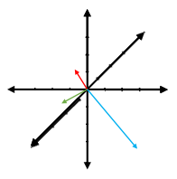
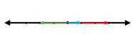
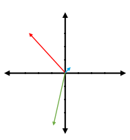
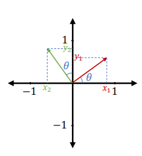
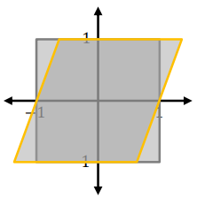
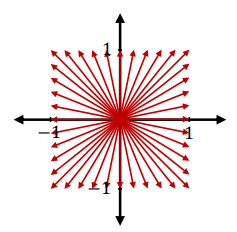
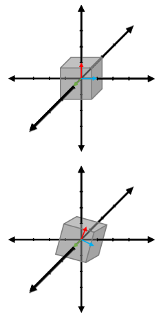
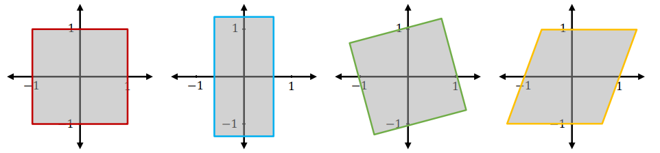
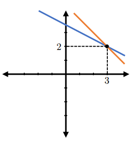

<link rel="stylesheet" type="text/css" media="all" href="styles.css">

## [Return to Contents](notes-contents)

# Chapter 4 - Linear Transformations

This chapter occasionally uses some slightly intimidating/complicated language to describe a relatively straightforward concept; however, it's important that you are exposed to the formal way to talk about these ideas so that you know what to ask the internet when you get stuck!

## 4.1 Demystifying linear Transformations

'Vectors spaces' are simply spaces in which vectors can exist... almost too simple to bother explaining, but we're going to refer to them a lot in this chapter, so it's important that we're all starting from the same place! For example, we can talk about a 1D (one dimensional) vector space existing 'in $\mathbb{R}$' (ie in the real numbers), a 2D space in $\mathbb{R}^2$ or an $n$D space existing in $\mathbb{R}^n$. The adjacent figures show 1D, 2D and 3D vectors space, each containing three random vectors. 
  

**Definition** - Linear transforms obey the following rules: Let $V$ and $W$ be vector spaces. A linear transformation (or 'mapping' or 'map') from $V$ to $W$ is a function $T : V \rightarrow W$ such that, for vectors $v$ and $w$ and scalars $\lambda$:
  

$$\begin{align}
&\qquad	T(v + w) = T(v) + T(w) \\
&	\text{(ie transform of the sum is the sum of the transforms)}\\
&\qquad	T(\lambda v) = \lambda T(v) \\
&	\text{(ie transform of scaled vector equals the scale of the transformed vector)}
\end{align}$$

## 4.2 One dimension

Let's start by talking about transformations in $\mathbb{R}$ space. Look at the three vectors in the top figure on the side of this page. They are actually just defined by a single number, so really they are just scalars in disguise, but bear with me! Think about how you might transform the blue vector into the red vector? You'd simply multiply it by a scalar, which in this case would be the number 3. Similar, to get to the green vector, we could have multiplied the blue by -2. Essentially ``scaling'' is the only thing you can do in 1D, not very exciting!

## 4.3 Two dimensions

Things are significantly more interesting in 2 dimensions. As with the 1D case, we can still apply simple scalings and if that scaling is the same in all directions, we can just think about it as a scalar. So, we can transform the vector $\vec{a}=(3,2)$ by a scaling factor of two to $2\vec{a}=(6,4)$.
  
However, we can also represent this process using a $(2\times2)$ matrix by multiplying the identity matrix by the scaling parameter;  

$$\begin{equation}
	2I_{2\times2}
	\begin{pmatrix}3\\2\end{pmatrix}=
	2\begin{pmatrix}1 & 0 \\	0 & 1\end{pmatrix}
	\begin{pmatrix}3\\2\end{pmatrix}=
	\begin{pmatrix}2 & 0 \\	0 & 2\end{pmatrix}
	\begin{pmatrix}3\\2\end{pmatrix}=
	\begin{pmatrix}6\\4\end{pmatrix}
\end{equation}$$

  

We refer to the matrix that we apply to our vector as our *transformation matrix*.  

But what if we wanted to increase the width of our vector by a factor of 2, but the height by a factor of 5? This is still just a scaling, but more complicated than our first example.   

$$\begin{equation}
	\begin{pmatrix}2 & 0 \\	0 & 5\end{pmatrix}
	\begin{pmatrix}3\\2\end{pmatrix}=
	\begin{pmatrix}6\\10\end{pmatrix}
\end{equation}$$

  
The answer to the question is shown above and we can check by simple matrix multiplication that it is correct. Shown below this is the inverse operation, which will hopefully seem fairly obvious to you, but also help you understand matrix inversion that we discussed last chapter.   

$$\begin{equation}
	\begin{pmatrix}3\\2\end{pmatrix}=
	\begin{pmatrix}1/2 & 0 \\	0 & 1/5\end{pmatrix}
	\begin{pmatrix}6\\10\end{pmatrix}
\end{equation}$$

  
Even if this case seems fairly simple, what about more complicated examples? What if we had a vector and we wanted to rotate it around the origin or shear it horizontally, or both? To answer this question and essentially explain everything else about transforms, we need to talk about basis vectors. However, before we do this, it's worth pausing to mention that the concept 'inverse' matrices that we met last chapter is easy to explain here.   

### 4.3.1 Basis Vectors
In 2D, the standard basis vectors are $\hat{\textbf{i}}=\begin{pmatrix}1\\0\end{pmatrix}$ and $\hat{\textbf{j}}=\begin{pmatrix}0\\1\end{pmatrix}$. So writing $\vec{v}=\begin{pmatrix}3\\2\end{pmatrix}$ can also be thought of as $\vec{v}=3\hat{\textbf{i}}+2\hat{\textbf{j}}$. What we haven't talked about before is that when you apply a matrix transformation, the columns of the matrix can be interpreted as the new basis for our transformed system. For example, in 2D, we've already seen from the scaling example above that the transformation $\begin{pmatrix}2 & 0 \\	0 & 5\end{pmatrix}$, moves $\hat{\textbf{i}}$ from (1,0) to (2,0) and $\hat{\textbf{j}}$ from (0,1) to (0,5).
  
If we wanted to build a transformation matrix which rotated all vectors 90 degrees anti-clockwise around the origin, we just need to think about what would happen to our basis vectors $\hat{\textbf{i}}$ and $\hat{\textbf{j}}$. Picture it in you head... rotating $\hat{\textbf{i}}$ by $90^\circ$ anti-clockwise would make it point vertically upwards to (0,1) and rotating $\hat{\textbf{j}}$ by $90^\circ$ anti-clockwise would make it point in the negative direction on the horizontal axis to (-1,0)... so to build the $90^\circ$ anti-clockwise transformation matrix, we simply write these two new basis vectors as the columns: of our transformation matrix $\begin{pmatrix}0 & -1 \\ 1 & 0\end{pmatrix}$.  

### 4.3.2 Rotation

We can generalise the rotation in 2D to any angle we wish, by thinking about polar coordinates. In the adjacent figure, we can imagine that our basis vectors, $\hat{\textbf{i}}$ and $\hat{\textbf{j}}$, have been transformed to the red and green vectors respectively. Based on our diagram and knowledge of trigonometry, the transformation matrix is:  

$$\begin{equation}
	R_\theta=\begin{pmatrix}\cos(\theta) & -\sin(\theta) \\	\sin(\theta) & \cos(\theta)\end{pmatrix}
\end{equation}$$

  

### 4.3.3 Shear

The adjacent figure illustrates the effect of shear on a square in a 2D space. The initial square has a dark grey border, but the square with a golden border shows it after shearing parallel to the horizontal axis. The shear matrices parallel to the horizontal and vertical axes are:  

$$\begin{equation}
	S_x=\begin{pmatrix}1 & \lambda \\	0 & 1\end{pmatrix}\qquad\&\qquad S_y=\begin{pmatrix}1 & 0 \\	\lambda & 1\end{pmatrix}
\end{equation}$$

  
Notice that if we are performing either of the above 'pure' shear operations, then one of the basis vectors remains unchanged. For example, in our figure, the $\hat{\textbf{i}}$ basis vector has not moved from it's original position. This is an important observation, which will be discussed in the next chapter.  

### 4.3.4 Visualizing Transformations

When thinking about basis change, it's is often more informative to imagine applying the effect of the transformation to a region of the same dimensionality as the space considered (\ie on an area in 2D or a volume in 3D). This is analogous to thinking about the effect on many vectors all at the same time, as in the top figure on the left, but drawing these vectors can be tedious, so instead we can just draw a simple shape, such as the square shown below it (any other shape would be fine, but a square is very convenient). We can now apply a transformation to this shape instead of to a particular vector and see the effect it has. Below are examples of scaling, rotation and shear.
  

## 4.4 Three dimensions

Nothing much new happens in 3D compared to 2D, except that the matrices are now larger and the figures are harder to draw. Scaling, rotation and shear, along with all the various combinations of these transformations, are still possible, although there are now more directions in which we can perform each of these actions.  

The adjacent figures show a cube, as well as it's three basis vectors. The second figure the effect of a rotation around the axis aligned with the green vector. The structure of the rotation matrix now depends on the axis which we are rotating around. Although this is not something you'd be asked to calculate by hand. The only 3D transformation you should remember is the pure scaling example:  

$$\begin{equation}
	T=\begin{pmatrix}a & 0 & 0 \\ 0 & b & 0 \\ 0 & 0 & c\end{pmatrix}
\end{equation}$$

  

## 4.5 Determinant and Inverse
We met both the determinant and inverse in the previous chapter, but we didn't really talk much about what they did. In the geometrical interpretation of matrices, they turn out to be really quite obvious!
  
The inverse matrix is simple the transformation required to 'undo' our initial transformation. So, if our transformation turns a square into a diamond, then the inverse will turn that diamond back into a square.
  
The determinant is also very straightforward as it simply describes the change in size (\ie area in 2D or volume in 3D) that is caused by our transformation. Consider the examples of a $90^\circ$ rotation and a factor of 3 vertical scaling below.  

$$\begin{align}
	\det\begin{pmatrix}0 & 1 \\ -1 & 0\end{pmatrix}=1\qquad\&\qquad
	\det\begin{pmatrix}1 & 0 \\	0 & 3\end{pmatrix}=3
\end{align}$$

  
Clearly, a $90^\circ$ rotation will not change the area of the square, so it has a determinant of 1; furthermore, all simple rotations will leave the area unchanged, which you can see by finding the determinant of the generalise rotation matrix.  

$$\begin{align}
	\det\begin{pmatrix}\cos(\theta) & -\sin(\theta) \\	\sin(\theta) & \cos(\theta)\end{pmatrix}\\=\cos^2(\theta)+\sin^2(\theta)=1
\end{align}$$

 

  
For scaling, the change in area is going to be the product of the change in each dimension, which is exactly what the determinant would give us. 
  

### 4.5.1 Nullspace (or Kernel)
So, now that we have a strong geometrical interpretation of matrices, let's return to the linear algebra perspective. Consider the linear system (expressed first as a system of equations, then in matrix form):  

$$\begin{align}
	\left.
	\begin{array}{ll}
	a_{11}x_{1} + a_{12}x_{2} + \dots + a_{1m}x_{n} &= b_{1} \\
	a_{21}x_{1} + a_{22}x_{2} + \dots + a_{2m}x_{n} &= b_{2} \\
	\vdots \\
	a_{m1}x_{1} + a_{m2}x_{2} + \dots + a_{mn}x_{n} &= b_{m}
    \end{array}
    \right\} \qquad Ax = b
\end{align}$$

  
Various methods exist for finding the solution to large systems similar to the one above *by hand* and this is very commonly taught on undergraduate engineering courses. However, the method for solving this offers you little insight into what the solution means, it's simply a tool and in the computing age it's now a tool you will almost certainly never use. So, we won't be covering this in DE1-MEM.
  
What is worth answering are the following questions: What $b$ can we solve this for? Is the solution unique? 
  
To investigate this, we write what is called the ``homogeneous equation'', which is where we simply set $b=0$, giving:  

$$Ax = 0$$

  
Conveniently, if the homogeneous equation has just one solution, then so does $Ax = b$; if the homogeneous equation has many solutions, then so does $Ax = b$. Clearly, homogeneous systems *always* have at least one solution, because if you set $x=0$, then it doesn't matter what $A$ is.
  
The solution of $Ax=0$ is called the nullspace or kernel of A and it gives you all the vectors by which you can multiply $A$ by and get zero.  

**Example** - Consider the linear system 

$$\begin{pmatrix}1 & 2 \\ 1 & 1\end{pmatrix}\begin{pmatrix}x \\ y\end{pmatrix}=\begin{pmatrix}7 \\ 5\end{pmatrix}$$

  
We can then find the combinations of $x$ & $y$ which solve the homogeneous equation (ie setting the right hand side to a zero vector) .  

$$\begin{pmatrix}1 & 2 \\ 1 & 1\end{pmatrix}\begin{pmatrix}x \\ y\end{pmatrix}=0 \qquad \Rightarrow \qquad  x+2y=0 \quad\&\quad x+y=0$$

  

Solving this simple case as a pair of simultaneous equations, we can see that $x=0\ \&\ y=0$, so we know that $Ax = b$ will have a single unique solution. To solve the $Ax = b$ case, we can either frame it once again as a system of simultaneous equations or, based on of discussion of linear systems in the previous chapter, we can find the inverse of $A$.  

$$A^{-1}=\begin{pmatrix}-1 & 2 \\ 1 & -1\end{pmatrix}\qquad \Rightarrow \qquad A^{-1}b=\begin{pmatrix}-1 & 2 \\ 1 & -1\end{pmatrix}\begin{pmatrix}7 \\ 5\end{pmatrix}=\begin{pmatrix}3 \\ 2\end{pmatrix}$$

  
In this case, the solution is $x=3\ \&\ y=2$.
  
Before we move on, we should briefly think again about the geometrical interpretation of the above. Consider for a pair of simultaneous equations given in the above example, each equation gives you a line on a 2D plane. The solution to the system exists if those lines cross at a point... but the only way that two lines could not cross is if they were parallel. 
  
Similarly, in 3D, each row of our system would give us an equation of the form $a_1x+a_2y+a_3z=b_n$, which is the equation of a flat 2D surface in our 3D space. Our equation will only have a unique solution if those three surfaces intersect at a single point... but once again, they are guaranteed to do this somewhere unless some of them are parallel. 
    