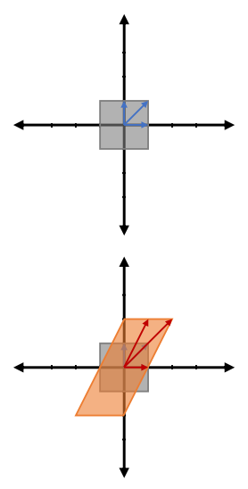
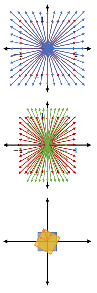
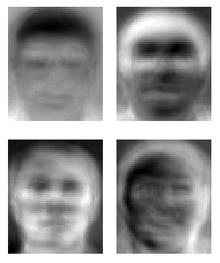

<link rel="stylesheet" type="text/css" media="all" href="styles.css">

## [Return to Contents](notes-contents)

# Chapter 5 - Eigenproblems

## 5.1 Definitions
In the previous chapter we talked about the geometrical interpretation of linear transformations, as well as some of properties of transformation matrices. In this chapter we're just going to introduce a further concept for analysing matrices. This topic is often considered to be a fairly challenging and abstract part of undergraduate engineering, but I hope to show you in this introductory page that eigenproblems have a very clear physical interpretation. 
  

The word 'eigen' is perhaps most usefully translated from German as meaning 'characteristic'. So, when I say that we will be looking for *eigenvalues* and *eigenvectors*, this suggests that these values and vectors are in some sense characteristic of a particular matrix. 
  
In the previous chapter we saw lots of examples of applying linear transformations to vectors spaces (primarily in $\mathbb{R}^2$). In the adjacent figure you can see our initial square in grey, as well as three vectors in blue. Beneath this you can see a new shape overlayed on top, which is the result of applying the transformation $T=\begin{pmatrix}1 & 1 \\ 0 & 2\end{pmatrix}$ (you should be able to look at a 2D transformation and write down the applied matrix).
  
Notice that of the three highlighted vectors, something different has happened to each one. The initially vertical $\hat{\textbf{j}}$ vector has not only been stretched longer, but has also had it's direction changed; the initially diagonal (1,1) vector has doubled in length, but still points in the same direction; and the initially horizontal $\hat{\textbf{i}}$ vector is still horizontal and its length is unchanged.
  
Eigenvectors are simply the vectors which, after applying a transformation, still lie on the same span (ie have not change direction). Each eigenvector has a corresponding eigenvalue, which is just the amount that the vector has been stretched along its span by the transformation. 
  
So, without doing any calculation, we can now say that the transformation $T$ has two eigenvectors, $v$, with corresponding eigenvalues, $\lambda$, which are: \newline \phantom{.}\hspace{3cm}$v_1=(1,0)$  with  $\lambda_1=1\qquad$ and $\qquad v_2=(1,1)$  with  $\lambda_2=2$
  

## 5.2 Calculating Eigensolutions
On the previous page we found our eigenvectors and values by inspection, but this was only possible because I chose a convenient transformation whose eigensolutions are easy to see. However, we didn't check whether there were more than two solutions (there are not) and we also didn't build a proper method for less obvious cases (or cases in higher dimensions). 
  
We can build a more formal definition by considering what we saw on the previous page, where we said that vectors would be considered to be eigenvectors if, after applying a transformation, they stayed on the same span, although their length was allowed to change. So, for an eigenvector, experiencing the transformation is no different from experiencing a simple scaling.   

This means that we can write,  

$$A\underline{x} = \lambda \underline{x}$$

  
where $A$ is an $n\times n$ transformation, $\underline{x}$ is a vector and $\lambda$ is a scalar parameter. The solutions to this equation are all the vectors, $\underline{x}$, which when transformed by $A$, it would be just the same as if they were just stretched by a factor of $\lambda$. So, $\underline{x}$ must be our eigenvectors and $\lambda$ our corresponding eigenvalues.  

For example, consider the following transformation matrix $A =\begin{bmatrix}	1 & -1 \\	2 & 4\end{bmatrix}$

  
You can easily verify that  

$$\begin{bmatrix}
	1 & -1 \\
	2 & 4
\end{bmatrix}
\begin{bmatrix}
	1 \\
	-2
\end{bmatrix}
=
3
\begin{bmatrix}
	1 \\
	-2
\end{bmatrix}$$

  
Hence, $3$ is an eigenvalue of $A$. Vector $\begin{bmatrix}
	1 \\
	-2
\end{bmatrix}$ is an eigenvector of $A$ corresponding to the scalar eigenvalue 3.
  

## 5.3 Finding All Eigenvalues
By recalling that multiplying a vector by a scalar is the equivalent to multiplying it by the identity matrix, $I$, times that scalar, we can re-express our eigenproblem to:  

$$\begin{align} 
	A\underline{x} = \lambda \underline{x} \qquad\Rightarrow{\text{re-express}}\qquad 
	A\underline{x} = \lambda I\underline{x} \qquad\Rightarrow{\text{rearrange}}\qquad
	A\underline{x}-\lambda I\underline{x} = 0
\end{align}$$

  
which we can then factorise to  

$$(A-\lambda I)\underline{x} = 0$$

  
We are looking for values of $\underline{x}$ and $\lambda$ for which the above equation is true. However, there is a trivial solution when $\underline{x}$ itself is just the zero vector (\eg (0, 0) in $\mathbb{R}^2$), but this solution is not very interesting (and also doesn't count as an eigenvector by definition). So, if we're not allowing $\underline{x}$ to be zero, the solutions must occur  when the action of $A-\lambda I$ on $\underline{x}$ results in a zero vector.
  
Remembering that a matrix can always be thought of as a transformation, and the determinant of that matrix is the scaling factor applied to the size of the transformed space. So, if a matrix has a determinant of zero, it means that all the vectors it is applied to will be crushed down to a dimension lower than previously! So, solutions to the above equation exist only when $\det(A-\lambda I)=0$.
  
Let's look again at the 2D example we calculated above:  

$$\begin{align}
	\det(A - \lambda I) = \det\left(\begin{bmatrix}
		1 & -1 \\
		2 & 4
	\end{bmatrix}-\begin{bmatrix}
	\lambda & 0 \\
	0 & \lambda
\end{bmatrix}\right)
=\det\left(
	\begin{bmatrix}
		1-\lambda & -1 \\
		2 & 4 - \lambda
	\end{bmatrix}\right)
\end{align}$$

  
Hence: 

$$\begin{align}
	\det(A - \lambda I)&= (1 - \lambda)(4 - \lambda) + 2=0 \\
	&= \lambda^{2} - 5\lambda + 6=0
\end{align}$$

  

In general, $\det(A-\lambda I)$ is a polynomial function of $\lambda$, which we refer to as the *characteristic polynomial* of $A$. Setting this characteristic polynomial equal to zero is referred to as the *characteristic equation*.  

To make $\det(A - \lambda I) = 0$, we can set $\lambda$ to $\lambda_1 = 3$ and $\lambda_2 = 2$. These are all the eigenvalues of $A$ and, in fact, all $n\times n$ matrices have $n$ eigenvalues; however, some might be repeated. It's is also possible that eigenvalues might be complex numbers, so questions (in exams!) often ask you to find all the *real* numbered eigenvalues. 

Notice that the sum of the eigenvalues is equal to the trace of the matrix ($\lambda_1+\lambda_2=2+3=5=\text{tr}(A)=1+4$) and that the product of the eigenvalues is equal to the determinant of the matrix ($\lambda_1\times\lambda_2=2\times3=6=\text{det}(A)=1\times4--1\times2$). In fact, this is always true.
  

## 5.4 Finding All Eigenvectors
### 5.4.1 For a (2x2) matrix
Continuing with our example, let $\lambda$ be a value satisfying the characteristic equation, namely, $\lambda$ is an eigenvalue of $A$. As will be shown, $\underline{x}$ always constitutes a vector space (eg $\begin{bmatrix}x_{1} \\ x_{2}\end{bmatrix}$), which we denote as EigenSpace($\lambda$), such that the eigenvectors of $A$ corresponding to $\lambda$ are exactly the non-zero vectors in EigenSpace($\lambda$).  

Consider again matrix $A$. Given that we know that $\lambda_{1} = 3$ and $\lambda_{2} = 2$, we can now find both eigenvectors. Firstly, for  $\lambda_{1} = 3$:  

$$\begin{align}
	(A - \lambda_{1}I)\underline{x}=(A - 3I)\underline{x} =
	\left(\begin{bmatrix}
		1 & -1 \\
		2 & 4
	\end{bmatrix}-\begin{bmatrix}
	3 & 0 \\
	0 & 3
\end{bmatrix}\right)
	\begin{bmatrix}
		x_{1} \\
		x_{2}
	\end{bmatrix}
=
\begin{bmatrix}
	-2 & -1 \\
	2 & 1
\end{bmatrix}
\begin{bmatrix}
	x_{1} \\
	x_{2}
\end{bmatrix}
	&=
	\begin{bmatrix}
0\\0
	\end{bmatrix} \\
\end{align}$$

  
Hence, any $\begin{bmatrix}x_{1} \\ x_{2}\end{bmatrix}$ satisfying $-2x_{1} - x_{2} = 0$ is a solution to the above system. The set of such vectors can be represented in a parametric form: $x_{1} = t$ and $x_{2} =$-$2t$ for any $t \in \mathbb{R}$. Note that this is a vector space - which we denote as EigenSpace($\lambda_{1}$) - of dimension 1. Every non-zero vector in EigenSpace($\lambda_{1}$) is an eigenvector corresponding to $\lambda_{1}$.
  
Similarly for $\lambda_{2}=2$:  

$$\begin{align}
	(A - \lambda_{2}I)\underline{x}=(A - 2I)\underline{x} =
	\left(\begin{bmatrix}
		1 & -1 \\
		2 & 4
	\end{bmatrix}-\begin{bmatrix}
		2 & 0 \\
		0 & 2
	\end{bmatrix}\right)
	\begin{bmatrix}
		x_{1} \\
		x_{2}
	\end{bmatrix}
	=
	\begin{bmatrix}
		-1 & -1 \\
		2 & 2
	\end{bmatrix}
	\begin{bmatrix}
		x_{1} \\
		x_{2}
	\end{bmatrix}
	&=
	\begin{bmatrix}
		0\\0
	\end{bmatrix} \\
\end{align}$$

  
Hence, any $\begin{bmatrix}x_{1} \\ x_{2}\end{bmatrix}$ satisfying $-x_{1} - x_{2} = 0$ is a solution to the above system. The set of such vectors can be represented in a parametric form: $x_{1} = t$ and $x_{2} =$-$t$ for any $t \in \mathbb{R}$. This is a vector space, EigenSpace($\lambda_{2}$) of dimension 1. Every non-zero vector in EigenSpace($\lambda_{2}$) is an eigenvector corresponding to $\lambda_{2}$.
  

### 5.4.2 For a (3x3) matrix
In a similar vein, consider a new matrix $A$:  

$$A =
\begin{bmatrix}
	4 & 6 & 0 \\
	-3 & -5 & 0 \\
	-3 & -6 & 1
\end{bmatrix}$$

  
Its characteristic equation is:  

$$\begin{align}
	\det(A - \lambda I)= 0
	\qquad\qquad \Rightarrow{} \qquad \qquad 
	\begin{vmatrix}
	4 - \lambda & 6 & 0 \\
	-3 & -5 - \lambda & 0 \\
	-3 & -6 & 1 - \lambda
	\end{vmatrix}
	= 0
\end{align}$$

  
Notice that the two zeros in the 3rd column mean that 4 of the 6 terms of the determinant will be zero.  

$$\begin{align}
	(1 - \lambda)
	\begin{vmatrix}
	4 - \lambda & 6 \\
	-3 & -5 - \lambda
	\end{vmatrix}
	&= 0 \\\\
	(1 - \lambda)((4 - \lambda)(-5 - \lambda) + 18) &= 18 \\
	(\lambda - 1)^{2}(\lambda + 2) &= 0
\end{align}$$

  
Hence, $A$ has two eigenvalues: $\lambda_{1} = 1$ and $\lambda_{2} = -2$.  

Solving $(A - \lambda I)\underline{x} = 0$ for $\lambda_{1} = 1$:  

$$\begin{align}
	(A - \lambda_{1}I)\underline{x} &= 0 \\\\
	\begin{bmatrix}
		4 - 1 & 6 & 0 \\
		-3 & -5 - 1 & 0 \\
		-3 & -6 & 1 - 1
	\end{bmatrix}
	\begin{bmatrix}
		x_{1} \\
		x_{2} \\
		x_{3}
	\end{bmatrix}=
	\begin{bmatrix}
		3 & 6 & 0 \\
		-3 & -6 & 0 \\
		-3 & -6 & 0
	\end{bmatrix}
	\begin{bmatrix}
		x_{1} \\
		x_{2} \\
		x_{3}
	\end{bmatrix}=
	\begin{bmatrix}
		3 & 6 & 0 \\
		0 & 0 & 0 \\
		0 & 0 & 0
	\end{bmatrix}
	\begin{bmatrix}
		x_{1} \\
		x_{2} \\
		x_{3}
	\end{bmatrix}
	&=
	0
\end{align}$$

  
Hence, any $\begin{bmatrix}x_{1} \\ x_{2} \\ x_{3}\end{bmatrix}$ satisfying $3x_{1} + 6x_{2} = 0$ is a solution to the above system. The set of such vectors can be represented in a parametric form: $x_{1} = 2u$, $x_{2} = -u$ and $x_{3} = v$ for any $(u,v) \in \mathbb{R}$. This is a vector space, EigenSpace($\lambda_{1}$) of dimension 2. Every non-zero vector in EigenSpace($\lambda_{1}$) is an eigenvector corresponding to $\lambda_{1}$.
  
Solving $(A - \lambda I)\underline{x} = 0$ for $\lambda_{2} = -2$:  

$$\begin{align}
	\begin{bmatrix}
		4 - -2 & 6 & 0 \\
		-3 & -5 - -2 & 0 \\
		-3 & -6 & 1 - -2
	\end{bmatrix}
	\begin{bmatrix}
		x_{1} \\
		x_{2} \\
		x_{3}
	\end{bmatrix}=
	\begin{bmatrix}
		6 & 6 & 0 \\
		-3 & -3 & 0 \\
		-3 & -6 & 3
	\end{bmatrix}
	\begin{bmatrix}
		x_{1} \\
		x_{2} \\
		x_{3}
	\end{bmatrix}=
	\begin{bmatrix}
		1 & 1 & 0 \\
		0 & 1 & -1 \\
		0 & 0 & 0
	\end{bmatrix}
	\begin{bmatrix}
		x_{1} \\
		x_{2} \\
		x_{3}
	\end{bmatrix}
=0
\end{align}$$

  
Hence, any $\begin{bmatrix}x_{1} \\ x_{2} \\ x_{3}\end{bmatrix}$ satisfying:  

$$\begin{align}
	x_{1} + x_{2} = 0 \qquad \&\qquad
	x_{2} - x_{3} = 0
\end{align}$$

  
is a solution to the above system. The set of such vectors can be represented in a parametric form: $x_{1} = -t$, $x_{2} = t$ and $x_{3} = t$ for any $t \in \mathbb{R}$. This is a vector space, EigenSpace($\lambda_{2}$) of dimension 1. Every non-zero vector in EigenSpace($\lambda_{2}$) is an eigenvector corresponding to $\lambda_{2}$.
  

## 5.5 Interpretation of Eigensolutions

At the beginning of this chapter we observed the effect of a particularly elegant transformation that was a combination of a horizontal shear and vertical stretch, which yielded the easy to spot eigenvectors $(0,1)$ and $(1,1)$. There are other systems for which the eigensolutions can be trivially derived. Firstly, for a isotropic (ie the same in all directions) scaling, *all vectors* will be eigenvectors (see blue vectors on red adjacent figure); however, if the scaling is anisotropic in magnitude, then only the basis vectors will be eigenvectors (see green vectors on red adjacent figure).
  
In the case of pure rotational transformations, as you can see from the orange on blue squares in the adjacent figure, all vectors will no longer align with their original span... **except** in the case of a $180^\circ$ rotation, where *all* vectors will be eigenvectors. If this seems odd, just consider the fact that a $180^\circ$ rotation will have the same effect as scaling by a factor on -1 in all directions and when you substitute $\theta=180^\circ$ into the 2D rotation matrix,  you can see that all the non-zero terms are on the leading diagonal, just like a scaling. 
  
if you imagine a cube in $\mathbb{R}^2$ experiencing pure rotation around one of its axes. Hopefully it should fit with what you've learned so far that this system will only have one real eigenvector, which will be its axis of rotation. 
  

### 5.5.1 Applications

Before we finish this chapter its worth briefly mentioning three engineering applications of eigenproblems that you can look up. Firstly,  Google's famous PageRank algorithm, which uses a matrix to describe the links connecting all pages on the web and then ranks them using an eigenvector. Secondly, data compression can be performed using eigenanalysis to decompose groups of similar data (eg images of faces, see adjacent for some eigenfaces) into their principal components.  Finally, mechanical systems defined springs and masses, it is possible to use eigen analysis to calculate the vibrational modes of the objects.