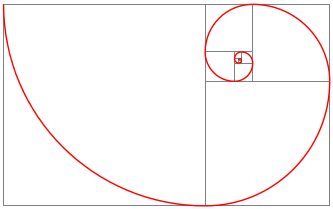
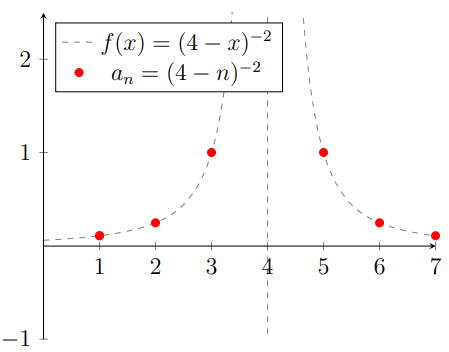
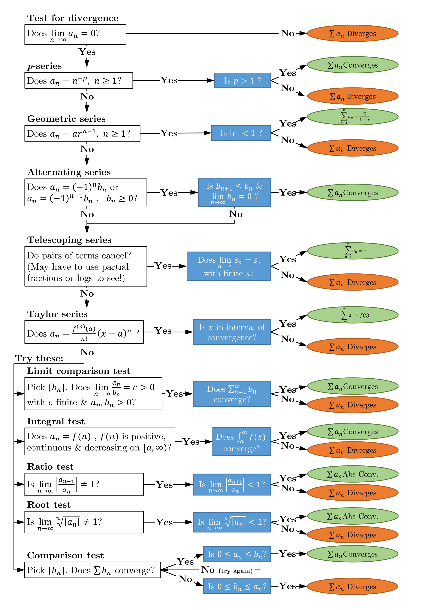

<link rel="stylesheet" type="text/css" media="all" href="styles.css">

## [Return to Contents](notes-contents)

# Chapter 6 - Sequences and Series
In mathematics, a **sequence** is a numbered list of terms that may contain repeats and **series** can be thought of as the sum of the terms of an infinite sequence.  

$$\begin{align}
&\mathrm{\textbf{Sequence}} & a_1, a_2, a_3, a_4,...\\
\\
&\mathrm{\textbf{Series}} & a_1+a_2+a_3+a_4+...
\end{align}$$

  

## 6.1 Sequences
Sequences can be defined using formulae, such as in the following three examples where $n$ is a natural number ($\mathbb{N}^+=\{1,2,3,4,...\}$) and is called the *index*.  

$$\begin{align}
a_n= &2n+3\\
b_n= &\cos{n\pi}\\
c_n= &(-1)^n\\
d_n= &7\sqrt[n]{x}
\end{align}$$

  
It is common notation to write ``$(a_n)$'' to express the sequence $a_1, a_2, a_3, a_4...$ and the two sequence $(b_n)$ and $(c_n)$ are considered to be equal if $b_n=c_n$ for all values of $n$, which happens to be the case in the examples given above (don't let the different expression of the rules fool you,  $(b_n)$ and $(c_n)$ are identical sequences!).  

Sequences may also be defined *recursively*, such that a term is defined as a function of previous terms, as in $\quad l_n=2l_{n-3}-l_{n-1}$.

  

It may be possible to determine the function defining a sequence based on a few example terms; however, more often, additional information is required, such as what **family** the sequence is from.  

For example, for the sequence $(h_n)$  

$$\begin{equation}
h_1=41,\quad h_2=43,\quad h_3=47 \quad\mathrm{and}\quad h_4=53
\end{equation}$$

  
It could be that this sequence was defined by the rule, 'the prime numbers in order, starting at 41' and so the next term would be $h_5=59$; however, with only the information available to us, the function $h_n=n^2-n+41$ could equally be correct, meaning that the next term would be $h_5=61$. The human brain is very good at finding patterns, as well as jumping to conclusions!  

**Arithmetic sequences** - This first family of sequences all follow the rule that each term differs from the next by the same fixed amount and are often written  

$$\begin{equation}
a_n=a_1+d(n-1)
\end{equation}$$

  
where $a_1$ is the first term and $d$ is called the *common difference*. For example, if we are told that  

$$\begin{equation}
b_1=7,\quad b_2=12,\quad b_3=17, \quad b_4=22, \quad...
\end{equation}$$

  
is part of an arithmetic sequence, then it can be fully describe by the rule  

$$\begin{equation}
b_n=7+5(n-1)
\end{equation}$$

  

**Geometric sequences** - This family of sequences all follow the rule that each term differs from the next by the same fixed ratio and are often written  

$$\begin{equation}
a_n=a_1r^{n-1}
\end{equation}$$

  
where $a_1$ is the first term and $r$ is called the *common ratio*. For example, if we are told that  

$$\begin{equation}
b_1=\frac{4}{5},\quad b_2=\frac{12}{5},\quad b_3=\frac{36}{5}, \quad b_4=\frac{108}{5} \quad...
\end{equation}$$

  
is part of a geometric sequence, then it can be fully describe by the rule  

$$\begin{equation}
a_n=\frac{4}{5}\times 3^{n-1}
\end{equation}$$

  
Other famous examples of sequences include:   

$$\begin{align}
&\mathrm{\textbf{The prime numbers}} & 2,3,5,7,11,13,...\\
\\
&\mathrm{\textbf{The Fibonacci numbers}} & 0, 1, 1, 2, 3, 5, 8,...&\\
\\
&\mathrm{\textbf{The triangle numbers}} & 1,3,6,10,15,21,...
\end{align}$$

  

## 6.2 Series

A series is the sum of all the terms of an infinite sequence, so it can be written  

$$\begin{equation}
\sum_{n=1}^\infty(a_n)=a_1+a_2+a_3+a_4+...
\end{equation}$$

  
However, if only a finite number of terms are summed, this is referred to as a *truncated* series.
  
The same families that are used to describe sequences also apply to series and for some of these, useful identities can be found that help us understand and manipulate them.   

**Arithmetic series** - The sum of the first $m$ terms of the arithmetic sequence $(a_n)$ constitutes the truncated series $S_m$, such that   

$$\begin{equation}
S_m=\sum_{n=1}^m(a_n)=a_1+a_2+a_3+...+a_{m-1}+a_m
\end{equation}$$

  
We can derive an expression for $S_m$ by first re-expressing each term of the series using only the first term and the common difference.  

$$\begin{equation}
S_m   =a_1 + (a_1+d) + (a_1+2d) + ... + (a_1+(m-2)d) + (a_1+(m-1)d)
\end{equation}$$

  
Next we re-express the series again, but this time only using the last term and the common difference.  

$$\begin{equation}
S_m   =(a_m-(m-1)d) + (a_m-(m-2)d) + (a_m-(m-3)d) + ... + (a_m-d) + a_m
\end{equation}$$

  
Adding these two forms together yields  

$$\begin{equation}
2S_m   =(a_1+a_m)+(a_1+a_m)+(a_1+a_m)+...+(a_1+a_m)+(a_1+a_m)
\end{equation}$$

  
which rearranges to our explicit equation  

$$\begin{align}
S_m   =&\frac{m}{2}(a_1+a_m)\\
S_m   =&\frac{m}{2}(a_1+(a_1+(m-1)d))\\
S_m   =&\frac{m}{2}(2a_1+(m-1)d)
\end{align}$$

  

**Geometric series** - The sum of the first $m$ terms of the geometric sequence $(a_n)$ constitutes the truncated series $S_m$, such that   

$$\begin{equation}
S_m=\sum_{n=1}^m(a_n)=a_1+a_2+a_3+...+a_{m-1}+a_m
\end{equation}$$

  
We can derive an expression for $S_m$ by first re-expressing each term of the series using only the first term and the common ratio.   

$$\begin{equation}
S_m   =a_1 + (a_1r) + (a_1r^2) + ... + (a_1r^{m-2}) + (a_1r^{m-1})
\end{equation}$$

  
Multiplying both sides of the expression above by $r$  

$$\begin{equation}
S_mr   =a_1r + (a_1r^2) + (a_1r^3) + ... + (a_1r^{m-1}) + (a_1r^m)
\end{equation}$$

  
The difference between the two equations above is  

$$\begin{equation}
S_m-S_mr   =a_1 - a_1r^m
\end{equation}$$

  
which factorises and rearranges to our explicit equation  

$$\begin{align}
S_m(1-r)   =&a_1(1-r^m)\\
S_m   =&a_1\frac{1-r^m}{1-r}
\end{align}$$

  

Notice that based on the expression above, even if there are infinitely many terms in the sequence, the series may still be finite if $r<1$. We will discuss this concept further in the following section. Besides these two families, there are many others which also have handy tricks to help you make use of them.  

## 6.3 Limits and Convergence
A limit is the value that a function or sequence 'approaches' as the input or index approaches a specified value. The expression  

$$\begin{equation}
\lim_{x\to n}f(x)=L
\end{equation}$$

is read 'the limit of f of $x$, as $x$ goes to $n$, equals $L$'.
  
It is often useful to know whether or not a series *converges*, and if so, what it converges to. A variety of convergence tests exist, which allow you to methodically examine the convergence of a series.
  

**The n$^\mathrm{th}$ term test** - calculate what the last term of a sequence would be, as it can give us a clue as to whether the corresponding series converges. In fact, we can say that it is ``necessary, but not sufficient'' (ie needed, but not enough on its own), that as the index $n$ goes to infinity, the terms must go to zero in order for a series to converge.   

Formally,  

$$\mathrm{If} \quad\sum_{n=0}^\infty a_n \quad\mathrm{converges, then}\quad\lim_{n\to \infty}a_n=0$$

  
and by similar reasoning, if the limit does not go to zero, as the index goes to infinity, the series must diverge. (Although, in the case of the adjacent figure, $f(x)$ does go to infinity, but it still diverges!)  

$$\mathrm{If} \quad\lim_{n\to \infty}a_n\ne0 \quad\mathrm{then}\quad\sum_{n=0}^\infty a_n \quad\mathrm{diverges}$$

  
To understand why having a limit at infinity of zero is not enough to establish series convergence, consider the function $a_n=(4-n)^{-2}$. The figure shows the terms in this series; however, the point at $n=4$ is missing as there is a discontinuity in the function. So, although a sequence may eventually ``settle down'' to zero, if it contains terms that are infinite or undefined along the way, then the corresponding series will not converge.  

**$p$-series test** - Consider a sequence of the form $a_n=1/n^p$ and remember that numbers less than 1 get smaller when they are put to powers greater than 1 (e.g. 0.5$^2$=0.25). So the test for convergence here is simply to observe whether the exponent, $p$, is greater than 1.  

There are many other tests that can be applied to determine the convergence of a series. There is also a 'sensible' order in which they should be tried that is based in part on how conclusive their results are, but also on how easy it is to apply them, which will hopefully make this process efficient. There is no need for you to learn all of these as they are easy to look up online; however, what is important is that you understand what they mean and how to use them.  

    

## 6.4 Truncated sum of 1, $n$, $n^2$ and $n^3$
If you were asked to sum an infinite series of ones (\ie $S=1+1+1+1+1+...$), this would clearly never stop growing and would therefore explode to infinity (a very slow and unexciting explosion). However, a truncated series of $N$ ones would of course be finite and add up to $N$.   

$$\sum_{n=1}^{n=N}{1}=N$$

   
You could even think of this series an arithmetic series where the common difference is zero (so $S_N=\frac{N}{2}(2\times1+(N-1)0)=N$); however, the geometric series type analysis with a common ratio of 1 would not work.   

Now imagine a series which simply added up the natural numbers (\ie $S=1+2+3+...$). Once again, this series clearly doesn't stop growing, but any truncation would result in a finite answer. Applying the arithmetic series analysis again here (with $d=1$) leads to the result  

$$\sum_{n=1}^{n=N}{n}=\frac{N}{2}(2\times 1+(N-1)\times 1)=\frac{N(N+1)}{2}$$

  
An alternative approach to evaluating this series is by expanding the binomial expression $(n-1)^2$....  

$$(n-1)^2=n^2-2n+1$$

  
and then rearranging the result to   

$$n^2-(n-1)^2=2n-1$$

  
At this point, it's necessary to know that summation is a linear operation, so it has the following two useful properties:  

$$\sum{(a_n+b_n)}=\sum{(a_n)}+\sum{(b_n)} \qquad\qquad \&\qquad\qquad \sum{(3a_n)}=3\sum{(a_n)}$$

  
which, combined with our rearranged binomial above, means that we can say   

$$\sum_{n=1}^{n=N}{(n^2-(n-1)^2)}=\sum_{n=1}^{n=N}{(2n-1)}=2\sum_{n=1}^{n=N}{(n)}-\sum_{n=1}^{n=N}{(1)}$$

  
This may initially not look very helpful, but the left hand side expression is what we refer to as a telescoping series. This means that pairs of terms within the series will cancel with each other. In this case, each term contains a $n^2$ component and a $(n-1)^2$ component, which is simply the value of $n^2$ from the previous term in the sequence. Remembering that the series starts from $n=1$ and that $0^2=0$, it becomes clear that only the final $n^2$ term is not cancelled, so $\sum_{n=1}^{n=N}{(n^2-(n-1)^2)}=N^2$. So our binomial expression becomes   

$$2\sum_{n=1}^{n=N}{(n)}-\sum_{n=1}^{n=N}{(1)}=N^2$$

  
Substituting in our knowledge that the sum of $N$ ones is just $N$, then rearranging, leads to the same result we found earlier  

$$\sum_{n=1}^{n=N}{n}=\frac{N^2+N}{2}$$

  
This on its own is not hugely exciting, but it turns out we can use this same approach to find an expression to evaluate any truncated series of the form $\sum{n^b}$, where $b$ is a positive integer.  

### 6.4.1 Truncated sum of $n^b$
So, to find an expression for $\sum{n^2}$, we start by expanding the cubic expression $(n-1)^3=(n^3-3n^2+3n-1)$ and then rearranging this equation to  

$$n^3-(n-1)^3=3n^2-3n+1 \qquad \qquad \textrm{So}\qquad\qquad \sum_{n=1}^{n=N}{(n^3-(n-1)^3)}=3\sum_{n=1}^{n=N}{(n^2)}-3\sum_{n=1}^{n=N}{(n)}+\sum_{n=1}^{n=N}{(1)}$$

  
Once again, we have have a telescoping series, so clearly $\sum_{n=1}^{n=N}{(n^3-(n-1)^3)}=N^3$. Combining this with our knowledge of $\sum{n}$ and $\sum{1}$, we can rearrange the expression to make it explicit for the only thing we don't know.  

$$\sum_{n=1}^{n=N}{n^2}=\frac{1}{3}\left(N^3+\frac{3}{2}(N^2+N)-N\right)=\frac{N(N+1)(2N+1)}{6}$$

  
This continues to work for all positive integer values of $b$, although the algebra does become tiresome by hand. So, lastly, to find the truncated sum of $n^3$, you would start from $(n-1)^4$ and follow the same process, leading to the result  

$$\sum_{n=1}^{n=N}{n^3}=\frac{N^2(N+1)^2}{4}$$

  

### 6.4.2 Example of a truncated sum
To evaluate the expression   

$$\sum_{n=1}^{n=7}{(2n+1)(n-1)(n+3)}$$

  
one strategy is to first expand this expression to the from $(2n^3+5n^2-4n-3)$ and then chop it up into it's various components using the linearity properties  

$$\sum_{n=1}^{n=7}{(2n+1)(n-1)(n+3)}=2\sum_{n=1}^{n=7}{(n^3)}+5\sum_{n=1}^{n=7}{(n^2)}-4\sum_{n=1}^{n=7}{(n)}-3\sum_{n=1}^{n=7}{(1)}$$

  
As we have already derived expressions for each of these truncated summations, solving becomes a matter of simple substitution  

$$\sum_{n=1}^{n=7}{(2n+1)(n-1)(n+3)}=2\left(\frac{7^2(7+1)^2}{4}\right)+5\left(\frac{7(7+1)(2\times7+1)}{6}\right)-4\left(\frac{7^2+7}{2}\right)-3(7)=2135$$

  

## 6.5 Mind blown
There is a meaningful sense in which the following statement is true and it can be shown in a variety of ways.   

$$S_\infty   =1+2+3+4+5+...=-\frac{1}{12}$$

  
Seriously though... head to the Numberphile YouTube channel for an explanation. The general idea is that ``infinity'' isn't really anything like just a 'very large number'.

    
