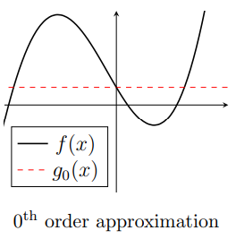
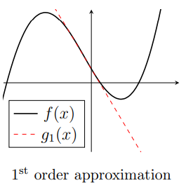
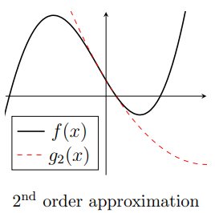
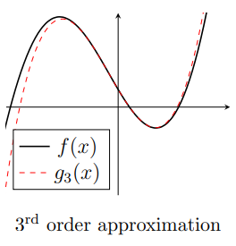
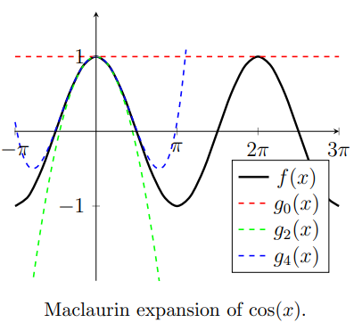
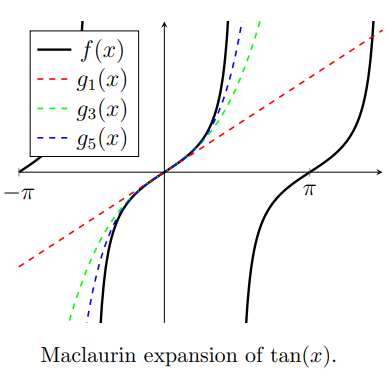
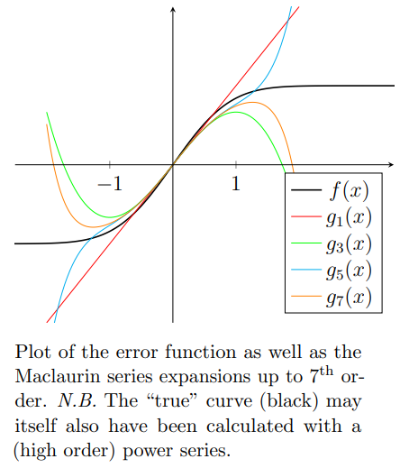
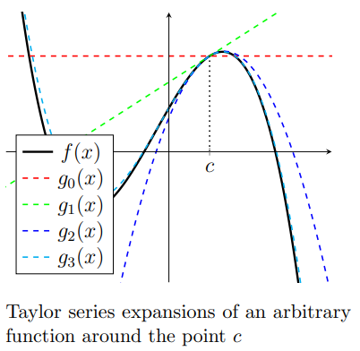
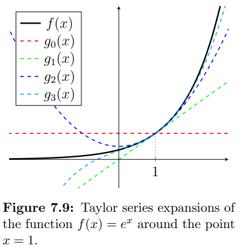

<link rel="stylesheet" type="text/css" media="all" href="styles.css">

## [Return to Contents](notes-contents)

# Chapter 7 - Power Series
It is often useful to re-express a function as a power series. Before we go any further, its important that you understand what this means, so consider the example below:   

$$\begin{equation}
e^x=1+x+\frac{x^2}{2!}+\frac{x^3}{3!}+\frac{x^4}{4!}+...
\end{equation}$$

  
Try this on your calculator at $x=1.2$ so that you are convinced that the function on the LHS (left-hand-side) can be approximated with the power series on the RHS. 
  

## 7.1 Maclaurin Series
For many smooth, continuously differentiable functions (or what are sometimes called ``well-behaved'' functions), if you know everything about the function at just one place (at $x=0$ for Maclaurin series), it is possible to use this information to reconstruct the entire curve.   

When we say ``know everything'' at a point, we mean the value of the function and all of its derivatives ($f(0), f'(0), f''(0),f^{(3)}(0),...$).   

We can use this information to construct a sequence of approximations to our function.   

Let's suppose we have some function $f(x)$ and we know everything about it at the point $x=0$, but nothing about it anywhere else except that it is well-behaved.   

We can use the value of the function at $x=0$ to construct a (pretty bad) approximate function $g_0(x)$, which we shall call our ``zeroth order'' guess. Clearly, as this function only has one piece of information to work with, it will just be a horizontal line that goes through the $y$-axis at the same place as the real function, $f(0)$.   

$$\begin{equation}
g_0(x)=f(0)
\end{equation}$$

  
We can see, in the first figure on the right, that this guess function is not great...
  
A better approximation can be made by using the next piece of information available to us, which is the value of the function's first derivative $f'(0)$. 
      

Our ``first order'' guess, $g_1(x)$ uses both pieces of information to construct a straight line (of the form $y=mx+c$) where both the $y$-intercept and the gradient are the same as the function $f(x)$ at $x=0$. This is shown in the second figure and is clearly a significant improvement. 

$$\begin{equation}
g_1(x)=f(0)+f'(0)x
\end{equation}$$

      

Repeating this process, we will now also use the second derivative of our function to help improve our guess function (third figure). 
  
We see that a factor of $\frac{1}{2}$ is required before the $x^2$ term. To understand why, try differentiating $g_2(x)$ twice to convince yourself that it equals $f''(0)$ as it should. 

$$\begin{equation}
g_2(x)=f(0)+f'(0)x+\frac{f''(0)}{2}x^2
\end{equation}$$

      

Finding the third order approximation requires using the third derivative, as shown in the last figure. Again, to understand where the $(3\times 2)^{-1}$ term comes from, try differentiating $g_3(x)$ three times. 
  
Hopefully, you will now see the pattern and be confident that the next term (for the fourth order approximation) will have a factor of $(4\times 3\times 2)^{-1}$ before it. 
 

$$\begin{equation}
g_3(x)=f(0)+f'(0)x+\frac{f''(0)}{2}x^2+\frac{f^{(3)}(0)}{3\times 2}x^3
\end{equation}$$

      
With this pattern in mind, we can now write the general equation for the $n^{th}$ order term (Don't forget that $n!$ is defined as $n\times (n-1)!$, so $1!=1\times 0!$ and therefore $0!=1$).   

$$\begin{align}
g_n(x)
&=\frac{f(0)}{0!}+\frac{f'(0)}{1!}x+\frac{f''(0)}{2!}x^2+\frac{f^{(3)}(0)}{3!}x^3+...+\frac{f^{(n)}(0)}{n!}x^n \\
&=\sum_{n=0}^{\infty}\frac{f^{(n)}(0)}{n!}x^n
\end{align}$$

  

### 7.1.1 Maclaurin Examples

**Example** - Consider the function $f(x)=\cos(x)$ (a well-behaved function). It's first four derivatives evaluated at $x=0$ are:  

$$\begin{align}
f(0)&=\cos(0)=1 \\
f'(0)&=-\sin(0)=0 \\
f''(0)&=-\cos(0)=-1 \\
f^{(3)}(0)&=\sin(0)=0 \\
f^{(4)}(0)&=\cos(0)=1
\end{align}$$

  
Therefore the Maclaurin series expansion is  

$$\begin{align}
g(x)
&=1-\frac{1}{2!}x^2+\frac{1}{4!}x^4-\frac{1}{6!}x^6+...\\
&=\sum_{n=0}^{\infty}(-1)^n\frac{1}{(2n)!}x^{2n}
\end{align}$$

    
**Example** - Consider the function $f(x)=\tan(x)$ (not a well-behaved function, due to its asymptotes). It's first four derivatives evaluated at $x=0$ are:
  

$$\begin{align}
f(0)&=\tan(0)=0 \\
f'(0)&=\sec^2(0)=1 \\
f''(0)&=2\tan(0)\sec^2(0)=0 \\
f^{(3)}(0)&=-2 (\cos(2(0))-2) \sec^4(0)=2\\
f^{(4)}(0)&=-4 (\cos(2(0))-5) \tan(0) \sec^4(0)=0
\end{align}$$

  

$$\begin{align}
g(x)
&=x+\frac{1}{3}x^3+\frac{2}{15}x^5+...\\
\end{align}$$

  

Looking at the figure we can see that although our approximation is definitely improving locally (ie close to $x=0$), it is not able to model the function at all after $x=\frac{\pi}{2}$. This is because tan($x$) contains asymptotes and is therefore not considered a well-behaved function. 
  

In the next example, we look again at the error function (from the Normal Distribution Chapter). The adjacent figure shows the error function as well as Maclaurin approximations up to the \nth{7} order, but although the function is quickly represented well near $x=0$, the improvements seem stop beyond around $x=1$. However, the Taylor polynomials do continue to improve (slowly) and the error function can be exactly expressed as a Taylor series. 

  

$$\begin{align}
	f(0)&=\text{erf}(0)=0 \\
	f'(0)&=\frac{2}{\sqrt{\pi}}e^{-x^2}=\frac{2}{\sqrt{\pi}} \\
	f''(0)&=-\frac{4}{\sqrt{\pi}}xe^{-x^2}=0 \\
	f^{(3)}(0)&=-\frac{4}{\sqrt{\pi}}(2x^2-1)e^{-x^2}=-\frac{4}{\sqrt{\pi}} \\
	f^{(4)}(0)&=-\frac{8}{\sqrt{\pi}}x(2x^2-3)e^{-x^2}=0
\end{align}$$

    

which yields (once we've added a few more terms),   

$$\begin{equation}
	\text{erf}(x)=\frac{2}{\sqrt{\pi}}\left(x-\frac{x^3}{3}+\frac{x^5}{10}-\frac{x^7}{42}+\frac{x^9}{216}-...\right)
\end{equation}$$

  

## 7.1 Taylor Series

The Taylor series simply extends the Maclaurin series concept by saying that we can reconstruct well-behaved functions if we know everything about \textit{any} point (\ie not just at the point $x=0$ like Maclaurin). The expression can be derived in the same way as the Maclaurin series, but requires some minor rearrangement to find each successive approximation.   

$$\begin{align}
g_n(x)=\sum_{n=0}^{\infty}\frac{f^{(n)}(c)}{n!}(x-c)^n
\end{align}$$

    

**Example** - Consider the function $f(x)=e^x$. It's first three derivatives evaluated at $x=1$ are:
  

$$\begin{align}
f(1)&=e^1=e \\
f'(1)&=e^1=e \\
f''(1)&=e^1=e \\
f^{(3)}(1)&=e^1=e
\end{align}$$

  
Notice how this is different from the expression given at the beginning of this chapter for $e^x$. This is because the first series was expanded around the point $x=0$ (Maclaurin series), whereas here we have expanded around $x=1$.   

$$\begin{equation}
g(x)=e+e (x-1)+\frac{e}{2}(x-1)^2+\frac{e}{3!}(x-1)^3+\frac{e}{4!}(x-1)^4+...
\end{equation}$$

  
It is important to select a sensible point from which to expand a series. This is especially true  if you are trying to use only a few terms of the series (truncation) to approximate a complicated function, as the further away from your expansion point, the less accurate (on average) your approximations become.  

**Mind slightly blown** - Of course, another way to think about the two different power series approximations of the function $f(x)=e^x$, is that seemingly moving our approximation from $x=0$ to $x=1$ caused us to multiply every term by $e$. But when you consider that $e^{x+1}=ee^x$ it should suddenly make a lot of sense!

    

