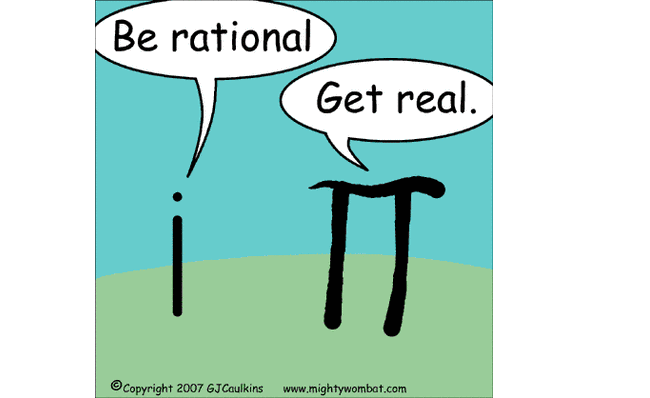
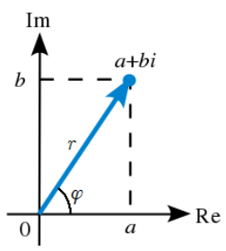
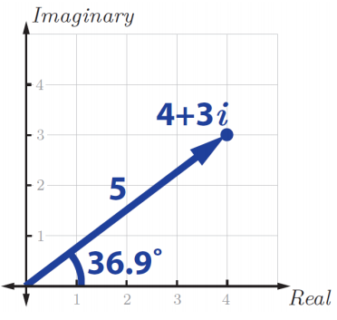
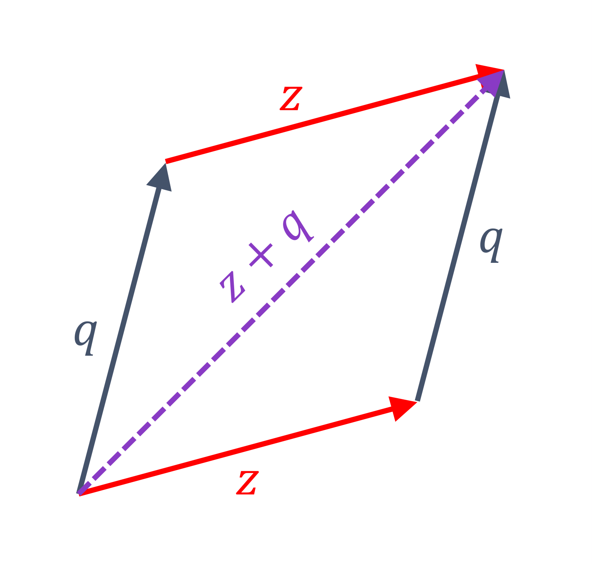
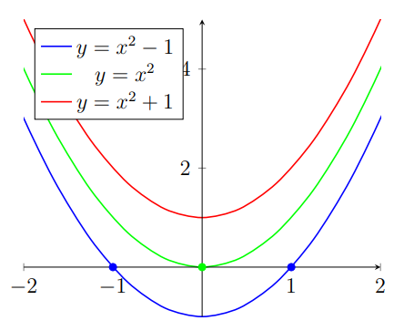
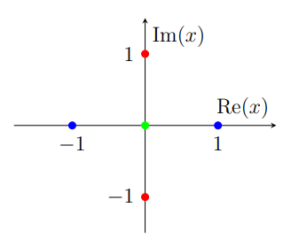
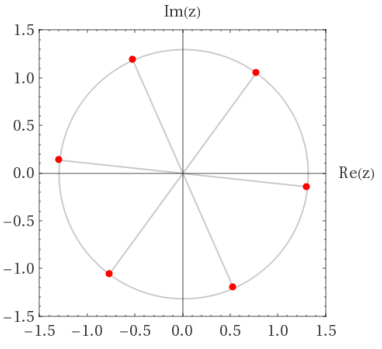
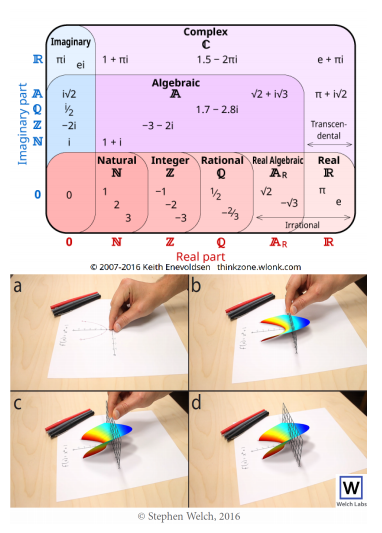

<link rel="stylesheet" type="text/css" media="all" href="styles.css">

## [Return to Contents](notes-contents)

# Chapter 8 - Complex Numbers
You will most likely have met complex numbers before, but if you haven't **don't panic** because this chapter starts from scratch and aims to make sure that you really *get* them as they're going to turn out to be useful later on!
  
Essentially, complex numbers are those that can be expressed in the form $a+bi$, where $i$ is the 'imaginary unit'. A typical definition of $i$ might be 'a solution to the equation $x^2+1=0$'. Notice I said *a* solution and not *the* solution, because of course this equation has two solutions ($x=\sqrt{-1}=i$ and $x=-\sqrt{-1}=-i$)*. The definition can also be simply stated directly as:  

$$\begin{equation}
i=\sqrt{-1}
\end{equation}$$

  

As we shall see, imaginary numbers turn up a lot in real applications, so their name is perhaps a bit misleading and some of the early pioneers of this field weren't happy about this. In fact, the famous mathematician Carl Friedrich Gauss, shown here, wished that they had been called 'Lateral numbers', which should make a lot of sense to you once you've seen them plotted on a 2D plane. These plots are called **Argand** diagrams and the complex number $a+ib$ corresponds to a point at the Cartesian coordinate $(a,b)$.  

$$\begin{align}
	\text{Re}(a+bi)&=a\quad &\&\qquad \text{Im}(a+bi)&=b\\ 
	|a+bi|&=\sqrt{a^2+b^2}=r\quad &\&\qquad \arg(a+bi)&=\arctan(\frac{b}{a})=\varphi
\end{align}$$

 

Equally, we can switch to Polar coordinates, where we now need to know the angle, $\varphi$, that the line makes with the positive $x$-axis (called the *argument* or *phase*), as well as the distance to the point, $r$, which can be thought of as a radius (referred to as the *magnitude*, *absolute* or *modulus*).

     

To convert between these two representation, you just need to remember your trigonometry and Pythagoras theorem. The polar description can also be written as, for example,  $4 + 3i = 5 \angle 36.9^\circ$.  

$$\begin{align}
z&=a+bi=r\cos(\varphi)+r\sin(\varphi)i\\
z&=re^{i\varphi}=\sqrt{a^2+b^2}\ e^{i\arctan(\frac{b}{a})}
\end{align}$$

  
where $\varphi$ is in radians rather than the the degrees shown in the figure. Hopefully its clear from the diagram where the sine and cosine notation came from, but you may be wondering how $e$ got involved. However, you'll have to skip ahead in the notes to see that $e^{ix}=\cos(x)+i\sin(x)$.
  

  
\* *In fact, it is the 'Fundamental Theorem of Algebra' which states that a polynomial of order $n$, must have exactly $n$ roots. Sometimes these are both real (ie $x^2=1$), sometimes complex ie $x^2=-1$), sometimes both in the same place (ie $x^2=0$), and sometimes there's a mix of real and complex. In particular, for polynomials with real coefficients, the roots are always either real or in conjugate pairs.*

## 8.1 Operations with complex numbers

Adding or subtracting complex numbers is simple enough, as you just consider the two parts separately (like with vectors!). For example, consider the two complex numbers $z=a+bi$ and $q=c+di$,  

$$\begin{equation}
z+q=(a+c)+(b+d)i\qquad \&\qquad z-q=(a-c)+(b-d)i
\end{equation}$$

  
Similarly, if I wanted to multiply two complex numbers together, I could just work through the FOIL approach (first, outside, inside, last) and get the answer. For example, consider the two complex numbers $z=a+bi$ and $q=c+di$. However, don't forget to fully simplify at the end, such that any $i^2$ terms are converted to $-1$.   

$$\begin{align}
z\times q &= (a+bi)(c+di) = ac+adi+bci+bdi^2 \\
&= ac+adi+bci-bd = (ac-bd)+(ad+bc)i
\end{align}$$

  
There are several approaches for division, all of which are very tedious using the $(a+bi)$ form.
In the method shown below, we first write the expression as a fraction and then perform an operation called 'realising the denominator' in which we multiply the top and bottom lines by the **complex conjugate** of the denominator (much like the process of 'rationalising the denominator' when surds are involved).  

$$\begin{align}
q\div z &= \frac{(c+di)}{(a+bi)} = \frac{(c+di)}{(a+bi)}\times\frac{(a-bi)}{(a-bi)} = \frac{ac-bci+adi-bdi^2}{a^2+abi-abi-bi^2} = \frac{(ac+bd)+(ad-bc)i}{a^2+b^2}
\end{align}$$

  
The complex conjugate is a very useful concept and it is defined, for $z=a+bi$, as the complex number which has the same real component, $a$, and an imaginary component of the same size, but opposite sign, $-b$. This, when multiplied with $z$, has the property of making it into a purely real number and is given the symbol $\bar{z}=a-bi$ (sometime $z^*$ is used instead of $\bar{z}$).  

This process gets tedious pretty quickly - imagine if you were asked in a test for $z\times z\times z\div q$...! However, if I represent my complex number in polar form, things get much easier. To multiply $z$ and $q$, I just multiply their magnitudes and then sum their arguments. The logic behind this becomes clear when the numbers are written in their exponential form $z_1=r_1e^{i\varphi_1}$ and $z_2=r_2e^{i\varphi_2}$, so therefore $z_1z_2=r_1r_2e^{i(\varphi_1+\varphi_2)}$.  Division is similar.  

$$\begin{align}
z\times q &= (r_zr_q)e^{i(\varphi_z+\varphi_q)}\\
z\div q &= (r_z/r_q)e^{i(\varphi_z-\varphi_q)}
\end{align}$$

  

**Example** - If $z=(3-4i)$ and $q=(12+5i)$, then find $z^3/q^2$ ...   

$$\begin{align}
z^3/q^2 = & (5^3\angle(-53.13\times 3)^\circ)/(13^2\angle(22.6\times 2)^\circ)\\
\Rightarrow{\text{simplify}}\quad = & (125\angle-159.4^\circ)/(169\angle45.2^\circ) = (125/169)\angle(-110.7-45.2)^\circ = 0.74\angle-204.6^\circ\\
\text{Therefore } z^3/q^2 = & -0.6724 + 0.3083i \text{(expressed in same form as question)}
\end{align}$$

  

## 8.2 Finding complex roots

One particularly interesting concept is the process for finding complex roots. Remember that the roots of a function are the points at which $f(x)=0$, which can usually be thought of as the points at which the function touches the horizontal axis.   

In the adjacent figure, you see three functions, for the **blue** function (lowest) you can immediately see its two roots, where as for the **green** (middle) there appears to be only one (although you can think of this as it having one 'unique root' as it just has two at the same location). However, the **red** function (top) doesn't appear to have any roots... but we know from the Fundamental Theorem of Algebra that it must have two, so where are they?  

Well, as we discussed above, in these fairly simple cases, we can just rearrange our equation to show that the other roots are complex $x=\pm i$. So, this is something that you're going to have to be careful with from a language perspective, because all the functions in the above figure have *two roots* (see figure below), but only one has *two unique, real roots*.  

**Example** - We can apply this same logic to more complicated quadratic expressions. Consider the function $f(x)=x^2-2x+3$. To find the roots of a quadratic, we either factorise (which doesn't work in this case), or put the coefficients into the quadratic formula.  

$$\begin{equation}
	x=\frac{2\pm\sqrt{(-2)^2-4\times 1\times 3}}{2\times 1}=\frac{2\pm\sqrt{4-12}}{2}=1\pm i\sqrt{2}
\end{equation}$$

  

## 8.3 De Moivre's Theorem
This concept results directly from the exponential polar form of a complex number and primarily gives you a short-cut to finding the roots of a complex number. (NB. $e^{ix}$=cis$(x)=\cos(x)+i\sin(x)$).  
 
$$\begin{equation}
z^n=(re^{i\varphi})^n=r^ne^{in\varphi}=r^n(\cos(n\varphi)+i\sin(n\varphi))=r^n\textrm{cis}(n\varphi)
\end{equation}$$

  

**Example** - I want to find $z$ in the expression $z^6=(4-3i)$. First, I would find the magnitude of the right hand side (RHS), which in this case is $\sqrt{4^2+(-3)^2}=5$, then, based on the equation above, I can say that the magnitude of our solution must be $r=\sqrt[6]{5}$. Next, find the argument of the RHS using simple trigonometry,  $\theta=\arctan(-3/4)=-36.87^\circ$. Now, by comparing this to De Moivre's expression above, we can see that, $\theta=n\varphi=-36.87^\circ$, $n=6$, so $\varphi=-6.14^\circ$.  

We have now found $r$ and $\varphi$ for one of the roots, but this is actually enough to make finding the other five roots easy (it's a sixth power, so we're expecting six in total) . As we've seen already, when you multiply complex numbers, the magnitude multiplies and the angles sums. So, if we're looking for numbers that each multiply by themselves 6 times to make the same number, then they must all have the same magnitude, $r=\sqrt[6]{5}$.
  

So, really, we are just looking for different angles which, when multiplied by 6, equal $-36.87^\circ$. We've already found one ($\varphi=-6.14^\circ$), but what about the rest...? You might be thinking, 'but how can there be others?'. At this point we have to remember that in polar coordinates, adding $360^\circ$ to an angle takes it back to the same place and essentially has no effect. So, we can now say that we are looking for numbers that satisfy the following two criteria $-180^\circ<\varphi\leq180$ and $6\varphi=(m360-36.87)^\circ$, where $m$ is an integer. Rearranging this slightly, gives us $\varphi=(m60-6.14)^\circ$, which suggests that, starting from the angle that we already have, the other values of $\varphi$ are found by simply adding or subtracting $60^\circ$, which is another way of saying that these are a set of equally distributed points around the circumference of a circle, radius $r=\sqrt[6]{5}$, as per the adjacent diagram.  

So, the roots are $z=\sqrt[6]{5}\angle(-126.14^\circ,-66.14^\circ,-6.14^\circ,53.86^\circ,113.86^\circ173.86^\circ)$, which can more succinctly be expressed as $z=\sqrt[6]{5}\angle(m60-6.14)^\circ$. Finally, because of the way the question was written, we must now use trig to covert all of these polar representations back to Cartesian form... which you can read off from the figure.   

### 8.3.1 Efficient Integration
Currently, if you were asked to evaluate the expression $I=\int e^{ax}\cos(bx)\textrm{d}x$, you would probably not be very happy with whoever asked and expect a 20 minute session of two stage 'integration by parts'... Fortunately, complex number can help here as well!  

Recall from earlier in this chapter that $e^{(a+ib)x}=e^{ax}e^{ibx}=e^{ax}(\cos(bx)+i\sin(bx))$, which has a striking similarity to what we've been asked to integrate, except it's now got this addition $i\sin(bx)$ part in it.  

So, the idea is, to take your expression and compress it down into the purely exponential form, then integrate in a single easy step and finally evaluate only the real component of this expression (or only the imaginary part if your question contained a sin($bx$) instead of cos($bx$)).  

$$\begin{equation}
	\int e^{ax}\cos(bx)dx=\text{Re}\left\{\int e^{(a+ib)x}dx\right\}\qquad\&\qquad\int e^{ax}\sin(bx)dx=\text{Im}\left\{\int e^{(a+ib)x}dx\right\}
\end{equation}$$

  
The way I like to think about this approach is that it takes your initial problem, adds some other bits to make the integration more convenient, but *crucially* it tags this extra stuff with a special sticky label (ie the imaginary unit $i$), which makes it easy to find and ignore later on. Such a simple approach can save you a lot of time and will also make you much less prone to the mistakes that inevitably come from many pages of working.   

## 8.4 Imaginary numbers really exist

This is the end of this very brief introduction to imaginary numbers for this course, but we'll be using them later on in other topics. The space of all numbers can be divided up into subsets and the figure to the right illustrates that complex numbers contain all the others that you will have encountered in the past.  

This means that you are now equipped to address a very wide range of maths problems, especially those we'll be seeing in the next 9 weeks!   

It you would like to find out more about complex numbers, the phenomenal video series by Welch labs will change your life: [http://www.welchlabs.com/](http://www.welchlabs.com/)

    