

<link rel="stylesheet" type="text/css" media="all" href="styles.css">

## [Return to Contents](notes-contents)

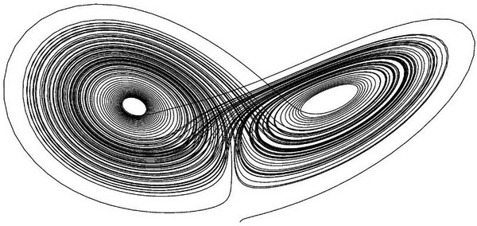

# Chapter 9 - Ordinary Differential Equations
You've already met the concept of differentiation in the context of functions and have almost certainly even applied it in the past to distance/speed/acceleration type questions. So, now let's see if we can apply this concept more generally to the class of problems called Ordinary Differential Equations (ODEs). These equations are referred to as 'ordinary' because the functions being differentiated are dependant on a single variable. For example, in mechanics so far, both speed and acceleration are a function of time only (ie $\frac{dx}{dt}\ \&\ \frac{d^2x}{dt^2}$), whereas you can imagine, for example, a problem involving the diffusion of heat, in which the local temperature is a function of both time and space (ie $T(t,x)$), meaning that you could in principal differentiate $T$ with respect to $t$ or $x$... or both! We will come back to these in a later chapter.   

First off, let's start with some notation. As with so many areas of maths, there are many ways to represent the same concept, so it's important that you don't get stuck always using the same style in class or you might be intimidated when you see something new in practice. However, the general rule is, use whatever style you prefer to use, just *be consistent* throughout any given document, also, if a question is asked in a certain style,  be sure to return the final answer in the same style. For the function $y(x)$, here are some equivalent ways of writing the \nth{1}, \nth{2} and \nth{3} derivatives:  

$$\begin{equation}
	\frac{\textrm{d}y}{\textrm{d}x}\equiv y'\equiv \dot{y}\equiv y_x\qquad\&\qquad
	\frac{\textrm{d}^2y}{\textrm{d}x^2}\equiv y''\equiv \ddot{y}\equiv y_{xx}\qquad\&\qquad
	\frac{\textrm{d}^3y}{\textrm{d}x^3}\equiv y^{(3)}
\end{equation}$$

  
Notice that some of the notation styles stop being appropriate for high order derivatives. It's also important to remember that it's implicit in the above expressions that $y$ is a function of $x$, and so the first derivative could equally be written $\frac{\textrm{d}y(x)}{\textrm{d}x}$... the '$(x)$' is often left out for convenience (which can occasionally cause confusion). I can only apologise for the lack of consistency and ask you to be brave and press on!  

## 9.1 Back to basics
So, let's start from the beginning. Consider the expression   

$$\begin{equation}
y=1
\end{equation}$$

  
It seems to be stating that some variable $y$ is equal to 1, but just like any other language, often in maths we require some context to understand what is meant. Based on the discussion above, you may have correctly guessed that what I implicitly mean is that the function $y(x)$ is equal to 1 for any/all values of $x$. Graphically, this would just be a horizontal line at $y=1$.  

So far so good, however, the next function requires a little bit more thought.  

$$\begin{equation}
y'=1
\end{equation}$$

  
If you are asked to 'find the solution' to this or 'solve' it, what this typically means is for you to find (if possible) an expression in the form '$y=...$' that satisfies the expression. By our previous experience with calculus, we can see that (through integration), the solution must be of the form  

$$\begin{equation}
y=x+c
\end{equation}$$

  
and because this solution contains an unknown variable (in this case $c$) we would call it a *general* solution. If you tried to sketch it on a graph, you'd have to draw an infinite number of parallel diagonal lines (gradient=1), where each would have a different value of $c$.  

However, if you were given a bit more information, such as that at $x=0$ then $y=2$, you can now work out $c$ and say that the solution must be $y=x+2$. This is called the *particular* solution.  

Similarly, for the function  

$$\begin{equation}
y''=1
\end{equation}$$

  
the general solution must be of the form
  

$$\begin{equation}
y=\frac{1}{2}x^2+ax+b
\end{equation}$$

  
because for any values of $a$ and $b$, $y''$ will always equal 1. Once again, to find $a$ and $b$, you'd need to be given more pieces of information (two more pieces to be exact).   

Nothing complicated here! But now lets see what happens when things get more interesting.... Consider the equation  

$$\begin{equation}
y=y'
\end{equation}$$

  
If you turn this into a slightly more wordy question, you're being asked, 'what function exactly equals the derivative of itself?'  

Do you know any?  

## 9.2 A function which is it's own derivative
Let's take a minute to recall the original 'lim(RoR)' (ie 'limit of rise over run') definition of a derivative:  

$$\begin{equation}
	y'(x)=\lim_{\Delta x \to 0}\left(\frac{y(x+\Delta x)-y(x)}{\Delta x}\right)
\end{equation}$$

  
As we're looking for the special case where $y'=y$, let's just substitute this in and see what happens.  

$$\begin{equation}
	y'(x)=\lim_{\Delta x \to 0}\left(\frac{y(x+\Delta x)-y(x)}{\Delta x}\right)=y(x)
\end{equation}$$

  
Now we need a good candidate function to investigate. Let's use the function $y=b^x$, where $b$ is some unknown constant. Why this function? Well if we take some test values for $b$, we can see that when $b$ is large (ie $b=100$), then the gradient of $100^x$ is always larger than $100^x$; whereas, when $b$ is small (ie $b=0.01$) the gradient of $0.01^x$ is always smaller than $0.01^x$... so perhaps there's a sweet spot in the middle!  

$$\begin{align}
b^x=\lim_{\Delta x \to 0}\left(\frac{b^{(x+\Delta x)}-b^x}{\Delta x}\right)
\end{align}$$

  
This can be rearranged (skipping a few steps here, but make sure you have a go at the algebra on your own if this looks like magic!) to   

$$\begin{align}
b=\lim_{\Delta x \to 0}\left((1+\Delta x)^\frac{1}{\Delta x}\right)
\end{align}$$

  
If you try to approximate this on your calculator, you'll probably start to recognise something. At $\Delta x=0.1$, $b\approx2.594$; at $\Delta x=0.01$, $b\approx2.705$; and at $\Delta x=0.001$, $b\approx2.718$... we've just found $e$, or 'Euler's number'!  

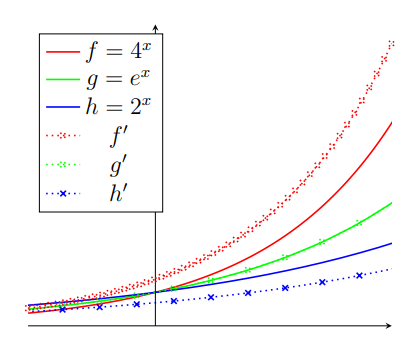 

That might seem like a lot of work, just to find something you probably already knew, but Euler's number is at the heart of differential equation analysis, as it's the only function that is its own derivative.... this is going to come in very handy!  

So, if we look again at the ODE $y=y'$, we can now say that the general solution must be of the form $y=ae^x$.   

### 9.2.1 Applying e more generally

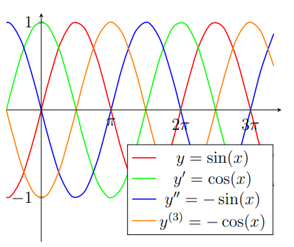 

What about the case of $y=-y'$? In this scenario, the function needs to equal the negative of its derivative, but actually this is no problem, because $y=e^{-x}$ differentiates to $y=-e^{-x}$. Job done. This same logic can also be used to solve $y''=y$, which is just $y=ae^x+be^{-x}$ (differentiate it twice to check).   

However, it's when you consider the case $y=-y''$ that things start to get interesting again. Now we're looking for a function which is the negative of its second derivative, so our $e^{-x}$ trick would not work here because we're differentiating twice and the two negative signs would cancel.   

So, can you think of any functions that are the negative of their second derivative... for a hint, see the figure... it's the trigonometric functions! So, now we can write a general solution to $y=-y''$ as $y=A\sin(x)+B\cos(x)$. We have to include both sine and cosine as they both have the negative of themselves as their second derivative. However, if, for example, we were also told that $y=0$ when $x=0$, then we'd know that the coefficient $B$ in our general solution must be zero, as otherwise $B\cos(0)$ would not satisfy this condition. With a second piece of information, such as $y=3$ when $x=\pi/2$, we can now find our particular solution by simply substituting this into $y=A\sin(x)$, to see that $A$ must equal 3.  

You might be wondering why I put so much emphasis on Euler's number if the trigonometric functions are also needed... and you might even be worried that perhaps this means many other functions are needed for special cases... which I might force you to learn for the exam...?   

Fear not! Just remember that you can express trig functions in terms of exponentials as follows  

$$\begin{equation}
\sin(x) = \frac{e^{ix}-e^{-ix}}{2i} \qquad\&\qquad
\cos(x) = \frac{e^{ix}+e^{-ix}}{2}
\end{equation}$$

  
So actually, the above $y=-y''$ case was just more Euler's number in disguise. This makes even more sense when you consider that the function $y=e^{ix}$ differentiates to $y'=ie^{ix}$ and then to $y''=i^2e^{ix}=-e^{ix}=-y$.

## 9.3 Categories
Various types of ODE exist and recognising which category a specific equation belongs to gives us an indication of how its solution might be found (as well as how difficult the analysis is going to be).  

Imagining all possible combinations of variables in an ODE, the vast majority of cases are considered to be ***non-linear***. Non-linear ODEs are typically more difficult to solve and their analysis is beyond the scope of this course. They contain non-linear elements, such as the products of variables/derivatives or terms with exponents, eg   

$$x\frac{\textrm{d}^2y}{\textrm{d}x^2}+y^2x-\left(\frac{\textrm{d}y}{\textrm{d}x}\right)^2=\sin(x) \qquad \text{and} \qquad y\left(\frac{\textrm{d}y}{\textrm{d}x}\right)-\sqrt{y}=0$$

  

However, the category of ***linear*** ODEs are very useful for describing a variety of physical systems and are also amenable to fairly straightforward analysis. All linear ODEs take the form of a sum of derivatives, each with a coefficient, (example of a second order shown below)

$$\sum_{i=1}^{n}a_iy^{(i)}=f(x)
\qquad\qquad\Rightarrow{\text{2}^{nd} \text{order}}\qquad\qquad
a\frac{\textrm{d}^2y}{\textrm{d}x^2}+b\frac{\textrm{d}y}{\textrm{d}x}+cy=f(x)$$

  
where $f(x)$ is a function of $x$, which does not need to be linear itself. Furthermore, within the category of linear ODEs, we also have the important sub-category of homogeneous, linear ODEs,  which are those expressions for which $f(x)=0$, ie   

$$\sum_{i=1}^{n}a_iy^{(i)}=0
\qquad\qquad\Rightarrow{\text{2}^{nd} \text{order}}\qquad\qquad
a\frac{\textrm{d}^2y}{\textrm{d}x^2}+b\frac{\textrm{d}y}{\textrm{d}x}+cy=0$$

  
The remainder of this chapter will be dedicated to the analysis of homogeneous, linear, second order ODEs, as they can be used to model several physical systems relevant to engineering. 
  

## 9.4 ODE in physical systems

This is the bit where we try to live up to the name 'engineering mathematics', by turning the maths into meaning. ODEs can be used to describe a very wide variety of physical systems, but the one that we're going to focus on here is often called the 'spring-mass-damper problem'.   

### 9.4.1 Spring-mass systems
Imagine a trolley of mass, ${\color{red}m}$, attached to a spring of stiffness, ${\color{green}k}$, that can move on a smooth (frictionless) surface (see figure for colours).
  

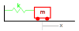 

This system can be described by a second-order, linear ODE by summing all of the forces acting on the trolley. Clearly, if the trolley is at rest and the spring is in its neutral position (neither extended or compressed), then there are no forces acting on the trolley. However, if we moved the trolley in the positive $x$ direction, this would extend the spring and the trolley would feel a corresponding force in the negative $x$ direction, pulling it back to the middle. In fact, this force would be negatively proportional to the distance, $x$, such that $F_\text{spring}=-{\color{green}k}x$ (where ${\color{green}k}$ represents the stiffness of the spring).   

We're currently holding the trolley in place, but if we now release it, the force from the spring will accelerate the trolley in the negative $x$ direction (\ie back toward the middle), from Newton's Second Law, we know that the sum of the forces on an object equals its mass times acceleration, $\Sigma F={\color{red}m}a\equiv{\color{red}m}\frac{\textrm{d}^2x}{\textrm{d}t^2}\equiv{\color{red}m}\ddot{x}\equiv{\color{red}m}x''$.   

So we can now write an expression for the motion of the trolley, which we can rearrange to see is just a second-order, linear, homogeneous ODE, as discussed above.   

$$-{\color{green}k}x={\color{red}m}a
\qquad\Rightarrow{\text{re-express}}\qquad
{\color{red}m}\ddot{x}+{\color{green}k}x=0
\qquad\Rightarrow{\text{rearrange}}\qquad
\ddot{x}=-\frac{\color{green}k}{\color{red}m}x
\qquad\xRightarrow{\text{re-express}}\qquad
x\propto-\ddot{x}$$

  
The four expressions above all express the same concept, although the first is perhaps the most descriptive (force balance); the second is the standard for this type of problem; the third statement helps us relate this concept to the discussion in the previous section about derivatives in general; and the final proportionality statement generalises the problem. We are clearly looking for something that is related to the negative of its own second derivative, which as we saw previously is a property of the trigonometric functions.   

So, we can say that the general solution for this problem, must be of the form $x=A\sin(\omega_0 t)+B\cos(\omega_0 t)$. Where did the new constant $\omega_0$ come from? Well, compared to our initial discussion, we now have some extra constants (${\color{green}k}$ and ${\color{red}m}$) to account for. Our equation tells us that our second derivative must equal $(-{\color{green}k}/{\color{red}m})$ times our solution. Remembering how trig. functions differentiate, we can see that:  

$$\begin{align}
x& =A\sin(\omega_0 t)+B\cos(\omega_0 t) , \qquad\\
\dot{x}& =A\omega_0\cos(\omega_0 t)-B\omega_0\sin(\omega_0 t) , \qquad\\
\ddot{x}& =-A\omega_0^2\sin(\omega_0 t)-B\omega_0^2\cos(\omega_0 t)=-\omega_0^2x
\end{align}$$

  
Therefore, $\omega_0^2=\frac{\color{green}k}{\color{red}m}$, and so $\omega_0=\sqrt{\frac{\color{green}k}{\color{red}m}}$. Notice that based on this definition $\omega_0$ has the units of 1/time, so we can think of it as a rate or frequency. Referring back to our equations, we can now see that the $\omega_0$ term is a kind of oscillation rate for our trolley system. But how do we find $A$ and $B$?  

### 9.4.2 Initial Conditions
In this idealised system, with no friction/air resistance/energy loss, if we move our trolley away from the middle to an initial starting position $x_0$ and then let go, its future position as a function of time, $x(t)$, will be described by the general solution $x=A\sin(\omega_0 t)+B\cos(\omega_0 t)$. In fact, now that we know the initial position, we can say that $x=x_0$ when $t=0$ and substituting this into our general solution gives, $x_0=A\sin(0)+B\cos(0)=A\times0+B\times1=B$, so $B=x_0$.   
 
 Furthermore, as we know that the trolley initially has zero speed at the instant we release it, we can say that $\dot{x}=0$ when $t=0$. Our updated first derivative expression is $\dot{x}=A\omega_0\cos(\omega_0 t)-x_0\omega_0\sin(\omega_0 t)$, so when we substitute our initial speed we get $0=A\omega_0\cos(0)-x_0\omega_0\sin(0)=A\omega_0$, so $A=0$.  
 
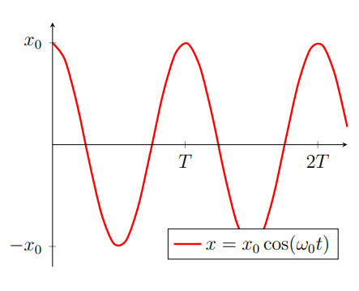 

By considering these two initial conditions, we can now write down our particular solution as $x=x_0\cos(\omega_0 t)$, where $\omega_0=\sqrt{\frac{\color{green}k}{\color{red}m}}$.   
 
 Physically, this means that our trolley is oscillating with an amplitude of $x_0$ and a frequency of $f=\frac{\omega_0}{2\pi}=\frac{\sqrt{\color{green}k/\color{red}m}}{2\pi}$, which we refer to as the *resonant* or *characteristic* or *natural* frequency (whereas $\omega_0$ is called the characteristic *angular frequency*). This means that every $T=\frac{2\pi}{\sqrt{\color{green}k/\color{red}m}}$ seconds, our trolley returns to the position from which we originally released it (we call $t$ the characteristic time period). As you can see from this expression (and hopefully from the imaginary trolley in your mind), increasing the mass of the trolley or reducing the stiffness of the spring both have the effect of increasing the time period of the oscillation.   
 
 We call these trolley/spring systems 'simple harmonic oscillators' and say that they perform **simple harmonic motion** (SHM). Without energy loss, this system must oscillate forever.   
 
Now imagine a slightly different scenario, where we take the same SHM system, but change the initial conditions. This time, rather than giving the trolley an initial displacement, we instead start it in the middle ($x|_{t=0}=0$), 
but give it an initial speed, $\dot{x}|_{t=0}\neq0$ (the vertical bar notation '$|$' means 'such that' or 'when', ie $x$ when $t=0$). Working through the analysis in the same way as the above, but using the two new initial conditions that $x=0$ and $\dot{x}=v_0$ when $t=0$, we would now recover the particular solution $x=\frac{v_0}{\omega_0}\sin(\omega_0 t)$. Make sure you can work this through on your own before reading on.
  

### 9.4.3 Damping

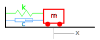

Now we are going to add another component to the system called a *damper*, which causes a force negatively proportional to the speed, a bit like wind resistance. You can see a simplified representation of a 'dashpot damper' in the adjacent figure. The design imagines a sealed tube containing a viscous fluid and a loosely fitting piston. As you move the trolley, the fluid has to squeeze around the piston, which would heat the fluid and dissipate energy (and we can think about {\color{cyan}$c$} as being a related to the fluid's 'viscosity').   

Unlike our SHM system from the previous section, we now have a means for the trolley to lose energy. This kind of system is therefore referred to as 'damped' and it has the following governing equation, where ${\color{cyan}c}$ is the damping constant:  

$$\color{red}m\ddot{x}+\color{cyan}c\dot{x}+\color{green}kx=0$$

  
This will be the first time that we attempt to tackle an ODE with three terms. Fortunately, there is a well defined method for this. We start be re-writing the equation replacing the acceleration/speed/position terms as follows:  

$${\color{red}m}\lambda^2+{\color{cyan}c}\lambda+{\color{green}k}=0$$

  
We now have what looks like quadratic equation in $\lambda$, referred to as the characteristic equation. We can find the roots of this equation by using the quadratic formula as usual.  

$$\lambda=\frac{-b\pm\sqrt{b^2-4ac}}{2a}
\qquad\xRightarrow{\text{substituting}}\qquad
\lambda=\frac{-{\color{cyan}c}\pm\sqrt{ {\color{cyan}c} ^2-4\color{red}m\color{green}k}}{2\color{red}m}$$

  
This is where things get interesting. The value of our discriminant ($\color{cyan}c^2-4\color{red}m\color{green}k$) tells us what kind of roots to expect and, assuming ${\color{red}m}$, $\color{cyan}c$ and $\color{green}k$ are all positive (as they would be in nature), there are three possible scenarios.   

**1. Two complex roots** (${\color{cyan}c}^2-4{\color{red}m}{\color{green}k}<0$): 'Underdamped'   

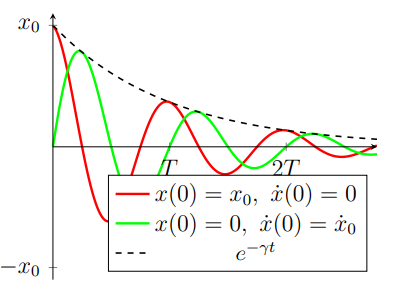

In this scenario, the trolley will still oscillate, but the damper has the effect of gradually draining the kinetic energy from the system. The general solution for this scenario is   

$$x=e^{-\gamma t}(A\sin(\omega_d t))+B\cos(\omega_d t))$$

  
where $\gamma=\frac{\color{cyan}c}{2\color{red}m}$ is the damping coefficient, and $\omega_d=\sqrt{\omega_0^2-\gamma^2}$ is the damped natural frequency. The damped natural frequency will always be lower than the undamped natural frequency. As before, in order to find $A$ and $B$, we need to know the initial conditions of the system (\ie displacements and velocities).   

**2. Two real roots** ($\color{cyan}c ^2-4\color{red}m\color{green}k>0$): 'Overdamped'  

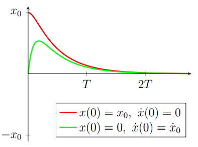

In this scenario, the trolley damping constant is so high that the motion of the trolley is just a battle between the spring and the damper. No oscillation occurs, just an exponential drift to $x=0$. The general solution for this scenario is   

$$x=Ae^{\lambda_1 t}+Be^{\lambda_2 t}$$

  
where $\lambda_1$ and $\lambda_2$ are the roots of the characteristic equation (which will always be negative...).  

**3. One real root** ($\color{cyan}c^2-4\color{red}}\color{green}k=0$): 'Critical damping'  

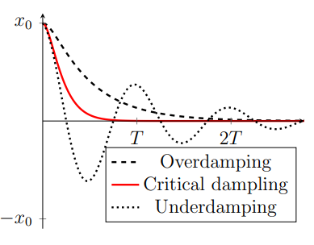

In this final case, the damping is tuned such that the trolley returns to the middle as fast as is possible *without* oscillation. This can be thought of as the scenario in which energy is lost from the system fastest. It is also when the damping constant equals the undamped natural frequency $\gamma=\omega_0$, \ie $\omega_d=0$. It has the general solution   

$$x=e^{-\gamma t}(A+Bt)$$

  
Mechanical systems, such as car suspension or nice kitchen draws which close slowly, often use grease with a carefully tuned viscosity to ensure that they are critically damped, in order to dissipate energy from the system as quickly as possible, but avoiding oscillation.   

### 9.4.4 Other physical systems

We can write the general form of the spring-mass-damper problem so that it includes a force as a function of time, $F(t)$, which would make it into a heterogeneous second-order, linear ODE. You'll learn methods for solving these later in the course.  

$$m\ddot{x}+c\dot{x}+kx=F(t)$$

  

Is it also possible to describe other physical systems using simple second-order, linear ODEs. The behaviour of a **series electrical circuit** consisting of an inductor, a resistor and a capacitor (the order is irrelevant) can be described using the following expression,  

$$L\frac{\textrm{d}I}{\textrm{d}t}+RI+\frac{q}{C}=V(t)$$

  
where $L$ is the inductance $C$ is the capacitance, $I$ is the current, $R$ is the resistance, $q$ is the net charge through the system, $V$ is the voltage and $t$ is time. At first this may appear significantly different from the trolley's equation; however, once you've realised that $I=\frac{\textrm{d}q}{\textrm{d}t}$, the similarity should be clearer.   

$$L\ddot{q}+R\dot{q}+C^{-1}q=V(t)$$

 
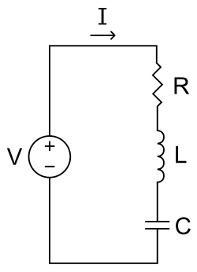

voltage and force, as well as charge and displacement. This in turn implies  conceptual translations from inductance to mass; resistance to damping; and inverse capacitance to spring stiffness. And it turns out the the maths really is identical.  

Similarly, **idealised hydraulic systems** containing a flywheel (mass or inductor), a constriction (damper or resistor) and a membrane (spring or capacitor), can be modelled using the following expression   

$$I\ddot{V}+\beta\dot{V}+\alpha V=P(t)$$

  

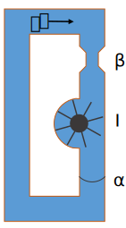

where $I$ is the flow specific moment of inertia of the fly wheel; $\beta$ is a viscous constriction factor; $\alpha$ is a volume specific membrane stiffness; $v$ is the volume of fluid displaced; $P$ is the pressure drop across the system; and $t$ is time... but even if you didn't know what these terms meant, you could still solve this ODE and discover things about this system. It's important to remember that all of the physical systems discussed in this chapter are only *approximately* described using our simple ODE and lots of assumptions need to be valid for this approximation to be useful... but useful they are!   

## 9.5 ODE summary

Although we only explored one tiny region of the differential equations universe (linear, homogeneous ODEs),  this has already allowed us to build approximate descriptions of several interesting physical systems. We also spent longer than a typical undergraduate course making sure that the foundations of our understanding were secure and I hope this means that when you come to tackle more complex problems, you'll be starting from a solid base.

    
