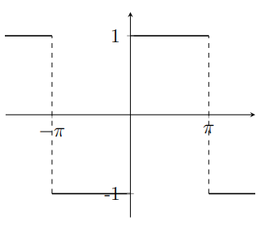

<script type="text/x-mathjax-config">
  MathJax.Hub.Config({
    tex2jax: {
      inlineMath: [ ['$','$'], ["\\(","\\)"] ],
      processEscapes: true
    }
  });
</script>

<script type="text/javascript" async
  src="https://cdnjs.cloudflare.com/ajax/libs/mathjax/2.7.5/MathJax.js?config=TeX-MML-AM_CHTML">
</script>
<script type="text/javascript" src="tutorialSheetScripts.js"> </script>
<link rel="stylesheet" type="text/css" media="all" href="styles.css">

## [Return to Contents](notes-contents)


# Converting notes from Latex (pdf) to Github pages
## Things to look out for

After getting access to the folder containing the source code, content can more or less all be copied and pasted from the .tex file to a markdown file.
<br><br>

* To maintain consistency, it would be a good idea to include 2 line breaks between each paragraph, after copying the text over.<br>

<div markdown="1">

```html:Code
Paragraph
<br><br>
Next paragraph
```

</div>

<br><br>
* In the Latex source code, the font is made Italic or bold with a latex command. To keep the font consistent in bodies of text change this to markdown syntax as shown below.<br>
<div markdown="1">

```html:Code
<!-- Italic and Bold in Latex -->
\textit{Italic} and \textbf{Bold}

<!-- Italic and Bold in Markdown -->
*Italic* and **Bold**
```

</div>

<br><br>

* To align images right and specify their size, use a tag similar to this.<br>
<div markdown="1">

```html:Code

```

</div>
<br><br>

* The best way to display figures made with Latex is yet to be found. The temporary quick and dirty workaround is to screen shot the figures directly from the notes pdf at high resolution and embed them as a png or svg
<br><br>

* Add $$ before and after free-standing math notation (not in bodies of text). For unknown reasons, github pages does not support all tags with the * syntax. Since equations are rarely references in text, it should be okay to remove the *. For example: <br>
<div markdown="1">

```html:Code
<!-- before -->
\begin{equation*}
\frac{\partial}{\partial x} \left[ f(x, y) \, g(x, y) \right] = 
\frac{\partial f(x,y)}{\partial x}\,g(x,y) + f(x,y)\,\frac{\partial
g(x,y)}{\partial x}
\end{equation*}

<!-- after -->
$$\begin{equation}
\frac{\partial}{\partial x} \left[ f(x, y) \, g(x, y) \right] = 
\frac{\partial f(x,y)}{\partial x}\,g(x,y) + f(x,y)\,\frac{\partial
g(x,y)}{\partial x}
\end{equation}$$
```

</div>

<br><br>

* There are a few known latex commands that do not render properly on Github pages. Up until now they have been replaced with the following: <br>
```html:Code
<!-- These don't work -->
\dd{x} , \me  , \xRightarrow

<!-- Replace with these -->
\textrm{d}x , e , \Rightarrow
```

</div>