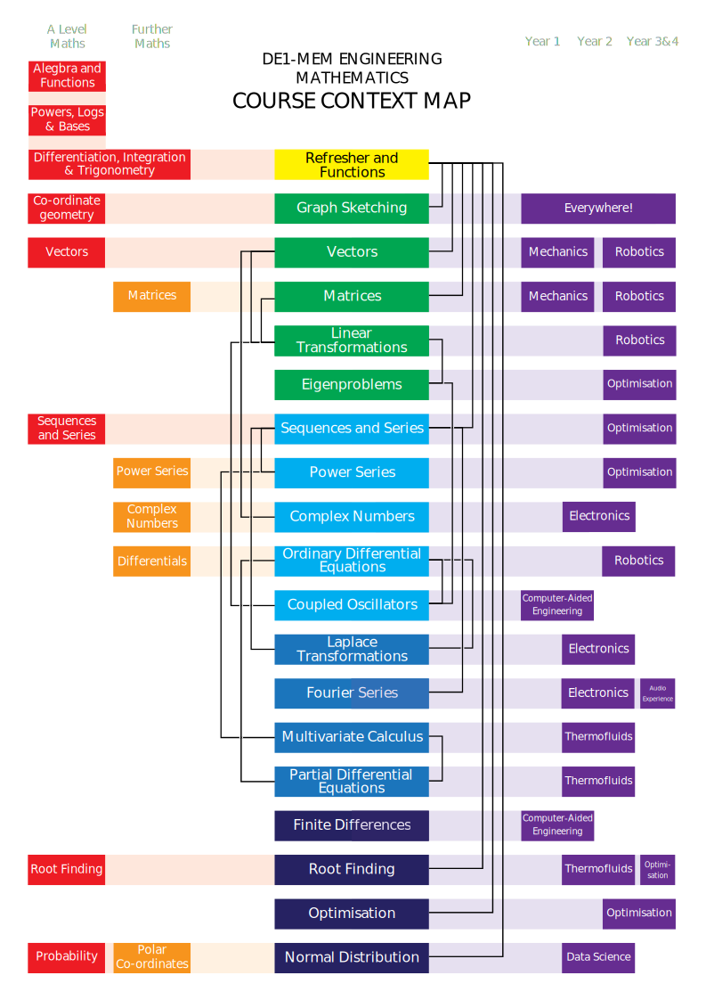

<link rel="stylesheet" type="text/css" media="all" href="styles.css">

# DE1-MEM: Engineering Mathematics
### Dr Sam Cooper - Dyson School of Design Engineering

 

## Contents

### Chapter 0 - [Refresher](0-refresher)
* __[0.1 - Algebra](0-refresher#algebra)__
* __[0.2 - Calculus](0-refresher#calculus)__
* __[0.3 - Using calculus](0-refresher#using-calculus)__
* __[0.4 - Powers, logs & bases](0-refresher#powers-logs-bases)__
* __[0.5 - Engineers Love](0-refresher#engineers-love)__

### Chapter 1 - [Functions](1-functions)
* __[1.1 - Curve Sketching](1-functions#curve-sketching)__

### Chapter 2 - [Vectors](2-vectors)
* __[2.1 - Co-ordinate Geometry](2-vectors#co-ordinate-geometry)__
* __[2.2 - Vector multiplication](2-vectors#vector-multiplication)__
* __[2.3 - Vector equation of line](2-vectors#vector-equation)__

### Chapter 3 - [Matrices](3-matrices)
* __[3.1 - Matrix Operations](2-vectors#matrix-operations)__
* __[3.2 - Rules of Addition and Multiplication](3-matrices#rules)__
* __[3.3 - Transpose](3-matrices#transpose)__
* __[3.4 - Square Matrices](3-matrices#square-matrices)__
* __[3.5 - Inverses](3-matrices#inverses)__
* __[3.6 - Linear Systems](3-matrices#linear-systems)__
* __[3.7 - Labels](3-matrices#labels)__

### Chapter 4 - [Linear Transformations](4-linear-transformations)
* __[4.1 - Demystifying Linear Transformations](4-linear-transformations#demystifying)__
* __[4.2 - One Dimension](4-linear-transformations#one-dimension)__
* __[4.3 - Two Dimensions](4-linear-transformations#two-dimensions)__
* __[4.4 - Three Dimensions](4-linear-transformations#three-dimensions)__
* __[4.5 - Determinant and Inverse](4-linear-transformations#determinant-and-inverse)__

### Chapter 5 - [Eigenproblems](5-Eigenproblems)
* __[5.1 - Definitions](5-Eigenproblems#definitions)__
* __[5.2 - Calculating Eigensolutions](5-Eigenproblems#calculating-eigensolutions)__
* __[5.3 - Finding All Eigenvalues](5-Eigenproblems#finding-all-values)__
* __[5.4 - Finding All Eigenvectors](5-Eigenproblems#finding-all-vectors)__
* __[5.5 - Interpretation Of Eigensolutions](5-Eigenproblems#interpretation-of-solutions)__

### Chapter 6 - [Sequences and Series](6-sequences-and-series)
* __[6.1 - Sequences](6-sequences-and-series#sequences)__
* __[6.2 - Series](6-sequences-and-series#series)__
* __[6.3 - Limits and Convergence](6-sequences-and-series#limits)__
* __[6.4 - Truncated sum of 1, $n$, $n^2$ and $n^3$](6-sequences-and-series#truncated-sums)__
* __[6.5 - Mind Blown](6-sequences-and-series#seq-ser-mind-blown)__

### Chapter 7 - [Power Series](7-power-series)
* __[7.1 - Maclaurin Series](7-power-series#maclaurin-series)__
* __[7.2 - Taylor Series](7-power-series#taylor-series)__

 

## About the Course
This course is a rapid introduction (or reminder for some) to a range of topics that you will find useful during your engineering career. A huge amount of wonderful resources have become freely available online in the past few years, in the form of videos, blogs, forums, wikis etc.. My hope for this course is that you finish with the confidence necessary to look up questions that you don't understand and hopefully re-purpose methods from one area to another. 
  
Some undergraduate courses expect students to memorise a lot of formulae and derivations; however, now that all of mankind's collected knowledge is just a few clicks away, there is no longer much value in this! Instead, we will focus on developing an intuitive understanding of the various topics, which I hope will not only be more useful, but also much more enjoyable and satisfying!
  
These notes are not intended to be comprehensive (that is what the internet is for), but instead hope to offer a fast paced and engaging description of the concepts, pitched at a level appropriate to DE1. Some the material is based on notes developed by Dr Rhazaoui, who taught the first iteration of this course. 

### Course Support and Assessment

Learning maths is a very personal activity, with each student having their own approach; however, to really understand what's going on, there is no  way around putting in the work on your own, occasionally getting stuck and thinking your way out. That said, I really hope the notes, lectures, online videos, tutorial sheets and quizzes help to push you in the right direction and keep you motivated!
  
Every week, you will take a short non-credit quiz to help me (and you) understand how you're getting on. The course will be assessed through a combination 4 progress tests at half termly intervals, as well as 2 more substantial exams at the beginning of terms two and three. The course is two terms long and each week we will have 2 one hour lectures introducing the material. We will also have weekly tutorial sessions which will be 2 hours in the first term and 1 hour in the second. These sessions are primarily intended for you to ask the tutors questions about the material from the previous weeks and are not ideal for quite study. We will use Learning Catalytics to support the learning process, by running live quizzes.

### Further Resources
KL Stroud and DJ Booth, _Engineering Mathematics_, 7th Ed., Macmillan, 2013 (Imperial library 510.246STR), is probably _the_ core text for 1st year Maths, although ML Boas, _Mathematical Methods in the Physical Sciences_, 3rd Ed., Wiley, 2006 (Imperial library: 530.15BOA) is a bit less wordy and goes into some more advanced topics as wells. 
  
WolframAlpha is a brilliant mathematical resource and if you are ever stuck with a question, this should be one of your first ports of call. Finally, I would like to recommend several wonderful YouTube series, including WelchLabs, 3Blue1Brown, blackpenredpen and Numberphile as a source of mathematical inspiration and delight.
  

    

<!--

-->

This work is licensed under the Creative Commons Attribution- Noncommercial- Share Alike 2.0 UK: England \& Wales License.   To view a copy of this license, visit  http://creativecommons.org/licenses/by-nc-sa/2.0/uk/ or send a letter to Creative Commons, 171 Second Street, Suite 300, San Francisco, California, 94105, USA.
	
These notes were written by Dr Sam Cooper and Dr Freddie Page of the Dyson School of Design Engineering, Imperial College London - corrections to samuel.cooper@imperial.ac.uk.
	
Thanks to Dr Khalil Rhazaoui for bravely pulling together the first draft of the notes for this course, which were helpful as a basis for creating later versions. Thanks also to Prof. Dave Dye who mentored me as a lecturer and whose notes were helpful for some of the later chapters of this book.
 

