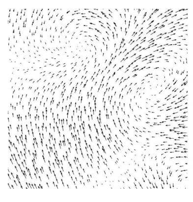

<link rel="stylesheet" type="text/css" media="all" href="styles.css">

# Tutorial Sheet Title, Week x

### Learning targets

### Reading
* [section](link#page=x)

### Lectures
* One (monday)
* Two (tuesday)

### Additional resources
*insert links*

    

# Problem sheet
## Essential Questions
### Problem 1.
Problem text $f = (x) \Leftarrow \text{this is some math}$

(a)

 answer 

        

-----------------------------------------------------------------------------------

        

-----------------------------------

## Exam Style Questions
### Problem n.

        

-----------------------------------

## Challenging Questions
### Problem n.

        

## Answers

<button type="button" onclick="displayAnswerButtons('block')">Show answer buttons</button>
<button type="button" onclick="displayAnswers('block')">Show all answers</button>
<button type="button" onclick="displayAnswers('none')">Hide all answers</button>
  
### For Printing
<button type="button" onclick="prepareForPrint('block')">Add whitespace</button>
<button type="button" onclick="prepareForPrint('none')">Remove whitespace</button>

  

# Next week, another topic!
