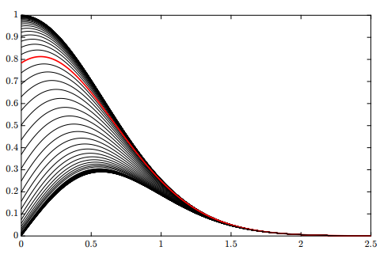

<link rel="stylesheet" type="text/css" media="all" href="styles.css">

# Refresher and Functions Tutorial Sheet, Sheet #1

### Learning Targets

1. Use the method of partial fractions
1. Find the derivative of functions with the product, chain and sum rules
1. Find the integral of functions using the power rule, sum rule and integration by parts
1. Simplify logarithms
1. Identify key points in a function (roots, asymptotes, stationary points, inflection points, domain, range)
1. Sketch a graph of a given function

<!-- ### Reading
* [Intro](https://legoyoda112.github.io/DE-MEM-Resources/files/DE1-MEM_notes_2019.pdf#page=7)
* [Chapter 0 - Refersher](https://legoyoda112.github.io/DE-MEM-Resources/files/DE1-MEM_notes_2019.pdf#page=10)
* [Chapter 1 - Functions](https://legoyoda112.github.io/DE-MEM-Resources/files/DE1-MEM_notes_2019.pdf#page=18)

### Lectures
* Welcome (monday) *(populate with recording link?)*
* Function sketching (tuesday) * -->

### Additional Resources
* [SJC - Curve Sketching](https://youtu.be/EFxv2r9gwtc)
* [3Blue1Brown - Calculus Playlist](https://www.youtube.com/playlist?list=PLZHQObOWTQDMsr9K-rj53DwVRMYO3t5Yr)
* [WA - Sketch Any Function](https://www.wolframalpha.com/input/?i=(x%5E2%2B3x-7)%2F(x-9))

    

# Problem sheet
## Essential Questions
### Problem 1.
Separate the following using the method of partial fractions.

(a) $\frac{x^2-6}{x^3-x}$

$\Rightarrow \quad $ factorise the denominator $\Rightarrow{}\ \ x^3-x = x(x+1)(x-1)$  
$\Rightarrow{}\ \ \frac{x^2-6}{x^3-x} = \frac{A}{x} + \frac{B}{(x+1)} + \frac{C}{(x-1)}$  
from numerators  $x^2 - 6 = (A+B+C)x^2 + (C-B)x - A$  
$\Rightarrow \quad A+B+C = 1,\\ \quad C-B = 0,\\ \quad A = 6$  
$\Rightarrow \quad C = B = \frac{-5}{2}$  
$\Rightarrow{}\ \ \boxed{ \frac{x^2-6}{x^3-x} = \frac{6}{x} - \frac{5}{2(x+1)} - \frac{5}{2(x-1)}}$

Hello!

(b) $\frac{5(x-7)}{x^2+2x-35}$

$\Rightarrow{}\quad$ factorize the denominator  
$\Rightarrow \quad x^2+2x-35 = (x+7)(x-5)$  
$\Rightarrow \quad \frac{5(x-7)}{x^2+2x-35} = \frac{A}{x+7} + \frac{B}{x-5}$  
$\Rightarrow \quad $ from numerators  $5x-35 = (A+B)x - 5A + 7B$  
$\Rightarrow \quad A+B = 5,\quad -5A + 7B = -35$  
$\Rightarrow \quad \boxed{A = \frac{35}{6},\quad B=\frac{-5}{6},
\ \ \frac{5(x-7)}{x^2+2x-35} = \frac{35}{6(x+7)} - \frac{5}{6(x-5)} }$

(c) $\frac{x-1}{(3x+2)^2(2x+3)}$

$\Rightarrow{}\quad$ for linear and repeated factors  
$\Rightarrow{}\ \ \frac{x-1}{(3x+2)^2(2x+3)} = \frac{A}{2x+3} + \frac{B}{3x+2} + \frac{C}{(3x+2)^2}$  
$\Rightarrow{}\quad$from numerators $\Rightarrow{}\quad x-1 = (9A+6B)x^2 + (12A+13B+2C)x + 4A + 6B +3C$  
$\Rightarrow{}\quad 9A+6B = 0,\quad 12A +13B +2C = 1,\quad 4A+6B+3C=-1$  
$\Rightarrow{}\quad A = \frac{-2}{5},\quad B=\frac{3}{5},\quad C=-1$  
$\Rightarrow{}\ \ \boxed{ \frac{x-1}{(3x+2)^2(2x+3)} = -\frac{2}{5(2x+3)} + \frac{3}{5(3x+2)} - \frac{1}{(3x+2)^2} }$

        

-----------------------------------------------------------------------------------

### Problem 2.
Obtain the derivative of the function, $f(x)=\frac{x+3}{2-x}$, using the definition of derivative (The limit of rise over run or "$\lim{(RoR)}$"

(a) $f(x)= {x^2}$

$\Rightarrow{}\quad$ using the expression $$f'(x) = \lim_{\Delta x\to0} \frac{f(x+\Delta x) - f(x)}{\Delta x}$$  
$\Rightarrow{}\ \ f'(x) = \lim_{\Delta x\to0} \frac{(x+\Delta x)^2-(x^2)}{\Delta x}$  
$\Rightarrow{}\ \ f'(x) = \lim_{\Delta x\to0} \frac{2 * \Delta x * x}{\Delta x} = \boxed{\frac{2x}}$

(b) $f(x)= \sin{x}$

$\Rightarrow{}\ \ f'(x) = \lim_{\Delta x\to0} \frac{\sin{x}\cos{\Delta x}} + \frac{\cos{x}\sin{\Delta x}} - \frac{\sin{x}}{\Delta x} = \boxed{\cos{x}}$

(c)$f(x)=\frac{x+3}{2-x}$

$
$\Rightarrow{}\ \ f'(x) = \lim_{\Delta x\to0} \frac{\frac{(x+\Delta x)+3}{2-(x+\Delta x)} - \frac{(x+3)}{(2-x)}}{\Delta x} = \lim_{\Delta x\to0} \frac{\frac{5\Delta x}{(2-x)(2-x-\Delta x)}}{\Delta x}$  
$\Rightarrow{}\ \ f'(x) = \lim_{\Delta x\to0} \frac{5}{(2-x)(2-x-\Delta x)}= \boxed{ \frac{5}{(2-x)^2} }$

$ The exam won't need to do this :)$

        

-----------------------------------------------------------------------------------

### Problem 3.
Obtain the derivative of the following functions, using the product, chain and sum rule

(a) $f(x) = x^3 e^{2x}$

$\Rightarrow{}$ Using product rule $\Rightarrow{} \frac{d}{dx}(uv) = v\frac{du}{dx} + u\frac{dv}{dx}\\ \Rightarrow{} u = x^3,\quad v=\exp{(2x)}$  
$\Rightarrow{} \frac{du}{dx} = 3x^2$  
$\Rightarrow{}$ using chain rule $\frac{d}{dx}v(g(x)) = \frac{dv}{dg}\frac{dg}{dx}$ to solve $\frac{dv}{dx}$ with $g(x) = 2x $  
$\Rightarrow{} \frac{dv}{dx} = 2\exp{(2x)}$  
$\Rightarrow{} \boxed{\frac{df(x)}{dx} = 3x^2\exp{(2x)} + 2x^3\exp{(2x)} \Rightarrow{} \frac{df(x)}{dx} = x^2\exp{(2x)}(3 + 2x)}$

(b) $f(x) = \sin{(x^2 + 3x)}$

$\Rightarrow{}$ Using chain rule $\Rightarrow{} \frac{df(x)}{dx}= \cos{(x^2+3x)}\frac{d}{dx}(x^2+3x)$  
$\Rightarrow{}$ Using sum rule $\Rightarrow{} \frac{d}{dx}(g(x)+h(x)) = \frac{dg}{dx} + \frac{dh}{dx}$  
$\Rightarrow{} \frac{d}{dx}(x^2+3x) = 2x + 3 $  
$\Rightarrow{} \boxed{\frac{df(x)}{dx} = \cos{(x^2+3x)}(2x + 3)}$

(c) $f(x) = \frac{x^2+2}{3x+1}$

$\Rightarrow{}$ Using product, chain and sum rule  
$\Rightarrow{} f(x) = (x^2+2)(3x+1)^{-1}$  
$\Rightarrow{} \frac{df(x)}{dx} = 2x(3x+1)^{-1} + (x^2+2)(-3(3x+1)^{-2})$  
$\Rightarrow{} \boxed{\frac{df(x)}{dx} = \frac{3x^2+2x-6}{(3x+1)^{2}}}$  

        

-----------------------------------------------------------------------------------

### Problem 4.
Integrate the following functions, using the power rule, sum rule and integration by parts.

(a) $f(x) = 2x\sin{(x)}$

$\Rightarrow{} \int{2x\sin{(x)}}dx$  
$\Rightarrow{}$ using integration by parts $\Rightarrow{} \int{udv} = uv -\int{vdu}$  
$\Rightarrow{} u =2x,\quad dv=\sin{(x)dx} \Rightarrow{} du=2dx,\quad v=-\cos{(x)}$  
$\Rightarrow{} \int{2x\sin{(x)}}dx = 2x(-\cos{(x)}) - \int{(-cox(x))2}dx$  
$\Rightarrow{} \int{2x\sin{(x)}}dx = -2x\cos{(x)} + 2\int{\cos{(x)}}dx$  
$\Rightarrow{} \boxed{\int{2x\sin{(x)}}dx = -2x\cos{(x)} + 2\sin{(x)} + c}$

(b) $f(x) = x^2 \ln{(4x)}$

$\Rightarrow{} \int{x^2 \ln{(4x)}}dx$  
$\Rightarrow{}$ using integration by parts $\Rightarrow{} u =\ln{(4x)},\quad dv=x^2dx \Rightarrow{} du=\frac{1}{x}dx,\quad v=\frac{x^3}{3}$  
$\Rightarrow{} \int{x^2 \ln{(4x)}}dx = \ln{(4x)}\frac{x^3}{3} - \int{\frac{x^3}{3}\frac{1}{x}}dx$  
$\Rightarrow{} \int{x^2 \ln{(4x)}}dx = \frac{x^3}{3}\ln{(4x)} - \int{\frac{x^2}{3}}dx$  
$\Rightarrow{} \int{x^2 \ln{(4x)}}dx = \frac{x^3}{3}\ln{(4x)} - \int{\frac{x^2}{3}}dx$  
$\Rightarrow{} \int{x^2 \ln{(4x)}}dx = \frac{x^3}{3}\ln{(4x)} - \frac{x^3}{9} + c$  
$\Rightarrow{} \boxed{\int{x^2 \ln{(4x)}}dx = \frac{x^3}{9}{(3\ln{(4x)} - 1) + c}}$  

(c) $f(x) = x^5 e^{x^2}$

$\Rightarrow{} \int{x^5 \exp{(x^2)}}dx$  
$\Rightarrow{}$ substitute $ u =x^2,\quad du=2xdx$  
$\Rightarrow{} \int{x^5 \exp{(x^2)}}dx = \frac{1}{2}\int{u^2 \exp{(u)}}du$  
$\Rightarrow{}$ using integration by parts  
$\Rightarrow{} f =u^2,\quad dg=\exp{(u)}du \\ \Rightarrow{} df=2udu,\quad g=\exp{(u)}$  
$\Rightarrow{} \frac{1}{2}\int{u^2 \exp{(u)}}du = \frac{1}{2} \big[u^2\exp{(u)} - \int{\exp{(u)}2u}du \big]$  
$\Rightarrow{} \frac{1}{2}\int{u^2 \exp{(u)}}du = \frac{1}{2}u^2\exp{(u)} - \int{\exp{(u)}u}du$  
$\Rightarrow{}$ using integration by parts $\Rightarrow{} f =u,\quad dg=\exp{(u)}du \Rightarrow{} df=du,\quad g=\exp{(u)}$  
$\Rightarrow{} \frac{1}{2}\int{u^2 \exp{(u)}}du = \frac{1}{2}u^2\exp{(u)} - \big[ u\exp{(u)} - \int{\exp{(u)}}du \big]$  
$\Rightarrow{} \frac{1}{2}\int{u^2 \exp{(u)}}du = \frac{1}{2}u^2\exp{(u)} - u\exp{(u)} + \exp{(u)} + c$  
$\Rightarrow{} \frac{1}{2}\int{u^2 \exp{(u)}}du = \frac{1}{2}\exp{(u)}(u^2 - 2u + 2) + c$  
$\Rightarrow{}$ substitute back for $ u =x^2$  
$\Rightarrow{} \boxed{\int{x^5 \exp{(x^2)}}dx = \frac{1}{2}\exp{(x^2)}(x^4 - 2x^2 + 2) + c}$

        

-----------------------------------------------------------------------------------

### Problem 5.
Express the following without logarithms (assume we are working in base 10 unless otherwise stated)

(a) $\log{x}=\log{P}+2\log{Q}-\log{K}-3$

$\log{x}=\log{\frac{PQ^2}{K}}-\log{1000\ \ \ }$  
$\Rightarrow{}\ \ \boxed{=\frac{PQ^2}{1000K}}$ 

(b) $\log{R}=1+\frac{1}{3}\log{M}+3\log{S}$

$\Rightarrow{} \log{R=\log{10+\log{M^{\frac{1}{3}}+\log{S^3\ \ }}}}$  
$\Rightarrow{}\ \boxed{R=10 \cdot S^3 \cdot \sqrt[3]{M}}$

(c) $\ln{P}=\frac{1}{2}\ln\left(Q+1\right)-3\ln{R}+2$

$\Rightarrow{} \ln{P=\ln{ \left(Q+1\right) }^{\frac{1}{2}}+\ln{e^2-\ln{R^3}}}$  
$\Rightarrow{}\ \ \boxed{P=\frac{e^2\sqrt{Q+1}}{R^3}}$

        

-----------------------------------------------------------------------------------

### Problem 6.
Express the following in log form, with no fractions or powers inside the log.

(a) $V=\frac{\pi{}h}{4}\left(D-h\right)\left(D+h\right)$

$\Rightarrow\log{V=\boxed{\log{\pi{}+\log{h+\log{(D-h)}}}+\log{\left(D+h\right)-\log4}}}$

(b) $P=\frac{1}{16}(2d-1)^2N\sqrt{S}$

$\Rightarrow\log{P}=\boxed{2\log{\left(2d-1\right)}+\log{N}+\frac{1}{2}\log{S}-\log{16}}$

        

-----------------------------------------------------------------------------------

### Problem 7.
Solve the following equations using logarithm theorems.

(a) $\log{(5x-1)}=2$

${10}^2=5x-1\ \ \
\Rightarrow{}\ \ \ \boxed{x=\frac{101}{5}=20.2}$

(b) $\log_2{(x+1)}-\log_2{(x-4)}=3$

$\log_2{\frac{x+1}{x-4}}=3\ \ \ \Rightarrow{}\ \ \ 2^3=\frac{x+1}{x-4}$
$\Rightarrow{}\ \ \ x+1=8x-32\ \ \ \Rightarrow{}\ \ \ \boxed{x=\frac{33}{7}=4.71...}$

(c) $\log_6{(x+4)}+\log_6{(x-2)}=\log_6{(4x)}$ where $x>0$

$\log_6{\left((x+4).(x-2)\right)}=\log_6{4x}\ \ \Rightarrow{}\ \left(x+4\right)\left(x-2\right)=4x$  
$\Rightarrow{}\ \ x^2-2x-8=0$  
$\Rightarrow{}\ \ \ (x-4)(x+2)=0\ \ \ x_1=4 \text{ and } x_2=-2\ \ \ \Rightarrow{}\ \ \ \boxed{x=4}$

        

-----------------------------------------------------------------------------------

### Problem 8.
Determine the domain and range of the functions defined below.

(a) $f(x)=\cos^2{(x)}$

$\Rightarrow{}\boxed{
\text{Domain of } f\left(x\right)\ \Rightarrow{}\ \ (-\infty{},\infty{})}$  
$\Rightarrow{} \boxed{ \text{Range of f }\left(x\right)\Rightarrow{}[0,1].}$

(b) $f(x)={-x}^2+5x-6$

$\Rightarrow{}\boxed{\text{Domain of f}\left(x\right)\ \Rightarrow{}\ \ (-\infty{},\infty{})}$  
$\Rightarrow{}\boxed{\text{Range of } f(x) \Rightarrow{} \text{, function has one maximum.}
\Rightarrow{}\quad y\leq \frac{1}{4}}$

(c) $f(x)=-x^3+4x^2-4x\ $

$\Rightarrow{}\boxed{\text{
Domain of f}\left(x\right)\ \Rightarrow{}(-\infty{},\infty{})}$.  
$\Rightarrow{}\boxed{\text{Range of f}\left(x\right)\Rightarrow{}\ \ (-\infty{},\infty{})}$

(d) $f\left(x\right)=$exp⁡$(1/x)$

$y=e^{\frac{1}{x}}\ \Rightarrow{}$ at  $x=0$, the function is undefined.
$\Rightarrow{} \boxed{\text{Domain of } f(x)\ \Rightarrow{}(-\infty{},0)\cup{}(0,\infty{})}$.  
$y=e^{\frac{1}{x}}\ \Rightarrow{}$ at $y=1$, the function is undefined.  
$\Rightarrow{} 0 < y < 1 \text{ & } y>1$  
$ \Rightarrow{}\ \ \boxed{\text{Range of } f(x)\ \Rightarrow{}\ \ (0,1)\cup{}(1,\infty{})}$

(e) $f\left(x\right)=\frac{1}{e^x+1}$

 $\Rightarrow{} \boxed{\text{Domain of the function} \Rightarrow{}(-\infty{},\infty{})}$.  
$y=\frac{1}{e^x+1}\ \Rightarrow{}$ at $y=0\ \text{ & } y=1$, the function is undefined.  
$\Rightarrow{}\boxed{\text{Range of } f(x)\ \Rightarrow{}\ \ (0,1)}$.

        

-----------------------------------------------------------------------------------

### Problem 9.
Evaluate the following by applying change of base to base 10 (rounded to 1 decimal place) and then using these numbers with finite accuracy to calculate the final answer (also to 3 significant figures)

(a) $\log_2{15}$

$\log_{10}2\times{}\log_2{15}=\log_{10}{15}$
$\Rightarrow{} \boxed{\log_2{15}=\frac{\log_{10}{15}}{\log_{10}2}\approx\frac{1.2}{0.3}=4.00.}$

(b) $\log_{20}{17}$

$\log_{10}20\times{}\log_{20}{17}=\log_{10}{17}$
$\Rightarrow{} \boxed{\log_{20}{17}=\frac{\log_{10}{17}}{\log_{10}20}\approx\frac{1.2}{1.3}=0.923}$

(c) $\log_3{16}$

$\log_{10}3\times{}\log_3{16}=\log_{10}{16}$ 
$\Rightarrow{} \boxed{\log_3{16}=\frac{\log_{10}{16}}{\log_{10}3}\approx\frac{1.2}{0.5}=2.40}$

        

## Exam Style Questions
### Problem 10.
A curve has equation $f(x) = \frac{ax^2 - 12}{4x^2 + bx - 6}$, where $a$ and $b$ are constants.

(a) Find the coordinates of the point where the curve crosses the $y$-axis

 When $x=0, f(x)=\frac{-12}{-6} \\ \Rightarrow{} f(x) = 2,\ \\ \Rightarrow{} \boxed{(0,2)}$ 

(b) You are given that the curve has a vertical asymptote at $x=2$. Find the value of $b$ and the equation of the other vertical asymptote.

At $x=2, 4x^2 +bx - 6 = 0$  
$\Rightarrow 4(2)^2 + b(2) - 6 = 0 \Rightarrow \boxed{b = - 5}$  
$\Rightarrow$ Factorise $4x^2 - 5x - 6$  
$\Rightarrow (4x+3)(x-2)$   
$\therefore$ The other asymptote occurs when $4x+3=0 \Rightarrow \boxed{x = -\frac{3}{4}}$

(c) You are given that the curve crosses the $x$-axis when $x= \pm{\sqrt{6}}$. Find the value of $a$ and the equation of the horizontal asymptote.

When $f(x)=0, x = \pm{\sqrt{6}}$  
$\therefore 0 = \frac{ax^2 - 12}{4x^2 + bx - 6}\\ a(6)-12 = 0 $  
$6a = 12 \Rightarrow \boxed{a = 2}$  
Horizontal asymptote occurs when $x \rightarrow{\infty}$  
$f(x)$ will tend to the highest powers of x  
$\Rightarrow f(x) = \frac{ax^2}{4x^2}$  
Therefore, the horizontal asymptote occurs at $\boxed{y=\frac{1}{2}.}$ 

(d) Find the set of values for which $y \geqslant 0$.

Using the graph you sketched, you can see that $y$ is greater than or equal to zero in the regions where $\boxed{x\leqslant -\sqrt{6}, \space - \frac{3}{4} < x < 2, \space x \geqslant \sqrt{6}}$ 

(e) Find the domain (using the set notation)

$\boxed{ x \ \epsilon \ \mathbb{R}, x \neq -\frac{3}{4}, x \neq 2}$

(f) Sketch the function, indicating the location of the features listed above

<iframe src="https://www.desmos.com/calculator/ll5ygltnd3?embed" width="500px" height="500px" style="border: 1px solid #ccc" frameborder=0></iframe>

        

-----------------------------------------------------------------------------------

### Problem 11.
 A curve has equation $y=\frac{3x^2 - 9}{x^2 + 3x - 4}$

(a) Find the equations of the two vertical asymptotes and the one horizontal asymptote of this curve.

$\boxed{x = 1 \\ x = -4 \\ y = 3}$ 

(b) State, with justification, how the curve approaches the horizontal asymptote for large positive and large negative values of x.

$\text{Large positive}\ x, \boxed{y \ \rightarrow{3} \text{ from below}}$  
$\text{Large negative} \ x, \boxed{ \ y \rightarrow{3}\text{ from above}}$

(c) Sketch the curve

<iframe src="https://www.desmos.com/calculator/jdzogmrkh8?embed" width="500px" height="500px" style="border: 1px solid #ccc" frameborder=0> 
</iframe>

(d) Solve the inequality $\frac{3x^2 - 9}{x^2 + 3x -4} \geqslant 0. $

From the graph you have just sketched, you can see that the function is greater than or equal to zero in the regions where $\boxed{x<-4, -\sqrt{3} \leqslant x < 1, x \geqslant \sqrt{3}}$

        

------------
<button type="button" onclick="displayAnswerButtons('block')">Show answer buttons</button>
<button type="button" onclick="displayAnswers('block')">Show all answers</button>
<button type="button" onclick="displayAnswers('none')">Hide all answers</button>
  
### For Printing
<button type="button" onclick="prepareForPrint('block')">Add whitespace</button>
<button type="button" onclick="prepareForPrint('none')">Remove whitespace</button>

  

# Next week, Vectors!
