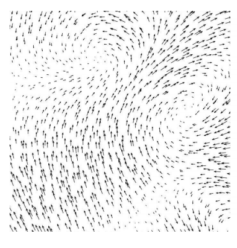

<link rel="stylesheet" type="text/css" media="all" href="styles.css">

# Vectors, Sheet #2

### Learning Targets
* Add and subtract vectors
* Find the modulus of a vector
* Find the unit vector
* Calculate the scalar product
* Use $\cos{\theta} = \frac{\vec{a}\cdot\vec{b}}{\|\vec{a}\|\|\vec{b}\|}$
* Use the cross product
* Use basis vectors
* Find the cartesian and vector equations for a plane
* Find the minimum distance between vectors

### Additional Resources
* [3Blue1Brown - Linear Algebra Playlist](https://www.youtube.com/playlist?list=PLZHQObOWTQDPD3MizzM2xVFitgF8hE_ab)
* [Skew vectors example](https://youtu.be/HC5YikQxwZA)

    

# Problem sheet
## Essential Questions
### Problem 1.
Consider the three vectors $\vec{a}= (2,1,0)$, $\vec{b}= (-1,2,3)$, and $\vec{c}= (1,2,1)$. Calculate the following:

(a) $\vec{a}+\vec{b}$

$\Rightarrow \quad \boxed{\vec{a}+\vec{b}=(1,3,3)}$

(b) $2\vec{a}-\vec{b}$

$2\vec{a}-\vec{b}=((2\times2+1),\space (2\times1-2),\space (2\times0-3)) = \boxed{ (5,0,-3)}$

(c) $\vec{a}\circ\vec{b}\circ \vec{c}$

$\vec{a}\circ\vec{b}\circ \vec{c}=(\vec{a}\circ\vec{b})\circ\vec{c}=(-2,2,0)(1,2,1)=\boxed{(-2,4,0)}$

(d) $|\vec{c}|$

$|c| = \sqrt{1^2+2^2+1^2}= \boxed{ \sqrt{6}}$

(e) Find the unit vector in direction of $\vec{c}$.

$\boxed{\hat{c} = \frac{\vec{c}}{|c|} = \left(\frac{1}{\sqrt{6}},\frac{2}{\sqrt{6}},\frac{1}{\sqrt{6}}\right)}$

(f) Find the volume of the parallelepiped described by the vectors $\vec{a}, \vec{b}$ and $\vec{c}$ (hint: Use Triple scalar product). 

$V=|\vec{a}\cdot(\vec{b}\times\vec{c})|=|(2,1,0)\cdot(-4,4,-4)|=|-4|=\boxed{4 \text{ volume units}}$

-----------------------------------------------------------------------------------

### Problem 2.
Scalar product calculation.

(a) Let $\vec{a} = \hat{i}+2\hat{j} $ and $ \vec{b} =2\hat{i}+\hat{j}. $ Is $ \| \vec{a} \| = \| \vec{b} \|?$ Are the vectors $\vec{a}$ and $\vec{b}$ equal ?

We have $$|\vec{a}|=\sqrt{1^2+2^2}=\sqrt{5}$$ and $$|\vec{b}|=\sqrt{2^2+1^2}=\sqrt{5}$$ So, $$\boxed{|\vec{a}|=|\vec{b}|.}$$ But, the two vectors are <b>not equal</b> since their corresponding components are distinct.

(b) Find the vector from point $P(2, 3, 0)$ to $Q(-1, -2, -4)$:

Since the vector is to be directed from P to Q, clearly P is the initial point and Q is the terminal point. So, the required vector joining P and Q is the vector $\vec{PQ}$ given by 
$$\vec{PQ} = (-1-2)\hat{i}+(-2-3)\hat{j}+(-4-0)\hat{k}$$ $$\boxed{\vec{PQ} = -3\hat{i}-5\hat{j}-4\hat{k}.}$$

(c) Find the angle $\theta$ between the vectors $\vec{a} = \hat{i}+\hat{j}-\hat{k}$ and $\vec{b}=\hat{i}-\hat{j}+\hat{k}$ :

The angle $\theta$ between two vectors $\vec{a}$ and $\vec{b}$ is given by $$\cos{\theta} = \frac{\vec{a}\cdot\vec{b}}{|\vec{a}||\vec{b}|}$$ $$\vec{a}\cdot\vec{b} = (\hat{i}+\hat{j}-\hat{k})\cdot (\hat{i}-\hat{j}+\hat{k})=-1$$ $$|\vec{a}||\vec{b}|=\sqrt{1^2+1^2+(-1)^2}\sqrt{1^2+(-1)^2+1^2}=\sqrt{3}\times\sqrt{3}=3$$ Therefore, we have $$\cos\mathrm{\theta} = -\frac{1}{3}$$ Hence,the required angle is $$\boxed{ \theta =\cos^{-1}\left(-\frac{1}{3}\right) = 109.5^{\circ} .}$$

(d) If $\vec{a} = 5\hat{i}-\hat{j}-3\hat{k}$ and $\vec{b} = \hat{i}+3\hat{j}-5\hat{k}$,  then show that the vectors $\vec{a}+\vec{b}$ and $\vec{a}-\vec{b}$ are perpendicular.

Two non-zero vectors are perpendicular if their scalar product is zero. 
$$\vec{a}+\vec{b} = (5\hat{i}-\hat{j}-3\hat{k})+(\hat{i}+3\hat{j}-5\hat{k})=6\hat{i}+2\hat{j}-8\hat{k}$$
$$\vec{a}-\vec{b} =(5\hat{i}-\hat{j}-3\hat{k})-(\hat{i}+3\hat{j}-5\hat{k})=4\hat{i}-4\hat{j}+2\hat{k}$$
Therefore, we have:
$$\boxed{(\vec{a}-\vec{b})\cdot(\vec{a}+\vec{b}) =(6\hat{i}+2\hat{j}-8\hat{k})\cdot(4\hat{i}-4\hat{j}+2\hat{k})=24-8-16=0}$$

(e) Show the points $A(-2\vec{i}+3\vec{j}+5\vec{k})$, $B(\vec{i}+2\vec{j}+3\vec{k})$, and $C(7\vec{i}-\vec{k})$ are collinear (They lie on the same straight line).

We have 
$$\vec{AB}=(1+2)\hat{i}+(2-3)\hat{j}+(3-5)\hat{k}=3\hat{i}-\hat{j}-2\hat{k},$$ $$\vec{BC}=(7-1)\hat{i}+(0-2)\hat{j}+(-1-3)\hat{k}=6\hat{i}-2\hat{j}-4\hat{k},$$ $$\vec{CA}=(-2-7)\hat{i}+(3-0)\hat{j}+(5+1)\hat{k}=-9\hat{i}+3\hat{j}+6\hat{k},$$ $$|\vec{AB}|=\sqrt{14},\space |\vec{BC}|=2\sqrt{14}, $$ 
and 
$$|\vec{AC}|=3\sqrt{14},$$
Therefore, $$\boxed{|\vec{AC}|=|\vec{AB}|+|\vec{BC}|.}$$

-----------------------------------------------------------------------------------

### Problem 3.
Cross product calculation.

(a) Find $|\vec{a}\times\vec{b}|,$ if $\vec{a}=2\vec{i}+\vec{j}+3\vec{k}$ and $\vec{b}=3\vec{i}+5\vec{j}-2\vec{k}$

We have
$$\vec{a}\times\vec{b}=$$ $$\begin{vmatrix}
\hat{i} & \hat{j} & \hat{k} \\
2 & 1 & 3 \\
3 & 5 & -2 \\
\end{vmatrix}$$ 
Therefore, 
$$\vec{a}\times\vec{b}= \hat{i}(-2-15)-(-4-9)\hat{j}+(10-3)\hat{k}=-17\hat{i}+13\hat{j}+7\hat{k}$$
Hence, $$|\vec{a}\times\vec{b}|=\sqrt{(-17)^2+(13)^2+(7)^2}= \boxed{\sqrt{507}.}$$ 

(b)  Find the area of a triangle having the points A$(1,1,1)$, B$(1,2,3)$ and C$(2,3,1)$ as its vertices

We have
$$\vec{AB}=\hat{j}+2\hat{k} \text{ and } \vec{AC}=\hat{i}+2\hat{j}$$	
The area of given triangle is 
$$\frac{1}{2}|\vec{AB}\times\vec{AC}|$$ Now $$\vec{AB}\times\vec{AC}=
\begin{vmatrix}
\hat{i} & \hat{j} & \hat{k} \\
0 & 1 & 2 \\
1 & 2 & 0 \\
\end{vmatrix}$$
Therefore $$|\vec{AB}\times\vec{AC}|= \sqrt{16+4+1}=\sqrt{21}$$
Thus, area of the triangle is  $\boxed{\frac{1}{2}\sqrt{21} \text{ units}^2}$

(c) Find a unit vector perpendicular to each of the vectors $(\vec{a}+\vec{b})$ and $(\vec{a}-\vec{b})$, where $\vec{a} = \hat{i}+\hat{j}+\hat{k} $, $\vec{b}= \hat{i}+2\hat{j}+3\hat{k}$.

We have $\vec{a}+\vec{b}=2\hat{i}+3\hat{j}+4\hat{k}$ and $\vec{a}-\vec{b}=-1\hat{j}-2\hat{k}$. 
Therefore, a vector is perpendicular to both $\vec{a}+\vec{b}$ and $\vec{a}-\vec{b}$ is given by 
$$(\vec{a}+\vec{b})\times(\vec{a}-\vec{b})=
\begin{vmatrix}
\hat{i} & \hat{j} & \hat{k} \\
2 & 3 & 4 \\
0 & -1 & -2 \\
\end{vmatrix}=-2\hat{i}+4\hat{j}-2\hat{k}(=\vec{c}, \text{ say})$$
Now $$|\vec{c}| = \sqrt{4+16+4}=\sqrt{24}=2\sqrt{6}$$
Therefore, the required unit vector is $$\boxed{\frac{\vec{c}}{|\vec{c}|} =-\frac{1}{\sqrt{6}}\hat{i}+\frac{2}{\sqrt{6}}\hat{j}-\frac{1}{\sqrt{6}}\hat{k}.}$$

(d) Find the area of a parallelogram which adjacent sides are given by the vectors $\vec{a}= 3\hat{i}+\hat{j}+4\hat{k}$ and $\vec{b}=\hat{i}-\hat{j}+\hat{k}$

The area of a parallelogram with $\vec{a}$ and $\vec{b}$ as its adjacent sides is given by $|\vec{a}\times\vec{b}|$
$$\vec{a}\times\vec{b}=
\begin{vmatrix}
\hat{i} & \hat{j} & \hat{k} \\
3 & 1 & 4 \\
1 & -1 & 1 \\
\end{vmatrix}=5\hat{i}+\hat{j}-4\hat{k}$$
Therefore $$|\vec{a}\times\vec{b}|	= \sqrt{25+1+16} = \sqrt{42}$$ 
Hence, the required area is $\boxed{\sqrt{42} \text{ units}^2.}$

-----------------------------------------------------------------------------------

### Problem 4.
Analytical geometry calculation.

(a) Find the equation for a plane through the point $(0,1,-7)$ which is perpendicular to the vector $(4,-1,6)$.

Let $A=(0,1,-7)$. Let $\vec{n}=(4,-1,6)$. Then, for $P=(x,y,z)$, the equation for the plane is 
$$\vec{n}.(P-A)= \cos(90^\circ)=0$$
This becomes 
$$(4,-1,6)\cdot(x-0,y-1,z+7)=0$$ 
Or 
$$4x-(y-1)+6(z+7)=0$$
Often, we prefer to write this as $\boxed{4x-y+6z+43=0.}$

(b) Find the equation for a plane through the points $A=(0,1,-7),B=(3,1,-9), $ and $C=(0,-5,-8)$. 

Let $\vec{AB}=\vec{b}=(3,1,-9)-(0,1,-7)=(3,0,-2)$. Let $\vec{AC}=\vec{c}=(0,-5,-8)-(0,1,7)=(0,-6,-1)$. 
Then, we can find a normal vector by taking their cross product 
$$\vec{n}=\vec{b}\times\vec{c}=\begin{vmatrix}
\hat{i}&\hat{j}&\hat{k}\\
-3&0&2\\
0&6&1\\
\end{vmatrix}=\hat{i}(0-12)-\hat{j}(-3-0)+\hat{k}(-18-0)=(-12,3,-18)$$
We will pick the first point $A=(0,1,-7)$ and we assume a point $P$ is on the plane $P=(x,y,z)$. 
Let $\vec{a}=\vec{AP}=(x-0,y-1,z+7)$.
The equation for the plane becomes 
$$\vec{n}\cdot\vec{a}=(-12,3,-18)\cdot(x,y-1,z+7)=0$$
Which we rewrite as 
$$-12x+3(y-1)-18(z+7)=0$$ 
or 
$$-12x+3y-18z-129=0$$
$$\boxed{4x-y+6z+43=0}$$

(c) Find the angle $\theta$ between two lines in the x, y-plane, if they are given by following equations: $$3x-4y+1=0  \quad\textrm{and}\quad  2x+y-5=0\$$

Normal vector to the lines are, respectively, $\vec{n_1} = 
(3 , -4)$  and $\vec{n_2}=(2,1)$. 
Therefore,
$$\cos\theta=\frac{n_1\cdot n_2}{|n_1|\cdot|n_2|}$$
$$\cos\theta=\frac{3\cdot2+(-4)\cdot1}{\sqrt{3^2+(-4)^2}\sqrt{2^2+1^2}}= \frac{2}{5\sqrt{5}}$$
$$\boxed{\theta=\cos^{-1}\left(\frac{2}{5\sqrt{5}}\right)=79.7^\circ}$$

(d) Let ABC be a triangle in the x, y-plane, with the vertices at the points A $= (2,-1)$, B$=(4,4)$ and C=$(9,7)$. Find the distance from point A normal to line BC:

First, we can begin by drawing a diagram of the points:

Find the equation of line BC:
$$ \text{Gradient} = C - B =
\begin{bmatrix}
5\\\\
3
\end{bmatrix}$$
$$ \therefore BC = 
\begin{bmatrix}
4 \\\\
4
\end{bmatrix} + \lambda 
\begin{bmatrix}
5 \\\\
3
\end{bmatrix}$$
The point D is the perpendicular intersection between line BC and A, where D can be expressed as a point on the line BC with a value of lambda to be found:
$$D =
\begin{bmatrix}
4 + 5\lambda \\\\
4 + 3\lambda
\end{bmatrix}$$
Therefore, we can form an equation for line AD: 
$$ \text{Gradient} = A - D =
\begin{bmatrix}
-2 - 5\lambda\\\\
-5 - 3\lambda
\end{bmatrix}$$
$$\therefore AD = 
\begin{bmatrix}
2 \\\\
-1
\end{bmatrix} + \mu 
\begin{bmatrix}
-2 - 5\lambda\\\\
-5 - 3\lambda
\end{bmatrix} $$
As we know that lines BC and AD are perpendicular, the dot product of their gradients will be equal to 0:
$$(-10 - 25\lambda) + (-15 - 9\lambda) = 0$$
$$\lambda = \frac{-25}{34}$$
We can use the AD gradient with this value of lambda to find the distance between A and D, d:
$$d^2 = (-2 - 5\lambda)^2 + (-5 - 3\lambda)^2$$
$$\boxed{ { d } ={\frac{19}{\sqrt{34}}}}$$

(e)  Find the unit vector in the direction of the sum of the vectors, $\vec{a}=2\vec{i}+2\vec{j}-5\vec{k}$ and $\vec{b}=2\vec{i}+\vec{j}+3\vec{k}$.

 The sum of given vector is: $$\vec{a}+\vec{b}(=\vec{c},\text{say})=4\vec{i}+3\vec{j}-2\vec{k}$$
And	
$$|\vec{c}|=\sqrt{4^2+3^2+(-2)^2}=\sqrt{29}$$
Thus, the required unit vector is 
$$\hat{c}=\frac{1}{|\vec{c}|}\vec{c}=\frac{1}{\sqrt{29}} (4\vec{i}+3\vec{j}-2\vec{k})=\boxed{\frac{4}{\sqrt{29}}\vec{i}+\frac{3}{\sqrt{29}}\vec{j}-\frac{2}{\sqrt{29}}\vec{k}}$$

-----------------------------------------------------------------------------------

### Problem 5.
(a) Show that the points $A = (2\hat{i},-\hat{j},\hat{k})$, $B = (\hat{i},-3\hat{j},-5\hat{k})$ and, $C = (3\hat{i},-4\hat{j},-4\hat{k})$ are the vertices of a right angled triangle.

We have 
$\vec{AB}=(1-2)\hat{i}+(-3+1)\hat{j}+(-5-1)\hat{k}=-\hat{i}-2\hat{j}-6\hat{k}$
$$\vec{BC}=(3-1)\hat{i}+(-4+3)\hat{j}+(-4+5)\hat{k}=2\hat{i}-\hat{j}+\hat{k}$$
$$\vec{CA}=(2-3)\hat{i}+(-1+4)\hat{j}+(1+4)\hat{k}=-\hat{i}+3\hat{j}+5\hat{k}$$
Further, note that
$$|\vec{AB}|^2=41=6+35=|\vec{BC}|^2+|\vec{CA}|^2$$
Hence, $\boxed{\textrm{the triangle is a right angled triangle.}}$

-----------------------------------------------------------------------------------

### Problem 6.
(a)  Use the scalar triple product to show that the vectors $a=2i+3j+k, b=i-j, c=7i+3j+2k$, are coplanar, that is, they lie in the same plane.

We have the volume of parallelepiped (remember the definition of the dot product and cross product)  
Volume = $|a||\cos\phi||b\times c|=\vec{a}\cdot(\vec{b}\times \vec{c})$
Volume=$\vec{a}\cdot(\vec{b}\times\vec{c})=(2,3,1)\cdot
\begin{vmatrix}
\hat{i} & \hat{j} & \hat{k} \\
1 & -1 & 0 \\
7 & 3 & 2 \\
\end{vmatrix}=(2,3,1)\big(\begin{vmatrix}
-1&0\\
3&2\\
\end{vmatrix}\hat{i}-\begin{vmatrix}
1&0\\
7&2\\
\end{vmatrix}\hat{j}+\begin{vmatrix}
1&-1\\
7&3\\
\end{vmatrix}\hat{k}\big)$  
Volume=$(2,3,1)(-2,-2,10)=-4-6+10=0$
Therefore, the volume of the parallelepiped formed by vector a,b,c is 0. $\boxed{\textrm{This means } \vec{a},\vec{b}, \textrm{ and } \vec{c} \textrm{ are coplanar.}}$

-----------------------------------------------------------------------------------

### Problem 7.
(a) Given the basis vectors $\vec{a} = 2\hat{i} - 3\hat{j}$ and $\vec{b} = \hat{i} + 2\hat{j}$, what is the vector $(4, -9)$ equivalent to?

$(4, -9)$ is equivalent to $4\vec{a} - 9\vec{b}$  
$4\vec{a} = 8\hat{i} - 12\hat{j}$  
$-9\vec{b} = -9\hat{i} - 18\hat{j}$  
$(4, -9) = (8-9)\hat{i} + (-12 - 18)\hat{j}$  
$(4, -9) = \boxed{-\hat{i} -30\hat{j}}$  

-----------------------------------------------------------------------------------

### Problem 8.
(a) The lines $l_1$ and $l_2$ have equations $\begin{pmatrix}
1 \\\\
0 \\\\
0 \\\\
\end{pmatrix} + \lambda\begin{pmatrix}
0 \\\\
1 \\\\
1 \\\\
\end{pmatrix} $ and $\begin{pmatrix}
-1 \\\\
3 \\\\
-1 \\\\
\end{pmatrix} + \mu\begin{pmatrix}
2 \\\\
-1 \\\\
-1 \\\\
\end{pmatrix} $ respectively, where $\lambda$ and $\mu$ are scalars.  
Find the shortest distance, $d$, between these two lines.

Method 1 (The long way):  
Let $A$ and $B$ be general points on $l_1$ and $l_2$ respectively.  
$A = \begin{pmatrix}
1 \\\\
\lambda \\\\
\lambda \\\\
\end{pmatrix}$ and
$B = \begin{pmatrix}
-1 + 2\mu \\\\
3 - \mu \\\\
-1 - \mu \\\\
\end{pmatrix}$  
$\vec{AB} = \begin{pmatrix}
-1 + 2\mu \\\\
3 - \mu \\\\
-1 - \mu \\\\
\end{pmatrix} - \begin{pmatrix}
1 \\\\
\lambda \\\\
\lambda \\\\
\end{pmatrix} = \begin{pmatrix}
-2 + 2\mu \\\\
3 - \mu -\lambda \\\\
-1 - \mu - \lambda \\\\
\end{pmatrix} $  
As $\vec{AB}$ is perpendicular to both $l_1$ and $l_2$, the scalar product of the direction vectors of the lines
is zero. This can be used to generate linear equations in $\lambda$ and $\mu$.  
$\vec{AB}$ is perpendicular to $l_1$:  
$\begin{pmatrix}
-2 + 2\mu \\\\
3 - \mu -\lambda \\\\
-1 - \mu - \lambda \\\\
\end{pmatrix}\cdot\begin{pmatrix}
0 \\\\
1 \\\\
1 - \mu - \lambda \\\\
\end{pmatrix} = 0$  
$3 - \mu - \lambda - 1 - \mu - \lambda = 0 \Rightarrow\quad 2 - 2\mu - 2\lambda = 0\quad (1)$  
$\vec{AB}$ is perpendicular to $l_2$:  
$\begin{pmatrix}
-2 + 2\mu \\\\
3 - \mu -\lambda \\\\
-1 - \mu - \lambda \\\\
\end{pmatrix}\cdot\begin{pmatrix}
2 \\\\
-1 \\\\
-1 - \mu - \lambda \\\\
\end{pmatrix} = 0$  
$ -4 + 4\mu - 3 + \mu + \lambda + 1 + \mu + \lambda = 0 \Rightarrow\quad -6 + 6\mu + 2\lambda = 0\quad (2)$  
Rearranging equation $(1)$ gives $\lambda = 1 - \mu$. This can be substituted into equation $(2)$.  
$ -6 + 6\mu +2(1 - \mu) = 0 \Rightarrow\quad -4 + 4\mu = 0 \Rightarrow\quad \mu = 1$  
Therefore, $\lambda = 1 - 1 = 0 $  
$\vec{AB} = \begin{pmatrix}
-2 + 2(1) \\\\
3 - 1 - 0 \\\\
-1 - 1 - 0 \\\\
\end{pmatrix} = \begin{pmatrix}
0 \\\\
2 \\\\
-2 \\\\
\end{pmatrix} $  
The length of $\vec{AB}$ is the shortest distance between the lines.  
Shortest distance, $d = |\vec{AB}| = \sqrt{0^2 + 2^2 + (-2)^2} = \boxed{2\sqrt{2}}$  
Method 2 (The quick way):  
Method 1 can be replaced by a short-cut equation:  
For two lines given in the form $l_1 = \vec{a_1} + \lambda\vec{b_1}$ and $l_2 = \vec{a_2} + \mu\vec{b_2}$, 
$ d = \frac{|(\vec{a_2} - \vec{a_1})\cdot(\vec{b_1}\times\vec{b_2})|}{|(\vec{b_1}\times\vec{b_2})|}$  
$\vec{a_2} - \vec{a_1} = \begin{pmatrix}
-1 \\\\
3 \\\\
-1 \\\\
\end{pmatrix} - \begin{pmatrix}
1 \\\\
0 \\\\
0 \\\\
\end{pmatrix} = \begin{pmatrix}
-2 \\\\
3 \\\\
-1 \\\\
\end{pmatrix}$  
$ \vec{b_1}\times\vec{b_2} = \begin{pmatrix}
0 \\\\
1 \\\\
1 \\\\
\end{pmatrix}\times\begin{pmatrix}
2 \\\\
-1 \\\\
-1 \\\\
\end{pmatrix} = \begin{pmatrix}
0 \\\\
2 \\\\
-2 \\\\
\end{pmatrix} $  
$ |\vec{b_1}\times\vec{b_2}| = \sqrt{0^2 + 2^2 + (-2)^2} = 2\sqrt{2} $  
$ (\vec{a_2} - \vec{a_1})\cdot(\vec{b_1}\times\vec{b_2}) = \begin{pmatrix}
-2 \\\\
3 \\\\
-1 \\\\
\end{pmatrix}\cdot\begin{pmatrix}
0 \\\\
2 \\\\
-2 \\\\
\end{pmatrix} = 0 + 6 + 2 = 8 $  
Finally, $d = \frac{8}{2\sqrt{2}} = \boxed{2\sqrt{2}}$

-----------------------------------------------------------------------------------

### Problem 9.
(a) The locations of a pair of long straight pipes are specified using Cartesian
co-ordinates as follows:
* Pipe $A$: diameter 0.8; axis through points $P (2, 5, 3)$ and $Q (7, 10, 8)$.
* Pipe $B$ diameter 1.0; axis through points $R (0, 6, 3)$ and $S (−12, 0, 9)$.

Do the pipes need re-aligning to avoid intersection? _(Assume the origin position O is (0,0,0))_.

For pipe $A$, the vector form of equation is (the other two forms are Parametric form and Cartesian form): 
$$\vec{r_A} =\vec{OP}+\lambda'\vec{PQ}= [2,5,3]+\lambda'[5,5,5]=[2,5,3]+\lambda\frac{[1,1,1]}{\sqrt{3}}$$
$$\vec{r_B} =\vec{OR}+\mu'\vec{RS}= [0,6,3]+\mu'[12,-6,6]=[0,6,3]+\mu\frac{[2,-1,1]}{\sqrt{6}}$$
(Non-unit) perpendicular to both their axes is
$$ p =\begin{vmatrix}
\hat{i} & \hat{i} & \hat{k}\\
1 & 1 & 1\\
2 & -1 & 1\\ 
\end{vmatrix}=[2,1,-3]$$
The length of mutually perpendicular pipe $A$ and $B$ is $d$. 
$$d=\Big|\frac{\vec{RP}\cdot\vec{n}}{|n|}\Big|=\Big|[2,-1,0]\cdot
\frac{[2,1,-3]}{\sqrt{14}}\Big|= \boxed{1.87 \dots}$$
Sum of the radii of the pipes is $0.4+0.5=\boxed{0.9.}$  
Hence, $\boxed{\text{the pipes do NOT need re-aligning to avoid intersection.}}$

-----------------------------------------------------------------------------------

## Exam Style Questions
### Problem 10.
#### [12 marks]
The diagram below shows a cuboid $OABCDEFG$ with coordinates as shown. The point P has coordinates $(4,2,0)$.

(a) Find the length of the diagonal $AG$

$AG = \sqrt{4^2 + 3^2 +5^2} \\ = \sqrt{50} \\ = \boxed{5\sqrt{2} }$

(b) Show that the vector $\textbf{n} = 15\textbf{i} - 20\textbf{j} +4\textbf{k}$ is normal to the plane $DPF$. Hence find the cartesian equation of this place.

$\overrightarrow{DP} = 4\textbf{i} +2\textbf{j} -5\textbf{k} \text{ or } \overrightarrow{PD} = -4\textbf{i} -2\textbf{j} +5\textbf{k}$  
$\overrightarrow{DF} = 4\textbf{i} +\textbf{j} \space \text{(or }\  \overrightarrow{PF} = \textbf{j} + 5\textbf{k})$  
The scalar product should equal $0$ if the vector $\textbf{n}$ is perpendicular to the plane.  
$\textbf{n} \cdot \overrightarrow{DP} = 15 \times 4 - 20 \times 2 + 4 \times (-5) = 0 $  
$\textbf{n} \cdot \overrightarrow{DF} = 15 \times 4 - 20 \times 3 = 0 $  
$\text{(or } \textbf{n} \cdot{PF} = -20 \times 1 + 4 \times 5 = 0)$  
$\textbf{r} \cdot \textbf{n} = \textbf{a} \cdot \textbf{n} \Rightarrow\boxed{15x - 20 y + 4z = 20
\textbf{r} = 4\textbf{i}}$

(c) The diagonal $AG$ intersects the plane $DPF$ at $Q$. Write down a vector equation of the line $AG$. Hence find the coordinates of the point $Q$, and the ratio $AQ:QG$.

$\textbf{r} = 4\textbf{i} + \lambda(-4\textbf{i} + 3\textbf{j} + 5\textbf{k})$  
$\textbf{r} = (4 - 4\lambda)\textbf{i} + 3\lambda\textbf{j} + 5\lambda\textbf{k}$  
Substitute the components of the vector equation of the line AG into the equation for the plane $DPF$.  
$15(4 - 4 \lambda) - 20 (3 \lambda) + 4 (5 \lambda) = 20 
\Rightarrow 40 = 100 \lambda, \lambda = 0.4$  
$Q$ is $(2.4, 1.2, 2)$  
$\overrightarrow{AQ} = (-1.6, 1.2, 2)$ and $\overrightarrow{QG} = (-2.4, 1.8, 3)$  
$\frac{-1.6}{-2.4} = \frac{1.2}{1.8} = \frac{2}{3} $  
Therefore, 
$\boxed{AQ : QG  = 2 : 3}$

(d) Find the acute angle between the line $AG$ and the plane $DPF$.

Angle between $(-4\textbf{i} + 3\textbf{j} + 5\textbf{k}) \text{ and } (15\textbf{i} -20\textbf{j} + 4\textbf{k})$ is $\theta$ where  
$ cos\theta = \frac{(-4\times15) + (3\times-20)+(5\times4)}{\sqrt{50}\sqrt{641}}$   
$\theta = 56.0$ or $124.0$  
$\boxed{\text{Angle between line and plane } = 34.0^\circ}$ 

-----------------------------------------------------------------------------------

### Problem 11.
#### [14 marks]
A mahi-mahi fish, initially located at $(-4,3,-2)$km, begins to swim towards a coral reef with velocity
$\begin{pmatrix}
    1 \\\\
    7 \\\\
    -6 \\\\
\end{pmatrix} \text{km/h}$.

(a) What is the speed of the fish in km/h to 2 decimal places?

$|\vec{v}|= \sqrt{1^2 + 7^2 + (-6)^2} = \sqrt{86} = \boxed{9.27 \text{km/h} }$ 

(b) A deep sea buoy floats on the surface of the water at location $(8,6,0)$km and is attached by a chain to an anchor that sits on the sea bed (the buoy does not move from its given position at sea-level). 
The vector 
$\begin{pmatrix}
1 \\\\
-1 \\\\
-4 \\\\
\end{pmatrix} $
describes the direction of the anchor from the buoy. The ocean is $10$km deep. How long is the anchor chain to 2 decimal places?

$\lambda 
\begin{pmatrix}
1\\-1\\-4
\end{pmatrix}
=  \begin{pmatrix}
x\\y\\-10
\end{pmatrix}
\Rightarrow{\lambda = \frac{-10}{-4}= 2.5}$   
$\Rightarrow$ Chain length $= \left| \begin{pmatrix} 2.5\\-2.5\\-10 \end{pmatrix} \right| = \sqrt{2.5^2 + (-2.5)^2 + (-10)^2} = \boxed{10.61 km}$

(c) What is the minimum distance from the buoy to the mahi-mahi fish to 2 decimal places?

 The position of the mahi-mahi fish at any given $t$ is represented by the vector $\vec{s}$.  
$\vec{s} = 
\begin{pmatrix}
-4\\3\\-2
\end{pmatrix} + t 
\begin{pmatrix}
1\\7\\-6
\end{pmatrix} = 
\begin{pmatrix}
-4+t\\3+7t\\-2-6t
\end{pmatrix} $ 
When the fish is closest to the buoy, the velocity vector of the fish $\vec{v}$ will be perpendicular to the vector from the fish to the buoy, which is represented by $(\vec{b} - \vec{s})$.  
 $\vec{v} \cdot (\vec{b} - \vec{s}) = 0 
= \begin{pmatrix}
1\\7\\-6
\end{pmatrix} \cdotp 
\begin{pmatrix}
8 -(-4+t)\\6-(3+7t)\\0-(-2-6t)
\end{pmatrix}
=  1(12-t) + 7(3-7t) - 6(2+6t) 
\\ = 21 - 86t = 0 \Rightarrow{t = \frac{21}{86}}$  
The minimum distance between the fish and the buoy is the length of the vector $(\vec{b} - \vec{s})$.  
$ |(\vec{b}-\vec{s})| = \sqrt{(12-t)^2 + (3-7t)^2 + (2+6t)^2} = \boxed{12.32 km} $

## Challenging Questions
### Problem 12.
Please prove any given three vectors $\vec{a}$, $\vec{b}$, and $\vec{c}$ satisfy the relationship
$$(\vec{a}+\vec{b})+\vec{c} = \vec{a} + (\vec{b} + \vec{c})$$

Let the vectors $\vec{a}, \vec{b}$ and $\vec{c}$ be represented by $\vec{PQ}$, $\vec{QR}$ and $\vec{RS}$, respectively, as shown in graph (i) and (ii)  

In graph(i)
$$\vec{a}+\vec{b}=\vec{PQ}+\vec{QR}=\vec{PR}$$
In graph(ii)
$$\vec{b}+\vec{c}=\vec{QR}+\vec{RS}=\vec{QS}$$
So, in graph(i)
$$(\vec{a}+\vec{b})+\vec{c}=\vec{PR}+\vec{RS}=\vec{PS}$$
In graph(ii)
$$\vec{a}+(\vec{b}+\vec{c})=\vec{PQ}+\vec{QS}=\vec{PS}$$
Therefore
$$(\vec{a}+\vec{b})+\vec{c}=\vec{a}+(\vec{b}+\vec{c})$$

-----------------------------------------------------------------------------------

### Problem 13.
The points $A$, $B$ and $C$ have position vectors $(-2, -3,0)$, $(-1, -1, 3)$ and $(1, 1, 1)$ respectively. Find the centre and radius of the circle that passes through all three points.

Let the centre of the circle, $X$ have position vector $\textbf{r} = \textbf{c} + \lambda(\textbf{c}-\textbf{b}) + \mu(\textbf{c}-\textbf{a})$, where $\textbf{a} = \begin{pmatrix}
-2\\-3\\0
\end{pmatrix}, \textbf{b} = \begin{pmatrix}
-1\\-1\\3
\end{pmatrix}, \textbf{c} = \begin{pmatrix}
1\\1\\1
\end{pmatrix} $  
Therefore, $\textbf{r} = \begin{pmatrix}
1\\1\\1
\end{pmatrix} + \lambda\begin{pmatrix}
2\\2\\-2
\end{pmatrix} + \mu\begin{pmatrix}
3\\4\\1
\end{pmatrix}$  
$\overrightarrow{AX}$, $\overrightarrow{BX}$ and $\overrightarrow{CX}$ are radii of the circle which passes through $A$, $B$ and $C$.  
$|\overrightarrow{AX}|^2 = |\overrightarrow{CX}|^2$  
$(3+(2\lambda+3\mu))^2 + (4+(2\lambda=4\mu))^2 + (1+(-2\lambda+\mu)) = (2\lambda +3\mu)^2 + (2\lambda + 4\mu)^2 + (-2\lambda+\mu)^2 $ 
$ 26 + 6(2\lambda + 3\mu) + 8(2\lambda + 4\mu) + 2(-2\lambda + \mu) = 0 $  
$ 26 + 24\lambda + 52\mu = 0,\quad (1)$  
$ |\overrightarrow{BX}|^2 = |\overrightarrow{CX}|^2$  
$ (2 + (2\lambda+3\mu))^2 + (2 + (2\lambda + 4\mu))^2 + (-2 + (-2\lambda + \mu))^2 = (2\lambda +3\mu)^2 + (2\lambda + 4\mu)^2 + (-2\lambda+\mu)^2$  
$ 12 + 4(2\lambda + 3\mu) + 4(2\lambda + 4\mu) - 4(-2\lambda + \mu) = 0$  
$ 12 + 24\lambda + 24\mu = 0,\quad (2)$  
Solving equations $(1)$ and $(2)$ simultaneously,  
$(1) - (2): 14 + 28\mu = 0 \Rightarrow \mu = -\frac{1}{2}$  
Substituting $\mu = -\frac{1}{2}$ into $(2)$:  
$ 12 + 24\lambda + 24(-\frac{1}{2}) = 0$  
$ 24\lambda = 0 \Rightarrow\quad \lambda = 0 $  
Therefore, $\textbf{r} = \begin{pmatrix}
1\\1\\1
\end{pmatrix} + -\frac{1}{2}\begin{pmatrix}
3\\4\\1
\end{pmatrix} = \begin{pmatrix}
-\frac{1}{2}\\-1\\\frac{1}{2}
\end{pmatrix}$  
Therefore, the coordinates of the centre of the circle are $\boxed{(-\frac{1}{2}, -1, -\frac{1}{2})}$.  
The point P is equidistant to each point $A$, $B$ and $C$ (since $A$, $B$ and $C$ lie on circumference of circle centre X).  
Considering point $C$, the radius $r$ is given by:  
$ r = |\overrightarrow{XC}| = \sqrt{(1-(-\frac{1}{2}))^2 + (1-(-1))^2 + (1 - \frac{1}{2})^2} = \boxed{\sqrt{\frac{13}{2}}} $

## Answers

<button type="button" onclick="displayAnswerButtons('block')">Show answer buttons</button>
<button type="button" onclick="displayAnswers('block')">Show all answers</button>
<button type="button" onclick="displayAnswers('none')">hide all answers</button>

  

# Next week, Matrices!
<!--  -->