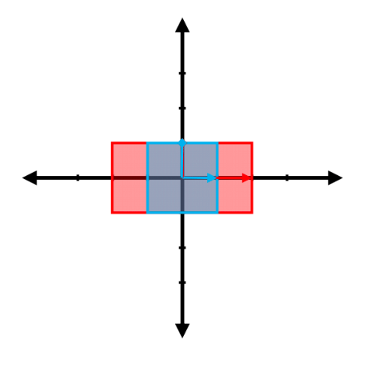
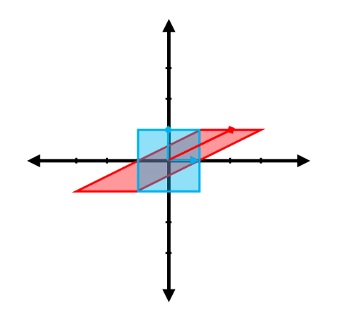
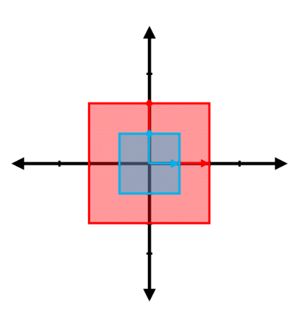
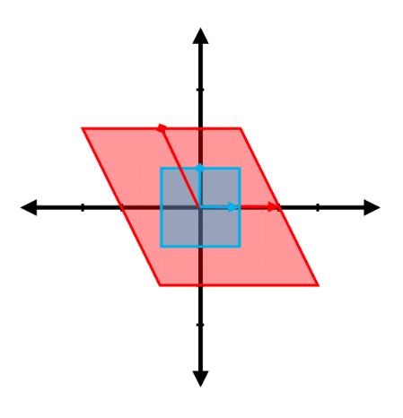
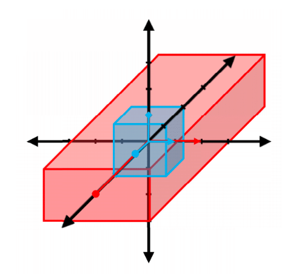

<script type="text/x-mathjax-config">
  MathJax.Hub.Config({
    tex2jax: {
      inlineMath: [ ['$','$'], ["\\(","\\)"] ],
      processEscapes: true
    }
  });
</script>

<script type="text/javascript" async
  src="https://cdnjs.cloudflare.com/ajax/libs/mathjax/2.7.5/MathJax.js?config=TeX-MML-AM_CHTML">
</script>
<script type="text/javascript" src="tutorialSheetScripts.js"> </script>
<link rel="stylesheet" type="text/css" media="all" href="styles.css">

# Linear Transforms Tutorial Sheet, Sheet #4A

### Learning Targets
* Understand and produce a graphical representation of a transformation matrix
* Find the transformation matrix for given representations of linear transformations
* Find the null space
* Understand how the relationship between the determinant of a matrix as area scale factor for a linear transformation

### Additional Resources
* [3Blue1Brown - Linear Algebra Playlist](https://www.youtube.com/playlist?list=PLZHQObOWTQDPD3MizzM2xVFitgF8hE_ab)
* [AFP - Interactive linear transforms](https://fourier.space/assets/matrices/index.html)
* [Let's remove Quaternions from every 3D Engine: Intro to Rotors from Geometric Algebra](https://youtu.be/syyK6hTWT7U)
* [MathWorks - rotx - Rotation matrix for rotations around x-axis](https://uk.mathworks.com/help/phased/ref/rotx.html)

<br><br><br><br>

# Problem sheet
## Essential Questions
### Problem 1.
From the following linear transformations, $T:\mathbb{R} \rightarrow \mathbb{R}$ where $T(a) = b$, express $b$ as a function of $a$.

(a)


<div class = "answer">$T(a)=3a$</div>

(b)


<div class = "answer">$T(a)=-a/2$</div>

(c)


<div class = "answer">$T(a)=3a/2$</div>

(d)


<div class = "answer">$T(a)=-2a$</div>
<div class = "workingout"><br><br><br><br><br><br><br><br></div>

-----------------------------------------------------------------------------------

### Problem 2.
The following graphs show pairs of vectors where the vector $\vec{a}$ is linearly transformed to $\vec{b}$ by a matrix, $T:\mathbb{R}^2 \rightarrow \mathbb{R}^2$. Considering that these transformations are all pure scalings, find the transformation matrix ($A$) in each case.

(a)


<div class = "answer">$\Rightarrow{}\quad T\bigg(\begin{pmatrix}a_1\\a_2\end{pmatrix}\bigg)=\begin{pmatrix}1&0\\0&-3\end{pmatrix} \begin{pmatrix}a_1\\a_2\end{pmatrix}$</div>

(b)


<div class = "answer">$\Rightarrow{}\quad T\bigg(\begin{pmatrix}a_1\\a_2\end{pmatrix}\bigg)=\begin{pmatrix}-1&0\\0&1\end{pmatrix} \begin{pmatrix}a_1\\a_2\end{pmatrix}$</div>

(c)


<div class = "answer">$\Rightarrow{}\quad T\bigg(\begin{pmatrix}a_1\\a_2\end{pmatrix}\bigg)=\begin{pmatrix}-2&0\\0&-3/2\end{pmatrix} \begin{pmatrix}a_1\\a_2\end{pmatrix}$</div>


(d)


<div class = "answer">$\Rightarrow{}\quad T\bigg(\begin{pmatrix}a_1\\a_2\end{pmatrix}\bigg)=\begin{pmatrix}-2&0\\0&-4\end{pmatrix} \begin{pmatrix}a_1\\a_2\end{pmatrix}$</div>
<div class = "workingout"><br><br><br><br><br><br><br><br></div>

-----------------------------------------------------------------------------------

### Problem 3.
The following graphs show pairs of vectors where the vector $\vec{a}$ is linearly transformed to $\vec{b}$ by a matrix, $T:\mathbb{R}^2 \rightarrow \mathbb{R}^2$. Considering that these transformations are all pure rotations (anti-clockwise from $\hat{i}$ should be assumed for rotations unless otherwise stated, just like for polar coordinates), find the angle $\theta$ and matrix $A$ in each case. $\bigg($NB. $R(\theta)=\begin{pmatrix}\cos{\theta}&-\sin{\theta}\\\sin{\theta}&\cos{\theta}\end{pmatrix}\bigg)$


(a)


<div class = "answer">$\Rightarrow{}\quad T\bigg(\begin{pmatrix}a_1\\a_2\end{pmatrix}\bigg)=\begin{pmatrix}-1&0\\0&-1\end{pmatrix} \begin{pmatrix}a_1\\a_2\end{pmatrix}$ <br>
$\Rightarrow{}\quad \cos^{-1}(-1)=180^{\circ}$</div>

(b)


<div class = "answer">$\Rightarrow{}\quad T\bigg(\begin{pmatrix}a_1\\a_2\end{pmatrix}\bigg)=\begin{pmatrix}0&-1\\1&0\end{pmatrix} \begin{pmatrix}a_1\\a_2\end{pmatrix}$ <br>
$\Rightarrow{}\quad \sin^{-1}(1)=90^{\circ}$</div>
<div class = "workingout"><br><br><br><br><br><br><br><br></div>

-----------------------------------------------------------------------------------

### Problem 4.
From applying a linear transformation, $T:\mathbb{R}^2 \rightarrow \mathbb{R}^2$ where $T(\vec{a}) = \vec{b}$. Find the vector $\vec{b}$ resulting when a <u>clockwise</u> rotation described by $R(\theta)=\begin{pmatrix}\cos{\theta}&\sin{\theta} \\\ -\sin{\theta}&\cos{\theta}\end{pmatrix}$ is applied to $\vec{a}$. Sketch the vectors $\vec{a}$ and $\vec{b}$ on a Cartesian axes

(a) $\vec{a}=\begin{pmatrix}2 \newline 2\end{pmatrix}$ and $\theta=60^{\circ}$
<div class = "answer">$R(60^{\circ})=\begin{pmatrix}0.5&0.866\\-0.866&0.5\end{pmatrix}$ <br>
$\Rightarrow{}\quad \begin{pmatrix}0.5&0.866\\-0.866&0.5\end{pmatrix} \begin{pmatrix}2\\2\end{pmatrix} = \boxed{ \begin{pmatrix}2.732\\-0.732\end{pmatrix}}$ <br>
$\Rightarrow{}\quad$ <br>
 
</div>

(b) $\vec{a}=\begin{pmatrix}2 \newline 3\end{pmatrix}$ and $\theta=45^{\circ}$
<div class = "answer">$R(45^{\circ})=\begin{pmatrix}0.7071&0.7071\\-0.7071&0.7071\end{pmatrix}$ <br>
$\Rightarrow{}\quad \begin{pmatrix}0.7071&0.7071\\-0.7071&0.7071\end{pmatrix} \begin{pmatrix}2\\3\end{pmatrix} = \boxed{ \begin{pmatrix}3.536\\0.7071\end{pmatrix}}$ <br>
$\Rightarrow{}\quad$ <br>
 </div>
<div class = "workingout"><br><br><br><br><br><br><br><br></div>

-----------------------------------------------------------------------------------

### Problem 5.
From the linear transformations represented in the following figures, obtain the transformation matrix and the change in size (\ie product of change in each dimension, such as area or volume). (NB. The red vector shown is the result of transforming the blue vector.


(a)


<div class = "answer">$A = \begin{pmatrix}2&0\\0&1\end{pmatrix}$ and $\det(A) = 2$</div>

(b)


<div class = "answer">$A = \begin{pmatrix}1&2\\0&1\end{pmatrix}$ and $\det(A) = 1$</div>

(c)


<div class = "answer">$A = \begin{pmatrix}2&0\\0&2\end{pmatrix}$ and $\det(A) = 4$</div>

(d)


<div class = "answer">$A = \begin{pmatrix}2&-1\\0&2\end{pmatrix}$ and $\det(A) = 4$</div>

(e)


<div class = "answer">$A = \begin{pmatrix}0.5&0\\-0.5&0.5\end{pmatrix}$ and $\det(A) = 0.25$</div>

(f)


<div class = "answer">$A = \begin{pmatrix}0&-2\\2&0\end{pmatrix}$ and $\det(A) = 4$</div>

(g)


<div class = "answer">$A = \begin{pmatrix}0&2\\-2&0\end{pmatrix}$ and $\det(A) = 4$</div>

(h)


<div class = "answer">$A = \begin{pmatrix}2&0\\0&-2\end{pmatrix}$ and $\det(A) = -4$</div>

(i)



NB. Difficult to see exactly in 3D, but each of the scalings are integers.

<div class = "answer">$A = \begin{pmatrix}2&0&0\\0&1&0\\0&0&3\end{pmatrix}$ and $\det(A) = 6$</div>
<div class = "workingout"><br><br><br><br><br><br><br><br></div>

-----------------------------------------------------------------------------------

### Problem 6.
For the following linear systems of equations find the null space and the corresponding solution of $x$ and $y$. Sketch the solutions as lines in a Cartesian axes

(a) $\begin{pmatrix}1&1 \\\ 2&1\end{pmatrix} \begin{pmatrix}x \\\ y\end{pmatrix} = \begin{pmatrix}2 \\\ 3\end{pmatrix}$

<div class = "answer">$\Rightarrow{}\quad$
$A^{-1} = \frac{1}{-1} \begin{pmatrix}1&-1\\-2&1\end{pmatrix} = \begin{pmatrix}-1&1\\2&-1\end{pmatrix}$ <br>
$\Rightarrow{}\quad \begin{pmatrix}x\\y\end{pmatrix} = A^{-1}b = \begin{pmatrix}-1&1\\2&-1\end{pmatrix} \begin{pmatrix}2\\3\end{pmatrix} \quad\Rightarrow{}\quad \boxed{\begin{pmatrix}x\\y\end{pmatrix} = \begin{pmatrix}1\\1\end{pmatrix}}$ <br>


</div>

(b) $\begin{pmatrix}2&4\\\ 1&3\end{pmatrix} \begin{pmatrix}x\\\ y\end{pmatrix} = \begin{pmatrix}6\\\ 12\end{pmatrix}$

<div class = "answer">$\Rightarrow{}\quad$
$A^{-1} = \frac{1}{2} \begin{pmatrix}3&-4\\-1&2\end{pmatrix} = \begin{pmatrix}3/2&-2\\-1/2&1\end{pmatrix}$ <br>
$\Rightarrow{}\quad \begin{pmatrix}x\\y\end{pmatrix} = A^{-1}b = \begin{pmatrix}3/2&-2\\-1/2&1\end{pmatrix} \begin{pmatrix}6\\12\end{pmatrix}$
$\Rightarrow{}\quad\boxed{\begin{pmatrix}x\\y\end{pmatrix} = \begin{pmatrix}-15\\9\end{pmatrix}}$ <br>


</div>
<div class = "workingout"><br><br><br><br><br><br><br><br></div>

-----------------------------------

### Problem 7 (Optional).
Read the documentation above, found under 'additional resources', regarding using Matlab to generate rotational transformation matrices.

(a) Generate a 3D transformation matrix, $\textbf{X}$, for a rotation of 38.4$^{\circ}$ about the x axis, giving your answer to 2 d.p.
<div class = "answer">
$\textbf{X} =  \begin{bmatrix} 
    1.00 \ 0.00 \ 0.00 \newline 0.00 \ 0.78 \ {-0.62} \newline 0.00 \ 0.62 \ 0.78 
    \end{bmatrix}$ <br><br>

Using Matlab:
<div markdown = "1">

```matlab:Code
X = rotx(38.4)
```

</div>
(note: if this is your first time using this tool you will be prompted to install an add-on, follow the instructions to do so)
</div>

(b) Vector $\textbf{M}$ is mapped to vector $\textbf{T}$ by a rotation of 96.2$^\circ$ about the x axis, followed by a rotation of 112.7$^\circ$
about the y axis. Generate vector $\textbf{T}$ given that: <br>
$\textbf{M} =  \begin{pmatrix} 
    7.2 \newline 42.1 \newline 13.6 
    \end{pmatrix}$ 
<div class = "answer">
$\textbf{T} =  \begin{pmatrix} 
    34.48 \\ -18.07 \\ -22.23
    \end{pmatrix}$ <br><br>

Using Matlab:
<div markdown = "1">

```matlab:Code
M = [7.2 ; 42.1 ; 13.6]
X = rotx(96.2) * M
T = roty(112.7) * X
```

</div>
</div>
<div class = "workingout"><br><br><br><br><br><br><br><br></div>

-----------------------------------

## Challenging Questions
### Problem 8.
The following figure shows a square in $\mathbb{R}^2$, marked with a circle and cross on its perimeter.


(a) On a single plot, sketch the result of applying the following transformation, A, to the square (including the new locations of the circle and cross) 
$$A = \begin{bmatrix} 2 \ 0 \\\ 1 \ 1.5\end{bmatrix}$$

<div class = "answer"></div>

(b) Assuming the area of the initial square is 4, what is the area of this region after the transformation?
<div class = "answer">$\det(A) = 3$, therefore area$ = 3 \cdot 4 = \boxed{12}$</div>
<div class = "workingout"><br><br><br><br><br><br><br><br></div>

-----------------------------------

### Problem 9.
Matrix $\textbf{M}$ is a transformation matrix.<br>
$\textbf{M} =  \begin{bmatrix} 
    2 \ 1 \newline x \ 4  
    \end{bmatrix}$

(a) When $\textbf{M}$ is applied to a shape of area 3, the resulting area is 21 find $x$.
<div class = "answer">
$\Rightarrow{} \frac{21}{3} = \boxed{\text{det}(\textbf{M}) = 7}$<br>
$\Rightarrow{} 8-x=7$<br>
$\Rightarrow{} \boxed{x=1}$
</div>

(b) **(Optional)** Copy and complete the code below, in a new script in Matlab, by adding in the complete transformation matrix. Run the script to visualize the transformation.
<div markdown = "1">

```matlab:Code
%define matrix transformation
M=[];

%define coordinates of original square
x=[-1 1 1 -1 -1];
y=[-1 -1 1 1 -1];

%preallocate transformed coordinate arrays with 0s
X = zeros(1,5);
Y = zeros(1,5);

%loop through coordinates of original square and apply
%the matrix transformation M to each
for i = 1:length(x)
    A = [x(i) ; y(i)];
    A = M * A;

    
    %define transformed coordinates
    X(i) = A(1,1);
    Y(i) = A(2,1);
end

%plot both the original square and the the transformed shape
hold all
plot(x,y,'LineWidth',3)
plot(X,Y,'LineWidth',3)

%define the axis and legend
axis([-6, 6, -6, 6])
legend('Original','Transformation')
grid on
```

</div>

<div class = "answer">
Matlab:
<div markdown = "1">

```matlab:Code
%define matrix transformation
M=[2 1 ; 1 4];
```

</div>
<br>
You now have a crude matrix visualizer, try some different 2D transformation matrices.
</div>
<div class = "workingout"><br><br><br><br><br><br><br><br></div>

<br><br>

## Answers

<button type="button" onclick="displayAnswerButtons('block')">Show answer buttons</button>
<button type="button" onclick="displayAnswers('block')">Show all answers</button>
<button type="button" onclick="displayAnswers('none')">hide all answers</button>
<br><br>
### For Printing
<button type="button" onclick="prepareForPrint('block')">Add whitespace</button>
<button type="button" onclick="prepareForPrint('none')">Remove whitespace</button>

<br><br>

# Next week, Power Series and Sequences!