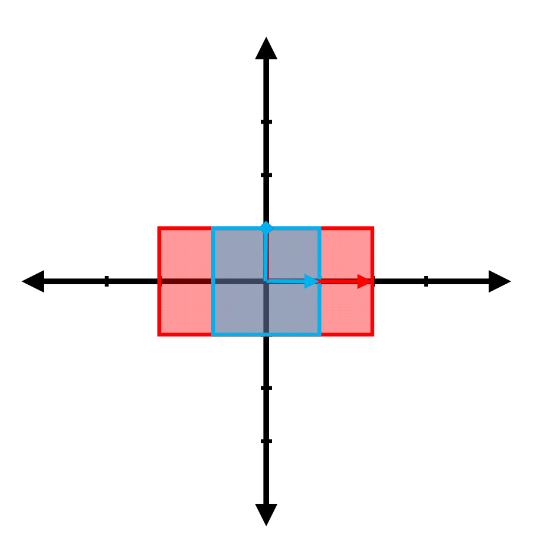
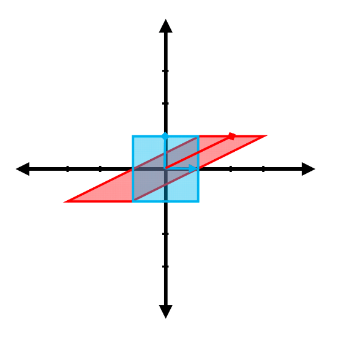
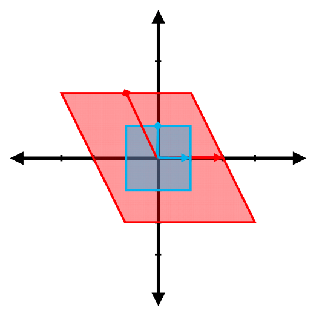
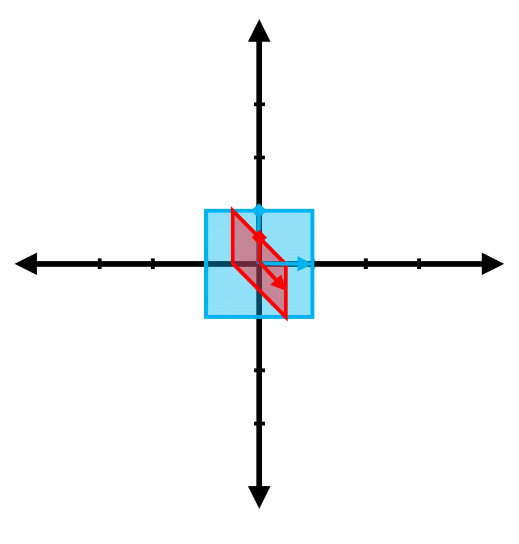
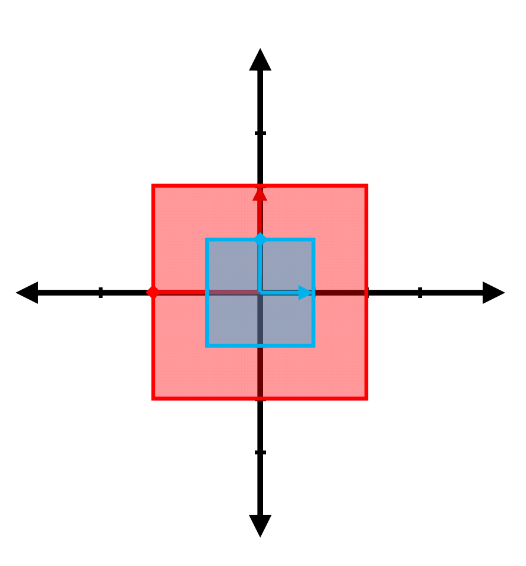

<link rel="stylesheet" type="text/css" media="all" href="styles.css">

# Eigenvectors and Eigenvalues Tutorial Sheet, Sheet #4B

### Learning targets
* Understand and produce visual representations of eigenvectors and eigenvalues 
* Find the eigenvectors and eigenvalues for 2 x 2 and 3 x 3 matrices

### Additional Resources
* [3Blue1Brown - Linear Algebra Playlist](https://www.youtube.com/playlist?list=PLZHQObOWTQDPD3MizzM2xVFitgF8hE_ab)
* [AFP - Interactive linear transforms](https://fourier.space/assets/matrices/index.html)
* [Let's remove Quaternions from every 3D Engine: Intro to Rotors from Geometric Algebra](https://youtu.be/syyK6hTWT7U)

    

# Problem sheet
## Essential Questions
### Problem 1.
Find the eigenvalues and the associated eigenvectors for the transformations represented in the following figures. _(NB. The red vector shown is the result of transforming the blue vector.)_

(a)

$\boxed{v_1 = (1,0), \lambda_1 = 2}$ and $\boxed{v_2 = (0,1), \lambda_2 = 1}$

(b)

$\boxed{v_1 = (1,0), \lambda_1 = 1}$ appears to be the only eigenvector; however when you do the maths you will see that $\boxed{v_2 = (-1,0), \lambda_2 = 1}$ also appears. These eigenvectors are linearly dependent, so they are considered as a single vector.

(c) 

All vectors are eigenvectors for a uniform scaling, all with $\boxed{\lambda=2}$ in this case.

(d)

$\boxed{v_1 = (1,0), \lambda_1 = 2}$ appears to be the only eigenvector; however when you do the maths you will see that $\boxed{v_2 = (-1,0), \lambda_2 = 2}$ also appears. These eigenvectors are linearly dependent, so they are considered as a single vector.

(e)

$\boxed{v_1 = (0,1), \lambda_1 = 0.5}$ and $\boxed{v_2 = (0,-1), \lambda_2 = 0.5}$. These eigenvectors are linearly dependent, so they are considered as a single vector. 

(f)

No real eigenvectors, all vectors change span.

(g)

No real eigenvectors, all vectors change span.

(h)

$\boxed{v_1 = (1,0), \lambda_1 = 2}$ and $\boxed{v_2 = (0,1), \lambda_2 = -2}$

-----------------------------------------------------------------------------------

### Problem 2.
Find the eigenvalues and the associate eigenvectors of the matrices:

(a) $\begin{pmatrix}1&3\\\ 2&2\end{pmatrix}$

$\Rightarrow{}\quad B=\begin{pmatrix}1&3\\2&2\end{pmatrix} - \lambda\begin{pmatrix}1&0\\0&1\end{pmatrix} \quad\Rightarrow{}\quad B = \begin{pmatrix}1-\lambda & 3\\2 & 2 - \lambda\end{pmatrix}$

$\Rightarrow{}\quad det(B) = 0 \quad\Rightarrow{}\quad (1 - \lambda)(2- \lambda) - 6 = 0 \quad\Rightarrow{}\quad \lambda^2 -3\lambda - 4 = 0$

$\Rightarrow{}\quad \text{eigenvalues}: \lambda_1 = 4, \quad\lambda_2 = -1$

For $\lambda_1 = 4, $

$\Rightarrow{}\quad Bx = 0 \quad\Rightarrow{}\quad \begin{pmatrix}-3&3\\\ 2&-2\end{pmatrix} \begin{pmatrix}x_1\\\ x_2\end{pmatrix} = \begin{pmatrix}0\\\ 0\end{pmatrix} \quad\Rightarrow{}\quad \begin{aligned} - 3x_1 + 3x_2 =& 0\\\  2x_1 - 2x_2 =& 0\end{aligned}\\\ 
\Rightarrow{}\quad x_1 = x_2 \quad\Rightarrow{}\quad \text{ in parametric form } x_1=t,\quad x_2=t\quad \text{ for any t } \in R\\\ 
\Rightarrow{}\quad \text{ if } t=1, \text{ eigenvector of } \lambda_1:\quad (1,1)$

For $\lambda_2 = -1, $

$\Rightarrow{}\quad \begin{pmatrix}2&3\\\ 2&3\end{pmatrix} \begin{pmatrix}x_1\\\ x_2\end{pmatrix} = \begin{pmatrix}0\\\ 0\end{pmatrix} \quad\Rightarrow{}\quad \begin{aligned} 2x_1 + 3x_2 =& 0\\\  2x_1 + 3x_2 =& 0\end{aligned} \quad\Rightarrow{}\quad x_1 = -\frac{3x_2}{2}\\\ 
\Rightarrow{}\quad \text{ in parametric form } x_1=-\frac{3t}{2},\quad x_2=t\quad \text{ for any } t \in R\\\ 
\Rightarrow{}\quad \text{ if }t=2, \text{ eigenvector of } \lambda_1:\quad (-3,2)$

To summarise:  
For $\boxed{\lambda_1 = 4, \begin{pmatrix}1\\1\end{pmatrix}},$  
For $\boxed{\lambda_2 = -1, \begin{pmatrix}-3\\2\end{pmatrix}}.$

(b) $\begin{pmatrix}1&-1\\\ 1&3\end{pmatrix}$

$\Rightarrow{}\quad B = \begin{pmatrix}1&-1\\1&3\end{pmatrix} - \lambda\begin{pmatrix}1&0\\0&1\end{pmatrix} \quad\Rightarrow{}\quad \begin{pmatrix} 1-\lambda & -1\\ 1 & 3-\lambda\end{pmatrix}$ 

$\Rightarrow{}\quad det(B) = (1 - \lambda)(3 - \lambda)- -1 = 0 \quad\Rightarrow{}\quad \lambda_1 = 2,\quad \lambda_2 = 2$

$\Rightarrow{}\quad \begin{pmatrix}-1&-1\\\ 1&1\end{pmatrix} \begin{pmatrix}x_1\\\ x_2\end{pmatrix} = \begin{pmatrix}0\\\ 0\end{pmatrix} \quad\Rightarrow{}\quad \begin{aligned} -x_1 -x_2 =& 0\\\  x_1 +x_2 =& 0\end{aligned}$

$\Rightarrow{}\quad \text{ in parametric form } x_1=t,\quad x_2=-t,\quad \text{ for any } t \in R\\\ 
\Rightarrow{}\quad \boxed{\text{ if } t=1, \text{ eigenvector of } \lambda_1:\quad (1,-1)}\\\ 
\Rightarrow{}\quad \boxed{\text{ if } t=2, \text{ eigenvector of } \lambda_2:\quad (2,-2)}$

(c) $\begin{pmatrix}1&3&1\\\ 0&5&0\\\ 1&3&0\end{pmatrix}$

$\Rightarrow{}\quad B = \begin{pmatrix}1&3&1\\0&5&0\\1&3&0\end{pmatrix} - \lambda \begin{pmatrix}1&0&0\\0&1&0\\0&0&1\end{pmatrix} \quad\Rightarrow{}\quad \begin{pmatrix} 1-\lambda & 3 & 1\\ 0 & 5-\lambda & 0\\ 1 & 3 & -\lambda\end{pmatrix}$
$\Rightarrow{}\quad det(B) = (1-\lambda)(5-\lambda)(-\lambda) + 1(-(5-\lambda)(1)) = 0
\quad\Rightarrow{}\quad (5-\lambda)(\lambda^2 -\lambda -1) = 0\\
\Rightarrow{}\quad 
	\begin{cases}
    	\begin{aligned}
    	5 - \lambda =& 0\\ 
        \lambda^2 -\lambda -1 =& 0
        \end{aligned}
    \end{cases}  
\quad\Rightarrow{}\quad \text{eigenvalues}: \lambda_1 = 5, \quad\lambda_2 = \frac{1+\sqrt{5}}{2}, \quad\lambda_3 = \frac{1-\sqrt{5}}{2}$
 

For $\lambda_1 = 5$
$\Rightarrow{}\quad \begin{pmatrix}-4&3&1\\\ 0&0&0\\\ 1&3&-5\end{pmatrix} \begin{pmatrix}x_1\\\ x_2\\\ x_3\end{pmatrix} = \begin{pmatrix}0\\\ 0\\\ 0\end{pmatrix} 
\Rightarrow{}\quad
	\begin{cases}
    	\begin{aligned}
    	-4x_1 +3x_2 +x_3 =& 0\\\ 
        0x_1 +0x_2 +0x_3 =& 0\\\ 
        x_1 +3x_2 -5x_3 =& 0
        \end{aligned}
    \end{cases}\\\ 
\Rightarrow{}\quad
	\begin{cases}
    	x_1  = \frac{6x_2}{5}\\\ 
        x_2 = \frac{19x_3}{15}
    \end{cases}
\quad\Rightarrow{}\quad \text{ in parametric form } x_1=\frac{6t}{5},\quad x_2=\frac{19t}{15},\quad x_3=t \text{ for any } t \in R\\\ 
\Rightarrow{}\quad \text{ if } t=15, \text{ eigenvector of } \lambda_1:\quad (18,19,15)$
 

For $\lambda_2 = \frac{1+\sqrt{5}}{2}$
$\Rightarrow{}\quad \begin{pmatrix} 1 - \frac{1+\sqrt{5}}{2} & 3 & 1\\\  0 & 5 - \frac{1+\sqrt{5}}{2} & 0 \\\  1 & 3 & - \frac{1+\sqrt{5}}{2}\end{pmatrix} \begin{pmatrix}x_1\\\ x_2\\\ x_3\end{pmatrix} = \begin{pmatrix}0\\\ 0\\\ 0\end{pmatrix} 
\Rightarrow{}\quad
	\begin{cases}
		\begin{aligned} 
    	\bigg(1 - \frac{1+\sqrt{5}}{2}\bigg)x_1 + 3x_2 + x_3 =& 0\\\ 
        \bigg(5 - \frac{1+\sqrt{5}}{2}\bigg)x_2 =& 0\\\ 
        x_1 + 3x_2 -\bigg(\frac{1+\sqrt{5}}{2}\bigg)x_3 =& 0
        \end{aligned}
    \end{cases}\\\ 
\Rightarrow{}\quad
	\begin{cases}
		x_2 = 0\\\ 
        x_1 = \bigg(\frac{1+\sqrt{5}}{2}\bigg)x_3
   \end{cases}
\quad\Rightarrow{}\quad \text{ in parametric form } x_1=\bigg(\frac{1+\sqrt{5}}{2}\bigg)t,\quad x_2=0,\quad x_3=t \text{ for any } t \in R \\\ 
\Rightarrow{}\quad \text{ if } t=1, \text{ eigenvector of }\lambda_2:\quad \big(\frac{1+\sqrt{5}}{2}, 0, 1\big)$
 

For $\lambda_3 = \frac{1-\sqrt{5}}{2}$
$\Rightarrow{}\quad \begin{pmatrix}1-\frac{1-\sqrt{5}}{2} & 3 & 1 \\\  0 & 5-\frac{1-\sqrt{5}}{2} & 0 \\\  1 & 3 & -\frac{1-\sqrt{5}}{2}\end{pmatrix} \begin{pmatrix}x_1\\\ x_2\\\ x_3\end{pmatrix} = \begin{pmatrix}0\\\ 0\\\ 0\end{pmatrix}\\\  
\Rightarrow{}\quad
	\begin{cases}
		x_2 = 0\\\ 
        x_1 = \bigg(\frac{1-\sqrt{5}}{2}\bigg)x_3
   \end{cases}
\quad\Rightarrow{}\quad \text{ in parametric form } x_1=\bigg(\frac{1-\sqrt{5}}{2}\bigg)t,\quad x_2=0,\quad x_3=t \text{ for any } t \in R$
$\Rightarrow{}\quad \text{ if } t=1, \text{ eigenvector of } \lambda_3:\quad \big(\frac{1-\sqrt{5}}{2}, 0, 1\big)$
 

To summarise:   
$\boxed{\text{For } \lambda_1 = 5, \begin{pmatrix}18\\\ 19\\\ 15\end{pmatrix} \\\ 
\text{For } \lambda_2 = \frac{1+\sqrt{5}}{2}, \begin{pmatrix}\frac{1+\sqrt{5}}{2}\\\ 0\\\ 1\end{pmatrix} \\\ 
\text{For } \lambda_3 = \frac{1-\sqrt{5}}{2}, \begin{pmatrix}\frac{1-\sqrt{5}}{2}\\\ 0\\1\end{pmatrix}}$

(d) $\begin{pmatrix}3&1&1\\\ 2&4&2\\\ 1&1&3\end{pmatrix}$

$\Rightarrow{}\quad B = \begin{pmatrix}3&1&1\\2&4&2\\1&1&3\end{pmatrix} - \lambda \begin{pmatrix}1&0&0\\0&1&0\\0&0&1\end{pmatrix} \quad\Rightarrow{}\quad \begin{pmatrix} 3-\lambda & 1 & 1\\ 2 & 4-\lambda & 2\\ 1 & 1 & 3-\lambda\end{pmatrix}$
$\Rightarrow{}\quad det(B) = (3-\lambda)((4-\lambda)(3-\lambda)-2) - 1(2(3-\lambda)-2) + 1(2 - 1(4 - \lambda)) = 0$
$\Rightarrow{}\quad p(\lambda): \lambda^3 -10\lambda^2 + 28\lambda -24 =0$
$\Rightarrow{}\quad$ possible roots of $p(\lambda) \quad\pm 1, 2, 3, 4, 6, 8, 12, 24$
$\Rightarrow{}\quad p(1) \neq 0;\quad p(-1) \neq 0;\quad p(2) = 0$
$\Rightarrow{}\quad \lambda_1 = 2$ is an eigenvalue and $(\lambda -2)$ is a factor of the polynomial $p(\lambda)$, then dividing the polynomial $p(\lambda)$ by $(\lambda -2)$
$\Rightarrow{}\quad \lambda^3 -10\lambda^2 + 28\lambda -24 = (\lambda - 2)(\lambda^2 -8\lambda -12)=0$  
$\Rightarrow{}\quad$ eigenvalues: $\lambda_1=2,\quad \lambda_2=2,\quad \lambda_2=6$
  

For $\lambda_1 = 2$ and $\lambda_2 = 2$
$\Rightarrow{}\quad \begin{pmatrix}1&1&1\\\ 2&2&2\\\ 1&1&1\end{pmatrix}\begin{pmatrix}x_1\\\ x_2\\\ x_3\end{pmatrix} = \begin{pmatrix}0\\\ 0\\\ 0\end{pmatrix} \quad\Rightarrow{}\quad x_1 + x_2 + x_3 = 0 \quad\Rightarrow{}\quad x_1 = -x_2 -x_3$
$\Rightarrow{}\quad$ in parametric form $x_1=-t-u,\quad x_2=t,\quad x_3=u$ for any $t,u \in R$
$\Rightarrow{}\quad$ if $t=0$ and $u=1$, eigenvector of $\lambda_1: (-1,0,1)$
$\Rightarrow{}\quad$ if $t=1$ and $u=0$, eigenvector of $\lambda_2: (-1,1,0)$
  

For $\lambda_3 = 6$
$\Rightarrow{}\quad \begin{pmatrix}-3&1&1\\\ 2&-2&2\\\ 1&1&3\end{pmatrix}\begin{pmatrix}x_1\\\ x_2\\\ x_3\end{pmatrix} = \begin{pmatrix}0\\\ 0\\\ 0\end{pmatrix} 
\quad\Rightarrow{}\quad 
	\begin{cases}
    -3x_1 + x_2 + x_3 = 0\\\ 
    2(x_1 - x_2 + x_3) =0\\\ 
    x_1 + x_2 - 3x_3 =0
    \end{cases}\quad\Rightarrow{}\quad 
	\begin{cases}
    x_1 = x_3\\
    x_2 = 2x_3
    \end{cases}$
$\Rightarrow{}\quad$ in parametric form $x_1=t,\quad x_2=2t,\quad x_3=t$ for any $t \in R$
$\Rightarrow{}\quad$ if $t=1$, eigenvector of $\lambda_3: (1,2,1)$
  

To summarise:  
$\boxed{\text{For } \lambda_1 = 2 \text{ and } \lambda_2 = 2, \begin{pmatrix}-1\\\ 0\\\ 1\end{pmatrix}, \begin{pmatrix}-1\\\ 1\\\ 0\end{pmatrix}. \\\ 
\text{For } \lambda_3 = 6, \begin{pmatrix}1\\\ 2\\\ 1\end{pmatrix}}$

(e) $\begin{pmatrix}1&-1&-1\\\ 1&-1&0\\\ 1&0&-1\end{pmatrix}$

$\Rightarrow{}\quad B = \begin{pmatrix}1&-1&-1\\1&-1&0\\1&0&-1\end{pmatrix} - \lambda \begin{pmatrix}1&0&0\\0&1&0\\0&0&1\end{pmatrix} \quad\Rightarrow{}\quad \begin{pmatrix} 1-\lambda & -1 & -1\\ 1 & -1-\lambda & 0\\ 1 & 0 & -1-\lambda\end{pmatrix}$
$\Rightarrow{}\quad det(B) = (1-\lambda)(-1-\lambda)(-1-\lambda) - (-1)(-1-\lambda) + (-1)(-(-1 - \lambda)) = 0$
$\Rightarrow{}\quad (1 + \lambda)(-\lambda^2 -1) = 0
\quad\Rightarrow{}\quad
\begin{cases}
	1 + \lambda = 0\\
    -\lambda^2 -1 =0
\end{cases}$  
$\Rightarrow{}\quad$ eigenvalues: $\lambda_1 = -1, \quad \lambda_2 = i, \quad \lambda_3 =-i$
  

For $\lambda_1 = -1$
$\Rightarrow{}\quad \begin{pmatrix}2&-1&-1\\\ 1&0&0\\\ 1&0&0\end{pmatrix}\begin{pmatrix}x_1\\\ x_2\\\ x_3\end{pmatrix} = \begin{pmatrix}0\\\ 0\\\ 0\end{pmatrix}
\quad\Rightarrow{}\quad
\begin{cases}
	2x_1 -x_2 -x_3 = 0\\\ 
    x_1 = 0
\end{cases}$
$\Rightarrow{}\quad
\begin{cases}
	x_2= -x_3\\\ 
    x_1 = 0
\end{cases}$  
$\Rightarrow{}\quad$ in parametric form $x_1=0,\quad x_2=t, \quad x_3=-t$ for any $t \in R$
$\Rightarrow{}\quad$ if $t=1$, eigenvector $(0,1,-1)$
  

For $\lambda_2 = i$
$\Rightarrow{}\quad \begin{pmatrix}1-i&-1&-1\\\ 1&-1-i&0\\\ 1&0&-1-i\end{pmatrix}\begin{pmatrix}x_1\\\ x_2\\\ x_3\end{pmatrix} = \begin{pmatrix}0\\\ 0\\\ 0\end{pmatrix}
\quad\Rightarrow{}\quad
\begin{cases}
	x_1(1-i) -x_2 -x_3 =0\\\ 
    x_1 -(1+i)x_2 =0\\\ 
    x_1 -(1+i)x_3 =0
\end{cases}$
$\Rightarrow{}\quad
\begin{cases}
	x_1 =(1+i)x_2\\\ 
    x_2 = x_3
\end{cases}$  
$\Rightarrow{}\quad$ in parametric form $x_1=(1+i)t,\quad x_2=t,\quad x_3=t$ for any $t \in R$
$\Rightarrow{}\quad$ if $t=1$, eigenvector $(1+i,1,1)$
  

For $\lambda_3 = -i$
$\Rightarrow{}\quad \begin{pmatrix}1+i&-1&-1\\\ 1&-1+i&0\\\ 1&0&-1+i\end{pmatrix}\begin{pmatrix}x_1\\\ x_2\\\ x_3\end{pmatrix} = \begin{pmatrix}0\\\ 0\\\ 0\end{pmatrix}
\quad\Rightarrow{}\quad
\begin{cases}
	x_1(1+i) -x_2 -x_3 =0\\\ 
    x_1 -(1-i)x_2 =0\\\ 
    x_1 -(1-i)x_3 =0
\end{cases}$
$\Rightarrow{}\quad
\begin{cases}
	x_1 =(1-i)x_2\\
    x_2 = x_3
\end{cases}$ 
$\Rightarrow{}\quad$ in parametric form $x_1=(1-i)t,\quad x_2=t,\quad x_3=t$ for any $t \in R$
$\Rightarrow{}\quad$ if $t=1$, eigenvector $(1-i,1,1)$
  

To summarise: 
$\boxed{\text{For } \lambda_1 = -1, \begin{pmatrix}0\\\ 1\\\ -1\end{pmatrix}, \\\ 
\text{For } \lambda_2 = i. \begin{pmatrix}1 + i \\\ 1\\\ 1\end{pmatrix}, \\\ 
\text{For } \lambda_3 = -i,\begin{pmatrix}1 - i \\\ 1\\\ 1\end{pmatrix}}$

-----------------------------------------------------------------------------------

### Problem 3.
(a) Let $A$ be a $2\times2$ matrix whose trace equals 2 and determinant equals -2. Find the eigenvalues of $A$.

$\Rightarrow{}\quad$ considering $A = \begin{pmatrix}a&b\\c&d\end{pmatrix}
\quad\Rightarrow{}\quad 
\begin{cases}
	a + d = 2\\\ 
    ad - bc = -2
\end{cases}$
$\Rightarrow{}\quad \begin{pmatrix}a&b\\c&d\end{pmatrix} -\lambda\begin{pmatrix}1&0\\0&1\end{pmatrix} = \begin{pmatrix}a-\lambda&b\\c&d-\lambda\end{pmatrix} = B$
$\Rightarrow{}\quad det(B) = (a - \lambda)(d - \lambda) - bc = 0$
$\Rightarrow{}\quad \lambda^2 - 2\lambda - 2 = 0$  
$\Rightarrow{}\quad$ eigenvalues: $\boxed{\lambda_1 = 1 + \sqrt(3), \quad \lambda_2 = 1 - \sqrt(3)}$

-----------------------------------------------------------------------------------

### Problem 4.
(a) $A=\begin{pmatrix}4&-6&2\\\ -1&9&-2\\\ -4&12&-2\end{pmatrix}$
is 6 and its determinant is 36. Find the other eigenvalues of $A$.

$\Rightarrow{}\quad$ considering $B=\begin{pmatrix}4-\lambda&-6&2\\-1&9-\lambda&-2\\-4&12&-2-\lambda\end{pmatrix}$
$\Rightarrow{}\quad det(B) = (4 - \lambda)((9-\lambda)(-2-\lambda)+24)+6(-(-2-\lambda)-8)+2(-12+4(9-\lambda)) = 0$  
$\Rightarrow{}\quad p(\lambda): \lambda^3 -11\lambda^2 +36\lambda -36 = 0$
	
$\Rightarrow{}\quad$ if $\lambda_1 = 6$, then $(\lambda - 6)$ is a factor of the polynomial $p(\lambda)$ then dividing the polynomial $p(\lambda)$ by $(\lambda -6)$  
$\Rightarrow{}\quad \lambda^3 -11\lambda^2 +36\lambda -36 = (\lambda -6)(\lambda^2 -5\lambda + 6) = 0$  
$\Rightarrow{}\quad$ eigenvalues $\boxed{\lambda_2 = 2, \quad \lambda_3 = 3}$

-----------------------------------------------------------------------------------

### Problem 5.
(a) Given that $\begin{pmatrix}-2\\\ 1\\\ k\end{pmatrix}$ is an eigenvector of the matrix $\begin{pmatrix}1&2&-1\\\ 1&0&1\\\ 4&-4&5\end{pmatrix}$
find $k$ and the corresponding eigenvalue

$\Rightarrow{}\quad B = \begin{pmatrix}1-\lambda&2&-1\\1&-\lambda&1\\4&-4&5-\lambda\end{pmatrix}
\quad\Rightarrow{}\quad det(B) = p(\lambda) = \lambda^3 -6\lambda^2 +11\lambda -6 = 0$

$\Rightarrow{}\quad \begin{pmatrix}1-\lambda&2&-1\\\ 1&-\lambda&1\\\ 4&-4&5-\lambda\end{pmatrix}\begin{pmatrix}-2\\\ 1\\\ k\end{pmatrix} = \begin{pmatrix}0\\\ 0\\\ 0\end{pmatrix}$

$\Rightarrow{}\quad 
	\begin{pmatrix}
    	-2(1-\lambda) + 2 - k = 0\\\ 
        -2 -\lambda + k = 0\\\ 
        -8 -4 +k(5 -\lambda)=0
    \end{pmatrix}$
    
$\Rightarrow{}\quad$ evaluating these three equations with $\boxed{\lambda_2 = 2}$  
$\Rightarrow{}\quad \boxed{k = 4}$

-----------------------------------------------------------------------------------

### Problem 6.
(a) The eigenvalues of the matrix $A=\begin{pmatrix}1&1&1\\\ -1&3&1\\\ -1&1&3\end{pmatrix}$ are 2 and 3.
Find the corresponding eigenvectors and write down a matrix which diagonalizes $A$.

For $\lambda_1 = 2$ and $\lambda_2 = 2$  
$\Rightarrow{}\quad \begin{pmatrix}-1&1&1\\-1&1&1\\-1&1&1\end{pmatrix}\begin{pmatrix}x_1\\x_2\\x_3\end{pmatrix} = \begin{pmatrix}0\\0\\0\end{pmatrix}$
$\Rightarrow{}\quad -x_1 + x_2 + x_3 = 0$
$\Rightarrow{}\quad x_1 = x_2 + x_3$  
$\Rightarrow{}\quad$ in parametric form $x_1=t+u, \quad x_2=t,\quad x_3=u$ for any $t,u \in R$  
$\Rightarrow{}\quad$ if $t=0,\quad u=1$, eigenvector of $\lambda_1:\quad (1,0,1)^T$  
$\Rightarrow{}\quad$ if $t=1,\quad u=0$, eigenvector of $\lambda_2:\quad (1,1,0)^T$
  

For $\lambda_3 = 3$
$\Rightarrow{}\quad \begin{pmatrix}-2&1&1\\\ -1&0&1\\\ -1&1&0\end{pmatrix}\begin{pmatrix}x_1\\\ x_2\\\ x_3\end{pmatrix} = \begin{pmatrix}0\\\ 0\\\ 0\end{pmatrix}
\quad\Rightarrow{}\quad
	\begin{cases}
    -2x_1 + x_2 + x_3 = 0\\\ 
    -x_1 + x_3 = 0\\\ 
    -x_1 + x_2 = 0
    \end{cases}$  
$\Rightarrow{}\quad 
	\begin{cases}
    x_1 = x_3\\\ 
    x_1 = x_2
    \end{cases}$
$\Rightarrow{}\quad$ in parametric form $x_1=t,\quad x_2=t,\quad x_3=t$ for any $t \in R$
$\Rightarrow{}\quad$ if $t=1$, eigenvector of $\lambda_3:\quad (1,1,1)^T$
  

$\Rightarrow{}\quad P = \begin{pmatrix}1&1&1\\\ 0&1&1\\\ 1&0&1\end{pmatrix}$ is an invertible matrix that diagonalizes $A$,  
so that $P^{-1}AP = \begin{pmatrix}2&0&0\\\ 0&2&0\\\ 0&0&3\end{pmatrix}$
   

To summarise:
For $\lambda_1 = 2$ and $\lambda_2 = 2$, eigenvectors of $\boxed{\lambda_1: (1,0,1)^T}, \boxed{\lambda_2: (1,1,0)^T}$  
For $\boxed{\lambda_3 = 3, (1,1,1)^T.}$

        

-----------------------------------

## Exam Style Questions
### Problem 7.
This is the exam question from the Linear Transforms tutorial sheet with an extra part on eigenvectors and eigenvalues.\\ The following figure shows a square in $\mathbb{R}^2$, marked with a circle and cross on its perimeter.

(a) On a single plot, sketch the result of applying the following transformation, A, to the square (including the new locations of the circle and cross)

$$A = \begin{bmatrix} 2 \ 0 \\\ 1 \ 1.5\end{bmatrix}$$

(b) On the same axes draw the spans of any eigenvectors of A and label these spans with their corresponding eigenvalues.

$\color{teal}{\lambda = 1.5, \lambda = 2}$

(c) Assuming the area of the initial square is 4, what is the area of this region after the transformation?

$det(A) = 3$, therefore area$ = 3 \cdot 4 = \boxed{12}$

        

## Challenging Questions
### Problem 8.
For all the following transformation matrices $(A)$ , find the characteristic polynomial and the eigenvalues.

(a)$ A = \begin{pmatrix}1&0\\\ 0&-3\end{pmatrix}$

$\text{det}(A - \lambda I) = 0 $  
$(A - \lambda I) = \begin{pmatrix}1&0\\\ 0&-3\end{pmatrix} - \begin{pmatrix}
\lambda & 0 \\ 0 & \lambda \end{pmatrix} = \begin{pmatrix} 1-\lambda & 0\\ 0& -3-\lambda 	
\end{pmatrix}$  
$\text{det} (A - \lambda I) = (1 - \lambda)(-3 - \lambda)$  
Characteristic polynomial: $ \boxed{\lambda^2 + 2\lambda - 3 }$  
Eigenvalues: $\boxed{\lambda_1 = 1, \lambda_2 = -3}$

(b) $ A = \begin{pmatrix}-1&0\\\ 0&1\end{pmatrix}$

$\det (A - \lambda I) = 0 $  
$(A - \lambda I) = \begin{pmatrix}-1&0\\0&1\end{pmatrix} - \begin{pmatrix}\lambda & 0 \\ 0 & \lambda\end{pmatrix} =
\begin{pmatrix}-1-\lambda & 0\\ 0& 1-\lambda\end{pmatrix}$  
$\det (A - \lambda I) = (-1 - \lambda)(1- \lambda)$  
Characteristic polynomial: $\boxed{\lambda^2 - 1 }$  
Eigenvalues: $\boxed{\lambda_1 = 1, \lambda_2 = -1}$

(c) $ A = \begin{pmatrix}-2&0\\\ 0&-3/2\end{pmatrix}$

$\text{det} (A - \lambda I) = 0 $  
$(A - \lambda I) = \begin{pmatrix}-2&0\\0&-3/2\end{pmatrix} - \begin{pmatrix}\lambda & 0 \\ 0 & \lambda\end{pmatrix} =
\begin{pmatrix}-2-\lambda & 0\\ 0& -3/2-\lambda\end{pmatrix}$  
$\text{det} (A - \lambda I) = (-2 - \lambda)(-3/2- \lambda)$  
Characteristic polynomial: $\boxed{\lambda^2 + 7/2\lambda + 3}$  
Eigenvalues: $\boxed{\lambda_1 = -3/2, \lambda_2 = -2}$

(d) $ A = \begin{pmatrix}-2&0\\\ 0&-4\end{pmatrix}$

\quad$\det (A - \lambda I) = 0 $  
$(A - \lambda I) = \begin{pmatrix}-2&0\\0&-4\end{pmatrix} - \begin{pmatrix}\lambda & 0 \\ 0 & \lambda\end{pmatrix} =
\begin{pmatrix}-2-\lambda & 0\\ 0& -4-\lambda\end{pmatrix}$  
$\det (A - \lambda I) = (-2 - \lambda)(-4- \lambda)$  
Characteristic polynomial: $\boxed{\lambda^2 + 6\lambda + 8}$  
Eigenvalues: $\boxed{\lambda_1 = -4, \lambda_2 = -2}$

        

-----------------------------------------------------------------------------------

### Problem 9.
Let $A$ be a $3\times3$ matrix whose trace equals 5 and determinant equals -12. Given that 3 is an eigenvalue of $A$, find the other eigenvalues.

$\Rightarrow{}\quad$ considering $A = \begin{pmatrix}a&b&c\\d&e&f\\g&h&j\end{pmatrix}$  
$\Rightarrow{}\quad 
\begin{cases}
	a + e +j = 5\\
    a(ej - fh) - b(dj - fg) +c(dh - eg) = -12
\end{cases}\\
\Rightarrow{}\quad \begin{pmatrix}a&b&c\\d&e&f\\g&h&j\end{pmatrix} -\lambda\begin{pmatrix}1&0&0\\0&1&0\\0&0&1\end{pmatrix} = \begin{pmatrix}a-\lambda&b&c\\d&e-\lambda&f\\g&h&j-\lambda\end{pmatrix} = B\\
\Rightarrow{}\quad \text{det}(B) = a(ej - fh) +a(\lambda^2 -e\lambda -j\lambda) - \lambda(\lambda^2 - (e+j)\lambda +ej -fh) - \\ b(dj - fg) + bd\lambda +c(dh - eg) + cg\lambda = 0\\
\Rightarrow{}\quad -\lambda^3 + \lambda^2(a + e + j) +\lambda(bd -ae -aj -ej +fh +cg) -12 = 0\\
\Rightarrow{}\quad -\lambda^3 + 5\lambda^2 +\lambda(bd -ae -aj -ej +fh +cg) -12 = 0$
 

$\Rightarrow{}\quad$ for $\lambda_1 = 3,\quad bd -ae -aj -ej +fh +cg = -2$
$\Rightarrow{}\quad -\lambda^3 +5\lambda^2 -2\lambda -12 = 0 \quad\Rightarrow{}\quad (\lambda -3)(-\lambda^2 + 2\lambda +4) = 0$  
$\Rightarrow{}\quad$ Eigenvalues: $\boxed{\lambda_2 = 1 + \sqrt{5},\quad \lambda_3 = 1 - \sqrt{5}}$

        

-----------------------------------------------------------------------------------

### Problem 10.
For each of the following matrices, find an invertible matrix which diagonalizes it.

An $n \times n$ matrix $A$ is said to be diagonalisable if it can be written on the form  $A = PDP^{-1}$, 
where $D$ is a diagonal $n \times n$ matrix with the eigenvalues of $A$ as its entries and $P$ is a nonsingular $n \times n$ matrix consisting of the eigenvectors corresponding to the eigenvalues in $D$

(a) $A = \begin{pmatrix}1&3\\\ 2&2\end{pmatrix}$

$\Rightarrow{}
    \begin{cases}
        \lambda_1 = 4, \quad v_1 = (1,1)^T\\
        \lambda_2 = -1, \quad v_2 = (-3,2)^T
    \end{cases}\\
\Rightarrow{} P = \begin{pmatrix}1&-3\\1&2\end{pmatrix}$ is an invertible matrix that diagonalizes $A$, so that $P^{-1}AP = \begin{pmatrix}4&0\\0&-1\end{pmatrix}$

(b) $A = \begin{pmatrix}1&-1\\\ 1&3\end{pmatrix}$

$\Rightarrow{}
    \begin{cases}
        \lambda_1 = 2, \quad v_1 = (1,-1)^T\\
        \lambda_2 = 2, \quad v_2 = (2,-2)^T
    \end{cases}
\quad\Rightarrow{} P = \begin{pmatrix}-1&-2\\1&2\end{pmatrix}$ is not invertible

(c) F$A=\begin{pmatrix}1&3&1\\\ 0&5&0\\\ 1&3&0\end{pmatrix}$

$\Rightarrow{}
    \begin{cases}
        \lambda_1 = 5, \quad v_1 = (18,19,15)^T\\
        \lambda_2 = \frac{1+\sqrt(5)}{2}, \quad v_2 = (\frac{1+\sqrt{5}}{2},0,1)^T\\
        \lambda_3 = \frac{1-\sqrt(5)}{2}, \quad v_3 = (\frac{1-\sqrt{5}}{2},0,1)^T
    \end{cases}\\
\Rightarrow{} P = \begin{pmatrix}18&\frac{1+\sqrt{5}}{2}&\frac{1-\sqrt{5}}{2}\\19&0&0\\15&1&1\end{pmatrix}$ is an invertible matrix that diagonalizes $A$, so that $P^{-1}AP = \begin{pmatrix}5&0&0\\0&\frac{1+\sqrt{5}}{2}&0\\0&0&\frac{1-\sqrt{5}}{2}\end{pmatrix}$

(d) $A = \begin{pmatrix}3&1&1\\\ 2&4&2\\\ 1&1&3\end{pmatrix}$

$\Rightarrow{}
    \begin{cases}
        \lambda_1 = 2, \quad v_1 = (-1,0,1)^T\\
        \lambda_2 = 2, \quad v_2 = (-1,1,0)^T\\
        \lambda_3 = 6, \quad v_3 = (1,2,1)^T
    \end{cases}\\
\Rightarrow{} P = \begin{pmatrix}-1&-1&1\\0&1&2\\1&0&1\end{pmatrix}$ is an invertible matrix that diagonalizes $A$,  
so that $P^{-1}AP = \begin{pmatrix}2&0&0\\0&2&0\\0&0&6\end{pmatrix}$

(e) $A = \begin{pmatrix}1&-1&-1\\\ 1&-1&0\\\ 1&0&-1\end{pmatrix}$

$\Rightarrow{}
	\begin{cases}
    	\lambda_1 = -1, \quad v_1 = (0,1,-1)^T\\
        \lambda_2 = i, \quad v_2 = (1+i,1,1)^T\\
        \lambda_3 = -i, \quad v_3 = (1-i,1,1)^T
    \end{cases}\\
\Rightarrow{} P = \begin{pmatrix}0&1+i&1-i\\1&1&1\\-1&1&1\end{pmatrix}$ is an invertible matrix that diagonalizes $A$,
so that $P^{-1}AP = \begin{pmatrix}-1&0&0\\0&i&0\\0&0&-i\end{pmatrix}$

        

-----------------------------------

  

## Answers

<button type="button" onclick="displayAnswerButtons('block')">Show answer buttons</button>
<button type="button" onclick="displayAnswers('block')">Show all answers</button>
<button type="button" onclick="displayAnswers('none')">hide all answers</button>

  

# Next week, Power Series and Sequences!