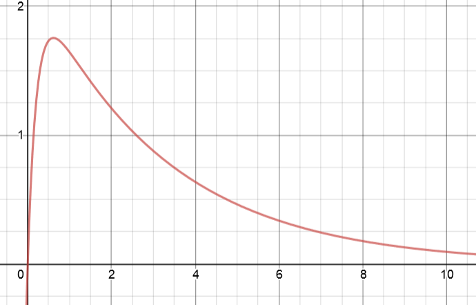

<script type="text/x-mathjax-config">
  MathJax.Hub.Config({
    tex2jax: {
      inlineMath: [ ['$','$'], ["\\(","\\)"] ],
      processEscapes: true
    }
  });
</script>

<script type="text/javascript" async
  src="https://cdnjs.cloudflare.com/ajax/libs/mathjax/2.7.5/MathJax.js?config=TeX-MML-AM_CHTML">
</script>
<script type="text/javascript" src="tutorialSheetScripts.js"> </script>
<link rel="stylesheet" type="text/css" media="all" href="styles.css">

# Ordinary Differential Equations Tutorial Sheet, Sheet #7

### Learning targets
* Identify the auxiliary equation for a differential equation
* Understand how the solutions to the auxiliary equation relates to the general solution
* Find the general equation and particular equation for a given differential equation
* Write an expression to describe the dynamics of a spring trolley system

### Additional Resources
* [Khan Academy - ODEs intro](https://youtu.be/6o7b9yyhH7k)

<br><br><br><br>

# Problem sheet
## Essential Questions
### Problem 1.
Find the general solutions of the following differential equations:

(a) $\frac{d^2y}{ {dx}^2}-3\frac{dy}{dx}+2y=0$
<div class = "answer">
As the equation is a homogeneous ODE:

$\Rightarrow r^2-3r+2=0,\quad r_{1,2}=1, 2$.}

$\Rightarrow{}$ Therefore, the general solution is: $\boxed{y(x)=C_1e^x+C_2e^{2x}}$
</div>

(b) $\frac{d^2y}{ {dx}^2}+2\frac{dy}{dx}+2y=0$
<div class = "answer">
$\Rightarrow{}\quad$
$r^2+2r+2=0, \quad r_{1,2}=-1\pm i$

$\Rightarrow{}\quad\ $Therefore, the general solution is: 
$\boxed{y(x)=e^{-x}(C_1\cos{x}+C_2\sin{x})}$
</div>

(c) $\frac{d^2y}{ {dx}^2}+4\frac{dy}{dx}+4y=0$
<div class = "answer">
$\Rightarrow r^2+4r+4=0, \rightarrow r_{1,2}=-2$

$\Rightarrow{} $Therefore, the general solution is: 
$\boxed{y(x)=(C_1+C_2x)e^{-2x}}$
</div>
<div class = "workingout"><br><br><br><br><br><br><br><br></div>

-----------------------------------------------------------------------------------

### Problem 2.
The differential equation $\ddot{x}+2\dot{x}+4x=0$ describes the free vibration of a mass-spring-damper system, where $x(t)$ represents the displacement from equilibrium of mass $M$.

(a) What values of the spring stiffness $k$ and the viscous damping coefficient $c$ does the equation represent?
<div class = "answer">For the equation $\ddot{x}+2\dot{x}+4x=0,$ $\boxed{\text{the damping coefficient } c = 2 \text{ and the spring stiffness } k=4.}$</div>

(b) Show that the frequency of vibration of the system is $\sqrt{3}$ rad/s and verify that this is equal to $\sqrt{\left(4kM-c^2\right)}/2M$.
<div class = "answer">The auxiliary equation can be written as follows:
$mr^2+cr+k=0$ solving for homogeneous ODE:

$\Rightarrow{}\ r_{1,2}=\frac{-c}{2m}\pm \frac{1}{2m} \sqrt{c^2-4mk}$,
substitute the values of $c = 2,\ k = 4,\ m = 1:$

$\Rightarrow{} \boxed{r_{1,2} =-1\pm \sqrt{3} i}$

$\Rightarrow{} $
Substituting the values of $c,\ k\ \mathrm{and}\ m$ in $\sqrt{\left(4kM-c^2\right)}/2M$
$ = \sqrt{3}$
</div>
<div class = "workingout"><br><br><br><br><br><br><br><br></div>

-----------------------------------

## Exam Style Questions
### Problem 3.
A trolley of mass, $m=$ 5kg, is attached to a wall by a spring of stiffness $k=$ $10Nm^{-1}$ and rolls without friction on the floor.

At $x=0$ the spring is in its neutral position (neither extended nor compressed) and the positive $x$ direction is considered to be pointing away from the wall. Air resistance can be neglected.

(a) Write down an expression to model the dynamics of this spring trolley system, relating its location to its acceleration.
<div class = "answer">
$m\ddot{x}+kx=0 \quad\rightarrow\quad \boxed{5\ddot{x}+10x=0}$
</div>


(b) The trolley is located at position x=0 and given an initial velocity of 8 m/s. Using this information, solve your differential equation such that you can write down an expression for location of the trolley as a function of time.
<div class = "answer">
$x=A\sin(\omega_{0}t)+B\cos(\omega_{0}t)$<br>

At $t=0$,$\quad\dot{x}=8$,$\quad x = 0$,$\quad\omega = \sqrt{\frac{k}{m}}$<br>

As $x=0$: $B=0$,$\quad x=A\sin(\omega t)$<br>

$\dot{x}=A\omega \cos(\omega t)$
$\Rightarrow 8=A\omega$
$\Rightarrow A=\frac{8}{\omega}$<br>

$\boxed{x=\frac{8}{\omega}\sin(\omega t)}$
</div>

(c) This system is flooded with water, resulting in a drag force on the trolley related to the speed through the dynamic viscosity damping constant $c=50\ N\ s\ m^{−1}$. Write down a new ordinary differential equation to describe the dynamics of this system
<div class = "answer">$m\ddot{x}+c\dot{x}+kx=0,\quad \boxed{5\ddot{x}+50\dot{x}+10x=0}$</div>

(d) Determine whether this system is under-damped, over-damped or critically damped.
<div class = "answer">$b^2-4ac$ $,\quad 2500-(4\times 5 \times 10) = 2500 - 200 = 2300$
$\Rightarrow \boxed{\text{Over-damped}}$
</div>

(e) Sketch a graph of the displacement vs time for this trolley (in part c) that clearly illustrates the shape of the function, assuming the same initial conditions used in part (b) (axis labels not required).
<div class = "answer">

</div>
<div class = "workingout"><br><br><br><br><br><br><br><br></div>

-----------------------------------------------------------------------------------

### WolframAlpha
You can generate a limitless suppply of these second order homogeneous ODE questions and answers using WolframAlpha including the various graphs. For example, try typing in: 
``` 3x”(t)+3x’(t)+4x(t)=0 where x(0)=3, x’(0)=0 ```,

[Click here for WolframAlpha link](https://www.wolframalpha.com/input/?i=3x%27%27(t)%2B3x%27(t)%2B4x(t)%3D0+where+x(0)%3D3,+x%27(0)%3D0)

<br><br>

## Answers

<button type="button" onclick="displayAnswerButtons('block')">Show answer buttons</button>
<button type="button" onclick="displayAnswers('block')">Show all answers</button>
<button type="button" onclick="displayAnswers('none')">hide all answers</button>
<br><br>
### For Printing
<button type="button" onclick="prepareForPrint('block')">Add whitespace</button>
<button type="button" onclick="prepareForPrint('none')">Remove whitespace</button>

<br><br>

# Next week, Coupled Harmonic Oscillators!