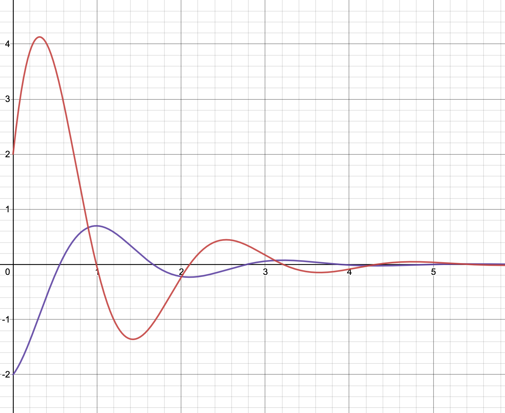

<script type="text/x-mathjax-config">
  MathJax.Hub.Config({
    tex2jax: {
      inlineMath: [ ['$','$'], ["\\(","\\)"] ],
      processEscapes: true
    }
  });
</script>

<script type="text/javascript" async
  src="https://cdnjs.cloudflare.com/ajax/libs/mathjax/2.7.5/MathJax.js?config=TeX-MML-AM_CHTML">
</script>
<script type="text/javascript" src="tutorialSheetScripts.js"> </script>
<link rel="stylesheet" type="text/css" media="all" href="styles.css">

# Ordinary Differential Equations Tutorial Sheet, Sheet #7

### Learning targets
* Identify the auxiliary equation for a differential equation
* Understand how the solutions to the auxiliary equation relates to the general solution
* Find the general equation and particular equation for a given differential equation
* Write an expression to describe the dynamics of a spring trolley system

### Additional Resources
* [Khan Academy - ODEs intro](https://youtu.be/6o7b9yyhH7k)

<br><br><br><br>

# Problem sheet
## Essential Questions
### Problem 1.
Find the general solutions of the following differential equations. This is very easy to do with WolframAlpha (or similar), but it's worth understanding how it works.

(a) $\frac{d^2y}{ {dx}^2}-3\frac{dy}{dx}+2y=0$
<div class = "answer">
As the equation is a homogeneous ODE:

$\Rightarrow r^2-3r+2=0,\quad r_{1,2}=1, 2$.

$\Rightarrow{}$ Using $r_{1,2}$:

$ y(x)=C_1e^{1x}+C_2e^{2x} $

$\Rightarrow{}$ Therefore, the general solution is: $\boxed{y(x)=C_1e^x+C_2e^{2x}}$

Using WorframAlpha:


[Click here for WolframAlpha link](https://www.wolframalpha.com/input/?i=d2y%2Fdx2+-+3+dy%2Fdx+%2B+2y+%3D+0) (you might need to scroll a bit to find the answer)

</div>

<div class = "workingout"><br><br><br></div>

(b) $\frac{d^2y}{ {dx}^2}+2\frac{dy}{dx}+2y=0$
<div class = "answer">

$\Rightarrow{}\quad$
$r^2+2r+2=0, \quad r_{1,2}=-1\pm i$

$\Rightarrow{}\quad\ $Therefore, the general solution is: 
$ y(x)=C_1e^{-x}\cos{x}+C_2e^{-x}\sin{x} $
<br><br>

$\Rightarrow{} $Simplified:

$\boxed{y(x)=e^{-x}(C_1\cos{x}+C_2\sin{x})}$
</div>

<div class = "workingout"><br><br><br></div>

(c) $\frac{d^2y}{ {dx}^2}+4\frac{dy}{dx}+4y=0$
<div class = "answer">
$\Rightarrow r^2+4r+4=0, \quad \rightarrow \quad r_{1,2}=-2$ (for both)
<br><br>
$\Rightarrow{} $Therefore, the general solution is: 
$ y(x)=C_1e^{-2x}+C_2e^{-2x}x $,
<br>
where the final $x$ appears because the root $-2$ is repeated 2x. If that is confusing, have a look at part (d).
<br><br>

$\Rightarrow{} $Simplified:

$\boxed{y(x)=(C_1+C_2x)e^{-2x}}$
</div>

<div class = "workingout"><br><br><br></div>

(d) $\frac{d^3y}{ {dx}^3}+6\frac{d^2y}{ {dx}^2}+12\frac{dy}{dx}+8y=0$
<div class = "answer">
This is a scary third-order ODE, but the way we solve it is exactly the same.
$\Rightarrow r^3+6r^2+12r+8=0, \quad \rightarrow \quad r_{1,2,3}=-2$ (for all three)
<br><br>
$\Rightarrow{} $Therefore, the general solution is: 
$ y(x)=C_1e^{-2x}+C_2e^{-2x}x+C_3e^{-2x}x^2 $,
<br>
where the $x$ & $x^2$ appear because the root $-2$ is repeated 3x.
<br><br>

$\Rightarrow{} $Simplified:

$\boxed{y(x)=(C_1+C_2x+C_3x^2)e^{-2x}}$
</div>

<div class = "workingout"><br><br><br></div>

-----------------------------------------------------------------------------------

### Problem 2.
The differential equation $\ddot{x}+2\dot{x}+4x=0$ describes the free vibration of a mass-spring-damper system, where $x(t)$ represents the displacement from equilibrium of mass $M$.

(a) What values of mass $M$, spring stiffness $k$ and the viscous damping coefficient $c$ does the equation represent?
<div class = "answer">You can read these straight off the equation. For $\ddot{x}+2\dot{x}+4x=0,$ $\boxed{\text{ Mass } M = 1 \text{, damping coefficient } c = 2 \text{ and spring stiffness } k=4.}$</div>

<div class = "workingout"><br><br></div>

(b) Show that the frequency of vibration of the system is $\sqrt{3}$ rad/s and verify that this is equal to $\sqrt{\left(4kM-c^2\right)}/2M$.
<div class = "answer">The auxiliary equation can be written as $mr^2+cr+k=0$. 
At $c = 2, k = 4$ & $m = 1$, this gives $r^2+2r+4=0$.

Solving for homogeneous ODE:

$\Rightarrow{}\ r_{1,2}=\frac{-2 \pm \sqrt{2^2 - 4 * 1 * 4}}{2 * 1}$ (the quadratic formula),

$\Rightarrow{} r_{1,2} =-1\pm \sqrt{3} i$
<br><br>
The frequency of an ODE is the imaginary component of the solution of the auxillary equation, i.e. frequency  $\boxed{\omega = Im(r) = \sqrt{3}.}$ Note that frequency cannot be negative.
<br><br>
$\Rightarrow{} $
Substituting the values of $c,\ k\ \mathrm{and}\ m$ in (this is trivial in WolframAlpha) $\boxed{\sqrt{\left(4kM-c^2\right)}/2M = \sqrt{3}}$
</div>

<div class = "workingout"><br><br><br><br><br><br><br><br></div>

-----------------------------------

## Exam Style Questions
### Problem 3.

A trolley of mass, $m=$ 5kg, is attached to a wall by a spring of stiffness $k=$ $10Nm^{-1}$ and rolls along the floor with a drag coefficient $c=3$.

At $x=0$ the spring is in its neutral position (neither extended nor compressed) and the positive $x$ direction is considered to be pointing away from the wall. Air resistance can be neglected.

(a) Draw a diagram of this system.
<div class = "answer">
<br>
$m=$ 5kg,  $k=$ 10Nm$^{-1}$,  $c=3$ & $x(0) = 0$
</div>
<div class = "workingout"><br><br><br><br><br><br><br><br></div>

(b) Write an expression relating the location of the trolley to its acceleration.
<div class = "answer">
Using the above values for $m$, $k$ & $c$:
$m\ddot{x}+c\dot{x}+kx=0 \quad\rightarrow\quad \boxed{5\ddot{x}+3\dot{x}+10x=0}$
</div>

<div class = "workingout"><br><br></div>

(c) State whether this system is underdamped, critically damped or overdamped.
<div class = "answer">$b^2-4ac$ $,\quad 3^2-(4\times 5 \times 10) = 9 - 200 = -191$
$\Rightarrow \boxed{\text{Under-damped}}$
</div>
<div class = "workingout"><br><br><br></div>

(d) Using this information, sketch a graph of displacement $x$ vs time $t$ for the trolley.

<div class = "answer">
This is something that WolframAlpha is really good at. From your knowledge of what 'under-damped' means, you should have a rough idea of what you're expecting - this will help because you'll know whether Wolfram has given you a sensible answer or not.
Just type the equation and initial conditions into the search:

```5x''+3x'+10x=0, x(0)=0```.
One of its many outputs will be a ready-made graph:
<br>


[Click here for WolframAlpha link](https://www.wolframalpha.com/input/?i=5x%27%27%2B3x%27%2B10x%3D0%2C+x%280%29%3D0)

</div>

<div class = "workingout"><br><br><br><br><br><br><br><br></div>

### Problem 4.

(This problem is very similar to that on the 2020 Exam.)

This graph shows the speed vs time (purple) and acceleration vs time (red) for a damped harmonic oscillator.

(a) State whether this system is under-, over- or critically damped.
<div class="answer">
The waveform is decaying over time, but does oscillate. Therefore, $\boxed{\text{the system is under-damped.}}$ No working is needed.
</div>
<div class = "workingout"><br></div>

(b) Write down the initial velocity and acceleration of the trolley.
<div class="answer">
$\boxed{v=-2m/s, a=2m/s}$. These can be read off the graph.
</div>
<div class = "workingout"><br></div>

(c) Find the integer frequency of oscillation of the system, in rad/s.
<div class="answer">
From the graph, it seems that the time period of oscillation $T ≈ 2.1$s.

Damped natural frequency $\omega = \frac{2\pi}{T} ≈ \frac{2\pi}{2.1}$

$\omega ≈ 2.992$, so we can say that $\boxed{\omega = 3\text{rad/s}}$
</div>
<div class = "workingout"><br><br><br><br><br></div>

(d) Assuming the mass starts at an initial position of $x=3$, draw a graph of displacement vs time.
<div class="answer">

</div>
<div class = "workingout"><br><br><br><br><br></div>

-----------------------------------------------------------------------------------

### WolframAlpha
You can generate a limitless suppply of these second order homogeneous ODE questions and answers using WolframAlpha including the various graphs. For example, try typing in: 
``` 3x”(t)+3x’(t)+4x(t)=0 where x(0)=3, x’(0)=0 ```,

[Click here for WolframAlpha link](https://www.wolframalpha.com/input/?i=3x%27%27(t)%2B3x%27(t)%2B4x(t)%3D0+where+x(0)%3D3,+x%27(0)%3D0)

<br><br>

## Answers

<button type="button" onclick="displayAnswerButtons('block')">Show answer buttons</button>
<button type="button" onclick="displayAnswers('block')">Show all answers</button>
<button type="button" onclick="displayAnswers('none')">hide all answers</button>
<br><br>

### For Printing
<button type="button" onclick="prepareForPrint('block')">Add whitespace</button>
<button type="button" onclick="prepareForPrint('none')">Remove whitespace</button>

<br><br>

# Next week, Coupled Harmonic Oscillators!